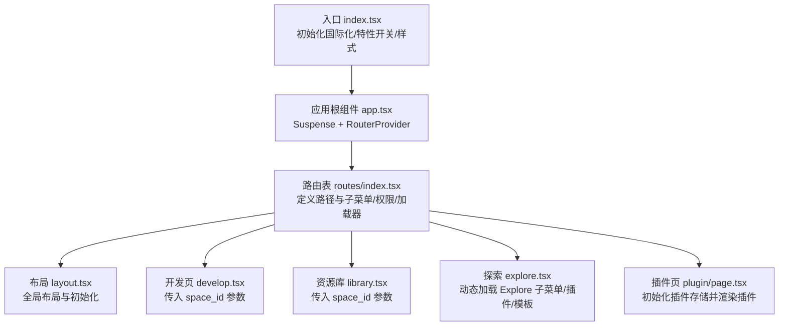
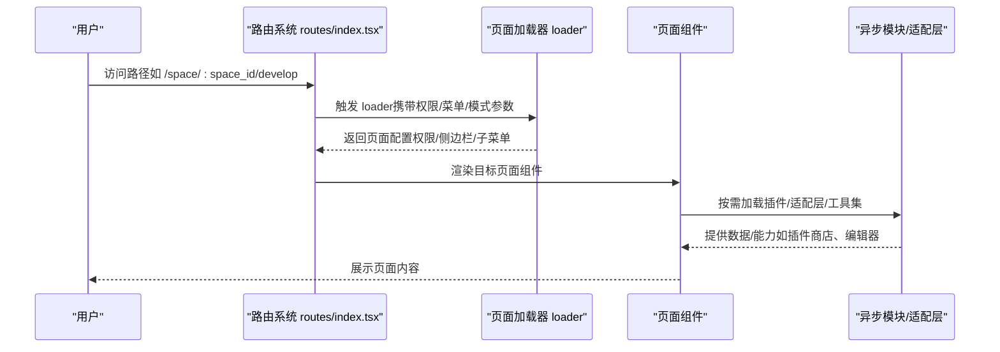
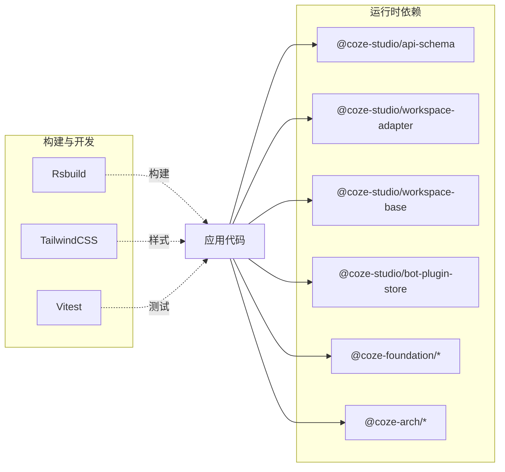

# API参考

<cite>
**本文引用的文件**
- [README.md](file://README.md)
- [package.json](file://package.json)
- [server.js](file://server.js)
- [src/index.tsx](file://src/index.tsx)
- [src/app.tsx](file://src/app.tsx)
- [src/layout.tsx](file://src/layout.tsx)
- [src/routes/index.tsx](file://src/routes/index.tsx)
- [src/pages/develop.tsx](file://src/pages/develop.tsx)
- [src/pages/library.tsx](file://src/pages/library.tsx)
- [src/pages/explore.tsx](file://src/pages/explore.tsx)
- [src/pages/plugin/page.tsx](file://src/pages/plugin/page.tsx)
- [src/global.d.ts](file://src/global.d.ts)
</cite>

## 目录
1. [简介](#简介)
2. [项目结构](#项目结构)
3. [核心组件](#核心组件)
4. [架构总览](#架构总览)
5. [详细组件分析](#详细组件分析)
6. [依赖分析](#依赖分析)
7. [性能考虑](#性能考虑)
8. [故障排查指南](#故障排查指南)
9. [结论](#结论)
10. [附录](#附录)

## 简介
本文件为 Coze Studio 前端应用的 API 参考与实现说明，聚焦于前端路由与页面加载流程中的“公开接口”与“对外服务集成接口”。由于该仓库为前端单页应用（SPA），主要通过浏览器 HTTP 请求与后端服务交互，并在运行时动态加载模块与页面组件。本文档将从路由定义、页面加载器（loader）行为、异步组件加载、全局初始化与国际化配置等角度，系统梳理前端侧的“API 行为契约”，并给出可操作的调用与集成建议。

## 项目结构
前端采用 React + React Router + Rsbuild 构建，入口文件负责初始化国际化、特性开关与样式，随后渲染应用根组件；应用根组件通过 Suspense 包裹 RouterProvider，按路由规则加载页面组件与异步模块。

图表来源
- [src/index.tsx:1-55](file://src/index.tsx#L1-L55)
- [src/app.tsx:1-37](file://src/app.tsx#L1-L37)
- [src/layout.tsx:1-24](file://src/layout.tsx#L1-L24)
- [src/routes/index.tsx:1-298](file://src/routes/index.tsx#L1-L298)
- [src/pages/develop.tsx:1-27](file://src/pages/develop.tsx#L1-L27)
- [src/pages/library.tsx:1-27](file://src/pages/library.tsx#L1-L27)
- [src/pages/explore.tsx:1-67](file://src/pages/explore.tsx#L1-L67)
- [src/pages/plugin/page.tsx:1-36](file://src/pages/plugin/page.tsx#L1-L36)

章节来源
- [src/index.tsx:1-55](file://src/index.tsx#L1-L55)
- [src/app.tsx:1-37](file://src/app.tsx#L1-L37)
- [src/layout.tsx:1-24](file://src/layout.tsx#L1-L24)
- [src/routes/index.tsx:1-298](file://src/routes/index.tsx#L1-L298)

## 核心组件
- 入口初始化：负责拉取特性开关、初始化国际化、动态引入 Markdown Box 样式，并挂载根节点渲染应用。
- 应用根组件：以 Suspense 包裹 RouterProvider，提供统一加载态与错误兜底。
- 路由系统：集中定义页面路径、权限要求、侧边栏菜单、子菜单数据源与页面加载器（loader）行为。
- 页面组件：按需传参（如 space_id、plugin_id、dataset_id 等），并与工作区适配层或插件生态进行交互。

章节来源
- [src/index.tsx:26-52](file://src/index.tsx#L26-L52)
- [src/app.tsx:24-36](file://src/app.tsx#L24-L36)
- [src/routes/index.tsx:50-298](file://src/routes/index.tsx#L50-L298)

## 架构总览
前端通过路由驱动页面加载，页面加载器（loader）承担以下职责：
- 权限控制：requireAuth 标记是否需要登录态。
- 导航与菜单：hasSider、subMenu、menuKey 控制侧边栏与菜单项。
- 页面模式：pageModeByQuery、requireBotEditorInit 等标记影响页面行为。
- 动态加载：部分子菜单与页面组件通过懒加载按需引入。

图表来源
- [src/routes/index.tsx:100-298](file://src/routes/index.tsx#L100-L298)
- [src/pages/develop.tsx:19-24](file://src/pages/develop.tsx#L19-L24)
- [src/pages/library.tsx:19-24](file://src/pages/library.tsx#L19-L24)
- [src/pages/explore.tsx:22-36](file://src/pages/explore.tsx#L22-L36)
- [src/pages/plugin/page.tsx:23-32](file://src/pages/plugin/page.tsx#L23-L32)

## 详细组件分析

### 路由与页面加载器（Loader）契约
- 权限控制
  - requireAuth: true 表示需要登录态；false 表示无需登录。
- 导航与菜单
  - hasSider: true/false 控制是否显示侧边栏。
  - subMenu: 懒加载的子菜单组件，用于动态生成导航。
  - menuKey: 顶层菜单键值，用于定位当前模块。
- 页面模式
  - pageModeByQuery: 通过查询参数决定页面展示模式。
  - requireBotEditorInit: 是否需要初始化 Bot 编辑器上下文。
  - requireWorkspaceEditorInit: 工作区编辑器初始化标记（在路由中出现）。
- 子模块
  - SpaceSubModuleEnum：空间子模块枚举，用于区分“开发/库/知识库/数据库/插件”等子模块。

章节来源
- [src/routes/index.tsx:100-298](file://src/routes/index.tsx#L100-L298)

### 开发页（/space/:space_id/develop）
- 参数绑定：从 URL 中提取 space_id 并传递给开发页组件。
- 加载器：设置子菜单键值为 DEVELOP，用于高亮当前模块。
- 适用场景：进入指定工作区的空间开发界面。

章节来源
- [src/pages/develop.tsx:19-24](file://src/pages/develop.tsx#L19-L24)
- [src/routes/index.tsx:118-125](file://src/routes/index.tsx#L118-L125)

### 资源库（/space/:space_id/library）
- 参数绑定：从 URL 中提取 space_id 并传递给资源库组件。
- 加载器：设置子菜单键值为 LIBRARY，用于高亮当前模块。
- 适用场景：查看与管理工作区内的资源库。

章节来源
- [src/pages/library.tsx:19-24](file://src/pages/library.tsx#L19-L24)
- [src/routes/index.tsx:175-182](file://src/routes/index.tsx#L175-L182)

### 探索（/explore）
- 子路由：支持 /explore/plugin 与 /explore/template。
- 加载器：设置 requireAuth 为 true，hasSider 为 true，menuKey 为 Explore。
- 子菜单：通过 @coze-community/explore 的 ExploreSubMenu 动态加载。
- 适用场景：浏览插件市场与模板市场。

章节来源
- [src/pages/explore.tsx:22-66](file://src/pages/explore.tsx#L22-L66)
- [src/routes/index.tsx:262-294](file://src/routes/index.tsx#L262-L294)

### 插件页（/space/:space_id/plugin/:plugin_id）
- 参数绑定：同时提取 space_id 与 plugin_id。
- 初始化：在组件挂载时初始化插件存储实例，确保插件生态可用。
- 适用场景：在指定工作区内打开并渲染某个插件详情页。

章节来源
- [src/pages/plugin/page.tsx:23-32](file://src/pages/plugin/page.tsx#L23-L32)
- [src/routes/index.tsx:217-236](file://src/routes/index.tsx#L217-L236)

### 知识库与数据库（/space/:space_id/knowledge/:dataset_id 与 /space/:space_id/database/:table_id）
- 知识库：支持预览与上传两个子路径，pageModeByQuery 决定页面模式。
- 数据库：支持查看表详情。
- 适用场景：对知识库数据集与数据库表进行管理与预览。

章节来源
- [src/routes/index.tsx:184-215](file://src/routes/index.tsx#L184-L215)

### 登录与重定向（/sign 与 /docs/*）
- 登录页：/sign，requireAuth 为 false，不显示侧边栏。
- 文档重定向：/docs/* 与 /open/docs/* 均为重定向到文档站点，hasSider 为 false，requireAuth 为 false。

章节来源
- [src/routes/index.tsx:87-96](file://src/routes/index.tsx#L87-L96)
- [src/routes/index.tsx:52-76](file://src/routes/index.tsx#L52-L76)

### 入口与全局初始化
- 特性开关：初始化 pullFeatureFlags，设置超时时间与门控函数。
- 国际化：根据本地存储的语言键初始化 i18n 实例。
- 样式：动态引入 Markdown Box 样式。
- 渲染：创建根节点并渲染 App 组件。

章节来源
- [src/index.tsx:26-52](file://src/index.tsx#L26-L52)

### 布局与全局错误处理
- 布局：Layout 组件调用全局初始化钩子并渲染全局布局。
- 错误兜底：路由层设置 errorElement 为全局错误组件，统一处理异常。

章节来源
- [src/layout.tsx:19-23](file://src/layout.tsx#L19-L23)
- [src/routes/index.tsx:81](file://src/routes/index.tsx#L81)

## 依赖分析
- 运行时依赖
  - @coze-studio/api-schema：API 模型与校验规范（工作区/插件/发布等）。
  - @coze-studio/workspace-adapter / @coze-studio/workspace-base：工作区适配层与基础能力。
  - @coze-studio/bot-plugin-store：插件生态存储与状态管理。
  - @coze-foundation/*：账户、布局、全局上下文等基础设施。
  - @coze-arch/*：设计体系、国际化、日志、Web 上下文等通用能力。
- 构建与开发
  - Rsbuild：构建与开发服务器。
  - TailwindCSS：原子化样式框架。
  - Vitest：单元测试。

图表来源
- [package.json:19-51](file://package.json#L19-L51)
- [package.json:52-81](file://package.json#L52-L81)

章节来源
- [package.json:19-81](file://package.json#L19-L81)

## 性能考虑
- 懒加载与按需渲染：通过 React.lazy 与路由 loader 的组合，减少首屏包体与初次渲染压力。
- Suspense 配合：在 App 根部使用 Suspense 提供统一加载态，提升用户体验。
- 动态样式：按需引入 Markdown Box 样式，避免全局样式污染。
- 国际化与特性开关：在入口处完成初始化，避免重复请求与阻塞主流程。

章节来源
- [src/app.tsx:24-36](file://src/app.tsx#L24-L36)
- [src/index.tsx:26-52](file://src/index.tsx#L26-L52)

## 故障排查指南
- 根节点缺失
  - 现象：启动时报错提示未找到 root 元素。
  - 处理：确认 index.html 中存在 id 为 root 的容器元素。
- 插件渲染失败
  - 现象：访问 /space/:space_id/plugin/:plugin_id 抛出缺少 plugin_id 或 space_id 的错误。
  - 处理：确保 URL 同时包含这两个参数；检查插件存储初始化逻辑。
- 国际化语言异常
  - 现象：语言未按预期切换。
  - 处理：检查本地存储的 i18next 键值；确认初始化时的语言选择逻辑。
- 路由错误兜底
  - 现象：页面渲染异常。
  - 处理：路由层已设置全局错误组件，可结合浏览器控制台与错误信息定位问题。

章节来源
- [src/index.tsx:45-48](file://src/index.tsx#L45-L48)
- [src/pages/plugin/page.tsx:26-28](file://src/pages/plugin/page.tsx#L26-L28)
- [src/routes/index.tsx:81](file://src/routes/index.tsx#L81)

## 结论
本前端应用通过清晰的路由与加载器契约，实现了工作区、插件、资源库、知识库与数据库等模块的统一接入。配合懒加载与全局初始化机制，既保证了良好的用户体验，也为后续扩展提供了稳定基座。实际 API 的具体请求/响应细节与认证方式由后端服务提供，前端侧通过适配层与生态组件完成对接。

## 附录

### API 行为清单（前端侧）
- 权限控制
  - /sign：无需登录（requireAuth=false）
  - /docs/* 与 /open/docs/*：无需登录（requireAuth=false）
  - /space/*：需要登录（requireAuth=true）
  - /explore：需要登录（requireAuth=true）
- 导航与菜单
  - hasSider：空间与探索模块默认开启侧边栏；登录页与文档页关闭侧边栏。
  - subMenu：空间模块与探索模块支持动态子菜单。
  - menuKey：空间模块对应 Space；探索模块对应 Explore。
- 页面模式
  - 知识库与数据库：pageModeByQuery 控制页面模式。
  - 插件页：初始化插件存储实例，确保插件生态可用。
- 参数约定
  - /space/:space_id/develop：space_id
  - /space/:space_id/library：space_id
  - /space/:space_id/knowledge/:dataset_id：space_id、dataset_id
  - /space/:space_id/database/:table_id：space_id、table_id
  - /space/:space_id/plugin/:plugin_id：space_id、plugin_id
  - /explore/plugin：type='plugin'
  - /explore/template：type='template'

章节来源
- [src/routes/index.tsx:52-76](file://src/routes/index.tsx#L52-L76)
- [src/routes/index.tsx:87-96](file://src/routes/index.tsx#L87-L96)
- [src/routes/index.tsx:100-298](file://src/routes/index.tsx#L100-L298)
- [src/pages/develop.tsx:21-24](file://src/pages/develop.tsx#L21-L24)
- [src/pages/library.tsx:21-24](file://src/pages/library.tsx#L21-L24)
- [src/pages/explore.tsx:40-66](file://src/pages/explore.tsx#L40-L66)
- [src/pages/plugin/page.tsx:23-32](file://src/pages/plugin/page.tsx#L23-L32)

### 安全与合规
- 登录态：除登录页与文档页外，其余页面均需登录态。
- 国际化：语言选择基于本地存储键值，遵循前端本地化策略。
- 样式隔离：动态引入样式，避免全局污染。

章节来源
- [src/routes/index.tsx:87-96](file://src/routes/index.tsx#L87-L96)
- [src/index.tsx:36-41](file://src/index.tsx#L36-L41)

### 服务器与构建
- 开发服务器：通过 server.js 引导 serve.ts 启动。
- 构建脚本：提供 dev/build/preview/test 等常用命令。
- 环境变量：IS_OVERSEA 用于判断是否海外环境。

章节来源
- [server.js:1-4](file://server.js#L1-L4)
- [package.json:11-18](file://package.json#L11-L18)
- [src/global.d.ts:19](file://src/global.d.ts#L19)