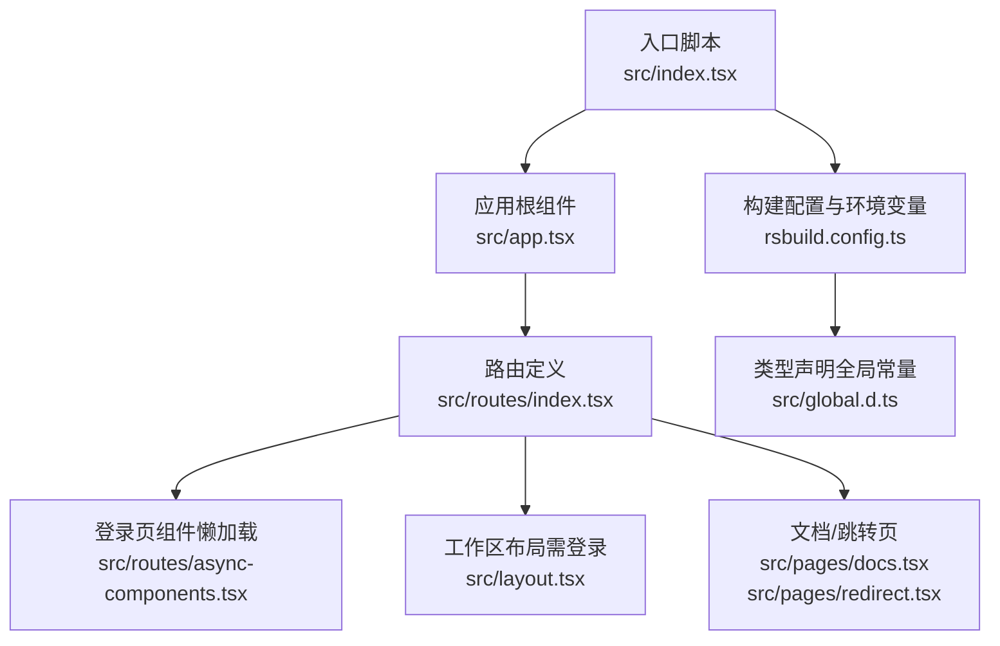
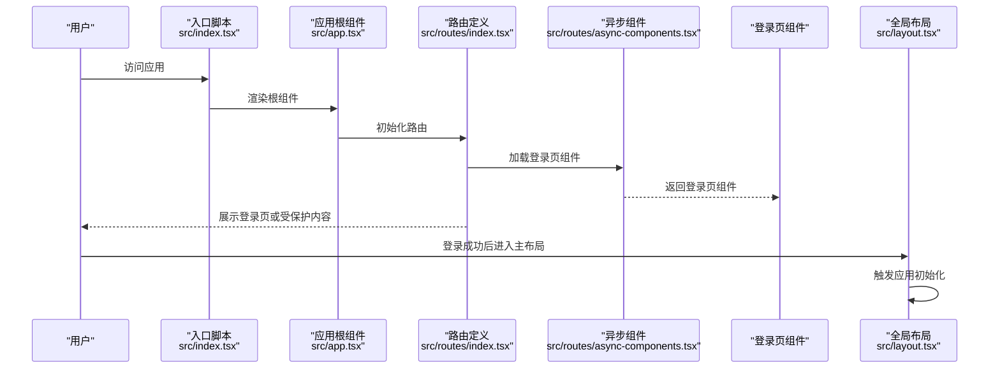
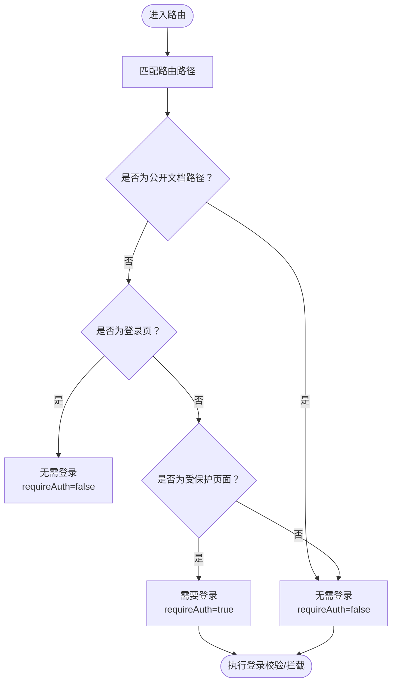
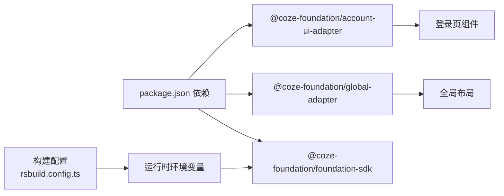

# API认证

<cite>
**本文引用的文件**
- [src/index.tsx](file://src/index.tsx)
- [src/app.tsx](file://src/app.tsx)
- [src/layout.tsx](file://src/layout.tsx)
- [src/routes/index.tsx](file://src/routes/index.tsx)
- [src/routes/async-components.tsx](file://src/routes/async-components.tsx)
- [src/pages/docs.tsx](file://src/pages/docs.tsx)
- [src/pages/redirect.tsx](file://src/pages/redirect.tsx)
- [rsbuild.config.ts](file://rsbuild.config.ts)
- [src/global.d.ts](file://src/global.d.ts)
- [package.json](file://package.json)
</cite>

## 目录
1. [简介](#简介)
2. [项目结构](#项目结构)
3. [核心组件](#核心组件)
4. [架构总览](#架构总览)
5. [详细组件分析](#详细组件分析)
6. [依赖分析](#依赖分析)
7. [性能考虑](#性能考虑)
8. [故障排查指南](#故障排查指南)
9. [结论](#结论)
10. [附录](#附录)

## 简介
本文件面向Coze Studio前端应用的API认证机制，基于当前仓库中的前端代码进行系统化梳理与说明。根据现有源码，认证相关的关键信息主要集中在路由层对“是否需要登录”的控制以及登录页面组件的加载方式；实际的认证实现（如JWT、API Key、OAuth）由上游SDK或后端服务提供，前端通过统一的账户适配器与全局布局完成集成。

本文件将：
- 梳理认证相关路由与页面加载策略
- 解释会话与登录状态在前端的体现
- 总结认证失败时的错误处理与重试建议
- 提供安全最佳实践与配置要点
- 明确不同端点的认证要求与权限级别

## 项目结构
前端采用React + React Router组织页面与路由，登录页通过异步组件按需加载，主布局使用全局适配器注入初始化逻辑。认证相关的关键点体现在路由配置中对“是否需要登录”的声明，以及登录页组件的懒加载。

图表来源
- [src/index.tsx:1-55](file://src/index.tsx#L1-L55)
- [src/app.tsx:1-37](file://src/app.tsx#L1-L37)
- [src/routes/index.tsx:1-298](file://src/routes/index.tsx#L1-L298)
- [src/routes/async-components.tsx:1-48](file://src/routes/async-components.tsx#L1-L48)
- [src/layout.tsx:1-24](file://src/layout.tsx#L1-L24)
- [src/pages/docs.tsx:1-26](file://src/pages/docs.tsx#L1-L26)
- [src/pages/redirect.tsx:1-26](file://src/pages/redirect.tsx#L1-L26)
- [rsbuild.config.ts:68-135](file://rsbuild.config.ts#L68-L135)
- [src/global.d.ts:1-19](file://src/global.d.ts#L1-L19)

章节来源
- [src/index.tsx:1-55](file://src/index.tsx#L1-L55)
- [src/app.tsx:1-37](file://src/app.tsx#L1-L37)
- [src/routes/index.tsx:1-298](file://src/routes/index.tsx#L1-L298)
- [rsbuild.config.ts:68-135](file://rsbuild.config.ts#L68-L135)
- [src/global.d.ts:1-19](file://src/global.d.ts#L1-L19)

## 核心组件
- 登录页组件：通过异步组件方式加载，便于按需传输与首屏优化。
- 路由与权限：路由配置中明确标注了“是否需要登录”（requireAuth），用于控制访问权限。
- 全局布局与初始化：布局组件在挂载时触发应用初始化逻辑，为认证上下文提供基础环境。

章节来源
- [src/routes/async-components.tsx:19-24](file://src/routes/async-components.tsx#L19-L24)
- [src/routes/index.tsx:88-96](file://src/routes/index.tsx#L88-L96)
- [src/layout.tsx:19-23](file://src/layout.tsx#L19-L23)

## 架构总览
下图展示了从入口到路由、再到登录页与布局的整体调用链，以及认证相关的关键节点（requireAuth与登录页懒加载）。

图表来源
- [src/index.tsx:33-52](file://src/index.tsx#L33-L52)
- [src/app.tsx:24-36](file://src/app.tsx#L24-L36)
- [src/routes/index.tsx:50-96](file://src/routes/index.tsx#L50-L96)
- [src/routes/async-components.tsx:19-24](file://src/routes/async-components.tsx#L19-L24)
- [src/layout.tsx:19-23](file://src/layout.tsx#L19-L23)

## 详细组件分析

### 路由与认证要求
- 文档与公开页面：路径以“/open/docs”、“/docs”开头的路由明确标注“不需要登录”，适合对外公开文档与跳转。
- 登录页：路径“/sign”对应登录页组件，且标注“不需要登录”，用于引导用户完成认证。
- 工作区与受保护页面：多处路由（如“/space/:space_id”、“/work_flow”、“/search/:word”等）标注“需要登录”，用于限制未认证用户的访问。
- 探索模块：探索页子菜单也标注“需要登录”。

图表来源
- [src/routes/index.tsx:50-96](file://src/routes/index.tsx#L50-L96)
- [src/routes/index.tsx:98-294](file://src/routes/index.tsx#L98-L294)

章节来源
- [src/routes/index.tsx:50-96](file://src/routes/index.tsx#L50-L96)
- [src/routes/index.tsx:98-294](file://src/routes/index.tsx#L98-L294)

### 登录页与认证入口
- 登录页组件通过异步组件加载，减少初始包体体积。
- 登录页所在路由明确“不需要登录”，作为认证流程的入口。

章节来源
- [src/routes/async-components.tsx:19-24](file://src/routes/async-components.tsx#L19-L24)
- [src/routes/index.tsx:88-96](file://src/routes/index.tsx#L88-L96)

### 全局布局与初始化
- 布局组件在挂载时触发应用初始化逻辑，为认证上下文提供基础环境。
- 主布局作为受保护页面的容器，承载认证后的导航与业务页面。

章节来源
- [src/layout.tsx:19-23](file://src/layout.tsx#L19-L23)

### 文档与跳转页
- 文档与跳转页组件通过副作用重定向至外部站点，这些页面不涉及认证逻辑。
- 这些页面同样标注“不需要登录”。

章节来源
- [src/pages/docs.tsx:19-24](file://src/pages/docs.tsx#L19-L24)
- [src/pages/redirect.tsx:19-24](file://src/pages/redirect.tsx#L19-L24)
- [src/routes/index.tsx:50-76](file://src/routes/index.tsx#L50-L76)

## 依赖分析
- 账户适配器与UI适配器：登录页组件来自账户UI适配器，表明认证界面由统一适配层提供。
- 全局适配器：布局组件依赖全局适配器，用于应用初始化与上下文注入。
- 构建配置：构建时通过define注入运行时环境变量，影响SDK区域与范围等行为。

图表来源
- [package.json:19-51](file://package.json#L19-L51)
- [rsbuild.config.ts:92-106](file://rsbuild.config.ts#L92-L106)
- [src/routes/async-components.tsx:19-24](file://src/routes/async-components.tsx#L19-L24)
- [src/layout.tsx:17-23](file://src/layout.tsx#L17-L23)

章节来源
- [package.json:19-51](file://package.json#L19-L51)
- [rsbuild.config.ts:92-106](file://rsbuild.config.ts#L92-L106)

## 性能考虑
- 异步加载登录页组件，降低首屏资源压力。
- 路由懒加载与按需渲染，有助于提升整体性能。
- 构建配置中包含别名与装饰器支持，保证SDK与业务代码的兼容性。

## 故障排查指南
- 登录页无法显示
  - 检查登录页路由配置与requireAuth标记是否正确。
  - 确认异步组件加载是否成功。
- 受保护页面被错误拦截
  - 核对目标路由的requireAuth设置。
  - 确保登录状态已在全局上下文中正确建立。
- 外部文档/跳转页无法访问
  - 确认路径前缀与公开文档路由一致。
  - 检查页面组件的副作用重定向逻辑。

章节来源
- [src/routes/index.tsx:88-96](file://src/routes/index.tsx#L88-L96)
- [src/routes/index.tsx:50-76](file://src/routes/index.tsx#L50-L76)
- [src/pages/docs.tsx:19-24](file://src/pages/docs.tsx#L19-L24)
- [src/pages/redirect.tsx:19-24](file://src/pages/redirect.tsx#L19-L24)

## 结论
本仓库前端代码通过路由配置明确了“是否需要登录”的访问控制策略，并通过异步组件与全局适配器实现了登录页与主布局的解耦与初始化。认证的具体实现（如JWT、API Key、OAuth）由上游SDK与后端服务提供，前端负责在合适的时机加载登录页并进入受保护页面。建议在后续扩展中补充对认证失败的统一错误处理与重试策略，并完善令牌刷新与会话管理的最佳实践。

## 附录

### 认证方法与流程概览
- JWT令牌
  - 通过账户适配器提供的登录流程完成身份验证，随后在受保护请求中携带令牌。
- API密钥
  - 若后端提供API Key认证，应在请求头或参数中携带相应密钥。
- OAuth集成
  - 通过账户UI适配器的OAuth登录流程完成授权，随后进入受保护页面。

### 令牌刷新与会话管理
- 建议在受保护页面加载前检查令牌有效性，若即将过期则触发刷新。
- 刷新成功后更新本地存储的令牌状态，避免重复刷新。
- 登出时清理令牌与会话信息，确保下次登录重新获取新令牌。

### 不同端点的认证要求与权限级别
- 公开文档与跳转页：无需登录（requireAuth=false）
- 登录页：无需登录（requireAuth=false）
- 工作区与受保护页面：需要登录（requireAuth=true）

### 认证失败的错误处理与重试策略
- 统一捕获认证失败的错误，提示用户重新登录。
- 对于网络异常导致的失败，可进行有限次数的指数退避重试。
- 登录页应提供清晰的错误提示与重试按钮。

### 安全最佳实践与令牌保护
- 令牌仅保存在安全的存储介质中，避免明文存储在本地缓存。
- 使用HttpOnly与SameSite策略保护Cookie（若使用Cookie存储）。
- 严格区分生产与测试环境，避免在开发环境打印敏感信息。
- 定期轮换API Key与JWT密钥，缩短令牌有效期。

### 配置选项与环境变量
- 构建时通过define注入运行时环境变量，影响SDK区域与范围等行为。
- 全局常量IS_OVERSEA用于判断是否海外版本，影响SDK区域选择。

章节来源
- [rsbuild.config.ts:92-106](file://rsbuild.config.ts#L92-L106)
- [src/global.d.ts:17-19](file://src/global.d.ts#L17-L19)