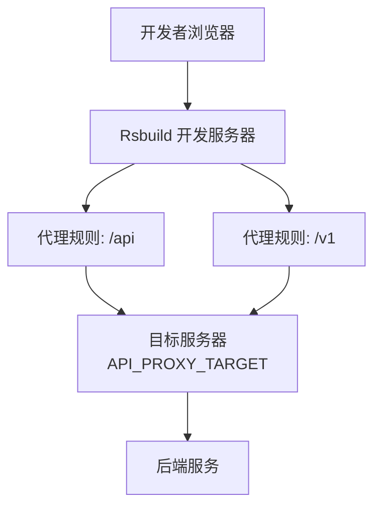
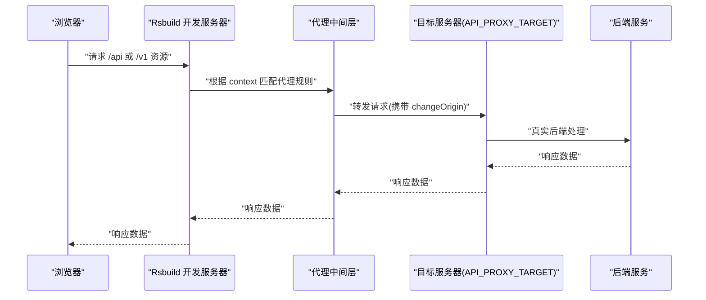
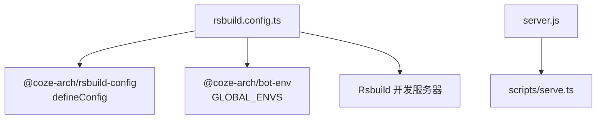

# 代理配置

<cite>
**本文引用的文件**
- [rsbuild.config.ts](file://rsbuild.config.ts)
- [server.js](file://server.js)
- [package.json](file://package.json)
- [global.d.ts](file://src/global.d.ts)
- [README.md](file://README.md)
</cite>

## 目录
1. [简介](#简介)
2. [项目结构](#项目结构)
3. [核心组件](#核心组件)
4. [架构总览](#架构总览)
5. [详细组件分析](#详细组件分析)
6. [依赖关系分析](#依赖关系分析)
7. [性能考量](#性能考量)
8. [故障排查指南](#故障排查指南)
9. [结论](#结论)
10. [附录](#附录)

## 简介
本文件面向 Coze Studio 前端开发团队，系统化说明开发环境下的代理配置与行为，重点覆盖以下内容：
- 开发服务器代理的上下文匹配规则（context）与目标服务器（target）配置
- 代理行为选项（如 secure、changeOrigin）的含义与影响
- 对 /api 与 /v1 路径的代理配置差异与注意事项
- 代理对开发体验的影响与性能优化策略
- 代理配置的调试方法与常见问题解决方案
- 生产环境代理配置的注意事项与最佳实践

## 项目结构
Coze Studio 使用 Rsbuild 作为构建与开发服务器工具。代理配置位于 Rsbuild 配置文件中，通过 server.proxy 数组定义多个代理规则；同时，开发服务器启动入口由 server.js 指定。

图表来源
- [rsbuild.config.ts:27-43](file://rsbuild.config.ts#L27-L43)

章节来源
- [rsbuild.config.ts:19-43](file://rsbuild.config.ts#L19-L43)
- [server.js:1-4](file://server.js#L1-L4)
- [package.json:11-17](file://package.json#L11-L17)

## 核心组件
- 代理配置主体：在 Rsbuild 配置中通过 server.proxy 定义，当前包含两条规则：
  - context: ['/api']，target: API_PROXY_TARGET，secure: false，changeOrigin: true
  - context: ['/v1']，target: API_PROXY_TARGET，secure: false，changeOrigin: true
- 目标服务器常量：API_PROXY_TARGET 在配置文件中被声明并赋值，用于统一代理转发的目标地址。
- 开发服务器入口：server.js 通过 Sucrase 注册后加载 scripts/serve.ts，用于本地开发服务器启动（具体实现位于 @coze-arch/rsbuild-config 所提供的 Rsbuild 配置中）。

章节来源
- [rsbuild.config.ts:25-43](file://rsbuild.config.ts#L25-L43)
- [server.js:1-4](file://server.js#L1-L4)

## 架构总览
下图展示了从浏览器到后端服务的请求链路，以及代理在其中的角色与影响。

图表来源
- [rsbuild.config.ts:29-42](file://rsbuild.config.ts#L29-L42)

## 详细组件分析

### 代理规则与上下文匹配
- context: ['/api']
  - 作用域：所有以 /api 开头的请求路径
  - 行为：匹配后按规则进行转发
- context: ['/v1']
  - 作用域：所有以 /v1 开头的请求路径
  - 行为：匹配后按规则进行转发
- 注意事项：
  - 两条规则共享同一目标服务器（API_PROXY_TARGET），意味着 /api 与 /v1 的上游服务应能区分或在同一后端上处理
  - 若业务上需要差异化处理，建议拆分为独立 target 或引入更细粒度的匹配逻辑

章节来源
- [rsbuild.config.ts:30-41](file://rsbuild.config.ts#L30-L41)

### 目标服务器配置
- API_PROXY_TARGET：在配置文件中声明并赋值，作为代理转发的目标地址
- 影响：
  - 所有命中代理规则的请求都会被转发至该地址
  - 在不同环境（开发/测试/生产）可通过替换该常量或通过环境变量注入实现差异化

章节来源
- [rsbuild.config.ts:22-25](file://rsbuild.config.ts#L22-L25)

### 代理行为选项详解
- secure: false
  - 含义：允许代理转发非 HTTPS 目标地址
  - 影响：在开发环境中，当目标服务器为 HTTP 时可避免证书相关错误
- changeOrigin: true
  - 含义：修改请求头中的 Origin 与 Host，使其指向目标服务器
  - 影响：有助于后端基于 Host/Origin 进行鉴权或跨域策略判断，减少因源不一致导致的鉴权失败

章节来源
- [rsbuild.config.ts:33-40](file://rsbuild.config.ts#L33-L40)

### /api 与 /v1 路径的代理配置对比
- 共同点：
  - 均启用 secure: false 与 changeOrigin: true
  - 均转发至同一目标服务器（API_PROXY_TARGET）
- 差异点：
  - 匹配前缀不同，分别对应不同的业务域或版本域
  - 若后端对 /api 与 /v1 采用不同路由或鉴权策略，需确保目标服务器具备相应处理能力

章节来源
- [rsbuild.config.ts:30-41](file://rsbuild.config.ts#L30-L41)

### 开发体验与性能优化
- 开发体验提升：
  - 通过代理消除前端与后端的跨域限制，简化联调流程
  - changeOrigin 可降低因源不一致导致的鉴权与安全策略问题
- 性能优化建议：
  - 仅保留必要的 context 规则，避免多余匹配开销
  - 将 API_PROXY_TARGET 指向就近的后端服务，减少网络延迟
  - 如后端支持，优先使用 HTTPS 目标地址并启用 secure: true，以提升安全性

章节来源
- [rsbuild.config.ts:29-42](file://rsbuild.config.ts#L29-L42)

## 依赖关系分析
- Rsbuild 配置依赖：
  - @coze-arch/rsbuild-config：提供 defineConfig 与默认开发服务器能力
  - @coze-arch/bot-env：提供全局环境变量（GLOBAL_ENVS），可用于条件化配置
- 开发服务器入口：
  - server.js 通过 Sucrase 注册后加载 scripts/serve.ts，实际开发服务器行为由 Rsbuild 配置驱动

图表来源
- [rsbuild.config.ts:19-20](file://rsbuild.config.ts#L19-L20)
- [server.js:1-4](file://server.js#L1-L4)

章节来源
- [rsbuild.config.ts:19-20](file://rsbuild.config.ts#L19-L20)
- [server.js:1-4](file://server.js#L1-L4)

## 性能考量
- 代理转发的额外网络跳转会带来轻微延迟，建议：
  - 在本地开发时尽量将 API_PROXY_TARGET 指向内网或本机后端，缩短 RTT
  - 避免在代理层做不必要的重写或复杂逻辑，保持规则简洁
  - 如后端具备缓存与压缩能力，优先利用后端优化而非在代理层重复处理

## 故障排查指南
- 症状：浏览器控制台出现跨域错误
  - 排查：确认代理规则是否覆盖了相关路径（/api、/v1），并检查 secure 与 changeOrigin 是否符合预期
  - 处理：若目标为 HTTP，请保持 secure: false；若后端依赖 Host/Origin 判断，请保持 changeOrigin: true
- 症状：请求被重定向或鉴权失败
  - 排查：检查 API_PROXY_TARGET 是否正确指向后端，以及后端是否对 Host/Origin 有严格校验
  - 处理：必要时调整 changeOrigin 行为或在后端放宽校验策略
- 症状：代理规则不生效
  - 排查：确认 context 前缀与请求路径一致；检查 Rsbuild 开发服务器是否正常启动
  - 处理：重启开发服务器，确保代理配置已重新加载
- 症状：HTTPS 目标报错
  - 排查：若目标为自签名证书，请保持 secure: false；否则请修复证书或改为 HTTPS 目标
  - 处理：在开发环境临时关闭 secure 校验，生产环境务必启用并配置有效证书

章节来源
- [rsbuild.config.ts:29-42](file://rsbuild.config.ts#L29-L42)

## 结论
Coze Studio 的开发代理配置通过简洁明确的规则，实现了对 /api 与 /v1 的统一转发，并通过 secure 与 changeOrigin 选项兼顾了开发便利性与后端鉴权需求。建议在开发阶段保持规则精简、目标就近，同时在生产环境遵循 HTTPS 与严格的证书校验策略，确保安全与性能的平衡。

## 附录

### A. 开发与运行命令
- 开发模式：通过 Rsbuild 启动开发服务器，自动应用代理配置
- 预览模式：构建产物预览，代理不参与

章节来源
- [package.json:11-17](file://package.json#L11-L17)
- [README.md:1-7](file://README.md#L1-L7)

### B. 环境变量与类型声明
- 全局环境变量：GLOBAL_ENVS 来源于 @coze-arch/bot-env，可用于条件化配置（如根据地区切换 SDK 区域）
- 类型声明：IS_OVERSEA 在全局类型声明中定义，便于在类型层面感知环境变量

章节来源
- [rsbuild.config.ts:19-20](file://rsbuild.config.ts#L19-L20)
- [global.d.ts:17-19](file://src/global.d.ts#L17-L19)