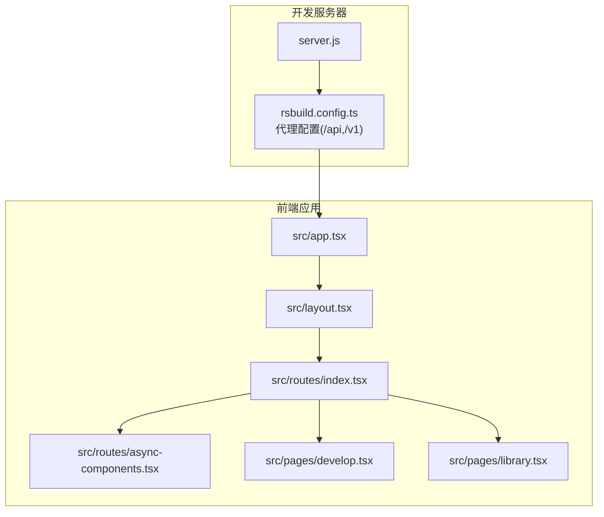
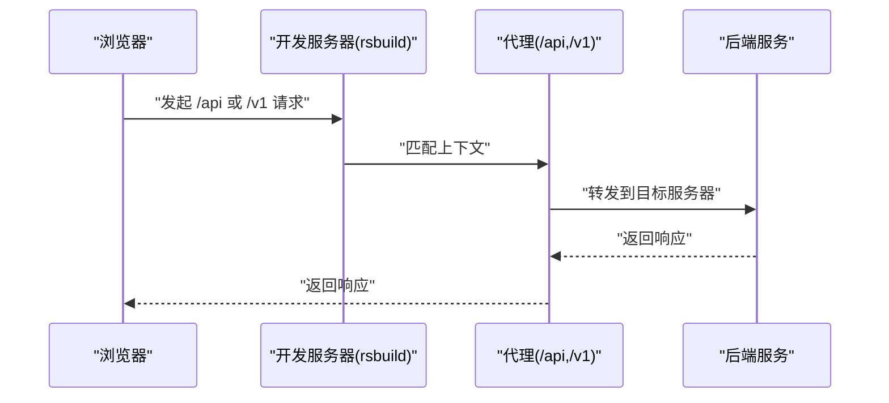
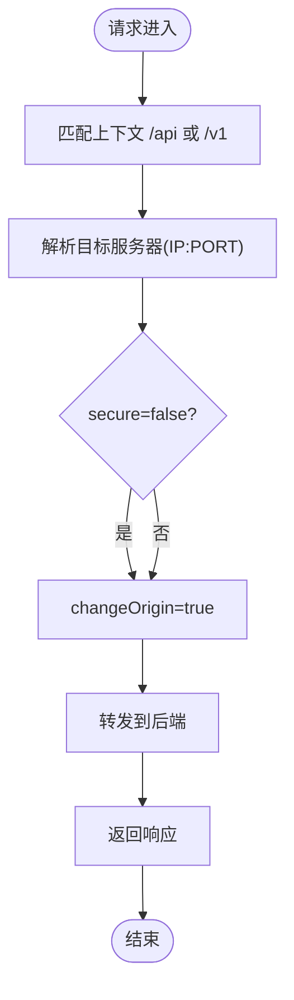
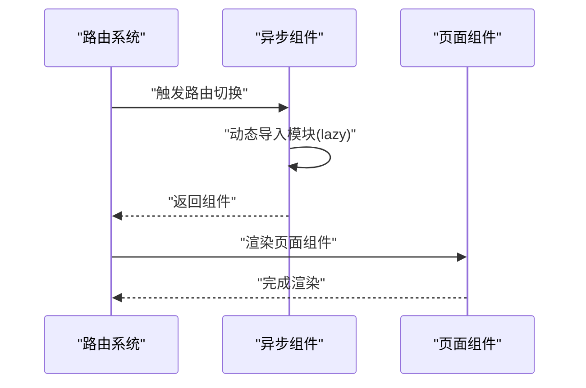
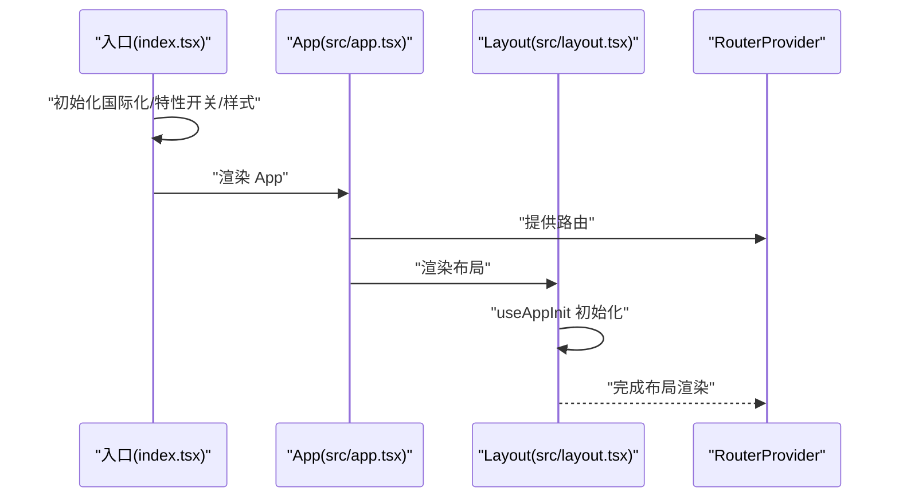
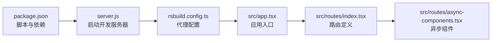

# 内部API

<cite>
**本文引用的文件**
- [server.js](file://server.js)
- [rsbuild.config.ts](file://rsbuild.config.ts)
- [package.json](file://package.json)
- [src/routes/index.tsx](file://src/routes/index.tsx)
- [src/routes/async-components.tsx](file://src/routes/async-components.tsx)
- [src/app.tsx](file://src/app.tsx)
- [src/layout.tsx](file://src/layout.tsx)
- [src/pages/develop.tsx](file://src/pages/develop.tsx)
- [src/pages/library.tsx](file://src/pages/library.tsx)
- [src/global.d.ts](file://src/global.d.ts)
- [tailwind.config.ts](file://tailwind.config.ts)
</cite>

## 目录
1. [简介](#简介)
2. [项目结构](#项目结构)
3. [核心组件](#核心组件)
4. [架构总览](#架构总览)
5. [详细组件分析](#详细组件分析)
6. [依赖分析](#依赖分析)
7. [性能考虑](#性能考虑)
8. [故障排查指南](#故障排查指南)
9. [结论](#结论)
10. [附录](#附录)

## 简介
本文件面向 Coze Studio 前端团队与集成开发者，系统化梳理内部 API 的代理配置、路由与组件异步加载机制，明确 /api 与 /v1 路径的代理规则（目标服务器、安全与跨域设置），并给出调用流程、参数与响应约定、错误处理策略、版本控制与兼容性建议，以及性能优化与监控指标指引。文档以仓库现有实现为依据，避免臆测，确保可操作性与可追溯性。

## 项目结构
前端应用采用 React + Rsbuild 构建，通过路由按需懒加载各功能模块，开发服务器内置代理将 /api 与 /v1 请求转发至后端目标地址。关键目录与文件如下：
- 开发服务器入口：server.js
- 构建与代理配置：rsbuild.config.ts
- 依赖与脚本：package.json
- 应用入口与路由：src/app.tsx、src/routes/index.tsx、src/routes/async-components.tsx
- 页面与布局：src/layout.tsx、src/pages/*.tsx
- 全局类型与样式：src/global.d.ts、tailwind.config.ts

图表来源
- [server.js:1-4](file://server.js#L1-L4)
- [rsbuild.config.ts:25-43](file://rsbuild.config.ts#L25-L43)
- [src/app.tsx:22-36](file://src/app.tsx#L22-L36)
- [src/layout.tsx:17-23](file://src/layout.tsx#L17-L23)
- [src/routes/index.tsx:50-298](file://src/routes/index.tsx#L50-L298)
- [src/routes/async-components.tsx:17-153](file://src/routes/async-components.tsx#L17-L153)
- [src/pages/develop.tsx:17-27](file://src/pages/develop.tsx#L17-L27)
- [src/pages/library.tsx:17-27](file://src/pages/library.tsx#L17-L27)

章节来源
- [server.js:1-4](file://server.js#L1-L4)
- [rsbuild.config.ts:25-43](file://rsbuild.config.ts#L25-L43)
- [src/app.tsx:22-36](file://src/app.tsx#L22-L36)
- [src/layout.tsx:17-23](file://src/layout.tsx#L17-L23)
- [src/routes/index.tsx:50-298](file://src/routes/index.tsx#L50-L298)
- [src/routes/async-components.tsx:17-153](file://src/routes/async-components.tsx#L17-L153)
- [src/pages/develop.tsx:17-27](file://src/pages/develop.tsx#L17-L27)
- [src/pages/library.tsx:17-27](file://src/pages/library.tsx#L17-L27)

## 核心组件
- 开发服务器与代理
  - server.js 使用 Sucrase 注册后，加载 scripts/serve.ts 启动开发服务器，rsbuild.config.ts 中定义了 /api 与 /v1 的代理规则，目标服务器为固定 IP:PORT。
- 路由与异步组件
  - src/routes/index.tsx 定义主路由与子路由；src/routes/async-components.tsx 将页面组件以 React.lazy 方式异步加载，提升首屏性能。
- 应用入口
  - src/app.tsx 渲染 RouterProvider，并包裹 Suspense 提供加载态；src/layout.tsx 初始化全局状态并渲染全局布局。

章节来源
- [server.js:1-4](file://server.js#L1-L4)
- [rsbuild.config.ts:25-43](file://rsbuild.config.ts#L25-L43)
- [src/routes/index.tsx:50-298](file://src/routes/index.tsx#L50-L298)
- [src/routes/async-components.tsx:17-153](file://src/routes/async-components.tsx#L17-L153)
- [src/app.tsx:22-36](file://src/app.tsx#L22-L36)
- [src/layout.tsx:17-23](file://src/layout.tsx#L17-L23)

## 架构总览
下图展示从浏览器到后端服务的请求链路，以及前端路由与异步加载对性能的影响。

图表来源
- [rsbuild.config.ts:25-43](file://rsbuild.config.ts#L25-L43)

章节来源
- [rsbuild.config.ts:25-43](file://rsbuild.config.ts#L25-L43)

## 详细组件分析

### API 代理配置（/api 与 /v1）
- 目标服务器
  - 代理目标为固定地址（IP:PORT），便于在不同环境统一转发。
- 安全设置
  - secure: false 表示不强制 TLS 校验；根据实际部署环境调整。
- 跨域与来源
  - changeOrigin: true 改写请求来源头，有助于后端基于 Origin 进行 CORS 控制或日志追踪。
- 上下文匹配
  - context: ['/api'] 与 context: ['/v1'] 明确代理范围，避免误伤其他路径。

图表来源
- [rsbuild.config.ts:25-43](file://rsbuild.config.ts#L25-L43)

章节来源
- [rsbuild.config.ts:25-43](file://rsbuild.config.ts#L25-L43)

### 路由与组件异步加载机制
- 主路由
  - src/routes/index.tsx 使用 createBrowserRouter 定义多级路由，包含工作区、插件、知识库、数据库等模块。
- 异步组件
  - src/routes/async-components.tsx 通过 React.lazy 对页面组件进行懒加载，减少初始包体积，提升首屏速度。
- 页面组件
  - src/pages/develop.tsx 与 src/pages/library.tsx 作为具体页面占位，注入路由参数并渲染对应业务组件。

图表来源
- [src/routes/index.tsx:50-298](file://src/routes/index.tsx#L50-L298)
- [src/routes/async-components.tsx:17-153](file://src/routes/async-components.tsx#L17-L153)
- [src/pages/develop.tsx:17-27](file://src/pages/develop.tsx#L17-L27)
- [src/pages/library.tsx:17-27](file://src/pages/library.tsx#L17-L27)

章节来源
- [src/routes/index.tsx:50-298](file://src/routes/index.tsx#L50-L298)
- [src/routes/async-components.tsx:17-153](file://src/routes/async-components.tsx#L17-L153)
- [src/pages/develop.tsx:17-27](file://src/pages/develop.tsx#L17-L27)
- [src/pages/library.tsx:17-27](file://src/pages/library.tsx#L17-L27)

### 应用入口与初始化
- 应用入口
  - src/app.tsx 渲染 RouterProvider 并包裹 Suspense，提供统一加载态。
- 布局与初始化
  - src/layout.tsx 调用 useAppInit 完成全局初始化，再渲染全局布局。

图表来源
- [src/app.tsx:22-36](file://src/app.tsx#L22-L36)
- [src/layout.tsx:17-23](file://src/layout.tsx#L17-L23)

章节来源
- [src/app.tsx:22-36](file://src/app.tsx#L22-L36)
- [src/layout.tsx:17-23](file://src/layout.tsx#L17-L23)

## 依赖分析
- 代理依赖
  - rsbuild.config.ts 中的 server.proxy 配置直接决定 /api 与 /v1 的转发行为。
- 路由依赖
  - src/routes/index.tsx 依赖 async-components.tsx 中的懒加载组件，形成页面级解耦。
- 构建与运行
  - package.json 定义 dev/build/preview/test 脚本；server.js 通过 Sucrase 注册后启动开发服务器。

图表来源
- [package.json:11-17](file://package.json#L11-L17)
- [server.js:1-4](file://server.js#L1-L4)
- [rsbuild.config.ts:25-43](file://rsbuild.config.ts#L25-L43)
- [src/app.tsx:22-36](file://src/app.tsx#L22-L36)
- [src/routes/index.tsx:50-298](file://src/routes/index.tsx#L50-L298)
- [src/routes/async-components.tsx:17-153](file://src/routes/async-components.tsx#L17-L153)

章节来源
- [package.json:11-17](file://package.json#L11-L17)
- [server.js:1-4](file://server.js#L1-L4)
- [rsbuild.config.ts:25-43](file://rsbuild.config.ts#L25-L43)
- [src/app.tsx:22-36](file://src/app.tsx#L22-L36)
- [src/routes/index.tsx:50-298](file://src/routes/index.tsx#L50-L298)
- [src/routes/async-components.tsx:17-153](file://src/routes/async-components.tsx#L17-L153)

## 性能考虑
- 代码分割与懒加载
  - 使用 React.lazy 与路由级拆分，降低首屏 JS 体积，缩短 TTI。
- 分包策略
  - rsbuild.config.ts 中启用 chunkSplit 策略，按大小阈值拆分代码块，避免单块过大影响缓存与加载。
- 构建回退与兼容
  - 通过 fallback: { path } 与装饰器配置，保证在不同运行时环境下的稳定性。
- 加载态体验
  - App 中通过 Suspense 提供统一加载态，改善用户感知。

章节来源
- [src/routes/async-components.tsx:17-153](file://src/routes/async-components.tsx#L17-L153)
- [rsbuild.config.ts:126-132](file://rsbuild.config.ts#L126-L132)
- [src/app.tsx:24-36](file://src/app.tsx#L24-L36)

## 故障排查指南
- 代理未生效
  - 检查 rsbuild.config.ts 中 server.proxy 的 context 是否覆盖目标路径；确认目标服务器可达且 secure 设置符合当前网络环境。
- 跨域问题
  - changeOrigin 已开启，若仍出现跨域，请检查后端 CORS 策略与预检请求处理。
- 路由不跳转或白屏
  - 确认路由层级与懒加载组件是否正确导出；检查 Suspense fallback 是否被意外覆盖。
- 国际化与特性开关
  - 若界面语言异常，检查 index.tsx 中国际化初始化逻辑与本地存储键值；特性开关拉取失败不影响基础渲染。
- 样式与主题
  - Tailwind 配置与设计令牌已注入，如样式异常，检查内容扫描范围与 safelist 规则。

章节来源
- [rsbuild.config.ts:25-43](file://rsbuild.config.ts#L25-L43)
- [src/routes/index.tsx:50-298](file://src/routes/index.tsx#L50-L298)
- [src/app.tsx:24-36](file://src/app.tsx#L24-L36)
- [src/index.tsx:33-52](file://src/index.tsx#L33-L52)
- [tailwind.config.ts:25-54](file://tailwind.config.ts#L25-L54)

## 结论
本项目通过 Rsbuild 代理与 React 路由懒加载，构建了清晰的内部 API 调用与页面渲染链路。/api 与 /v1 的代理规则简单明确，结合 secure 与 changeOrigin 可满足常见开发与测试场景。建议在生产环境中进一步细化代理目标与安全策略，并配合监控指标持续优化性能与稳定性。

## 附录

### API 调用流程与约定（基于现有实现）
- 调用流程
  - 浏览器向 /api 或 /v1 发起请求 → 开发服务器代理匹配 → 转发至目标服务器 → 返回响应。
- 参数与响应
  - 本仓库未内嵌具体 API 定义，调用方应遵循后端接口规范；前端仅负责代理与转发。
- 错误处理
  - 代理层不拦截错误，错误处理应在后端与调用端协同实现；前端可通过 Suspense 与错误边界提升用户体验。

章节来源
- [rsbuild.config.ts:25-43](file://rsbuild.config.ts#L25-L43)

### 版本控制与兼容性策略
- 版本标识
  - package.json 中 version 字段用于包级版本管理；前端应用版本号可用于发布与灰度控制。
- 兼容性
  - 通过 Rsbuild 的 fallback 与装饰器配置，兼容不同运行时语法与模块解析需求。
- 环境变量
  - global.d.ts 中声明 IS_OVERSEA 等常量，可在构建期注入环境信息，辅助差异化配置。

章节来源
- [package.json:2-4](file://package.json#L2-L4)
- [rsbuild.config.ts:113-124](file://rsbuild.config.ts#L113-L124)
- [src/global.d.ts:19-20](file://src/global.d.ts#L19-L20)