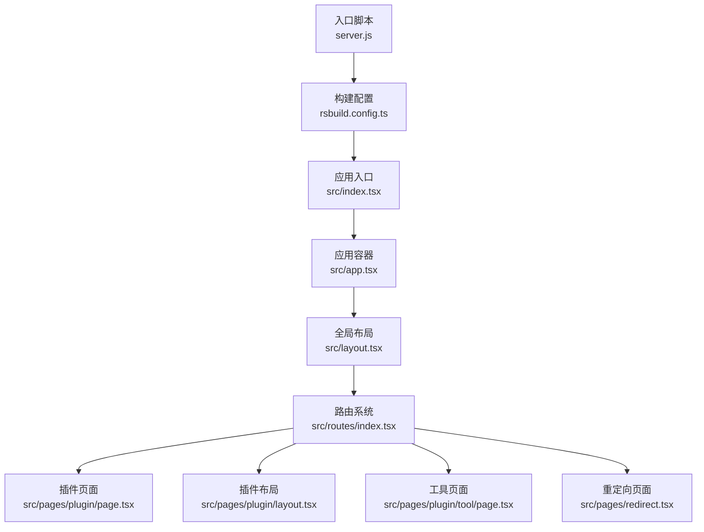
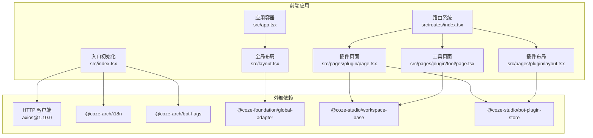
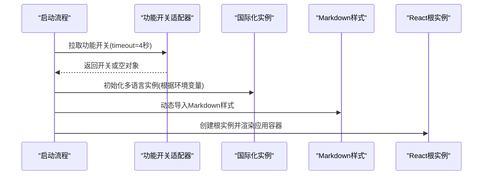
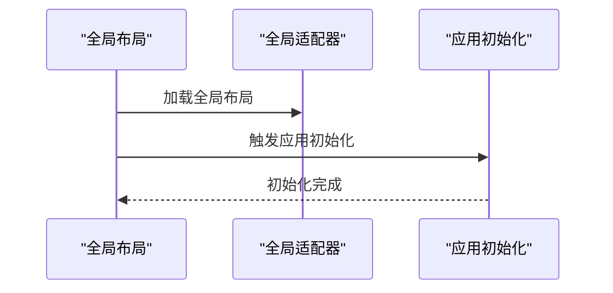
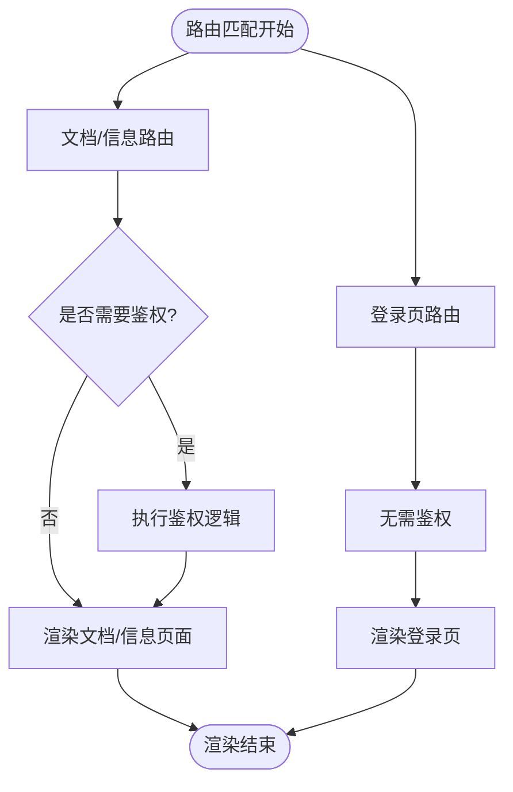
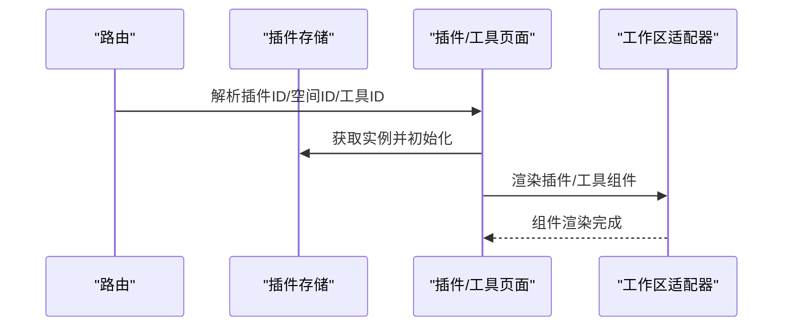
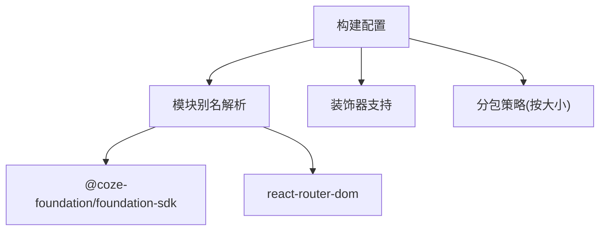
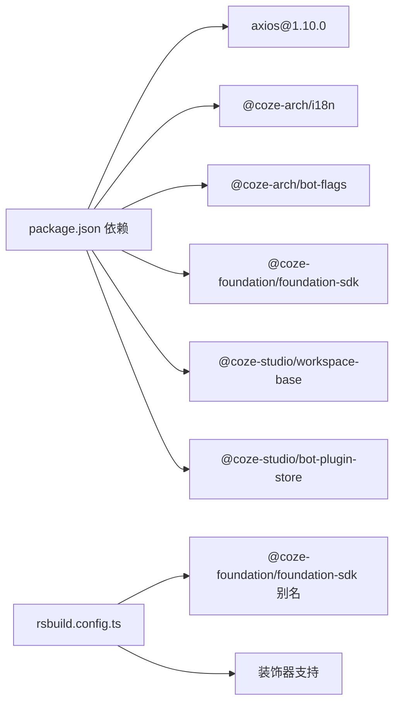

# 外部服务集成

<cite>
**本文引用的文件**
- [package.json](file://package.json)
- [rsbuild.config.ts](file://rsbuild.config.ts)
- [src/index.tsx](file://src/index.tsx)
- [src/app.tsx](file://src/app.tsx)
- [src/layout.tsx](file://src/layout.tsx)
- [src/pages/plugin/page.tsx](file://src/pages/plugin/page.tsx)
- [src/pages/plugin/layout.tsx](file://src/pages/plugin/layout.tsx)
- [src/pages/plugin/tool/page.tsx](file://src/pages/plugin/tool/page.tsx)
- [src/pages/redirect.tsx](file://src/pages/redirect.tsx)
- [src/routes/index.tsx](file://src/routes/index.tsx)
- [server.js](file://server.js)
- [.rush/temp/shrinkwrap-deps.json](file://.rush/temp/shrinkwrap-deps.json)
</cite>

## 目录
1. [简介](#简介)
2. [项目结构](#项目结构)
3. [核心组件](#核心组件)
4. [架构总览](#架构总览)
5. [详细组件分析](#详细组件分析)
6. [依赖分析](#依赖分析)
7. [性能考虑](#性能考虑)
8. [故障排除指南](#故障排除指南)
9. [结论](#结论)
10. [附录](#附录)

## 简介
本文件面向 Coze Studio 前端应用的外部服务集成，系统化梳理与外部系统的交互方式、认证与密钥管理、配置项与运行参数、超时与重试策略、可用性监控与降级策略、版本兼容性与更新计划，并给出安全与可靠性保障建议。由于当前仓库主要为前端应用与路由层，外部服务集成以 SDK 调用与第三方依赖为主，本文在不披露具体代码的前提下，基于现有文件与依赖信息进行抽象化说明与最佳实践指导。

## 项目结构
前端应用采用 React + Rsbuild 构建，入口初始化流程包含国际化、功能开关拉取、Markdown 样式动态注入等步骤；全局布局通过适配器加载；路由系统支持文档跳转与登录页等场景；插件工具页面通过工作区适配器与插件存储进行初始化与渲染。

**图示来源**
- [server.js:1-4](file://server.js#L1-L4)
- [rsbuild.config.ts:1-20](file://rsbuild.config.ts#L1-L20)
- [src/index.tsx:1-54](file://src/index.tsx#L1-L54)
- [src/app.tsx:1-37](file://src/app.tsx#L1-L37)
- [src/layout.tsx:1-23](file://src/layout.tsx#L1-L23)
- [src/routes/index.tsx:50-96](file://src/routes/index.tsx#L50-L96)
- [src/pages/plugin/page.tsx:1-36](file://src/pages/plugin/page.tsx#L1-L36)
- [src/pages/plugin/layout.tsx:1-41](file://src/pages/plugin/layout.tsx#L1-L41)
- [src/pages/plugin/tool/page.tsx:1-35](file://src/pages/plugin/tool/page.tsx#L1-L35)
- [src/pages/redirect.tsx:1-26](file://src/pages/redirect.tsx#L1-L26)

**章节来源**
- [server.js:1-4](file://server.js#L1-L4)
- [rsbuild.config.ts:1-20](file://rsbuild.config.ts#L1-L20)
- [src/index.tsx:1-54](file://src/index.tsx#L1-L54)
- [src/app.tsx:1-37](file://src/app.tsx#L1-L37)
- [src/layout.tsx:1-23](file://src/layout.tsx#L1-L23)
- [src/routes/index.tsx:50-96](file://src/routes/index.tsx#L50-L96)

## 核心组件
- 应用入口与初始化：负责国际化、功能开关拉取、样式注入与根节点挂载。
- 全局布局与适配器：统一加载全局布局与应用初始化逻辑。
- 路由系统：定义文档、登录、空间等路由，包含重定向逻辑。
- 插件与工具页面：通过工作区适配器与插件存储进行初始化与渲染。
- 构建与别名配置：对内部 SDK 与路由库进行路径解析与装饰器支持。

**章节来源**
- [src/index.tsx:26-52](file://src/index.tsx#L26-L52)
- [src/layout.tsx:17-23](file://src/layout.tsx#L17-L23)
- [src/routes/index.tsx:50-96](file://src/routes/index.tsx#L50-L96)
- [src/pages/plugin/page.tsx:20-33](file://src/pages/plugin/page.tsx#L20-L33)
- [src/pages/plugin/layout.tsx:19-38](file://src/pages/plugin/layout.tsx#L19-L38)
- [src/pages/plugin/tool/page.tsx:17-32](file://src/pages/plugin/tool/page.tsx#L17-L32)
- [rsbuild.config.ts:106-135](file://rsbuild.config.ts#L106-L135)

## 架构总览
前端应用通过入口初始化完成国际化与功能开关拉取后，进入路由系统；全局布局加载适配器；插件与工具页面通过工作区适配器与插件存储进行初始化。外部服务集成以 SDK 调用与第三方依赖为主，未见直接暴露的后端 API 客户端代码。

**图示来源**
- [src/index.tsx:17-52](file://src/index.tsx#L17-L52)
- [src/app.tsx:17-36](file://src/app.tsx#L17-L36)
- [src/layout.tsx:17-23](file://src/layout.tsx#L17-L23)
- [src/routes/index.tsx:50-96](file://src/routes/index.tsx#L50-L96)
- [src/pages/plugin/page.tsx:20-33](file://src/pages/plugin/page.tsx#L20-L33)
- [src/pages/plugin/layout.tsx:19-38](file://src/pages/plugin/layout.tsx#L19-L38)
- [src/pages/plugin/tool/page.tsx:17-32](file://src/pages/plugin/tool/page.tsx#L17-L32)
- [.rush/temp/shrinkwrap-deps.json:235](file://.rush/temp/shrinkwrap-deps.json#L235)

## 详细组件分析

### 组件A：入口初始化与外部依赖
- 国际化初始化：根据环境变量选择语言并初始化多语言实例。
- 功能开关拉取：通过适配器拉取功能开关，设置超时时间与兜底实现。
- Markdown 样式动态注入：按需导入 Markdown 渲染样式。
- 根节点挂载：创建 React 根实例并渲染应用容器。

**图示来源**
- [src/index.tsx:26-52](file://src/index.tsx#L26-L52)

**章节来源**
- [src/index.tsx:26-52](file://src/index.tsx#L26-L52)

### 组件B：全局布局与适配器
- 使用全局适配器加载统一布局。
- 在布局中触发应用初始化逻辑，确保全局状态与资源准备就绪。

**图示来源**
- [src/layout.tsx:17-23](file://src/layout.tsx#L17-L23)

**章节来源**
- [src/layout.tsx:17-23](file://src/layout.tsx#L17-L23)

### 组件C：路由系统与重定向
- 文档与信息类路由：统一使用重定向组件，设置是否需要侧边栏与鉴权。
- 登录页路由：独立页面，无需侧边栏与鉴权。
- 重定向逻辑：将特定路径重定向到外部站点。

**图示来源**
- [src/routes/index.tsx:50-96](file://src/routes/index.tsx#L50-L96)
- [src/pages/redirect.tsx:17-24](file://src/pages/redirect.tsx#L17-L24)

**章节来源**
- [src/routes/index.tsx:50-96](file://src/routes/index.tsx#L50-L96)
- [src/pages/redirect.tsx:17-24](file://src/pages/redirect.tsx#L17-L24)

### 组件D：插件与工具页面
- 插件页面：从路由参数读取插件与空间 ID，初始化插件存储后渲染插件容器。
- 插件布局：提供插件存储上下文与资源导航函数。
- 工具页面：从路由参数读取工具 ID，初始化插件存储后渲染工具组件。

**图示来源**
- [src/pages/plugin/page.tsx:20-33](file://src/pages/plugin/page.tsx#L20-L33)
- [src/pages/plugin/layout.tsx:19-38](file://src/pages/plugin/layout.tsx#L19-L38)
- [src/pages/plugin/tool/page.tsx:17-32](file://src/pages/plugin/tool/page.tsx#L17-L32)

**章节来源**
- [src/pages/plugin/page.tsx:20-33](file://src/pages/plugin/page.tsx#L20-L33)
- [src/pages/plugin/layout.tsx:19-38](file://src/pages/plugin/layout.tsx#L19-L38)
- [src/pages/plugin/tool/page.tsx:17-32](file://src/pages/plugin/tool/page.tsx#L17-L32)

### 组件E：构建配置与别名
- 包含内部 SDK 与路由库的别名解析，确保模块解析正确。
- 支持装饰器语法，便于依赖注入等特性。
- 性能分包策略，按大小拆分代码块。

**图示来源**
- [rsbuild.config.ts:106-135](file://rsbuild.config.ts#L106-L135)

**章节来源**
- [rsbuild.config.ts:106-135](file://rsbuild.config.ts#L106-L135)

## 依赖分析
- 第三方 HTTP 客户端：存在 axios 依赖，用于网络请求。
- 国际化与功能开关：分别通过对应适配器进行初始化与拉取。
- 内部 SDK 与适配器：通过别名解析指向内部工作区与插件相关模块。
- 构建与打包：Rsbuild 配置包含性能优化与装饰器支持。

**图示来源**
- [package.json:19-51](file://package.json#L19-L51)
- [.rush/temp/shrinkwrap-deps.json:235](file://.rush/temp/shrinkwrap-deps.json#L235)
- [rsbuild.config.ts:106-135](file://rsbuild.config.ts#L106-L135)

**章节来源**
- [package.json:19-51](file://package.json#L19-L51)
- [.rush/temp/shrinkwrap-deps.json:235](file://.rush/temp/shrinkwrap-deps.json#L235)
- [rsbuild.config.ts:106-135](file://rsbuild.config.ts#L106-L135)

## 性能考虑
- 分包策略：按大小拆分代码块，避免单块过大影响首屏加载。
- 模块别名：减少重复解析成本，提升打包效率。
- 动态样式：按需加载 Markdown 样式，降低初始包体。
- 装饰器支持：在构建阶段启用，避免运行时额外开销。

**章节来源**
- [rsbuild.config.ts:126-132](file://rsbuild.config.ts#L126-L132)
- [src/index.tsx:42-43](file://src/index.tsx#L42-L43)

## 故障排除指南
- 启动失败（根元素缺失）：检查 HTML 中是否存在目标挂载节点，确保入口逻辑可正常创建根实例。
- 国际化语言异常：确认环境变量与本地存储值，确保初始化时的语言选择符合预期。
- 功能开关拉取超时：适当调整超时时间，或在网络不佳环境下提供降级策略。
- 插件/工具页面参数缺失：确保路由参数完整传递，避免因缺少插件 ID 或空间 ID 导致初始化失败。
- 重定向异常：检查重定向目标地址与路径拼接逻辑，确保跳转正确。

**章节来源**
- [src/index.tsx:45-48](file://src/index.tsx#L45-L48)
- [src/index.tsx:37-41](file://src/index.tsx#L37-L41)
- [src/index.tsx:26-31](file://src/index.tsx#L26-L31)
- [src/pages/plugin/page.tsx:23-28](file://src/pages/plugin/page.tsx#L23-L28)
- [src/pages/redirect.tsx:20-22](file://src/pages/redirect.tsx#L20-L22)

## 结论
本前端应用通过入口初始化完成国际化与功能开关拉取，结合全局布局与路由系统，为插件与工具页面提供稳定的运行环境。外部服务集成以 SDK 调用与第三方依赖为主，建议在后续开发中补充统一的外部服务客户端封装、认证与密钥管理、超时与重试策略、可用性监控与降级策略，并完善版本兼容性与更新计划，以确保集成的安全性与可靠性。

## 附录
- 外部服务集成清单（建议）
  - 认证机制：统一令牌管理与刷新策略，支持多租户与多环境切换。
  - API 密钥管理：密钥加密存储、轮换与审计日志。
  - 访问控制：细粒度权限模型与最小权限原则。
  - 配置选项：环境变量驱动的可配置项与默认值。
  - 超时与重试：指数退避与最大重试次数，区分可重试与不可重试错误。
  - 可用性监控：请求成功率、延迟分布、错误率与告警阈值。
  - 降级策略：缓存回退、静态兜底、功能开关快速关闭。
  - 版本兼容性：语义化版本与向后兼容策略，发布前兼容性测试。
  - 更新计划：版本发布节奏、迁移指南与弃用策略。