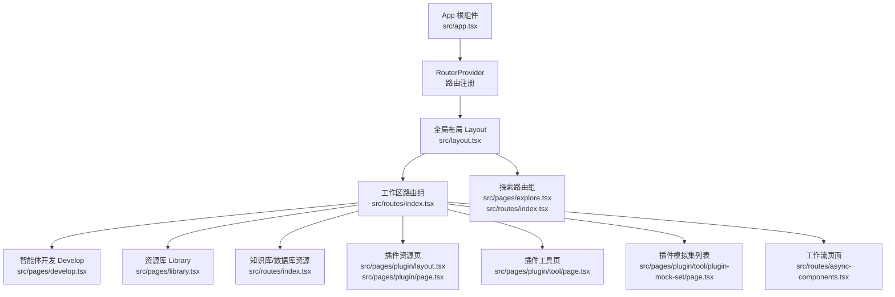
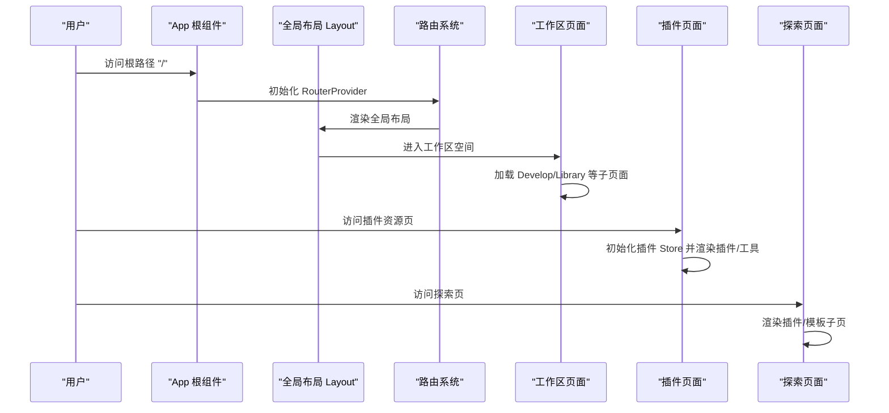
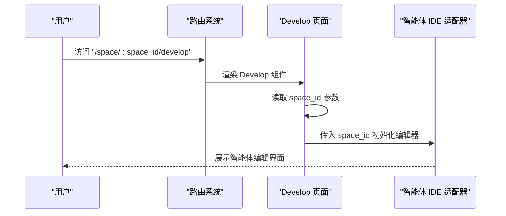
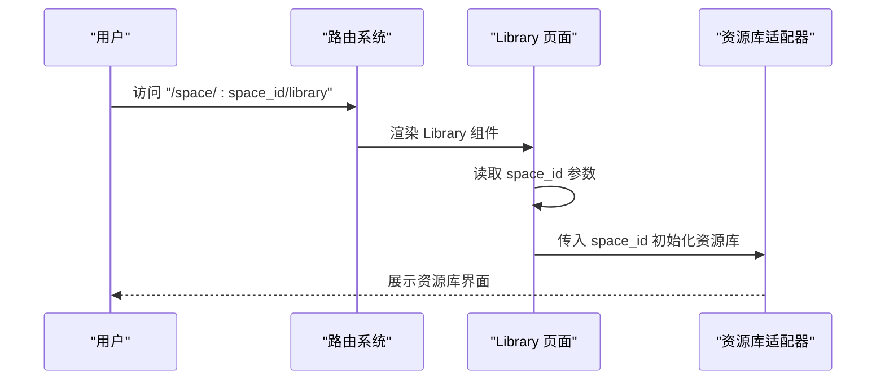
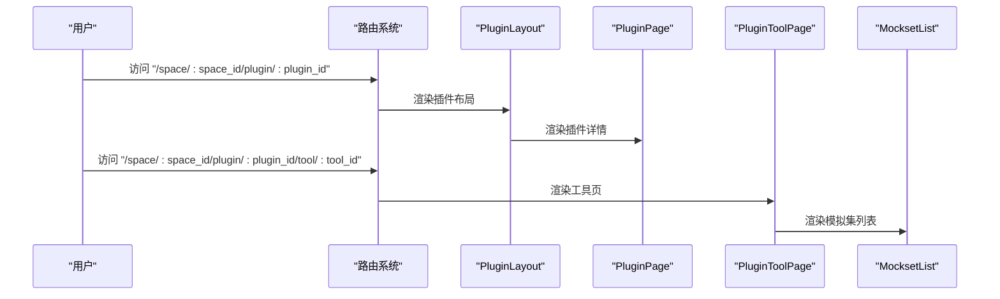
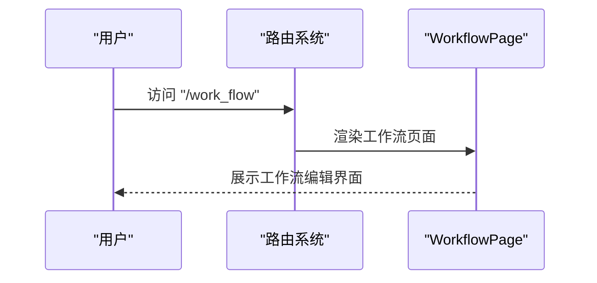
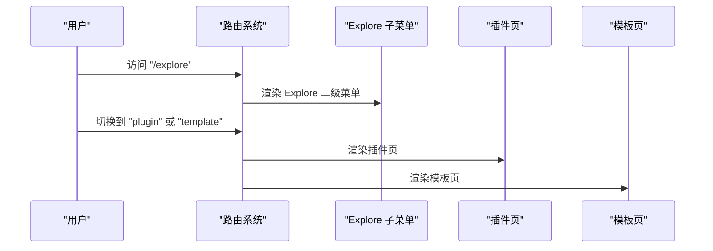
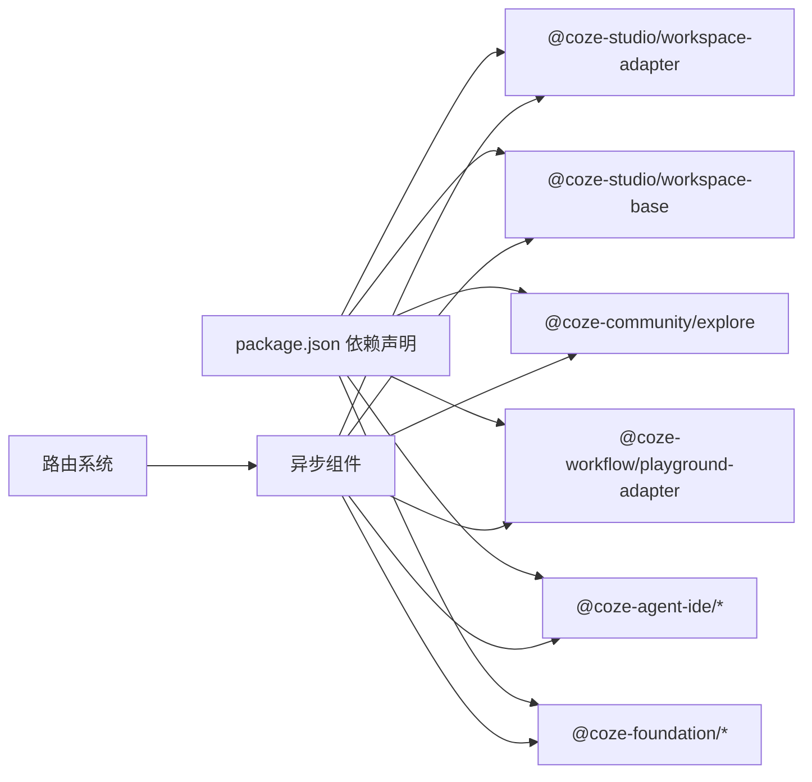

# 功能模块

<cite>
**本文引用的文件**
- [src/app.tsx](file://src/app.tsx)
- [src/layout.tsx](file://src/layout.tsx)
- [src/routes/index.tsx](file://src/routes/index.tsx)
- [src/routes/async-components.tsx](file://src/routes/async-components.tsx)
- [src/pages/develop.tsx](file://src/pages/develop.tsx)
- [src/pages/library.tsx](file://src/pages/library.tsx)
- [src/pages/explore.tsx](file://src/pages/explore.tsx)
- [src/pages/plugin/layout.tsx](file://src/pages/plugin/layout.tsx)
- [src/pages/plugin/page.tsx](file://src/pages/plugin/page.tsx)
- [src/pages/plugin/tool/page.tsx](file://src/pages/plugin/tool/page.tsx)
- [src/pages/plugin/tool/plugin-mock-set/page.tsx](file://src/pages/plugin/tool/plugin-mock-set/page.tsx)
- [package.json](file://package.json)
- [README.md](file://README.md)
</cite>

## 目录
1. [简介](#简介)
2. [项目结构](#项目结构)
3. [核心组件](#核心组件)
4. [架构总览](#架构总览)
5. [详细组件分析](#详细组件分析)
6. [依赖分析](#依赖分析)
7. [性能考虑](#性能考虑)
8. [故障排查指南](#故障排查指南)
9. [结论](#结论)
10. [附录](#附录)

## 简介
本文件面向 Coze Studio 前端功能模块，系统梳理并说明以下核心能力：
- 智能体开发：在工作区空间内进行智能体编辑与发布。
- 资源库管理：统一管理知识库、数据库表等资源。
- 插件生态系统：插件商店、插件详情、工具页与模拟集管理。
- 工作流构建：独立的工作流页面入口。
- 探索功能：插件与模板的探索页及子菜单。

文档同时解释模块间依赖关系、数据交互方式、权限控制与访问限制，并提供使用场景、操作示例、配置项与扩展机制说明，以及常见问题与最佳实践建议。

## 项目结构
前端应用通过路由驱动模块化页面，采用按需加载（懒加载）以优化首屏性能。顶层布局负责全局初始化与侧边栏容器；路由层组织工作区、探索、工作流等主功能域；各功能页面通过适配器或工作区组件承载具体业务。

图表来源
- [src/app.tsx:24-36](file://src/app.tsx#L24-L36)
- [src/layout.tsx:19-23](file://src/layout.tsx#L19-L23)
- [src/routes/index.tsx:50-297](file://src/routes/index.tsx#L50-L297)
- [src/routes/async-components.tsx:103-152](file://src/routes/async-components.tsx#L103-L152)
- [src/pages/develop.tsx:21-26](file://src/pages/develop.tsx#L21-L26)
- [src/pages/library.tsx:21-26](file://src/pages/library.tsx#L21-L26)
- [src/pages/explore.tsx:37-66](file://src/pages/explore.tsx#L37-L66)

章节来源
- [src/app.tsx:24-36](file://src/app.tsx#L24-L36)
- [src/layout.tsx:19-23](file://src/layout.tsx#L19-L23)
- [src/routes/index.tsx:50-297](file://src/routes/index.tsx#L50-L297)
- [src/routes/async-components.tsx:103-152](file://src/routes/async-components.tsx#L103-L152)
- [src/pages/develop.tsx:21-26](file://src/pages/develop.tsx#L21-L26)
- [src/pages/library.tsx:21-26](file://src/pages/library.tsx#L21-L26)
- [src/pages/explore.tsx:37-66](file://src/pages/explore.tsx#L37-L66)

## 核心组件
- 应用根组件：提供全局加载态与路由容器。
- 全局布局：负责应用初始化与全局容器渲染。
- 路由系统：集中定义工作区、探索、工作流等主路径与子路由。
- 异步组件：按需加载页面组件，降低初始包体积。
- 页面适配器：通过外部适配器注入具体功能（如智能体 IDE、工作区开发、探索页等）。

章节来源
- [src/app.tsx:24-36](file://src/app.tsx#L24-L36)
- [src/layout.tsx:19-23](file://src/layout.tsx#L19-L23)
- [src/routes/index.tsx:50-297](file://src/routes/index.tsx#L50-L297)
- [src/routes/async-components.tsx:17-152](file://src/routes/async-components.tsx#L17-L152)

## 架构总览
下图展示从应用启动到各功能模块的调用链路与依赖关系：

图表来源
- [src/app.tsx:24-36](file://src/app.tsx#L24-L36)
- [src/layout.tsx:19-23](file://src/layout.tsx#L19-L23)
- [src/routes/index.tsx:50-297](file://src/routes/index.tsx#L50-L297)
- [src/pages/plugin/layout.tsx:22-37](file://src/pages/plugin/layout.tsx#L22-L37)
- [src/pages/explore.tsx:37-66](file://src/pages/explore.tsx#L37-L66)

## 详细组件分析

### 智能体开发（工作区）
- 路由入口：工作区空间下的“develop”路径，支持带空间 ID 的动态参数。
- 页面职责：通过适配器加载智能体开发环境，支持编辑、调试与发布流程。
- 数据交互：页面接收空间 ID 参数，作为后续资源与权限校验的上下文标识。
- 权限控制：工作区相关路由通常需要登录态与空间权限。

图表来源
- [src/routes/index.tsx:118-125](file://src/routes/index.tsx#L118-L125)
- [src/pages/develop.tsx:21-26](file://src/pages/develop.tsx#L21-L26)

章节来源
- [src/routes/index.tsx:118-125](file://src/routes/index.tsx#L118-L125)
- [src/pages/develop.tsx:21-26](file://src/pages/develop.tsx#L21-L26)

### 资源库管理
- 路由入口：工作区空间下的“library”路径，用于资源库统一入口。
- 页面职责：通过适配器加载资源库页面，支持资源检索、分类与管理。
- 数据交互：页面接收空间 ID 参数，作为资源归属与权限边界。

图表来源
- [src/routes/index.tsx:175-182](file://src/routes/index.tsx#L175-L182)
- [src/pages/library.tsx:21-26](file://src/pages/library.tsx#L21-L26)

章节来源
- [src/routes/index.tsx:175-182](file://src/routes/index.tsx#L175-L182)
- [src/pages/library.tsx:21-26](file://src/pages/library.tsx#L21-L26)

### 插件生态系统
- 插件资源页：支持插件详情与工具页导航，具备插件 ID 与空间 ID 参数校验。
- 插件工具页：支持工具 ID 参数，进入具体工具的配置与调试界面。
- 模拟集管理：在工具页下提供模拟集列表，便于测试与验证。
- 数据交互：所有页面均通过插件 Store 初始化，确保状态一致与可维护性。

图表来源
- [src/routes/index.tsx:217-236](file://src/routes/index.tsx#L217-L236)
- [src/pages/plugin/layout.tsx:22-37](file://src/pages/plugin/layout.tsx#L22-L37)
- [src/pages/plugin/page.tsx:23-33](file://src/pages/plugin/page.tsx#L23-L33)
- [src/pages/plugin/tool/page.tsx:22-32](file://src/pages/plugin/tool/page.tsx#L22-L32)
- [src/pages/plugin/tool/plugin-mock-set/page.tsx:22-34](file://src/pages/plugin/tool/plugin-mock-set/page.tsx#L22-L34)

章节来源
- [src/routes/index.tsx:217-236](file://src/routes/index.tsx#L217-L236)
- [src/pages/plugin/layout.tsx:22-37](file://src/pages/plugin/layout.tsx#L22-L37)
- [src/pages/plugin/page.tsx:23-33](file://src/pages/plugin/page.tsx#L23-L33)
- [src/pages/plugin/tool/page.tsx:22-32](file://src/pages/plugin/tool/page.tsx#L22-L32)
- [src/pages/plugin/tool/plugin-mock-set/page.tsx:22-34](file://src/pages/plugin/tool/plugin-mock-set/page.tsx#L22-L34)

### 工作流构建
- 路由入口：独立的“work_flow”路径，无需工作区上下文。
- 页面职责：通过适配器加载工作流页面，支持流程设计与执行。
- 权限控制：该页面需要登录态。

图表来源
- [src/routes/index.tsx:242-250](file://src/routes/index.tsx#L242-L250)
- [src/routes/async-components.tsx:110-115](file://src/routes/async-components.tsx#L110-L115)

章节来源
- [src/routes/index.tsx:242-250](file://src/routes/index.tsx#L242-L250)
- [src/routes/async-components.tsx:110-115](file://src/routes/async-components.tsx#L110-L115)

### 探索功能
- 路由入口：探索页，包含插件与模板两类子页。
- 子菜单：左侧二级导航由适配器提供，支持切换插件与模板视图。
- 权限控制：探索页需要登录态。

图表来源
- [src/routes/index.tsx:262-294](file://src/routes/index.tsx#L262-L294)
- [src/pages/explore.tsx:37-66](file://src/pages/explore.tsx#L37-L66)
- [src/routes/async-components.tsx:133-152](file://src/routes/async-components.tsx#L133-L152)

章节来源
- [src/routes/index.tsx:262-294](file://src/routes/index.tsx#L262-L294)
- [src/pages/explore.tsx:37-66](file://src/pages/explore.tsx#L37-L66)
- [src/routes/async-components.tsx:133-152](file://src/routes/async-components.tsx#L133-L152)

## 依赖分析
- 外部依赖：通过适配器与第三方模块集成，如智能体 IDE、工作区适配器、探索社区模块、工作流适配器等。
- 内部依赖：页面组件依赖路由系统与全局布局；插件生态依赖插件 Store 提供的状态与导航能力。
- 懒加载策略：异步组件按需加载，减少初始包体积，提升首屏性能。

图表来源
- [package.json:19-50](file://package.json#L19-L50)
- [src/routes/async-components.tsx:17-152](file://src/routes/async-components.tsx#L17-L152)

章节来源
- [package.json:19-50](file://package.json#L19-L50)
- [src/routes/async-components.tsx:17-152](file://src/routes/async-components.tsx#L17-L152)

## 性能考虑
- 按需加载：通过懒加载拆分页面，避免一次性加载全部模块，缩短首屏时间。
- 状态管理：插件生态通过 Store 管理状态，避免重复初始化与跨页面状态同步成本。
- 路由缓存：利用 React Router 的缓存策略与 Suspense 结合，提升切换体验。
- 依赖精简：仅引入必要适配器与组件，减少运行时开销。

## 故障排查指南
- 页面空白或白屏
  - 检查路由是否正确匹配路径与参数（如 space_id、plugin_id、tool_id）。
  - 确认全局布局与路由容器是否正常渲染。
- 插件页面报错“缺少插件 ID 或空间 ID”
  - 确保访问路径包含必需参数，且在渲染前完成参数校验。
- 登录态缺失导致页面无法访问
  - 探索页与工作区相关路由需要登录态，检查认证流程与权限头信息。
- 首屏加载缓慢
  - 检查是否存在未懒加载的大模块，或是否存在循环依赖导致打包异常。
- 插件 Store 初始化失败
  - 确认插件 Store Provider 是否正确包裹页面，初始化逻辑是否在挂载后执行。

章节来源
- [src/pages/plugin/layout.tsx:26-28](file://src/pages/plugin/layout.tsx#L26-L28)
- [src/pages/plugin/page.tsx:26-28](file://src/pages/plugin/page.tsx#L26-L28)
- [src/pages/plugin/tool/page.tsx:25-27](file://src/pages/plugin/tool/page.tsx#L25-L27)
- [src/routes/index.tsx:40-47](file://src/routes/index.tsx#L40-L47)

## 结论
Coze Studio 前端通过清晰的路由分层与适配器模式，将智能体开发、资源库管理、插件生态、工作流与探索功能有机整合。模块间通过参数传递与共享 Store 实现低耦合高内聚的数据交互；配合懒加载与全局布局，兼顾了性能与可维护性。对于新用户，可从工作区与探索页快速上手；对开发者，可通过适配器扩展与 Store 管理实现深度定制。

## 附录
- 快速入口
  - 工作区智能体开发：/space/:space_id/develop
  - 资源库：/space/:space_id/library
  - 插件详情：/space/:space_id/plugin/:plugin_id
  - 插件工具：/space/:space_id/plugin/:plugin_id/tool/:tool_id
  - 工作流：/work_flow
  - 探索插件：/explore/plugin
  - 探索模板：/explore/template
- 权限与访问
  - 登录态要求：探索页、工作区相关路由、工作流页面。
  - 空间权限：智能体开发、资源库、插件资源等以空间 ID 作为上下文。
- 扩展建议
  - 新增页面：在路由系统中新增异步组件与路径映射。
  - 自定义适配器：通过适配器注入新的编辑器或页面组件。
  - 插件生态：基于插件 Store 提供的状态与导航能力扩展工具与模拟集。