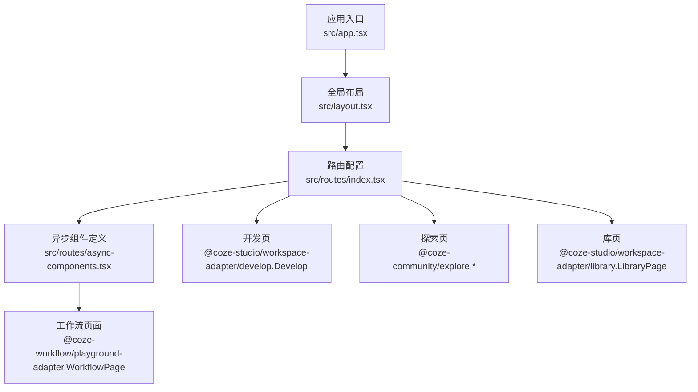
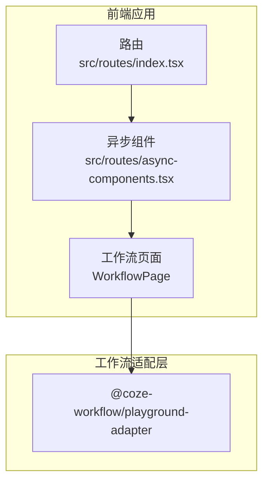
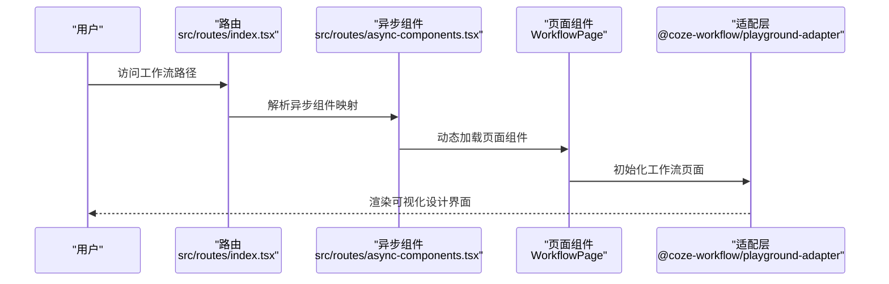
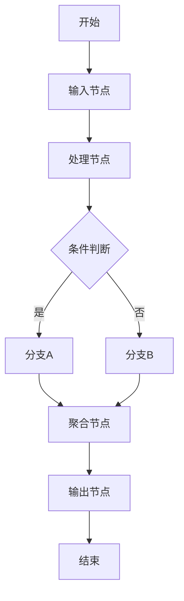
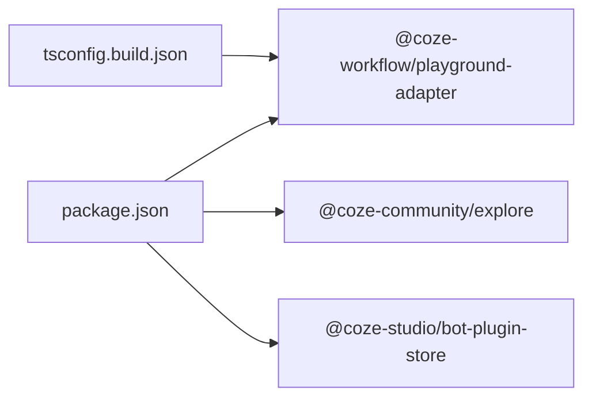

# 工作流构建

<cite>
**本文引用的文件**
- [README.md](file://README.md)
- [package.json](file://package.json)
- [tsconfig.build.json](file://tsconfig.build.json)
- [src/app.tsx](file://src/app.tsx)
- [src/layout.tsx](file://src/layout.tsx)
- [src/routes/index.tsx](file://src/routes/index.tsx)
- [src/routes/async-components.tsx](file://src/routes/async-components.tsx)
- [src/pages/develop.tsx](file://src/pages/develop.tsx)
- [src/pages/explore.tsx](file://src/pages/explore.tsx)
- [src/pages/library.tsx](file://src/pages/library.tsx)
</cite>

## 目录
1. [简介](#简介)
2. [项目结构](#项目结构)
3. [核心组件](#核心组件)
4. [架构总览](#架构总览)
5. [详细组件分析](#详细组件分析)
6. [依赖分析](#依赖分析)
7. [性能考虑](#性能考虑)
8. [故障排查指南](#故障排查指南)
9. [结论](#结论)
10. [附录](#附录)

## 简介
本文件面向 Coze Studio 的“工作流构建”能力，基于前端应用的路由与页面装配关系，系统化梳理工作流可视化设计工具在前端侧的接入方式、页面加载策略、以及与后端工作流适配层的协作边界。文档重点覆盖以下方面：
- 可视化流程设计工具的入口与页面组织
- 工作流节点的设计理念、连接与数据传递（通过适配层抽象说明）
- 调试、优化与版本管理的前端支持点
- 复杂工作流的设计模式与最佳实践建议
- 与智能体、插件的集成使用场景
- 执行性能监控与错误处理机制的前端落点

## 项目结构
前端应用采用 React + Rsbuild 构建，路由通过 React Router v6 组织，页面按模块拆分并通过动态导入（lazy）实现按需加载。工作流页面由 @coze-workflow/playground-adapter 提供，作为工作流可视化设计与执行的前端适配层。

图表来源
- [src/app.tsx:1-37](file://src/app.tsx#L1-L37)
- [src/layout.tsx:1-24](file://src/layout.tsx#L1-L24)
- [src/routes/index.tsx:1-250](file://src/routes/index.tsx#L1-L250)
- [src/routes/async-components.tsx:1-152](file://src/routes/async-components.tsx#L1-L152)

章节来源
- [README.md:1-7](file://README.md#L1-L7)
- [package.json:1-84](file://package.json#L1-L84)
- [tsconfig.build.json:92-133](file://tsconfig.build.json#L92-L133)
- [src/app.tsx:1-37](file://src/app.tsx#L1-L37)
- [src/layout.tsx:1-24](file://src/layout.tsx#L1-L24)
- [src/routes/index.tsx:1-250](file://src/routes/index.tsx#L1-L250)
- [src/routes/async-components.tsx:1-152](file://src/routes/async-components.tsx#L1-L152)

## 核心组件
- 应用外壳与加载占位：应用入口负责包裹全局布局与路由提供器，并在首次渲染时显示加载态，确保资源加载完成前的用户体验一致性。
- 全局布局：统一注入全局初始化逻辑，承载空间级导航与子模块布局。
- 路由与页面装配：通过异步组件定义集中声明各页面组件，工作流页面由 @coze-workflow/playground-adapter 提供，确保按需加载与体积控制。
- 开发页与探索页：分别用于工作流开发与生态资源浏览；库页用于资源管理。

章节来源
- [src/app.tsx:1-37](file://src/app.tsx#L1-L37)
- [src/layout.tsx:1-24](file://src/layout.tsx#L1-L24)
- [src/routes/async-components.tsx:103-152](file://src/routes/async-components.tsx#L103-L152)
- [src/routes/index.tsx:1-250](file://src/routes/index.tsx#L1-L250)
- [src/pages/develop.tsx:1-27](file://src/pages/develop.tsx#L1-L27)
- [src/pages/explore.tsx:1-67](file://src/pages/explore.tsx#L1-L67)
- [src/pages/library.tsx:1-27](file://src/pages/library.tsx#L1-L27)

## 架构总览
工作流构建在前端的职责是提供可视化设计界面与交互体验，具体的数据模型、节点类型、连接规则与执行引擎由 @coze-workflow/playground-adapter 抽象封装。前端通过路由与异步组件的方式将其集成到应用中。

图表来源
- [src/routes/index.tsx:1-250](file://src/routes/index.tsx#L1-L250)
- [src/routes/async-components.tsx:103-152](file://src/routes/async-components.tsx#L103-L152)

## 详细组件分析

### 工作流页面（WorkflowPage）
- 页面入口：路由中为工作流模块配置独立路径与权限要求，页面组件通过异步组件方式引入，降低首屏负载。
- 适配层职责：工作流可视化画布、节点类型体系、连线与数据流编排、执行与调试能力均由 @coze-workflow/playground-adapter 提供。
- 集成要点：页面加载器声明了无侧边栏与鉴权要求，确保在受控环境中进行工作流设计与执行。

图表来源
- [src/routes/index.tsx:242-250](file://src/routes/index.tsx#L242-L250)
- [src/routes/async-components.tsx:110-115](file://src/routes/async-components.tsx#L110-L115)

章节来源
- [src/routes/index.tsx:242-250](file://src/routes/index.tsx#L242-L250)
- [src/routes/async-components.tsx:110-115](file://src/routes/async-components.tsx#L110-L115)

### 节点设计与数据传递（概念性说明）
- 节点类型：工作流节点通常包括输入、处理、条件分支、聚合、输出等类型，节点间通过连线建立依赖关系。
- 连接方式：连线表达执行顺序与数据流向，支持单向数据流与条件分支。
- 数据传递：节点输入输出以结构化数据形式在节点之间传递，适配层负责校验与转换。
- 并行与串行：通过连线拓扑控制并发与串行执行，适配层提供调度与合并机制。

（本图为概念性流程示意，不对应具体源码）

### 调试、优化与版本管理（前端支持点）
- 调试：工作流页面提供断点、单步执行、变量检查与日志查看等能力，前端负责展示与交互。
- 优化：通过异步组件与懒加载减少初始包体；适配层内部对节点渲染与连线绘制进行性能优化。
- 版本管理：前端可展示版本列表与差异对比，便于回溯与发布。

章节来源
- [src/routes/async-components.tsx:110-115](file://src/routes/async-components.tsx#L110-L115)

### 与智能体、插件的集成（使用场景）
- 与智能体：工作流可调用智能体能力进行对话、推理或生成，节点类型中包含智能体调用节点。
- 与插件：工作流可复用插件工具链，节点类型中包含插件调用节点；插件工具可在独立页面中打开与配置。
- 场景示例：文本生成 -> 智能体问答 -> 结果归档；或 数据采集 -> 插件清洗 -> 输出汇总。

章节来源
- [src/routes/index.tsx:217-236](file://src/routes/index.tsx#L217-L236)
- [src/pages/develop.tsx:1-27](file://src/pages/develop.tsx#L1-L27)
- [src/pages/explore.tsx:1-67](file://src/pages/explore.tsx#L1-L67)

### 性能监控与错误处理（前端落点）
- 性能监控：前端通过加载态与骨架屏提升感知性能；适配层内部对渲染与执行进行节流与批处理。
- 错误处理：全局布局与路由层具备错误兜底能力，工作流页面内提供节点级错误提示与重试机制。

章节来源
- [src/app.tsx:1-37](file://src/app.tsx#L1-L37)
- [src/layout.tsx:1-24](file://src/layout.tsx#L1-L24)
- [src/routes/index.tsx:1-250](file://src/routes/index.tsx#L1-L250)

## 依赖分析
- 前端运行时依赖：React、React Router、Coze Design 等。
- 适配层依赖：工作流适配层 @coze-workflow/playground-adapter 通过异步组件方式注入，tsconfig 中也明确其构建配置。
- 生态依赖：探索页与插件页依赖 @coze-community/explore 与 @coze-studio/bot-plugin-store 等生态包。

图表来源
- [package.json:19-51](file://package.json#L19-L51)
- [tsconfig.build.json:130-131](file://tsconfig.build.json#L130-L131)

章节来源
- [package.json:19-51](file://package.json#L19-L51)
- [tsconfig.build.json:130-131](file://tsconfig.build.json#L130-L131)

## 性能考虑
- 按需加载：通过异步组件与路由懒加载降低首屏体积，提升启动速度。
- 渲染优化：避免不必要的重渲染，合理拆分组件与状态域。
- 交互反馈：在长任务与网络请求期间提供加载态与进度提示，改善用户体验。

（本节为通用指导，不直接分析具体文件）

## 故障排查指南
- 页面无法访问：确认路由配置与鉴权加载器设置是否正确。
- 组件未渲染：检查异步组件映射与导入路径是否一致。
- 加载卡顿：关注首屏依赖体积与关键渲染路径，必要时拆分代码块。
- 错误兜底：利用全局布局提供的错误边界组件定位问题。

章节来源
- [src/routes/index.tsx:242-250](file://src/routes/index.tsx#L242-L250)
- [src/routes/async-components.tsx:110-115](file://src/routes/async-components.tsx#L110-L115)
- [src/app.tsx:1-37](file://src/app.tsx#L1-L37)
- [src/layout.tsx:1-24](file://src/layout.tsx#L1-L24)

## 结论
本文件从前端视角梳理了 Coze Studio 工作流构建的接入方式与页面组织，明确了工作流可视化设计与执行在前端的职责边界。实际的节点类型、连线规则、执行引擎与版本管理等能力由 @coze-workflow/playground-adapter 提供，前端通过路由与异步组件实现稳定、可维护的集成。建议在实际使用中结合本文的设计模式与最佳实践，逐步完善复杂工作流的构建与运维。

## 附录
- 快速入口
  - 工作流页面：路由路径 work_flow，页面组件由 @coze-workflow/playground-adapter 提供。
  - 开发页：用于工作流开发与调试，路径参数 space_id。
  - 探索页：浏览插件与模板资源。
  - 库页：空间内资源管理。

章节来源
- [src/routes/index.tsx:242-250](file://src/routes/index.tsx#L242-L250)
- [src/pages/develop.tsx:1-27](file://src/pages/develop.tsx#L1-L27)
- [src/pages/explore.tsx:1-67](file://src/pages/explore.tsx#L1-L67)
- [src/pages/library.tsx:1-27](file://src/pages/library.tsx#L1-L27)