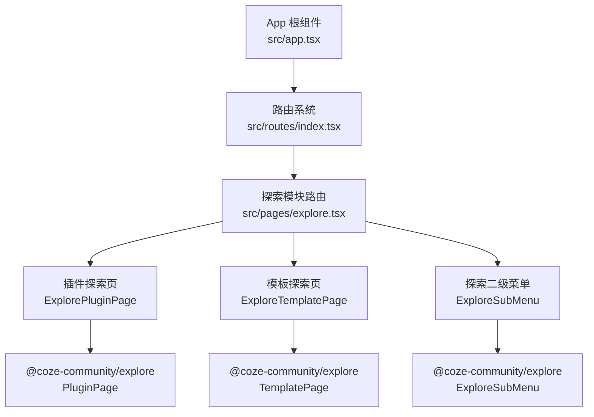
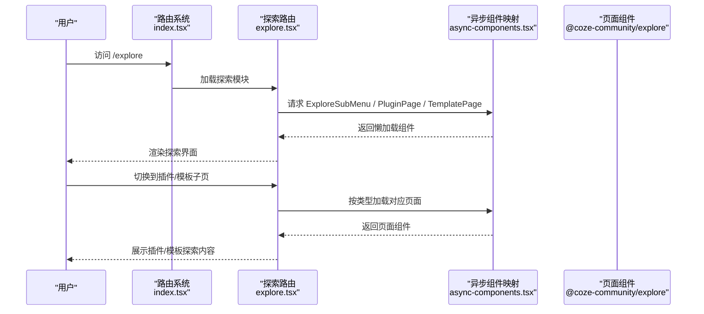
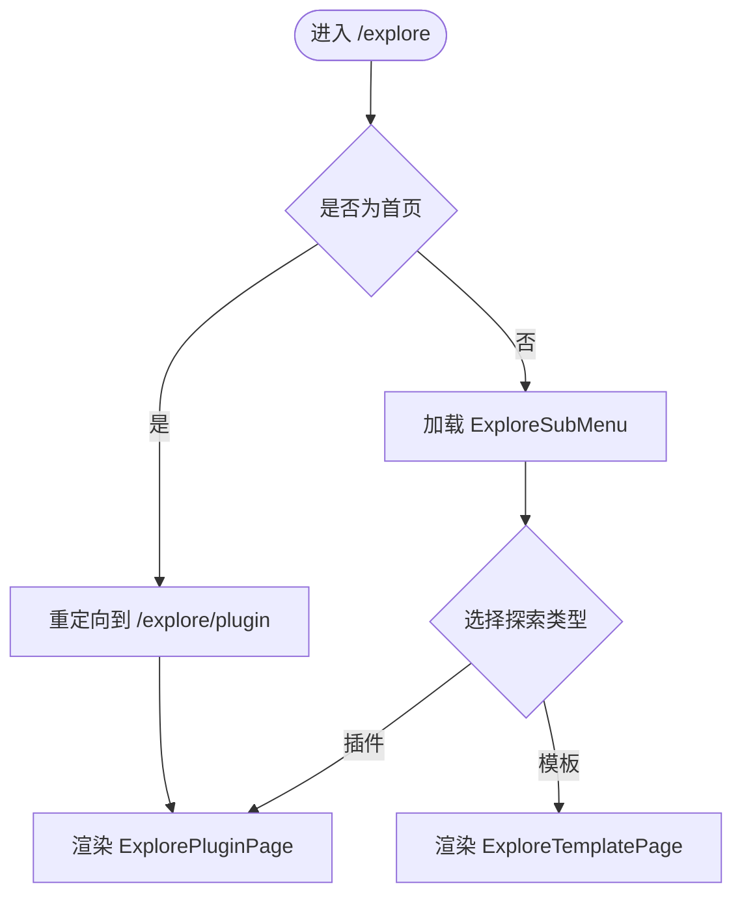
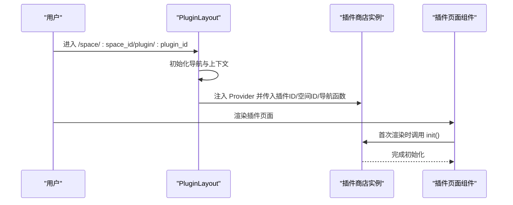
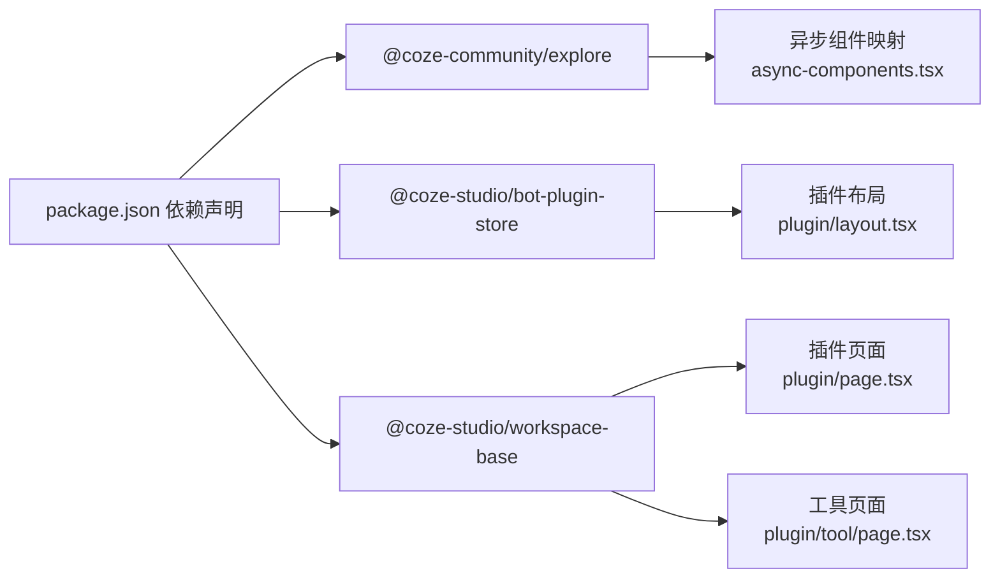

# 探索功能

<cite>
**本文引用的文件**
- [src/pages/explore.tsx](file://src/pages/explore.tsx)
- [src/routes/index.tsx](file://src/routes/index.tsx)
- [src/routes/async-components.tsx](file://src/routes/async-components.tsx)
- [src/app.tsx](file://src/app.tsx)
- [src/pages/plugin/layout.tsx](file://src/pages/plugin/layout.tsx)
- [src/pages/plugin/page.tsx](file://src/pages/plugin/page.tsx)
- [src/pages/plugin/tool/page.tsx](file://src/pages/plugin/tool/page.tsx)
- [package.json](file://package.json)
</cite>

## 目录
1. [简介](#简介)
2. [项目结构](#项目结构)
3. [核心组件](#核心组件)
4. [架构总览](#架构总览)
5. [详细组件分析](#详细组件分析)
6. [依赖关系分析](#依赖关系分析)
7. [性能考虑](#性能考虑)
8. [故障排查指南](#故障排查指南)
9. [结论](#结论)
10. [附录](#附录)

## 简介
本文件面向 Coze Studio 的“探索”功能，系统性梳理插件探索与模板探索的使用方式、资源发现机制、个性化推荐入口、界面导航结构、搜索过滤与排序能力、探索算法与推荐策略、配置与自定义项、历史记录与收藏管理、缓存机制与性能优化策略，并提供使用技巧与最佳实践。由于探索功能主要通过 @coze-community/explore 包提供的页面组件承载，本文在不展示具体源码的前提下，基于现有路由与异步组件加载机制进行架构与流程说明。

## 项目结构
探索功能由前端应用的路由系统统一接入，核心路径为 /explore，包含插件探索与模板探索两个子页面。页面组件通过异步懒加载的方式从 @coze-community/explore 包中按需引入，确保首屏性能与按需加载。

图表来源
- [src/app.tsx:24-36](file://src/app.tsx#L24-L36)
- [src/routes/index.tsx:262-294](file://src/routes/index.tsx#L262-L294)
- [src/pages/explore.tsx:37-66](file://src/pages/explore.tsx#L37-L66)
- [src/routes/async-components.tsx:134-152](file://src/routes/async-components.tsx#L134-L152)

章节来源
- [src/app.tsx:24-36](file://src/app.tsx#L24-L36)
- [src/routes/index.tsx:262-294](file://src/routes/index.tsx#L262-L294)
- [src/pages/explore.tsx:37-66](file://src/pages/explore.tsx#L37-L66)
- [src/routes/async-components.tsx:134-152](file://src/routes/async-components.tsx#L134-L152)

## 核心组件
- 探索路由对象：负责挂载探索模块的侧边菜单、认证要求与默认跳转逻辑，并为子路由提供类型标识（插件或模板）。
- 异步组件映射：通过 async-components.tsx 将 ExplorePluginPage、ExploreTemplatePage、ExploreSubMenu 统一懒加载，降低初始包体体积。
- 插件资源布局：在 /space/:space_id/plugin/:plugin_id 路径下提供插件资源的上下文与导航能力，配合插件商店状态初始化。

章节来源
- [src/pages/explore.tsx:37-66](file://src/pages/explore.tsx#L37-L66)
- [src/routes/async-components.tsx:134-152](file://src/routes/async-components.tsx#L134-L152)
- [src/pages/plugin/layout.tsx:22-37](file://src/pages/plugin/layout.tsx#L22-L37)

## 架构总览
探索功能采用“路由分发 + 按需加载 + 外部包承载”的架构模式：
- 路由层：集中定义 /explore 及其子路由，设置权限与侧边菜单。
- 组件层：通过 lazy 动态导入 @coze-community/explore 中的页面组件，避免打包时强耦合。
- 上下文层：插件资源路径下注入插件商店 Provider，确保插件工具链的可用性。

图表来源
- [src/routes/index.tsx:262-294](file://src/routes/index.tsx#L262-L294)
- [src/pages/explore.tsx:37-66](file://src/pages/explore.tsx#L37-L66)
- [src/routes/async-components.tsx:134-152](file://src/routes/async-components.tsx#L134-L152)

## 详细组件分析

### 探索路由与导航
- 路由路径：/explore，启用侧边栏与鉴权；默认重定向至 /explore/plugin。
- 子路由：
  - /explore/plugin：插件探索页，type=plugin。
  - /explore/template：模板探索页，type=template。
- 侧边菜单：通过 ExploreSubMenu 提供二级导航，便于在探索场景中切换不同视图或分类。

图表来源
- [src/routes/index.tsx:262-294](file://src/routes/index.tsx#L262-L294)
- [src/pages/explore.tsx:46-65](file://src/pages/explore.tsx#L46-L65)

章节来源
- [src/routes/index.tsx:262-294](file://src/routes/index.tsx#L262-L294)
- [src/pages/explore.tsx:37-66](file://src/pages/explore.tsx#L37-L66)

### 插件资源上下文与工具链
- 在 /space/:space_id/plugin/:plugin_id 下，通过 PluginLayout 注入 BotPluginStoreProvider，传入插件 ID、空间 ID 与资源导航函数，确保插件工具链可用。
- 页面组件在首次渲染时触发插件商店初始化，保证后续工具与模拟集合等资源可被正确加载。

图表来源
- [src/pages/plugin/layout.tsx:22-37](file://src/pages/plugin/layout.tsx#L22-L37)
- [src/pages/plugin/page.tsx:23-32](file://src/pages/plugin/page.tsx#L23-L32)

章节来源
- [src/pages/plugin/layout.tsx:22-37](file://src/pages/plugin/layout.tsx#L22-L37)
- [src/pages/plugin/page.tsx:23-32](file://src/pages/plugin/page.tsx#L23-L32)

### 工具详情与模拟集合
- 工具详情页：在 /space/:space_id/plugin/:plugin_id/tool/:tool_id 下渲染 Tool 组件，用于展示与操作单个工具。
- 模拟集合页：在 /space/:space_id/plugin/:plugin_id/tool/:tool_id/mock-set 下渲染 MocksetList，用于管理工具的模拟数据集。

章节来源
- [src/pages/plugin/tool/page.tsx:22-32](file://src/pages/plugin/tool/page.tsx#L22-L32)

### 探索页面组件职责
- ExplorePluginPage：承载插件探索的主界面，通常包含插件列表、搜索、分类筛选、排序与推荐位。
- ExploreTemplatePage：承载模板探索的主界面，通常包含模板列表、搜索、分类筛选、排序与推荐位。
- ExploreSubMenu：提供探索场景下的二级导航，如“全部”“热门”“最新”“我的”等视图切换。

章节来源
- [src/routes/async-components.tsx:134-152](file://src/routes/async-components.tsx#L134-L152)

## 依赖关系分析
探索功能的依赖主要集中在 @coze-community/explore 包与内部工作区包之间：
- @coze-community/explore：提供 ExploreSubMenu、PluginPage、TemplatePage 等探索相关页面组件。
- @coze-studio/bot-plugin-store：提供插件商店状态管理与 Provider，用于插件资源上下文。
- @coze-studio/workspace-base：提供插件、工具、模拟集合等基础组件与导航函数。

图表来源
- [package.json:66](file://package.json#L66)
- [src/routes/async-components.tsx:134-152](file://src/routes/async-components.tsx#L134-L152)
- [src/pages/plugin/layout.tsx:22-37](file://src/pages/plugin/layout.tsx#L22-L37)
- [src/pages/plugin/page.tsx:23-32](file://src/pages/plugin/page.tsx#L23-L32)
- [src/pages/plugin/tool/page.tsx:22-32](file://src/pages/plugin/tool/page.tsx#L22-L32)

章节来源
- [package.json:66](file://package.json#L66)
- [src/routes/async-components.tsx:134-152](file://src/routes/async-components.tsx#L134-L152)

## 性能考虑
- 按需加载：所有探索相关页面均通过 lazy 动态导入，减少首屏包体与初次渲染压力。
- Suspense 回退：根组件使用 Suspense 提供加载占位，提升交互体验。
- 资源初始化：插件页面在首次渲染时触发插件商店初始化，避免后续异步请求造成的抖动。
- 缓存策略：探索结果的缓存与性能优化由 @coze-community/explore 内部实现，前端通过懒加载与合理的组件拆分降低重复渲染成本。

章节来源
- [src/app.tsx:24-36](file://src/app.tsx#L24-L36)
- [src/pages/plugin/page.tsx:29-31](file://src/pages/plugin/page.tsx#L29-L31)

## 故障排查指南
- 路由无法访问或空白页
  - 检查 /explore 路由是否正确挂载，侧边菜单与 requireAuth 是否生效。
  - 确认 ExplorePluginPage/ExploreTemplatePage 是否成功从 @coze-community/explore 懒加载。
- 插件资源页面报错缺少参数
  - 确保路径包含 plugin_id 与 space_id，否则会抛出渲染错误。
  - 检查 PluginLayout 是否正确注入 Provider 与导航函数。
- 插件工具链不可用
  - 确认插件页面在首次渲染时已调用插件商店初始化。
- 搜索/筛选/排序无响应
  - 该能力由 @coze-community/explore 内部实现，若异常请检查网络与权限。

章节来源
- [src/pages/explore.tsx:46-65](file://src/pages/explore.tsx#L46-L65)
- [src/pages/plugin/layout.tsx:22-37](file://src/pages/plugin/layout.tsx#L22-L37)
- [src/pages/plugin/page.tsx:23-32](file://src/pages/plugin/page.tsx#L23-L32)

## 结论
探索功能以清晰的路由分发与按需加载为核心，结合 @coze-community/explore 提供的页面组件，实现了插件与模板的探索体验。通过 ExploreSubMenu、ExplorePluginPage、ExploreTemplatePage 的组合，用户可在统一入口完成资源发现、个性化推荐、搜索过滤与排序等操作。前端侧通过 Suspense、lazy 与插件商店初始化保障了性能与稳定性。实际的探索算法、推荐策略、缓存与收藏等功能细节由 @coze-community/explore 实现，建议在该包范围内进一步查阅其文档与源码以获得更完整的使用指南。

## 附录
- 使用技巧与最佳实践
  - 首次进入探索模块时，建议先浏览 ExploreSubMenu 的分类视图，再结合搜索与筛选快速定位目标资源。
  - 对于频繁使用的插件或模板，可结合收藏与历史记录功能进行管理。
  - 在插件资源路径下进行工具调试时，确保插件商店已完成初始化，避免工具链不可用的情况。
  - 若遇到页面空白或组件未加载，优先检查路由与懒加载配置，以及网络与鉴权状态。