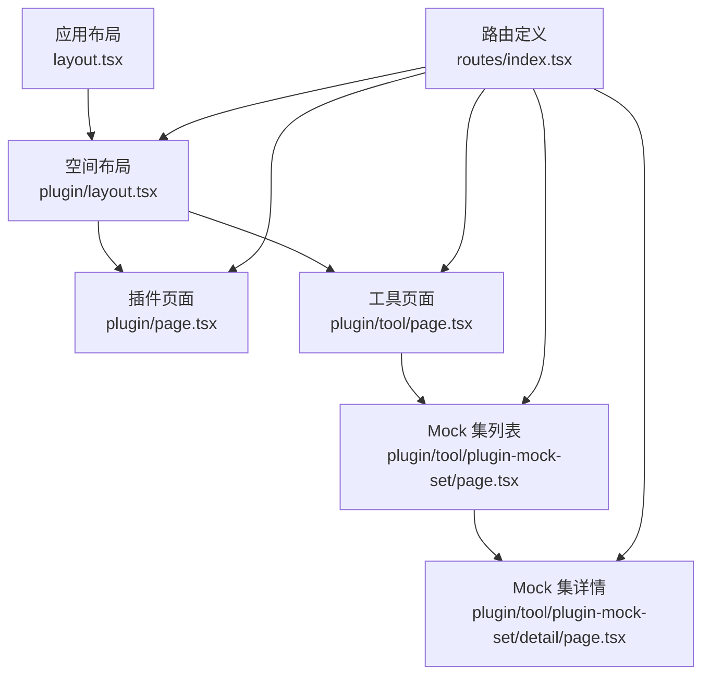
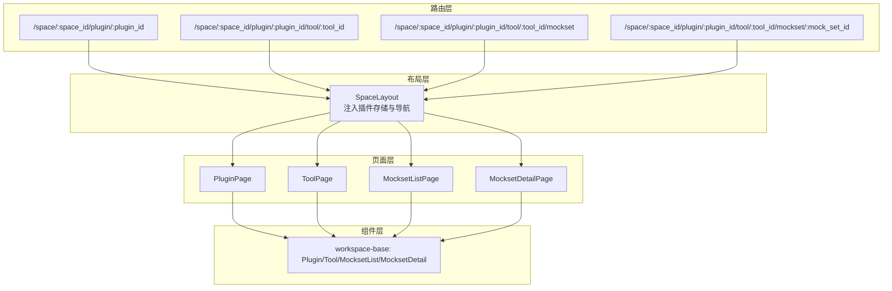
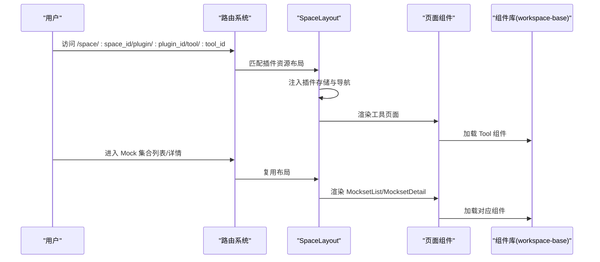
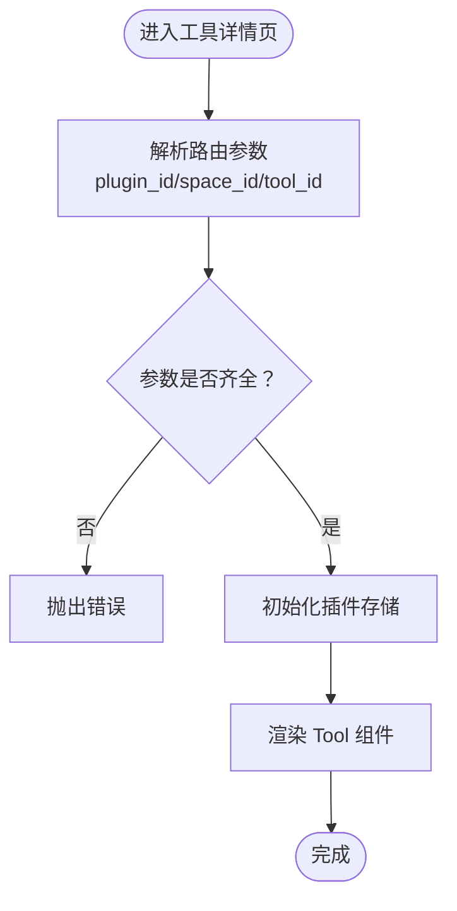
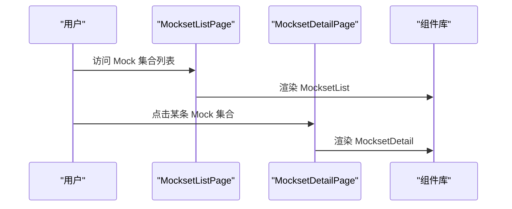
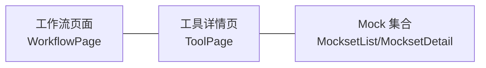
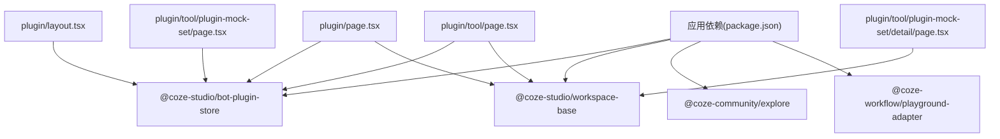

# 工具管理

<cite>
**本文引用的文件**
- [路由定义（index.tsx）](file://src/routes/index.tsx)
- [异步组件（async-components.tsx）](file://src/routes/async-components.tsx)
- [全局布局（layout.tsx）](file://src/layout.tsx)
- [插件资源布局（plugin/layout.tsx）](file://src/pages/plugin/layout.tsx)
- [插件页面（plugin/page.tsx）](file://src/pages/plugin/page.tsx)
- [工具页面（plugin/tool/page.tsx）](file://src/pages/plugin/tool/page.tsx)
- [工具 Mock 集列表（plugin/tool/plugin-mock-set/page.tsx）](file://src/pages/plugin/tool/plugin-mock-set/page.tsx)
- [工具 Mock 集详情（plugin/tool/plugin-mock-set/detail/page.tsx）](file://src/pages/plugin/tool/plugin-mock-set/detail/page.tsx)
- [应用包依赖（package.json）](file://package.json)
</cite>

## 目录
1. [简介](#简介)
2. [项目结构](#项目结构)
3. [核心组件](#核心组件)
4. [架构总览](#架构总览)
5. [详细组件分析](#详细组件分析)
6. [依赖关系分析](#依赖关系分析)
7. [性能考量](#性能考量)
8. [故障排查指南](#故障排查指南)
9. [结论](#结论)
10. [附录](#附录)

## 简介
本文件面向 Coze Studio 的“工具管理”能力，聚焦于前端侧的工具管理界面设计与功能实现。基于仓库中的路由与页面实现，文档梳理了工具在工作空间内的入口、工具详情页的渲染机制、Mock 集合的列表与详情页组织方式，以及与工作流的集成路径。同时给出工具安装、配置与使用流程说明、开发者配置指南与最佳实践建议，以及工具生命周期与版本控制的落地思路。

## 项目结构
围绕工具管理的关键目录与文件如下：
- 路由层：定义了从工作空间到插件、再到工具与 Mock 集合的完整路径
- 页面层：插件布局、插件首页、工具详情页、Mock 集合列表与详情页
- 组件层：通过异步组件加载来自 workspace-base 与社区生态的页面组件
- 依赖层：应用依赖 bot-plugin-store 提供插件状态与导航能力

**图示来源**
- [全局布局（layout.tsx）:19-23](file://src/layout.tsx#L19-L23)
- [插件资源布局（plugin/layout.tsx）:22-37](file://src/pages/plugin/layout.tsx#L22-L37)
- [插件页面（plugin/page.tsx）:23-32](file://src/pages/plugin/page.tsx#L23-L32)
- [工具页面（plugin/tool/page.tsx）:22-31](file://src/pages/plugin/tool/page.tsx#L22-L31)
- [工具 Mock 集列表（plugin/tool/plugin-mock-set/page.tsx）:22-33](file://src/pages/plugin/tool/plugin-mock-set/page.tsx#L22-L33)
- [工具 Mock 集详情（plugin/tool/plugin-mock-set/detail/page.tsx）:21-35](file://src/pages/plugin/tool/plugin-mock-set/detail/page.tsx#L21-L35)
- [路由定义（index.tsx）:218-236](file://src/routes/index.tsx#L218-L236)

**章节来源**
- [路由定义（index.tsx）:218-236](file://src/routes/index.tsx#L218-L236)
- [异步组件（async-components.tsx）:124-131](file://src/routes/async-components.tsx#L124-L131)
- [全局布局（layout.tsx）:19-23](file://src/layout.tsx#L19-L23)
- [插件资源布局（plugin/layout.tsx）:22-37](file://src/pages/plugin/layout.tsx#L22-L37)
- [插件页面（plugin/page.tsx）:23-32](file://src/pages/plugin/page.tsx#L23-L32)
- [工具页面（plugin/tool/page.tsx）:22-31](file://src/pages/plugin/tool/page.tsx#L22-L31)
- [工具 Mock 集列表（plugin/tool/plugin-mock-set/page.tsx）:22-33](file://src/pages/plugin/tool/plugin-mock-set/page.tsx#L22-L33)
- [工具 Mock 集详情（plugin/tool/plugin-mock-set/detail/page.tsx）:21-35](file://src/pages/plugin/tool/plugin-mock-set/detail/page.tsx#L21-L35)

## 核心组件
- 插件资源布局（SpaceLayout）
  - 作用：为插件模块提供统一的上下文与导航能力，注入插件 ID、空间 ID 与资源跳转函数
  - 关键点：通过 Provider 注入插件存储实例，确保页面内工具与 Mock 集合可访问统一的状态与导航
- 插件页面（PluginPage）
  - 作用：渲染插件主页，负责初始化插件存储状态
- 工具页面（ToolPage）
  - 作用：渲染指定工具的详情页，接收工具 ID 并交由底层组件展示
- Mock 集合页面（MocksetListPage）
  - 作用：渲染工具下的 Mock 集合列表，支持按工具维度筛选与浏览
- Mock 集合详情页面（MocksetDetailPage）
  - 作用：渲染指定 Mock 集合的详情，支持编辑与调试

上述组件均通过异步组件懒加载的方式引入，减少首屏体积并提升交互效率。

**章节来源**
- [插件资源布局（plugin/layout.tsx）:22-37](file://src/pages/plugin/layout.tsx#L22-L37)
- [插件页面（plugin/page.tsx）:23-32](file://src/pages/plugin/page.tsx#L23-L32)
- [工具页面（plugin/tool/page.tsx）:22-31](file://src/pages/plugin/tool/page.tsx#L22-L31)
- [工具 Mock 集列表（plugin/tool/plugin-mock-set/page.tsx）:22-33](file://src/pages/plugin/tool/plugin-mock-set/page.tsx#L22-L33)
- [工具 Mock 集详情（plugin/tool/plugin-mock-set/detail/page.tsx）:21-35](file://src/pages/plugin/tool/plugin-mock-set/detail/page.tsx#L21-L35)
- [异步组件（async-components.tsx）:124-131](file://src/routes/async-components.tsx#L124-L131)

## 架构总览
工具管理的前端架构采用“路由驱动 + 懒加载 + 上下文注入”的模式：
- 路由层定义插件与工具的层级关系，保证用户从工作空间进入插件商店后，能直达工具详情与 Mock 集合
- 布局层通过插件存储 Provider 提供统一状态与导航函数，确保页面间的数据一致性
- 页面层仅承担参数解析与初始化职责，具体 UI 由 workspace-base 与社区组件提供

**图示来源**
- [路由定义（index.tsx）:218-236](file://src/routes/index.tsx#L218-L236)
- [插件资源布局（plugin/layout.tsx）:22-37](file://src/pages/plugin/layout.tsx#L22-L37)
- [插件页面（plugin/page.tsx）:23-32](file://src/pages/plugin/page.tsx#L23-L32)
- [工具页面（plugin/tool/page.tsx）:22-31](file://src/pages/plugin/tool/page.tsx#L22-L31)
- [工具 Mock 集列表（plugin/tool/plugin-mock-set/page.tsx）:22-33](file://src/pages/plugin/tool/plugin-mock-set/page.tsx#L22-L33)
- [工具 Mock 集详情（plugin/tool/plugin-mock-set/detail/page.tsx）:21-35](file://src/pages/plugin/tool/plugin-mock-set/detail/page.tsx#L21-L35)

## 详细组件分析

### 路由与导航流程
- 用户从工作空间进入插件模块，路由匹配到插件资源布局
- 在插件布局中注入插件存储实例与资源导航函数，随后根据子路由渲染插件首页或工具详情页
- 工具详情页支持进一步进入 Mock 集合列表与详情页

**图示来源**
- [路由定义（index.tsx）:218-236](file://src/routes/index.tsx#L218-L236)
- [插件资源布局（plugin/layout.tsx）:22-37](file://src/pages/plugin/layout.tsx#L22-L37)
- [工具页面（plugin/tool/page.tsx）:22-31](file://src/pages/plugin/tool/page.tsx#L22-L31)
- [工具 Mock 集列表（plugin/tool/plugin-mock-set/page.tsx）:22-33](file://src/pages/plugin/tool/plugin-mock-set/page.tsx#L22-L33)
- [工具 Mock 集详情（plugin/tool/plugin-mock-set/detail/page.tsx）:21-35](file://src/pages/plugin/tool/plugin-mock-set/detail/page.tsx#L21-L35)

**章节来源**
- [路由定义（index.tsx）:218-236](file://src/routes/index.tsx#L218-L236)
- [插件资源布局（plugin/layout.tsx）:22-37](file://src/pages/plugin/layout.tsx#L22-L37)
- [工具页面（plugin/tool/page.tsx）:22-31](file://src/pages/plugin/tool/page.tsx#L22-L31)
- [工具 Mock 集列表（plugin/tool/plugin-mock-set/page.tsx）:22-33](file://src/pages/plugin/tool/plugin-mock-set/page.tsx#L22-L33)
- [工具 Mock 集详情（plugin/tool/plugin-mock-set/detail/page.tsx）:21-35](file://src/pages/plugin/tool/plugin-mock-set/detail/page.tsx#L21-L35)

### 工具详情页渲染机制
- 参数校验：工具页面会读取路由参数（插件 ID、空间 ID、工具 ID），若缺失则抛出错误
- 初始化：进入页面时调用插件存储实例的初始化方法，确保状态可用
- 渲染：将工具 ID 传给底层 Tool 组件进行展示

**图示来源**
- [工具页面（plugin/tool/page.tsx）:22-31](file://src/pages/plugin/tool/page.tsx#L22-L31)

**章节来源**
- [工具页面（plugin/tool/page.tsx）:22-31](file://src/pages/plugin/tool/page.tsx#L22-L31)

### Mock 集合列表与详情页
- 列表页：接收插件 ID、工具 ID、空间 ID，渲染 Mock 集合列表，支持按工具维度筛选
- 详情页：接收插件 ID、工具 ID、空间 ID、Mock 集合 ID，渲染详情并支持编辑与调试

**图示来源**
- [工具 Mock 集列表（plugin/tool/plugin-mock-set/page.tsx）:22-33](file://src/pages/plugin/tool/plugin-mock-set/page.tsx#L22-L33)
- [工具 Mock 集详情（plugin/tool/plugin-mock-set/detail/page.tsx）:21-35](file://src/pages/plugin/tool/plugin-mock-set/detail/page.tsx#L21-L35)

**章节来源**
- [工具 Mock 集列表（plugin/tool/plugin-mock-set/page.tsx）:22-33](file://src/pages/plugin/tool/plugin-mock-set/page.tsx#L22-L33)
- [工具 Mock 集详情（plugin/tool/plugin-mock-set/detail/page.tsx）:21-35](file://src/pages/plugin/tool/plugin-mock-set/detail/page.tsx#L21-L35)

### 工具与工作流的集成
- 工作流页面通过适配器组件加载，路由位于顶层路径
- 工具作为工作流中的节点或资源，其配置与数据可通过插件存储与导航函数在页面间传递
- 具体的节点连线与数据流由工作流引擎与工具协议共同决定，前端负责承载与呈现

**图示来源**
- [路由定义（index.tsx）:242-250](file://src/routes/index.tsx#L242-L250)
- [异步组件（async-components.tsx）:110-115](file://src/routes/async-components.tsx#L110-L115)
- [工具页面（plugin/tool/page.tsx）:22-31](file://src/pages/plugin/tool/page.tsx#L22-L31)
- [工具 Mock 集列表（plugin/tool/plugin-mock-set/page.tsx）:22-33](file://src/pages/plugin/tool/plugin-mock-set/page.tsx#L22-L33)
- [工具 Mock 集详情（plugin/tool/plugin-mock-set/detail/page.tsx）:21-35](file://src/pages/plugin/tool/plugin-mock-set/detail/page.tsx#L21-L35)

**章节来源**
- [路由定义（index.tsx）:242-250](file://src/routes/index.tsx#L242-L250)
- [异步组件（async-components.tsx）:110-115](file://src/routes/async-components.tsx#L110-L115)
- [工具页面（plugin/tool/page.tsx）:22-31](file://src/pages/plugin/tool/page.tsx#L22-L31)
- [工具 Mock 集列表（plugin/tool/plugin-mock-set/page.tsx）:22-33](file://src/pages/plugin/tool/plugin-mock-set/page.tsx#L22-L33)
- [工具 Mock 集详情（plugin/tool/plugin-mock-set/detail/page.tsx）:21-35](file://src/pages/plugin/tool/plugin-mock-set/detail/page.tsx#L21-L35)

## 依赖关系分析
- 应用依赖 bot-plugin-store 提供插件存储实例与导航函数
- 页面通过 usePluginStoreInstance 获取实例并在进入页面时初始化
- 异步组件懒加载 workspace-base 与社区组件，降低首屏负担

**图示来源**
- [应用包依赖（package.json）:19-51](file://package.json#L19-L51)
- [插件资源布局（plugin/layout.tsx）:19-20](file://src/pages/plugin/layout.tsx#L19-L20)
- [插件页面（plugin/page.tsx）:20-21](file://src/pages/plugin/page.tsx#L20-L21)
- [工具页面（plugin/tool/page.tsx）:20-21](file://src/pages/plugin/tool/page.tsx#L20-L21)
- [工具 Mock 集列表（plugin/tool/plugin-mock-set/page.tsx）:20-21](file://src/pages/plugin/tool/plugin-mock-set/page.tsx#L20-L21)
- [工具 Mock 集详情（plugin/tool/plugin-mock-set/detail/page.tsx）:19-20](file://src/pages/plugin/tool/plugin-mock-set/detail/page.tsx#L19-L20)

**章节来源**
- [应用包依赖（package.json）:19-51](file://package.json#L19-L51)
- [插件资源布局（plugin/layout.tsx）:19-20](file://src/pages/plugin/layout.tsx#L19-L20)
- [插件页面（plugin/page.tsx）:20-21](file://src/pages/plugin/page.tsx#L20-L21)
- [工具页面（plugin/tool/page.tsx）:20-21](file://src/pages/plugin/tool/page.tsx#L20-L21)
- [工具 Mock 集列表（plugin/tool/plugin-mock-set/page.tsx）:20-21](file://src/pages/plugin/tool/plugin-mock-set/page.tsx#L20-L21)
- [工具 Mock 集详情（plugin/tool/plugin-mock-set/detail/page.tsx）:19-20](file://src/pages/plugin/tool/plugin-mock-set/detail/page.tsx#L19-L20)

## 性能考量
- 懒加载策略：通过异步组件按需加载，避免一次性引入大量页面组件，降低首屏体积
- 状态初始化：页面进入时仅执行一次初始化，避免重复请求与渲染
- 导航复用：布局层统一注入插件存储与导航函数，减少重复计算与状态同步成本

[本节为通用性能建议，不直接分析具体文件]

## 故障排查指南
- 参数缺失错误
  - 现象：进入工具或 Mock 集合页面时抛出“缺少插件 ID 或空间 ID”的错误
  - 排查：确认路由参数是否正确传递；检查布局层是否正确注入插件存储与导航函数
- 初始化失败
  - 现象：页面渲染后无内容或状态异常
  - 排查：确认进入页面时已调用插件存储实例的初始化方法；检查网络与权限配置
- 导航异常
  - 现象：点击链接后无法跳转或跳转至错误页面
  - 排查：核对布局层注入的导航函数与路由定义是否一致；检查资源路径前缀

**章节来源**
- [工具页面（plugin/tool/page.tsx）:25-27](file://src/pages/plugin/tool/page.tsx#L25-L27)
- [工具 Mock 集列表（plugin/tool/plugin-mock-set/page.tsx）:24-27](file://src/pages/plugin/tool/plugin-mock-set/page.tsx#L24-L27)
- [工具 Mock 集详情（plugin/tool/plugin-mock-set/detail/page.tsx）:23-26](file://src/pages/plugin/tool/plugin-mock-set/detail/page.tsx#L23-L26)
- [插件资源布局（plugin/layout.tsx）:23-28](file://src/pages/plugin/layout.tsx#L23-L28)

## 结论
工具管理在前端层面通过清晰的路由分层、统一的布局上下文与懒加载组件，实现了从工作空间到插件、工具与 Mock 集合的顺畅导航。工具详情页与 Mock 集合页面分别承担展示与调试职责，配合工作流页面形成完整的工具使用闭环。开发者可依据本文档的流程与最佳实践，快速完成工具的安装、配置与使用，并在工作流中高效集成。

[本节为总结性内容，不直接分析具体文件]

## 附录

### 工具安装、配置与使用流程
- 安装
  - 在插件商店中选择目标插件，进入插件详情页
  - 通过插件存储实例初始化插件状态，完成安装准备
- 配置
  - 在工具详情页中填写工具所需参数，保存配置
  - 使用 Mock 集合进行数据模拟与验证
- 使用
  - 将工具拖入工作流，连接上游节点
  - 在工作流运行时，工具根据配置与输入数据输出结果

**章节来源**
- [插件页面（plugin/page.tsx）:23-32](file://src/pages/plugin/page.tsx#L23-L32)
- [工具页面（plugin/tool/page.tsx）:22-31](file://src/pages/plugin/tool/page.tsx#L22-L31)
- [工具 Mock 集列表（plugin/tool/plugin-mock-set/page.tsx）:22-33](file://src/pages/plugin/tool/plugin-mock-set/page.tsx#L22-L33)
- [工具 Mock 集详情（plugin/tool/plugin-mock-set/detail/page.tsx）:21-35](file://src/pages/plugin/tool/plugin-mock-set/detail/page.tsx#L21-L35)

### 开发者配置指南与最佳实践
- 路由与参数
  - 严格校验路由参数（插件 ID、空间 ID、工具 ID、Mock 集合 ID）
  - 在布局层统一注入插件存储与导航函数，避免重复实现
- 组件与状态
  - 页面仅承担参数解析与初始化，UI 由 workspace-base 与社区组件提供
  - 保持状态初始化逻辑简洁，避免阻塞首屏渲染
- 工作流集成
  - 明确工具在工作流中的输入输出规范，确保数据传递稳定
  - 使用 Mock 集合先行验证工具行为，再接入真实数据源

**章节来源**
- [插件资源布局（plugin/layout.tsx）:22-37](file://src/pages/plugin/layout.tsx#L22-L37)
- [工具页面（plugin/tool/page.tsx）:22-31](file://src/pages/plugin/tool/page.tsx#L22-L31)
- [工具 Mock 集列表（plugin/tool/plugin-mock-set/page.tsx）:22-33](file://src/pages/plugin/tool/plugin-mock-set/page.tsx#L22-L33)
- [工具 Mock 集详情（plugin/tool/plugin-mock-set/detail/page.tsx）:21-35](file://src/pages/plugin/tool/plugin-mock-set/detail/page.tsx#L21-L35)

### 生命周期与版本控制
- 生命周期
  - 初始化：进入页面时调用插件存储实例的初始化方法
  - 运行期：根据路由参数切换工具与 Mock 集合视图
  - 销毁：页面卸载时释放资源与取消订阅（由框架自动处理）
- 版本控制
  - 建议在插件元数据中维护版本号与变更日志
  - 在工具详情页提供版本切换入口，便于回滚与对比

[本节为通用指导，不直接分析具体文件]