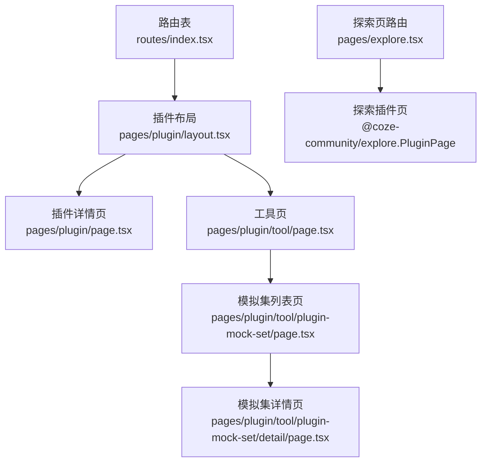
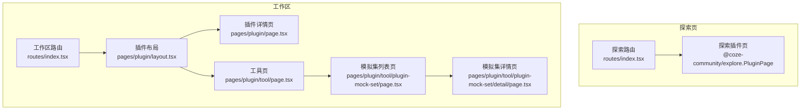
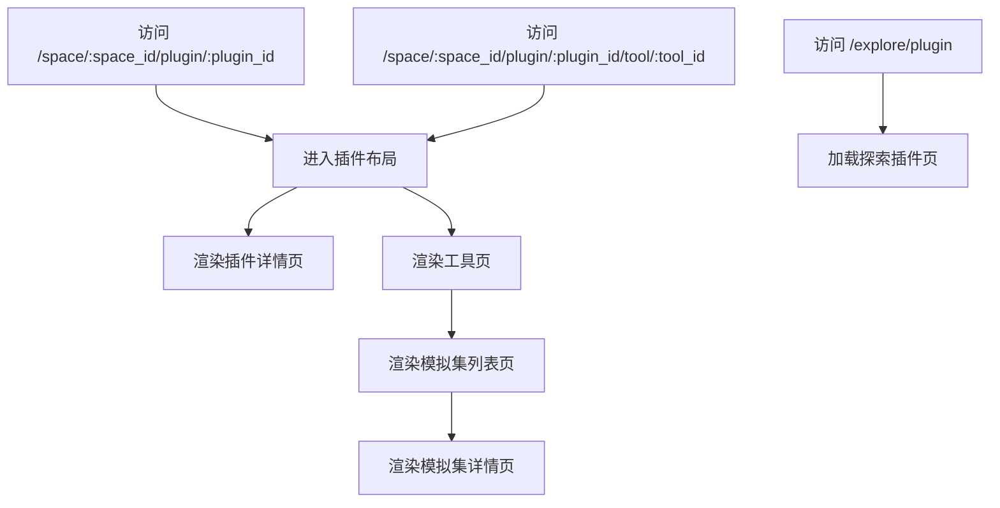
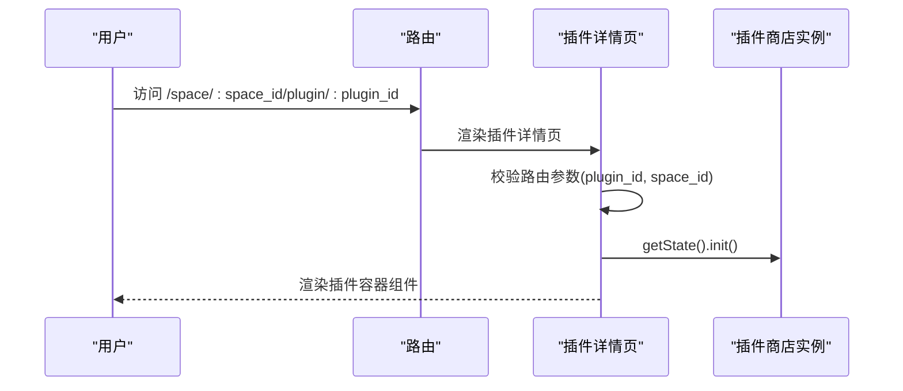
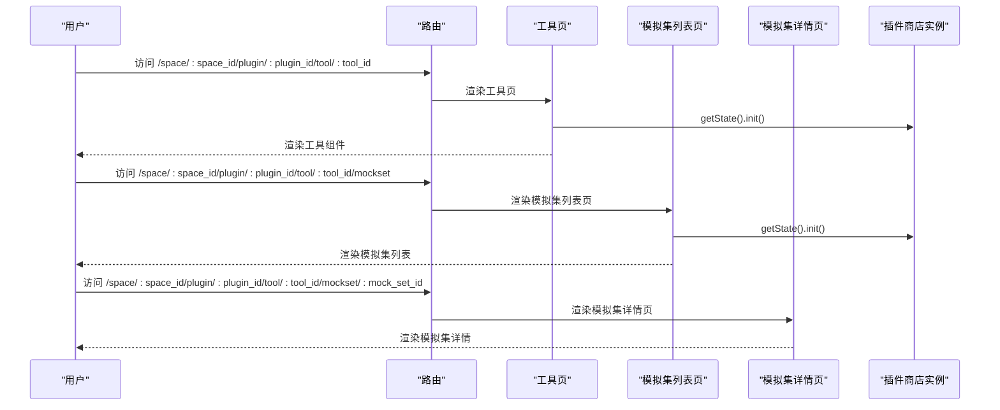
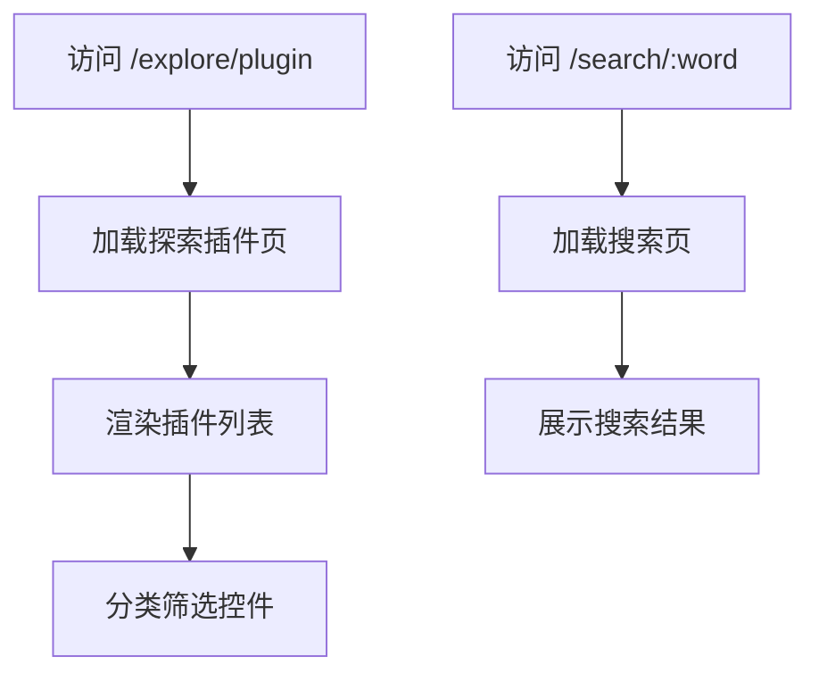
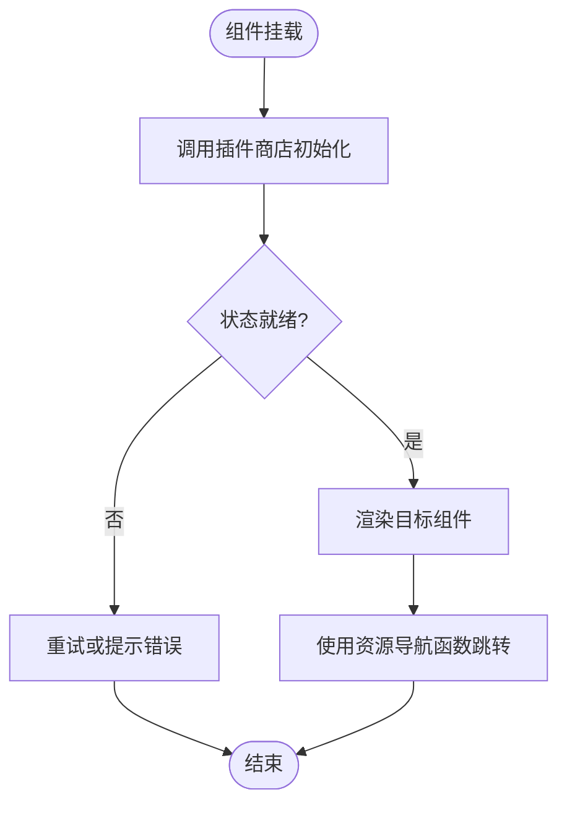
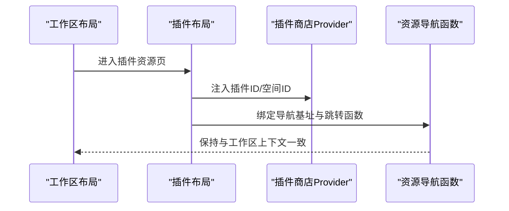
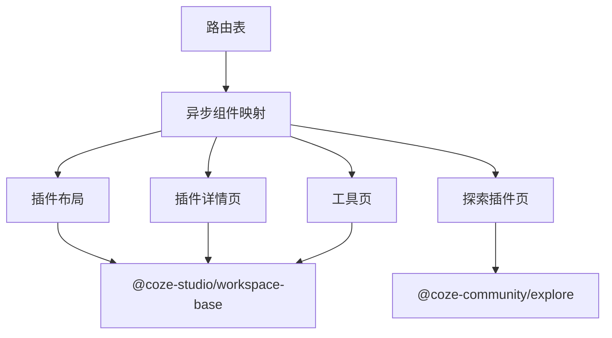

# 插件商店

<cite>
**本文引用的文件**
- [src/pages/plugin/page.tsx](file://src/pages/plugin/page.tsx)
- [src/pages/plugin/tool/page.tsx](file://src/pages/plugin/tool/page.tsx)
- [src/pages/plugin/tool/plugin-mock-set/page.tsx](file://src/pages/plugin/tool/plugin-mock-set/page.tsx)
- [src/pages/plugin/tool/plugin-mock-set/detail/page.tsx](file://src/pages/plugin/tool/plugin-mock-set/detail/page.tsx)
- [src/pages/plugin/layout.tsx](file://src/pages/plugin/layout.tsx)
- [src/routes/index.tsx](file://src/routes/index.tsx)
- [src/routes/async-components.tsx](file://src/routes/async-components.tsx)
- [src/pages/explore.tsx](file://src/pages/explore.tsx)
- [package.json](file://package.json)
</cite>

## 目录
1. [简介](#简介)
2. [项目结构](#项目结构)
3. [核心组件](#核心组件)
4. [架构总览](#架构总览)
5. [详细组件分析](#详细组件分析)
6. [依赖关系分析](#依赖关系分析)
7. [性能考虑](#性能考虑)
8. [故障排查指南](#故障排查指南)
9. [结论](#结论)
10. [附录](#附录)

## 简介
本文件面向 Coze Studio 的“插件商店”功能，系统化梳理前端路由与页面组织、插件列表与详情的渲染机制、工具（Tool）与模拟集（Mockset）子页面的交互流程、状态初始化与错误处理策略，以及与工作区（Workspace）的集成方式与导航约定。文档同时给出可视化图示，帮助开发者快速定位实现位置与调用链路。

## 项目结构
围绕插件商店的关键目录与文件如下：
- 路由定义：在路由表中声明了工作区内的插件资源页与探索页中的插件商店页
- 页面组件：插件详情页、工具页、模拟集列表页与模拟集详情页
- 布局与上下文：插件布局负责注入插件商店状态实例与资源导航函数
- 探索页：提供插件商店入口与二级菜单

图表来源
- [src/routes/index.tsx:217-236](file://src/routes/index.tsx#L217-L236)
- [src/pages/plugin/layout.tsx:22-37](file://src/pages/plugin/layout.tsx#L22-L37)
- [src/pages/plugin/page.tsx:23-32](file://src/pages/plugin/page.tsx#L23-L32)
- [src/pages/plugin/tool/page.tsx:23-31](file://src/pages/plugin/tool/page.tsx#L23-L31)
- [src/pages/plugin/tool/plugin-mock-set/page.tsx:23-33](file://src/pages/plugin/tool/plugin-mock-set/page.tsx#L23-L33)
- [src/pages/plugin/tool/plugin-mock-set/detail/page.tsx:22-35](file://src/pages/plugin/tool/plugin-mock-set/detail/page.tsx#L22-L35)
- [src/pages/explore.tsx:37-66](file://src/pages/explore.tsx#L37-L66)

章节来源
- [src/routes/index.tsx:217-236](file://src/routes/index.tsx#L217-L236)
- [src/pages/plugin/layout.tsx:22-37](file://src/pages/plugin/layout.tsx#L22-L37)
- [src/pages/plugin/page.tsx:23-32](file://src/pages/plugin/page.tsx#L23-L32)
- [src/pages/plugin/tool/page.tsx:23-31](file://src/pages/plugin/tool/page.tsx#L23-L31)
- [src/pages/plugin/tool/plugin-mock-set/page.tsx:23-33](file://src/pages/plugin/tool/plugin-mock-set/page.tsx#L23-L33)
- [src/pages/plugin/tool/plugin-mock-set/detail/page.tsx:22-35](file://src/pages/plugin/tool/plugin-mock-set/detail/page.tsx#L22-L35)
- [src/pages/explore.tsx:37-66](file://src/pages/explore.tsx#L37-L66)

## 核心组件
- 插件布局（SpaceLayout）
  - 注入插件商店 Provider，传入插件 ID、空间 ID 与资源导航函数
  - 通过 resourceNavigate 统一处理资源跳转
- 插件详情页（PluginPage）
  - 从路由参数读取插件 ID 与空间 ID
  - 初始化插件商店状态后渲染插件容器组件
- 工具页（ToolPage）
  - 从路由参数读取插件 ID、空间 ID 与工具 ID
  - 初始化插件商店状态后渲染工具组件
- 模拟集列表页（MocksetListPage）
  - 从路由参数读取插件 ID、空间 ID 与工具 ID
  - 初始化插件商店状态后渲染模拟集列表
- 模拟集详情页（MocksetDetailPage）
  - 从路由参数读取插件 ID、空间 ID、工具 ID 与模拟集 ID
  - 渲染模拟集详情组件

章节来源
- [src/pages/plugin/layout.tsx:22-37](file://src/pages/plugin/layout.tsx#L22-L37)
- [src/pages/plugin/page.tsx:23-32](file://src/pages/plugin/page.tsx#L23-L32)
- [src/pages/plugin/tool/page.tsx:23-31](file://src/pages/plugin/tool/page.tsx#L23-L31)
- [src/pages/plugin/tool/plugin-mock-set/page.tsx:23-33](file://src/pages/plugin/tool/plugin-mock-set/page.tsx#L23-L33)
- [src/pages/plugin/tool/plugin-mock-set/detail/page.tsx:22-35](file://src/pages/plugin/tool/plugin-mock-set/detail/page.tsx#L22-L35)

## 架构总览
插件商店的前端架构以 React Router 为核心，结合异步组件加载与工作区适配器，形成“探索页入口 + 工作区内插件资源页”的双路径模式。探索页提供全局插件商店浏览能力；工作区内插件资源页则与当前工作区上下文绑定，支持工具与模拟集的深度使用。

图表来源
- [src/routes/index.tsx:262-294](file://src/routes/index.tsx#L262-L294)
- [src/routes/index.tsx:217-236](file://src/routes/index.tsx#L217-L236)
- [src/pages/explore.tsx:37-66](file://src/pages/explore.tsx#L37-L66)
- [src/pages/plugin/layout.tsx:22-37](file://src/pages/plugin/layout.tsx#L22-L37)
- [src/pages/plugin/page.tsx:23-32](file://src/pages/plugin/page.tsx#L23-L32)
- [src/pages/plugin/tool/page.tsx:23-31](file://src/pages/plugin/tool/page.tsx#L23-L31)
- [src/pages/plugin/tool/plugin-mock-set/page.tsx:23-33](file://src/pages/plugin/tool/plugin-mock-set/page.tsx#L23-L33)
- [src/pages/plugin/tool/plugin-mock-set/detail/page.tsx:22-35](file://src/pages/plugin/tool/plugin-mock-set/detail/page.tsx#L22-L35)

## 详细组件分析

### 路由与页面组织
- 工作区插件资源路由
  - 在工作区空间下挂载插件布局，子路由包含插件详情与工具页
  - 工具页进一步嵌套模拟集列表与详情页
- 探索页插件商店路由
  - 探索页提供二级菜单与插件商店入口，直接加载社区提供的插件页组件

图表来源
- [src/routes/index.tsx:217-236](file://src/routes/index.tsx#L217-L236)
- [src/routes/index.tsx:277-284](file://src/routes/index.tsx#L277-L284)
- [src/pages/plugin/layout.tsx:22-37](file://src/pages/plugin/layout.tsx#L22-L37)
- [src/pages/plugin/page.tsx:23-32](file://src/pages/plugin/page.tsx#L23-L32)
- [src/pages/plugin/tool/page.tsx:23-31](file://src/pages/plugin/tool/page.tsx#L23-L31)
- [src/pages/plugin/tool/plugin-mock-set/page.tsx:23-33](file://src/pages/plugin/tool/plugin-mock-set/page.tsx#L23-L33)
- [src/pages/plugin/tool/plugin-mock-set/detail/page.tsx:22-35](file://src/pages/plugin/tool/plugin-mock-set/detail/page.tsx#L22-L35)
- [src/pages/explore.tsx:51-57](file://src/pages/explore.tsx#L51-L57)

章节来源
- [src/routes/index.tsx:217-236](file://src/routes/index.tsx#L217-L236)
- [src/routes/index.tsx:277-284](file://src/routes/index.tsx#L277-L284)
- [src/pages/plugin/layout.tsx:22-37](file://src/pages/plugin/layout.tsx#L22-L37)
- [src/pages/plugin/page.tsx:23-32](file://src/pages/plugin/page.tsx#L23-L32)
- [src/pages/plugin/tool/page.tsx:23-31](file://src/pages/plugin/tool/page.tsx#L23-L31)
- [src/pages/plugin/tool/plugin-mock-set/page.tsx:23-33](file://src/pages/plugin/tool/plugin-mock-set/page.tsx#L23-L33)
- [src/pages/plugin/tool/plugin-mock-set/detail/page.tsx:22-35](file://src/pages/plugin/tool/plugin-mock-set/detail/page.tsx#L22-L35)
- [src/pages/explore.tsx:51-57](file://src/pages/explore.tsx#L51-L57)

### 插件详情页渲染与参数传递
- 参数校验：从路由读取插件 ID 与空间 ID，缺失时抛出错误
- 状态初始化：在组件挂载时调用插件商店实例的初始化方法
- 渲染：向插件容器组件传递插件 ID 与空间 ID

图表来源
- [src/pages/plugin/page.tsx:23-32](file://src/pages/plugin/page.tsx#L23-L32)

章节来源
- [src/pages/plugin/page.tsx:23-32](file://src/pages/plugin/page.tsx#L23-L32)

### 工具页与模拟集页渲染
- 工具页
  - 读取插件 ID、空间 ID、工具 ID
  - 初始化插件商店状态，渲染工具组件
- 模拟集列表页
  - 读取插件 ID、空间 ID、工具 ID
  - 初始化插件商店状态，渲染模拟集列表
- 模拟集详情页
  - 读取插件 ID、空间 ID、工具 ID、模拟集 ID
  - 渲染模拟集详情组件

图表来源
- [src/pages/plugin/tool/page.tsx:23-31](file://src/pages/plugin/tool/page.tsx#L23-L31)
- [src/pages/plugin/tool/plugin-mock-set/page.tsx:23-33](file://src/pages/plugin/tool/plugin-mock-set/page.tsx#L23-L33)
- [src/pages/plugin/tool/plugin-mock-set/detail/page.tsx:22-35](file://src/pages/plugin/tool/plugin-mock-set/detail/page.tsx#L22-L35)

章节来源
- [src/pages/plugin/tool/page.tsx:23-31](file://src/pages/plugin/tool/page.tsx#L23-L31)
- [src/pages/plugin/tool/plugin-mock-set/page.tsx:23-33](file://src/pages/plugin/tool/plugin-mock-set/page.tsx#L23-L33)
- [src/pages/plugin/tool/plugin-mock-set/detail/page.tsx:22-35](file://src/pages/plugin/tool/plugin-mock-set/detail/page.tsx#L22-L35)

### 插件列表展示、分类筛选与搜索
- 展示逻辑
  - 插件商店入口位于探索页，加载社区提供的插件页组件
  - 插件页负责渲染插件列表与分类筛选控件
- 搜索功能
  - 搜索页路由存在，可承载搜索结果页组件
- 分类筛选
  - 通过插件页组件内部的状态与过滤逻辑实现

图表来源
- [src/routes/index.tsx:277-284](file://src/routes/index.tsx#L277-L284)
- [src/routes/index.tsx:252-260](file://src/routes/index.tsx#L252-L260)
- [src/pages/explore.tsx:51-57](file://src/pages/explore.tsx#L51-L57)

章节来源
- [src/routes/index.tsx:277-284](file://src/routes/index.tsx#L277-L284)
- [src/routes/index.tsx:252-260](file://src/routes/index.tsx#L252-L260)
- [src/pages/explore.tsx:51-57](file://src/pages/explore.tsx#L51-L57)

### 安装流程与状态管理
- 状态初始化
  - 所有插件相关页面在挂载时调用插件商店实例的初始化方法，确保状态可用
- 导航与资源跳转
  - 插件布局通过资源导航函数统一处理跳转，保证与工作区上下文一致
- 错误处理
  - 当路由参数缺失时，组件抛出错误，便于上层错误边界捕获与提示

图表来源
- [src/pages/plugin/page.tsx:29-31](file://src/pages/plugin/page.tsx#L29-L31)
- [src/pages/plugin/tool/page.tsx:28-30](file://src/pages/plugin/tool/page.tsx#L28-L30)
- [src/pages/plugin/tool/plugin-mock-set/page.tsx:28-30](file://src/pages/plugin/tool/plugin-mock-set/page.tsx#L28-L30)
- [src/pages/plugin/layout.tsx:29-36](file://src/pages/plugin/layout.tsx#L29-L36)

章节来源
- [src/pages/plugin/page.tsx:29-31](file://src/pages/plugin/page.tsx#L29-L31)
- [src/pages/plugin/tool/page.tsx:28-30](file://src/pages/plugin/tool/page.tsx#L28-L30)
- [src/pages/plugin/tool/plugin-mock-set/page.tsx:28-30](file://src/pages/plugin/tool/plugin-mock-set/page.tsx#L28-L30)
- [src/pages/plugin/layout.tsx:29-36](file://src/pages/plugin/layout.tsx#L29-L36)

### 与工作区的集成与权限控制
- 集成方式
  - 插件布局作为工作区内的插件资源页根容器，注入插件商店 Provider
  - 使用资源导航函数与工作区空间 ID 绑定，确保跳转与上下文一致
- 权限控制
  - 工作区路由与探索页路由均声明需要认证，保障访问安全

图表来源
- [src/pages/plugin/layout.tsx:29-36](file://src/pages/plugin/layout.tsx#L29-L36)
- [src/routes/index.tsx:98-107](file://src/routes/index.tsx#L98-L107)
- [src/routes/index.tsx:262-271](file://src/routes/index.tsx#L262-L271)

章节来源
- [src/pages/plugin/layout.tsx:29-36](file://src/pages/plugin/layout.tsx#L29-L36)
- [src/routes/index.tsx:98-107](file://src/routes/index.tsx#L98-L107)
- [src/routes/index.tsx:262-271](file://src/routes/index.tsx#L262-L271)

### 评分、评论与下载统计
- 实现说明
  - 插件商店入口与插件页由社区模块提供，具体评分、评论与下载统计等 UI 与数据逻辑由社区插件页组件负责
  - 前端仅负责路由接入与页面渲染，不直接承担这些业务数据的存储与计算

章节来源
- [src/routes/index.tsx:277-284](file://src/routes/index.tsx#L277-L284)
- [src/pages/explore.tsx:51-57](file://src/pages/explore.tsx#L51-L57)

## 依赖关系分析
- 路由与异步组件
  - 路由表通过异步组件懒加载插件布局、插件页、工具页与探索插件页
- 外部依赖
  - 插件商店相关 UI 与交互由社区模块提供
  - 工作区适配器与导航函数来自工作区基础包

图表来源
- [src/routes/async-components.tsx:124-152](file://src/routes/async-components.tsx#L124-L152)
- [src/routes/index.tsx:217-236](file://src/routes/index.tsx#L217-L236)
- [src/routes/index.tsx:277-284](file://src/routes/index.tsx#L277-L284)

章节来源
- [src/routes/async-components.tsx:124-152](file://src/routes/async-components.tsx#L124-L152)
- [src/routes/index.tsx:217-236](file://src/routes/index.tsx#L217-L236)
- [src/routes/index.tsx:277-284](file://src/routes/index.tsx#L277-L284)

## 性能考虑
- 懒加载与按需渲染
  - 路由采用异步组件，减少首屏体积，提升初始加载速度
- 状态初始化时机
  - 在组件挂载阶段进行一次初始化，避免重复初始化带来的开销
- 导航一致性
  - 使用统一的资源导航函数，减少重复逻辑与潜在的性能损耗

## 故障排查指南
- 路由参数缺失
  - 现象：页面抛出错误
  - 处理：检查路由是否正确传入插件 ID 与空间 ID
- 插件商店未初始化
  - 现象：页面空白或状态异常
  - 处理：确认初始化调用已执行，检查插件商店实例状态
- 导航异常
  - 现象：点击跳转后路径不正确
  - 处理：核对资源导航函数的基址与插件 ID 是否正确

章节来源
- [src/pages/plugin/page.tsx:25-27](file://src/pages/plugin/page.tsx#L25-L27)
- [src/pages/plugin/tool/page.tsx:25-27](file://src/pages/plugin/tool/page.tsx#L25-L27)
- [src/pages/plugin/tool/plugin-mock-set/page.tsx:25-27](file://src/pages/plugin/tool/plugin-mock-set/page.tsx#L25-L27)
- [src/pages/plugin/tool/plugin-mock-set/detail/page.tsx:24-26](file://src/pages/plugin/tool/plugin-mock-set/detail/page.tsx#L24-L26)

## 结论
插件商店在前端层面通过清晰的路由分层与异步组件加载，实现了“探索页入口 + 工作区资源页”的双通道体验。页面组件职责明确，状态初始化与导航函数统一，便于扩展与维护。评分、评论与下载统计等业务能力由社区模块提供，前端保持轻耦合接入。建议后续在状态持久化与缓存策略方面进一步优化，以提升复杂场景下的用户体验。

## 附录
- 关键依赖
  - @coze-studio/workspace-base：工作区基础组件与导航函数
  - @coze-community/explore：探索页与插件页组件
  - @coze-studio/bot-plugin-store：插件商店状态实例与 Provider

章节来源
- [package.json:19-81](file://package.json#L19-L81)