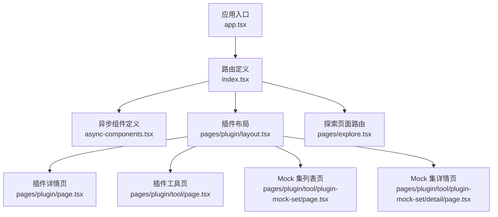
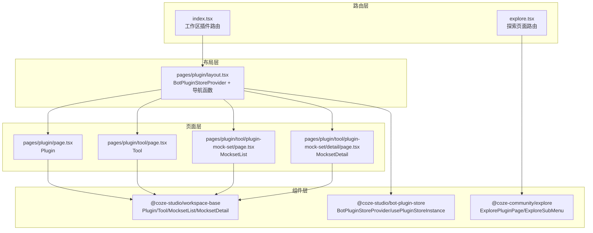
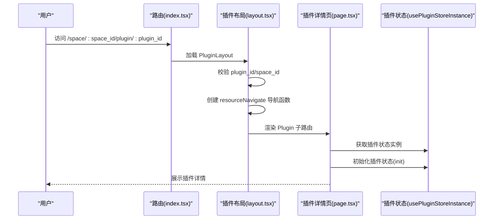
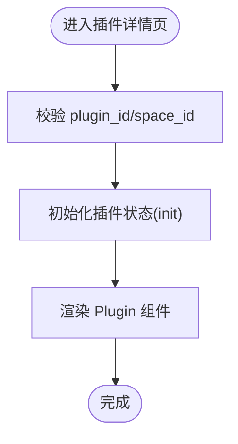
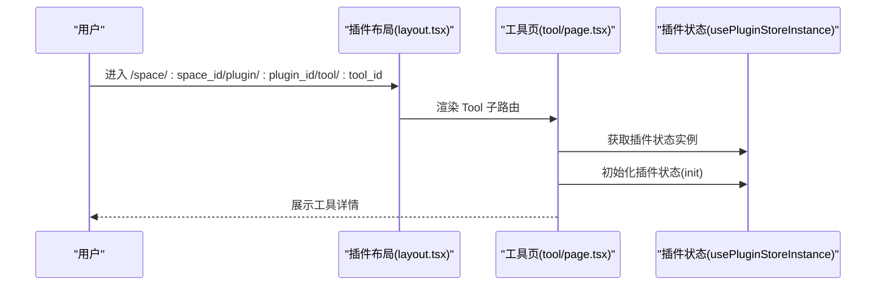
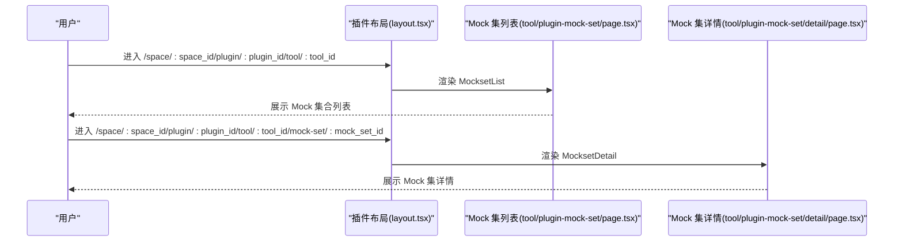
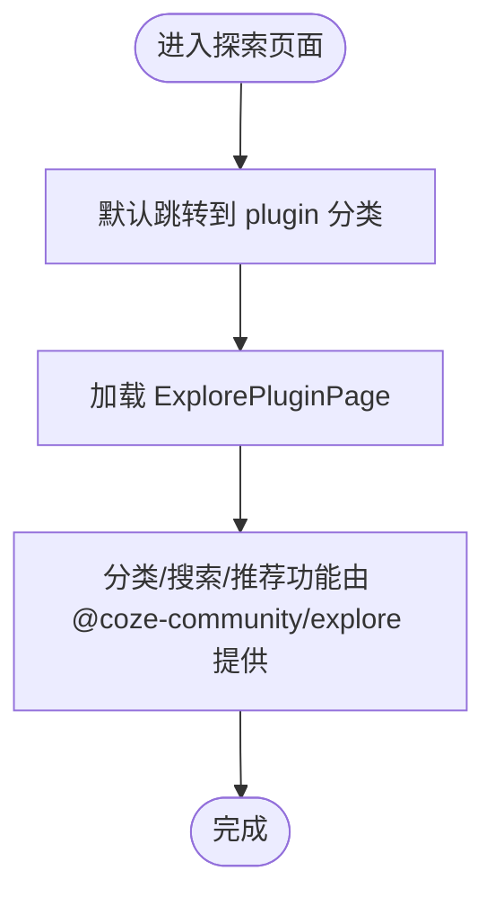
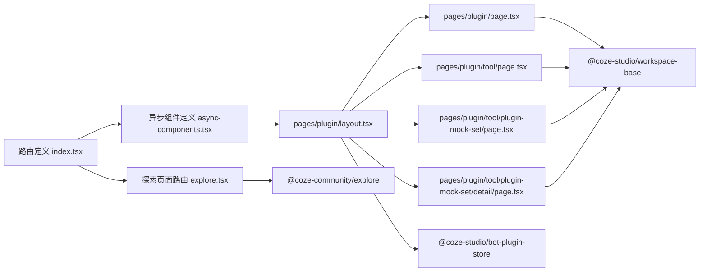

# 插件生态系统

<cite>
**本文引用的文件**
- [路由定义 index.tsx](file://src/routes/index.tsx)
- [异步组件定义 async-components.tsx](file://src/routes/async-components.tsx)
- [应用入口 app.tsx](file://src/app.tsx)
- [插件布局 layout.tsx](file://src/pages/plugin/layout.tsx)
- [插件详情页 page.tsx](file://src/pages/plugin/page.tsx)
- [插件工具页 page.tsx](file://src/pages/plugin/tool/page.tsx)
- [插件工具 Mock 集列表页 page.tsx](file://src/pages/plugin/tool/plugin-mock-set/page.tsx)
- [插件工具 Mock 集详情页 page.tsx](file://src/pages/plugin/tool/plugin-mock-set/detail/page.tsx)
- [探索页面路由 explore.tsx](file://src/pages/explore.tsx)
- [包依赖 package.json](file://package.json)
- [项目说明 README.md](file://README.md)
</cite>

## 目录
1. [简介](#简介)
2. [项目结构](#项目结构)
3. [核心组件](#核心组件)
4. [架构总览](#架构总览)
5. [详细组件分析](#详细组件分析)
6. [依赖关系分析](#依赖关系分析)
7. [性能考虑](#性能考虑)
8. [故障排查指南](#故障排查指南)
9. [结论](#结论)
10. [附录](#附录)

## 简介
本文件面向 Coze Studio 的插件生态系统，系统性阐述插件商店的使用方法、工具管理与详情展示、安装/配置/更新/卸载流程、开发者开发指南与发布流程、架构设计与扩展机制、插件分类/搜索/推荐实现思路、与主应用的集成方式与通信协议，以及最佳实践与常见问题解决方案。本文所有技术细节均基于前端仓库中实际源码进行分析与总结。

## 项目结构
前端采用 React + React Router + Rsbuild 构建，插件生态相关页面通过路由懒加载与统一布局容器组织，核心模块包括：
- 路由层：定义工作区空间下的插件资源路径与探索页面的插件商店入口
- 布局层：提供插件上下文与资源导航能力
- 页面层：插件详情、工具列表、Mock 集合与详情等具体视图
- 组件层：来自 workspace-base 与 bot-plugin-store 的可复用组件与状态提供器

图表来源
- [应用入口 app.tsx:24-36](file://src/app.tsx#L24-L36)
- [路由定义 index.tsx:50-298](file://src/routes/index.tsx#L50-L298)
- [异步组件定义 async-components.tsx:124-152](file://src/routes/async-components.tsx#L124-L152)
- [插件布局 layout.tsx:22-38](file://src/pages/plugin/layout.tsx#L22-L38)
- [插件详情页 page.tsx:23-32](file://src/pages/plugin/page.tsx#L23-L32)
- [插件工具页 page.tsx:22-31](file://src/pages/plugin/tool/page.tsx#L22-L31)
- [插件工具 Mock 集列表页 page.tsx:22-33](file://src/pages/plugin/tool/plugin-mock-set/page.tsx#L22-L33)
- [插件工具 Mock 集详情页 page.tsx:21-35](file://src/pages/plugin/tool/plugin-mock-set/detail/page.tsx#L21-L35)
- [探索页面路由 explore.tsx:37-66](file://src/pages/explore.tsx#L37-L66)

章节来源
- [应用入口 app.tsx:24-36](file://src/app.tsx#L24-L36)
- [路由定义 index.tsx:50-298](file://src/routes/index.tsx#L50-L298)
- [异步组件定义 async-components.tsx:124-152](file://src/routes/async-components.tsx#L124-L152)
- [插件布局 layout.tsx:22-38](file://src/pages/plugin/layout.tsx#L22-L38)
- [插件详情页 page.tsx:23-32](file://src/pages/plugin/page.tsx#L23-L32)
- [插件工具页 page.tsx:22-31](file://src/pages/plugin/tool/page.tsx#L22-L31)
- [插件工具 Mock 集列表页 page.tsx:22-33](file://src/pages/plugin/tool/plugin-mock-set/page.tsx#L22-L33)
- [插件工具 Mock 集详情页 page.tsx:21-35](file://src/pages/plugin/tool/plugin-mock-set/detail/page.tsx#L21-L35)
- [探索页面路由 explore.tsx:37-66](file://src/pages/explore.tsx#L37-L66)

## 核心组件
- 插件布局容器：在工作区空间内注入插件上下文与资源导航函数，确保插件生态内的子路由具备一致的上下文能力。
- 插件详情组件：用于展示插件元信息、版本、描述、作者、评分等，并承载后续安装/配置/管理入口。
- 工具组件：展示插件内可用工具清单，支持跳转到工具详情或 Mock 集合。
- Mock 集合组件：提供工具的 Mock 数据集合列表与详情，便于调试与测试。
- 探索插件商店：位于探索页面，作为插件生态的“发现入口”，支持分类、搜索与推荐（由 @coze-community/explore 提供）。

章节来源
- [插件布局 layout.tsx:22-38](file://src/pages/plugin/layout.tsx#L22-L38)
- [插件详情页 page.tsx:23-32](file://src/pages/plugin/page.tsx#L23-L32)
- [插件工具页 page.tsx:22-31](file://src/pages/plugin/tool/page.tsx#L22-L31)
- [插件工具 Mock 集列表页 page.tsx:22-33](file://src/pages/plugin/tool/plugin-mock-set/page.tsx#L22-L33)
- [插件工具 Mock 集详情页 page.tsx:21-35](file://src/pages/plugin/tool/plugin-mock-set/detail/page.tsx#L21-L35)
- [探索页面路由 explore.tsx:37-66](file://src/pages/explore.tsx#L37-L66)

## 架构总览
插件生态以“路由 + 布局 + 懒加载组件”的分层架构实现：
- 路由层负责路径匹配与页面装载；工作区空间下提供插件资源的二级路由。
- 布局层提供插件上下文与资源导航函数，保证插件生态内的导航一致性。
- 组件层通过 workspace-base 提供的组件渲染插件详情、工具与 Mock 集合。
- 插件商店位于探索页面，通过 @coze-community/explore 提供的组件实现分类、搜索与推荐。

图表来源
- [路由定义 index.tsx:217-236](file://src/routes/index.tsx#L217-L236)
- [路由定义 index.tsx:262-294](file://src/routes/index.tsx#L262-L294)
- [异步组件定义 async-components.tsx:124-152](file://src/routes/async-components.tsx#L124-L152)
- [插件布局 layout.tsx:29-36](file://src/pages/plugin/layout.tsx#L29-L36)
- [插件详情页 page.tsx:20-32](file://src/pages/plugin/page.tsx#L20-L32)
- [插件工具页 page.tsx:20-31](file://src/pages/plugin/tool/page.tsx#L20-L31)
- [插件工具 Mock 集列表页 page.tsx:20-33](file://src/pages/plugin/tool/plugin-mock-set/page.tsx#L20-L33)
- [插件工具 Mock 集详情页 page.tsx:19-35](file://src/pages/plugin/tool/plugin-mock-set/detail/page.tsx#L19-L35)

章节来源
- [路由定义 index.tsx:217-236](file://src/routes/index.tsx#L217-L236)
- [路由定义 index.tsx:262-294](file://src/routes/index.tsx#L262-L294)
- [异步组件定义 async-components.tsx:124-152](file://src/routes/async-components.tsx#L124-L152)
- [插件布局 layout.tsx:29-36](file://src/pages/plugin/layout.tsx#L29-L36)
- [插件详情页 page.tsx:20-32](file://src/pages/plugin/page.tsx#L20-L32)
- [插件工具页 page.tsx:20-31](file://src/pages/plugin/tool/page.tsx#L20-L31)
- [插件工具 Mock 集列表页 page.tsx:20-33](file://src/pages/plugin/tool/plugin-mock-set/page.tsx#L20-L33)
- [插件工具 Mock 集详情页 page.tsx:19-35](file://src/pages/plugin/tool/plugin-mock-set/detail/page.tsx#L19-L35)

## 详细组件分析

### 插件布局与上下文
- 功能职责：在工作区空间内注入插件 ID 与空间 ID，提供资源导航函数，包装子路由出口。
- 关键点：校验路由参数完整性；通过 BotPluginStoreProvider 提供插件状态上下文；使用 pluginResourceNavigate 生成资源级导航函数。

图表来源
- [路由定义 index.tsx:217-236](file://src/routes/index.tsx#L217-L236)
- [插件布局 layout.tsx:22-38](file://src/pages/plugin/layout.tsx#L22-L38)
- [插件详情页 page.tsx:23-32](file://src/pages/plugin/page.tsx#L23-L32)

章节来源
- [插件布局 layout.tsx:22-38](file://src/pages/plugin/layout.tsx#L22-L38)
- [插件详情页 page.tsx:23-32](file://src/pages/plugin/page.tsx#L23-L32)

### 插件详情页
- 功能职责：展示插件元信息与概览，承载安装/配置/管理入口。
- 关键点：读取路由参数 plugin_id 与 space_id；初始化插件状态；渲染 Plugin 组件。

图表来源
- [插件详情页 page.tsx:23-32](file://src/pages/plugin/page.tsx#L23-L32)

章节来源
- [插件详情页 page.tsx:23-32](file://src/pages/plugin/page.tsx#L23-L32)

### 插件工具页
- 功能职责：展示插件内工具清单，支持跳转到工具详情或 Mock 集合。
- 关键点：读取 plugin_id、space_id、tool_id；初始化插件状态；渲染 Tool 组件。

图表来源
- [插件布局 layout.tsx:22-38](file://src/pages/plugin/layout.tsx#L22-L38)
- [插件工具页 page.tsx:22-31](file://src/pages/plugin/tool/page.tsx#L22-L31)

章节来源
- [插件工具页 page.tsx:22-31](file://src/pages/plugin/tool/page.tsx#L22-L31)

### Mock 集合与详情
- 功能职责：展示工具的 Mock 数据集合列表与详情，便于调试与测试。
- 关键点：读取 plugin_id、space_id、tool_id、mock_set_id；渲染 MocksetList 或 MocksetDetail。

图表来源
- [插件布局 layout.tsx:22-38](file://src/pages/plugin/layout.tsx#L22-L38)
- [插件工具 Mock 集列表页 page.tsx:22-33](file://src/pages/plugin/tool/plugin-mock-set/page.tsx#L22-L33)
- [插件工具 Mock 集详情页 page.tsx:21-35](file://src/pages/plugin/tool/plugin-mock-set/detail/page.tsx#L21-L35)

章节来源
- [插件工具 Mock 集列表页 page.tsx:22-33](file://src/pages/plugin/tool/plugin-mock-set/page.tsx#L22-L33)
- [插件工具 Mock 集详情页 page.tsx:21-35](file://src/pages/plugin/tool/plugin-mock-set/detail/page.tsx#L21-L35)

### 插件商店与探索页面
- 功能职责：提供插件发现入口，支持分类、搜索与推荐。
- 关键点：探索页面路由指向 ExplorePluginPage；子菜单由 ExploreSubMenu 提供；默认进入 plugin 分类。

图表来源
- [路由定义 index.tsx:262-294](file://src/routes/index.tsx#L262-L294)
- [异步组件定义 async-components.tsx:147-152](file://src/routes/async-components.tsx#L147-L152)
- [探索页面路由 explore.tsx:37-66](file://src/pages/explore.tsx#L37-L66)

章节来源
- [路由定义 index.tsx:262-294](file://src/routes/index.tsx#L262-L294)
- [异步组件定义 async-components.tsx:147-152](file://src/routes/async-components.tsx#L147-L152)
- [探索页面路由 explore.tsx:37-66](file://src/pages/explore.tsx#L37-L66)

## 依赖关系分析
- 路由与页面：路由定义 index.tsx 与 explore.tsx 将路径映射到异步组件；异步组件定义 async-components.tsx 将路径映射到具体页面。
- 布局与组件：插件布局 layout.tsx 通过 BotPluginStoreProvider 注入插件上下文；页面通过 workspace-base 组件渲染插件详情、工具与 Mock 集合。
- 外部依赖：@coze-community/explore 提供探索页面与插件商店；@coze-studio/bot-plugin-store 提供插件状态管理；@coze-studio/workspace-base 提供插件生态通用组件。

图表来源
- [路由定义 index.tsx:50-298](file://src/routes/index.tsx#L50-L298)
- [异步组件定义 async-components.tsx:124-152](file://src/routes/async-components.tsx#L124-L152)
- [插件布局 layout.tsx:19-36](file://src/pages/plugin/layout.tsx#L19-L36)
- [插件详情页 page.tsx:20-32](file://src/pages/plugin/page.tsx#L20-L32)
- [插件工具页 page.tsx:20-31](file://src/pages/plugin/tool/page.tsx#L20-L31)
- [插件工具 Mock 集列表页 page.tsx:20-33](file://src/pages/plugin/tool/plugin-mock-set/page.tsx#L20-L33)
- [插件工具 Mock 集详情页 page.tsx:19-35](file://src/pages/plugin/tool/plugin-mock-set/detail/page.tsx#L19-L35)
- [探索页面路由 explore.tsx:37-66](file://src/pages/explore.tsx#L37-L66)

章节来源
- [路由定义 index.tsx:50-298](file://src/routes/index.tsx#L50-L298)
- [异步组件定义 async-components.tsx:124-152](file://src/routes/async-components.tsx#L124-L152)
- [插件布局 layout.tsx:19-36](file://src/pages/plugin/layout.tsx#L19-L36)
- [插件详情页 page.tsx:20-32](file://src/pages/plugin/page.tsx#L20-L32)
- [插件工具页 page.tsx:20-31](file://src/pages/plugin/tool/page.tsx#L20-L31)
- [插件工具 Mock 集列表页 page.tsx:20-33](file://src/pages/plugin/tool/plugin-mock-set/page.tsx#L20-L33)
- [插件工具 Mock 集详情页 page.tsx:19-35](file://src/pages/plugin/tool/plugin-mock-set/detail/page.tsx#L19-L35)
- [探索页面路由 explore.tsx:37-66](file://src/pages/explore.tsx#L37-L66)

## 性能考虑
- 路由懒加载：通过 React.lazy 与异步组件定义，按需加载插件相关页面，降低首屏体积与加载时间。
- 组件懒加载：插件详情、工具、Mock 集合等页面均采用懒加载，避免不必要的资源消耗。
- 状态初始化：页面在挂载时调用插件状态初始化，建议在状态层实现缓存与增量更新策略，减少重复请求。
- 导航优化：布局层提供统一的资源导航函数，避免重复计算与无效跳转。

章节来源
- [异步组件定义 async-components.tsx:124-152](file://src/routes/async-components.tsx#L124-L152)
- [插件详情页 page.tsx:29-31](file://src/pages/plugin/page.tsx#L29-L31)
- [插件工具页 page.tsx:28-30](file://src/pages/plugin/tool/page.tsx#L28-L30)
- [插件工具 Mock 集列表页 page.tsx:28-30](file://src/pages/plugin/tool/plugin-mock-set/page.tsx#L28-L30)
- [插件布局 layout.tsx:29-36](file://src/pages/plugin/layout.tsx#L29-L36)

## 故障排查指南
- 参数缺失错误：当路由参数 plugin_id 或 space_id 缺失时，页面会抛出渲染错误。请检查路由配置与导航链接是否正确传递参数。
- 插件状态未初始化：若插件详情/工具无法正常显示，请确认页面在挂载时已调用插件状态初始化。
- 导航异常：若资源导航不生效，请检查布局层传入的 resourceNavigate 函数与导航基路径是否正确。

章节来源
- [插件详情页 page.tsx:25-27](file://src/pages/plugin/page.tsx#L25-L27)
- [插件工具页 page.tsx:25-27](file://src/pages/plugin/tool/page.tsx#L25-L27)
- [插件工具 Mock 集列表页 page.tsx:23-27](file://src/pages/plugin/tool/plugin-mock-set/page.tsx#L23-L27)
- [插件工具 Mock 集详情页 page.tsx:22-26](file://src/pages/plugin/tool/plugin-mock-set/detail/page.tsx#L22-L26)
- [插件布局 layout.tsx:23-28](file://src/pages/plugin/layout.tsx#L23-L28)

## 结论
Coze Studio 的插件生态系统通过清晰的路由分层、统一的布局上下文与懒加载组件，实现了插件商店的发现、插件详情展示、工具管理与 Mock 测试的完整闭环。结合 @coze-community/explore 与 @coze-studio/bot-plugin-store 的能力，开发者可以快速构建与扩展插件生态。后续可在状态层引入缓存与增量更新、在探索页面完善分类/搜索/推荐算法，进一步提升用户体验与开发效率。

## 附录

### 使用方法与操作流程
- 插件商店使用：访问探索页面的插件分类，浏览与搜索插件，查看插件详情与工具清单。
- 插件详情与工具：在工作区空间内访问插件详情页与工具页，进行安装/配置/调试。
- Mock 集合：在工具页进入 Mock 集合列表与详情，进行本地测试与联调。

章节来源
- [路由定义 index.tsx:262-294](file://src/routes/index.tsx#L262-L294)
- [插件详情页 page.tsx:23-32](file://src/pages/plugin/page.tsx#L23-L32)
- [插件工具页 page.tsx:22-31](file://src/pages/plugin/tool/page.tsx#L22-L31)
- [插件工具 Mock 集列表页 page.tsx:22-33](file://src/pages/plugin/tool/plugin-mock-set/page.tsx#L22-L33)
- [插件工具 Mock 集详情页 page.tsx:21-35](file://src/pages/plugin/tool/plugin-mock-set/detail/page.tsx#L21-L35)

### 安装/配置/更新/卸载流程（基于现有代码的实现要点）
- 安装：在插件详情页触发安装动作后，插件状态初始化会加载插件元数据与工具清单。
- 配置：在工具页或 Mock 集合中进行参数配置与调试。
- 更新：通过插件状态层的刷新与缓存策略实现增量更新。
- 卸载：在插件状态层提供卸载接口，清理缓存与上下文。

章节来源
- [插件详情页 page.tsx:29-31](file://src/pages/plugin/page.tsx#L29-L31)
- [插件工具页 page.tsx:28-30](file://src/pages/plugin/tool/page.tsx#L28-L30)
- [插件工具 Mock 集列表页 page.tsx:28-30](file://src/pages/plugin/tool/plugin-mock-set/page.tsx#L28-L30)
- [插件布局 layout.tsx:29-36](file://src/pages/plugin/layout.tsx#L29-L36)

### 开发者指南与发布流程（基于现有代码的实现要点）
- 组件开发：基于 workspace-base 提供的组件进行二次封装，保持与插件生态的一致性。
- 上下文接入：在布局层使用 BotPluginStoreProvider 注入插件上下文，确保路由参数与导航函数正确传递。
- 发布与集成：通过异步组件定义将新页面纳入路由体系，确保按需加载与性能优化。

章节来源
- [异步组件定义 async-components.tsx:124-152](file://src/routes/async-components.tsx#L124-L152)
- [插件布局 layout.tsx:29-36](file://src/pages/plugin/layout.tsx#L29-L36)

### 架构设计与扩展机制
- 分层架构：路由层、布局层、页面层、组件层职责清晰，便于扩展与维护。
- 可插拔组件：通过 @coze-studio/workspace-base 与 @coze-studio/bot-plugin-store 提供的组件与状态，实现插件生态的可扩展性。
- 探索页面：通过 @coze-community/explore 提供的组件实现插件商店的分类、搜索与推荐能力。

章节来源
- [路由定义 index.tsx:262-294](file://src/routes/index.tsx#L262-L294)
- [异步组件定义 async-components.tsx:147-152](file://src/routes/async-components.tsx#L147-L152)
- [插件布局 layout.tsx:19-36](file://src/pages/plugin/layout.tsx#L19-L36)

### 插件分类/搜索/推荐算法（实现思路）
- 分类：由探索页面的 ExploreSubMenu 提供二级导航，结合 ExplorePluginPage 实现分类展示。
- 搜索：由 ExplorePluginPage 提供搜索输入与结果过滤逻辑。
- 推荐：由 ExplorePluginPage 提供推荐位与排序策略（具体实现由 @coze-community/explore 提供）。

章节来源
- [路由定义 index.tsx:277-284](file://src/routes/index.tsx#L277-L284)
- [异步组件定义 async-components.tsx:134-152](file://src/routes/async-components.tsx#L134-L152)
- [探索页面路由 explore.tsx:46-66](file://src/pages/explore.tsx#L46-L66)

### 与主应用的集成方式与通信协议
- 集成方式：通过路由懒加载与布局容器，将插件生态无缝嵌入主应用的工作区空间。
- 通信协议：布局层通过 resourceNavigate 提供统一的资源导航函数，页面通过插件状态实例进行数据交互与状态同步。

章节来源
- [路由定义 index.tsx:217-236](file://src/routes/index.tsx#L217-L236)
- [插件布局 layout.tsx:29-36](file://src/pages/plugin/layout.tsx#L29-L36)
- [插件详情页 page.tsx:29-31](file://src/pages/plugin/page.tsx#L29-L31)

### 最佳实践与常见问题
- 最佳实践：使用路由懒加载与组件懒加载；在布局层统一注入插件上下文；在状态层实现缓存与增量更新；保持组件与样式的一致性。
- 常见问题：参数缺失导致渲染错误；插件状态未初始化；导航异常。排查时优先检查路由参数、状态初始化与导航函数。

章节来源
- [插件详情页 page.tsx:25-31](file://src/pages/plugin/page.tsx#L25-L31)
- [插件工具页 page.tsx:25-30](file://src/pages/plugin/tool/page.tsx#L25-L30)
- [插件工具 Mock 集列表页 page.tsx:23-30](file://src/pages/plugin/tool/plugin-mock-set/page.tsx#L23-L30)
- [插件工具 Mock 集详情页 page.tsx:22-35](file://src/pages/plugin/tool/plugin-mock-set/detail/page.tsx#L22-L35)
- [插件布局 layout.tsx:23-36](file://src/pages/plugin/layout.tsx#L23-L36)