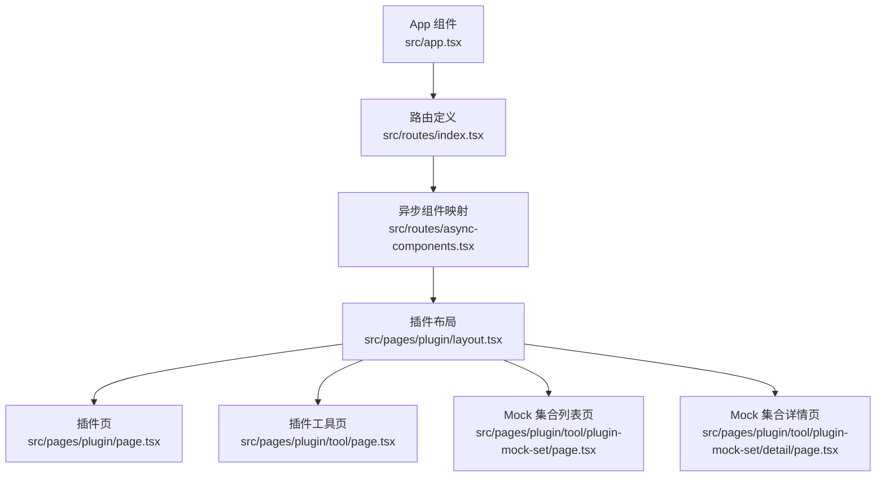
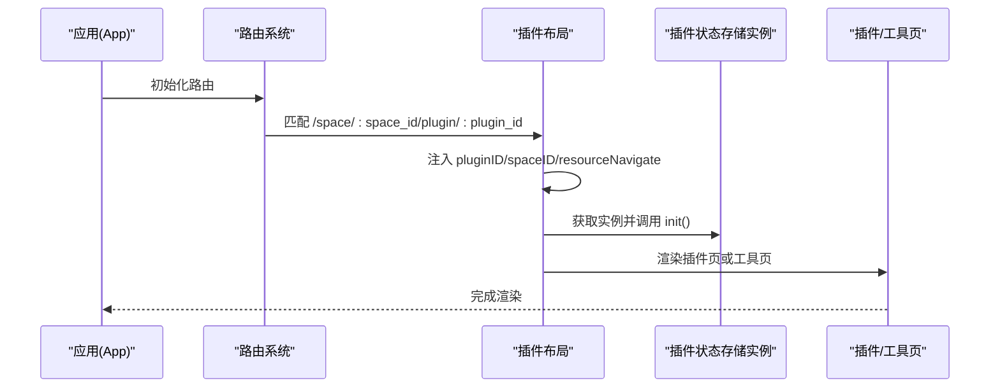
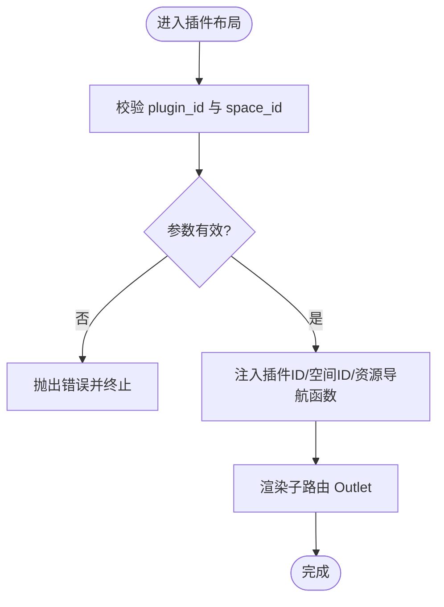
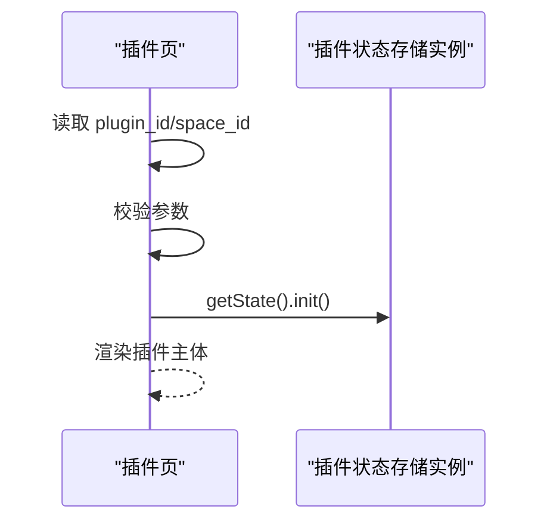
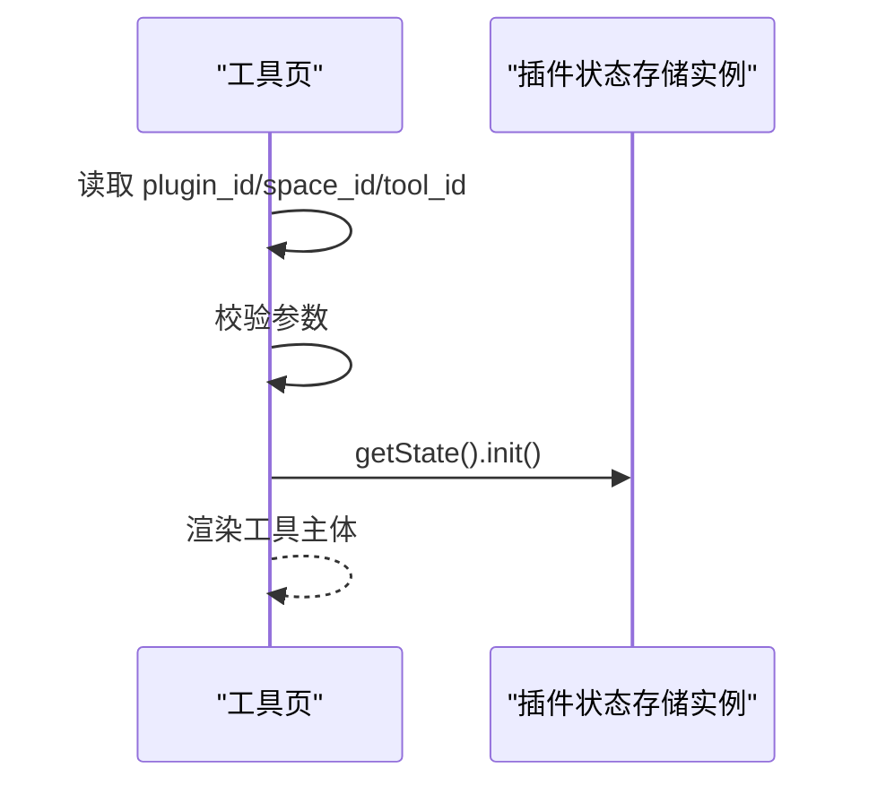
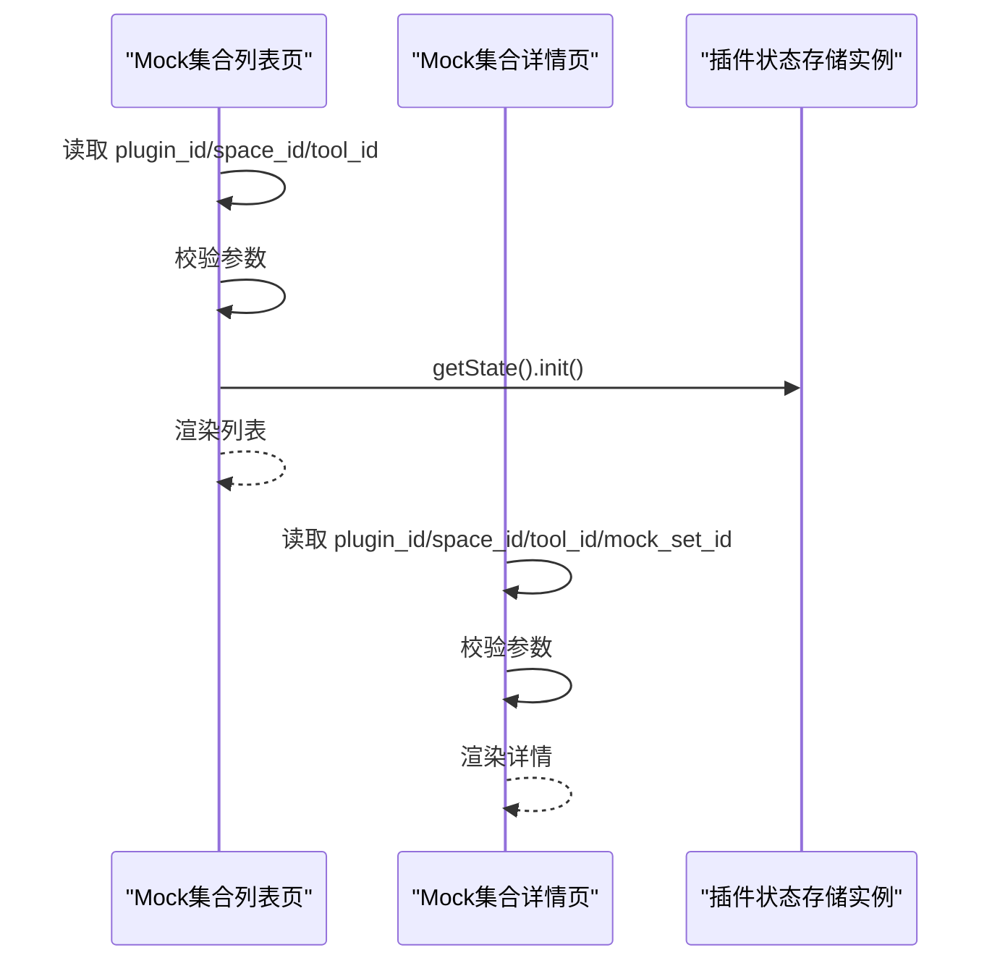
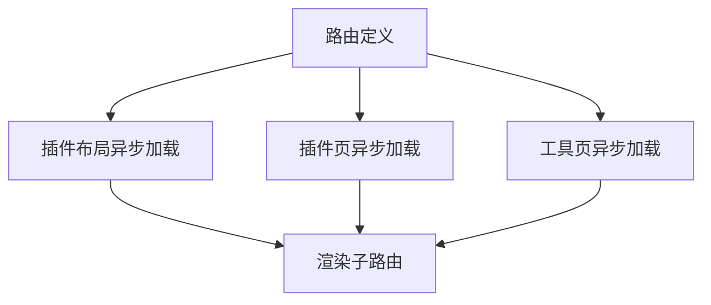
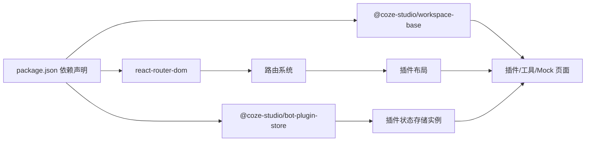

# 插件集成机制

<cite>
**本文引用的文件**
- [src/pages/plugin/page.tsx](file://src/pages/plugin/page.tsx)
- [src/pages/plugin/tool/page.tsx](file://src/pages/plugin/tool/page.tsx)
- [src/pages/plugin/layout.tsx](file://src/pages/plugin/layout.tsx)
- [src/pages/plugin/tool/plugin-mock-set/page.tsx](file://src/pages/plugin/tool/plugin-mock-set/page.tsx)
- [src/pages/plugin/tool/plugin-mock-set/detail/page.tsx](file://src/pages/plugin/tool/plugin-mock-set/detail/page.tsx)
- [src/routes/index.tsx](file://src/routes/index.tsx)
- [src/routes/async-components.tsx](file://src/routes/async-components.tsx)
- [src/app.tsx](file://src/app.tsx)
- [package.json](file://package.json)
</cite>

## 目录
1. [引言](#引言)
2. [项目结构](#项目结构)
3. [核心组件](#核心组件)
4. [架构总览](#架构总览)
5. [详细组件分析](#详细组件分析)
6. [依赖分析](#依赖分析)
7. [性能考虑](#性能考虑)
8. [故障排查指南](#故障排查指南)
9. [结论](#结论)
10. [附录](#附录)

## 引言
本文件面向 Coze Studio 前端中的“插件资源”子系统，系统化阐述插件在主应用内的路由接入、页面渲染、状态初始化与资源导航等机制；同时结合仓库中已暴露的前端插件能力（如插件页、工具页、Mock 集合页）进行技术说明。由于当前仓库未包含插件沙箱、通信协议、热更新与动态加载的具体实现源码，本文在这些方面以“基于现有文件的可验证事实”进行说明，并在相应章节提供概念性指导与最佳实践建议。

## 项目结构
Coze Studio 前端通过 React Router v6 进行路由管理，插件相关页面位于空间工作区下的 plugin 子路由中，采用异步组件按需加载的方式组织页面模块。插件资源页由布局容器包裹，注入插件 ID、空间 ID 以及资源导航函数，页面内部通过插件状态存储实例完成初始化。

图表来源
- [src/app.tsx:24-36](file://src/app.tsx#L24-L36)
- [src/routes/index.tsx:50-298](file://src/routes/index.tsx#L50-L298)
- [src/routes/async-components.tsx:124-131](file://src/routes/async-components.tsx#L124-L131)
- [src/pages/plugin/layout.tsx:22-38](file://src/pages/plugin/layout.tsx#L22-L38)
- [src/pages/plugin/page.tsx:23-33](file://src/pages/plugin/page.tsx#L23-L33)
- [src/pages/plugin/tool/page.tsx:22-31](file://src/pages/plugin/tool/page.tsx#L22-L31)
- [src/pages/plugin/tool/plugin-mock-set/page.tsx:21-33](file://src/pages/plugin/tool/plugin-mock-set/page.tsx#L21-L33)
- [src/pages/plugin/tool/plugin-mock-set/detail/page.tsx:21-35](file://src/pages/plugin/tool/plugin-mock-set/detail/page.tsx#L21-L35)

章节来源
- [src/app.tsx:24-36](file://src/app.tsx#L24-L36)
- [src/routes/index.tsx:50-298](file://src/routes/index.tsx#L50-L298)
- [src/routes/async-components.tsx:124-131](file://src/routes/async-components.tsx#L124-L131)

## 核心组件
- 路由与布局
  - 空间工作区路由下挂载插件资源子路由，插件布局负责注入插件 ID、空间 ID 与资源导航函数。
  - 插件页与工具页分别渲染插件主体与具体工具。
- 页面初始化
  - 插件页与工具页在首次挂载时调用插件状态存储实例的初始化方法，确保插件上下文准备就绪。
- 资源导航
  - 布局容器通过资源导航函数将页面内链接重定向到对应的空间与插件路径，保证导航一致性。

章节来源
- [src/routes/index.tsx:217-236](file://src/routes/index.tsx#L217-L236)
- [src/pages/plugin/layout.tsx:22-38](file://src/pages/plugin/layout.tsx#L22-L38)
- [src/pages/plugin/page.tsx:29-31](file://src/pages/plugin/page.tsx#L29-L31)
- [src/pages/plugin/tool/page.tsx:28-30](file://src/pages/plugin/tool/page.tsx#L28-L30)

## 架构总览
下图展示了从应用启动到插件页面渲染的关键交互：应用加载路由配置，进入空间工作区后匹配插件子路由，布局容器注入上下文并触发插件状态初始化，最终渲染插件或工具页面。

图表来源
- [src/app.tsx:24-36](file://src/app.tsx#L24-L36)
- [src/routes/index.tsx:217-236](file://src/routes/index.tsx#L217-L236)
- [src/pages/plugin/layout.tsx:30-36](file://src/pages/plugin/layout.tsx#L30-L36)
- [src/pages/plugin/page.tsx:29-31](file://src/pages/plugin/page.tsx#L29-L31)
- [src/pages/plugin/tool/page.tsx:28-30](file://src/pages/plugin/tool/page.tsx#L28-L30)

## 详细组件分析

### 插件布局容器（PluginLayout）
- 责任边界
  - 接收路由参数 plugin_id、space_id，校验完整性。
  - 通过 Provider 注入插件 ID、空间 ID 与资源导航函数，供子页面使用。
- 关键行为
  - 使用资源导航函数将页面内的资源跳转统一到空间与插件路径前缀下。
  - 将 Outlet 作为子路由出口，承载插件页与工具页。

图表来源
- [src/pages/plugin/layout.tsx:22-38](file://src/pages/plugin/layout.tsx#L22-L38)

章节来源
- [src/pages/plugin/layout.tsx:22-38](file://src/pages/plugin/layout.tsx#L22-L38)

### 插件页（PluginPage）
- 责任边界
  - 从路由参数提取 plugin_id、space_id 并校验。
  - 在组件挂载时调用插件状态存储实例的初始化方法。
  - 渲染插件主体组件。
- 数据流
  - 参数 → 校验 → 初始化 → 渲染。

图表来源
- [src/pages/plugin/page.tsx:23-33](file://src/pages/plugin/page.tsx#L23-L33)

章节来源
- [src/pages/plugin/page.tsx:23-33](file://src/pages/plugin/page.tsx#L23-L33)

### 工具页（PluginToolPage）
- 责任边界
  - 从路由参数提取 plugin_id、space_id、tool_id 并校验。
  - 在组件挂载时调用插件状态存储实例的初始化方法。
  - 渲染指定工具组件。
- 数据流
  - 参数 → 校验 → 初始化 → 渲染工具。

图表来源
- [src/pages/plugin/tool/page.tsx:22-31](file://src/pages/plugin/tool/page.tsx#L22-L31)

章节来源
- [src/pages/plugin/tool/page.tsx:22-31](file://src/pages/plugin/tool/page.tsx#L22-L31)

### Mock 集合页（MocksetList/MocksetDetail）
- Mock 集合列表页
  - 从路由参数提取 plugin_id、space_id、tool_id 并校验。
  - 在组件挂载时调用插件状态存储实例的初始化方法。
  - 渲染 Mock 集合列表组件。
- Mock 集合详情页
  - 从路由参数提取 plugin_id、space_id、tool_id、mock_set_id 并校验。
  - 渲染 Mock 集合详情组件。

图表来源
- [src/pages/plugin/tool/plugin-mock-set/page.tsx:21-33](file://src/pages/plugin/tool/plugin-mock-set/page.tsx#L21-L33)
- [src/pages/plugin/tool/plugin-mock-set/detail/page.tsx:21-35](file://src/pages/plugin/tool/plugin-mock-set/detail/page.tsx#L21-L35)

章节来源
- [src/pages/plugin/tool/plugin-mock-set/page.tsx:21-33](file://src/pages/plugin/tool/plugin-mock-set/page.tsx#L21-L33)
- [src/pages/plugin/tool/plugin-mock-set/detail/page.tsx:21-35](file://src/pages/plugin/tool/plugin-mock-set/detail/page.tsx#L21-L35)

### 路由与异步加载
- 路由定义
  - 在空间工作区内定义插件资源子路由，支持插件页与工具页。
- 异步组件
  - 插件布局、插件页、工具页均通过异步组件按需加载，降低首屏体积。

图表来源
- [src/routes/index.tsx:217-236](file://src/routes/index.tsx#L217-L236)
- [src/routes/async-components.tsx:124-131](file://src/routes/async-components.tsx#L124-L131)

章节来源
- [src/routes/index.tsx:217-236](file://src/routes/index.tsx#L217-L236)
- [src/routes/async-components.tsx:124-131](file://src/routes/async-components.tsx#L124-L131)

## 依赖分析
- 外部依赖
  - React Router v6：负责路由匹配与页面切换。
  - @coze-studio/workspace-base：提供插件、工具、Mock 集合等页面组件。
  - @coze-studio/bot-plugin-store：提供插件状态存储实例与 Provider。
- 内部依赖
  - 路由层通过异步组件解耦页面模块，布局层注入上下文，页面层负责初始化与渲染。

图表来源
- [package.json:19-51](file://package.json#L19-L51)
- [src/pages/plugin/layout.tsx:19-20](file://src/pages/plugin/layout.tsx#L19-L20)
- [src/pages/plugin/page.tsx:20-21](file://src/pages/plugin/page.tsx#L20-L21)
- [src/pages/plugin/tool/page.tsx:20-21](file://src/pages/plugin/tool/page.tsx#L20-L21)
- [src/pages/plugin/tool/plugin-mock-set/page.tsx:20-21](file://src/pages/plugin/tool/plugin-mock-set/page.tsx#L20-L21)

章节来源
- [package.json:19-51](file://package.json#L19-L51)

## 性能考虑
- 按需加载
  - 插件布局、插件页、工具页均通过异步组件加载，减少初始包体。
- 渲染优化
  - 页面在挂载时仅执行一次初始化，避免重复初始化带来的开销。
- 导航一致性
  - 通过统一的资源导航函数控制页面内跳转，减少不必要的重渲染。

## 故障排查指南
- 参数缺失
  - 若插件页或工具页缺少 plugin_id 或 space_id，将抛出错误并中断渲染。请检查路由参数传递是否正确。
- 初始化失败
  - 页面挂载时会调用插件状态存储实例的初始化方法。若初始化逻辑依赖网络或外部服务，请确认相关依赖可用。
- 导航异常
  - 若页面内跳转未生效，请检查布局容器注入的资源导航函数是否正确绑定空间与插件路径。

章节来源
- [src/pages/plugin/page.tsx:26-28](file://src/pages/plugin/page.tsx#L26-L28)
- [src/pages/plugin/tool/page.tsx:25-27](file://src/pages/plugin/tool/page.tsx#L25-L27)
- [src/pages/plugin/layout.tsx:23-28](file://src/pages/plugin/layout.tsx#L23-L28)

## 结论
本仓库中的插件资源子系统通过清晰的路由分层与异步加载策略，实现了插件页、工具页及 Mock 集合页的稳定运行。页面在挂载时完成插件上下文初始化，布局容器提供一致的资源导航能力。对于插件沙箱、通信协议、热更新与动态加载等更深层机制，当前仓库未提供直接实现源码，建议结合业务需求在后续迭代中补充相应能力与配套文档。

## 附录
- 开发与构建
  - 使用 Rsbuild 进行开发与构建，脚本与依赖在 package.json 中定义。
- 参考路径
  - 应用入口与路由：[src/app.tsx:24-36](file://src/app.tsx#L24-L36)、[src/routes/index.tsx:50-298](file://src/routes/index.tsx#L50-L298)
  - 插件布局与页面：[src/pages/plugin/layout.tsx:22-38](file://src/pages/plugin/layout.tsx#L22-L38)、[src/pages/plugin/page.tsx:23-33](file://src/pages/plugin/page.tsx#L23-L33)、[src/pages/plugin/tool/page.tsx:22-31](file://src/pages/plugin/tool/page.tsx#L22-L31)
  - Mock 集合页面：[src/pages/plugin/tool/plugin-mock-set/page.tsx:21-33](file://src/pages/plugin/tool/plugin-mock-set/page.tsx#L21-L33)、[src/pages/plugin/tool/plugin-mock-set/detail/page.tsx:21-35](file://src/pages/plugin/tool/plugin-mock-set/detail/page.tsx#L21-L35)
  - 异步组件与依赖：[src/routes/async-components.tsx:124-131](file://src/routes/async-components.tsx#L124-L131)、[package.json:19-51](file://package.json#L19-L51)