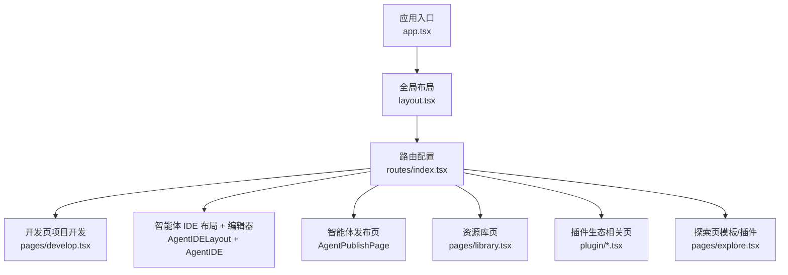
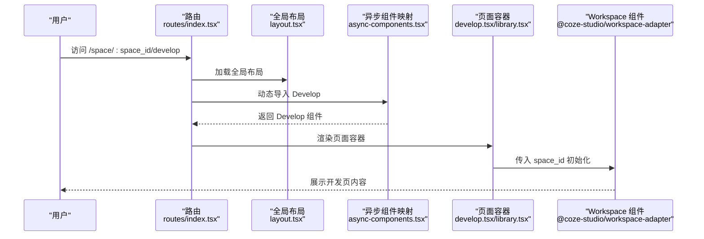
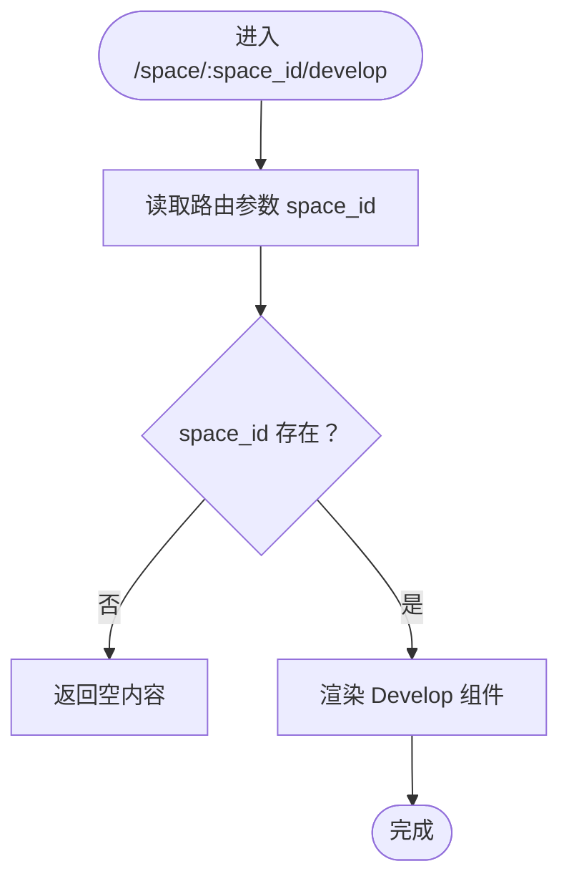
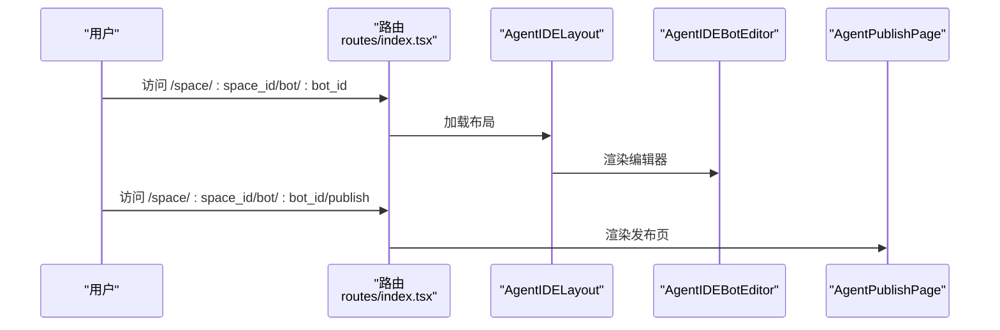
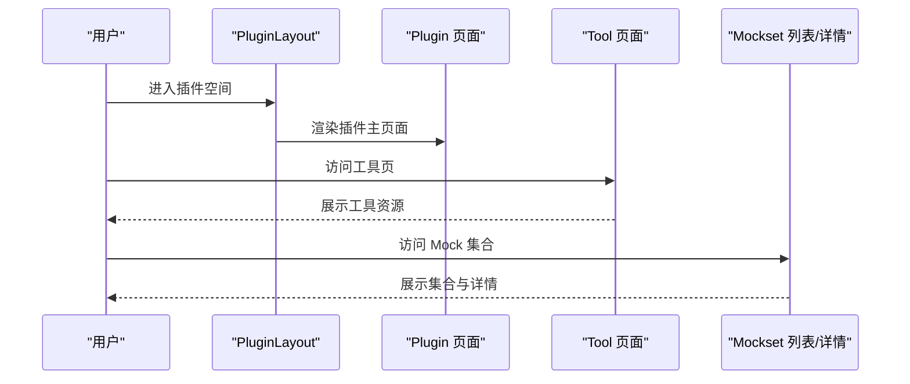
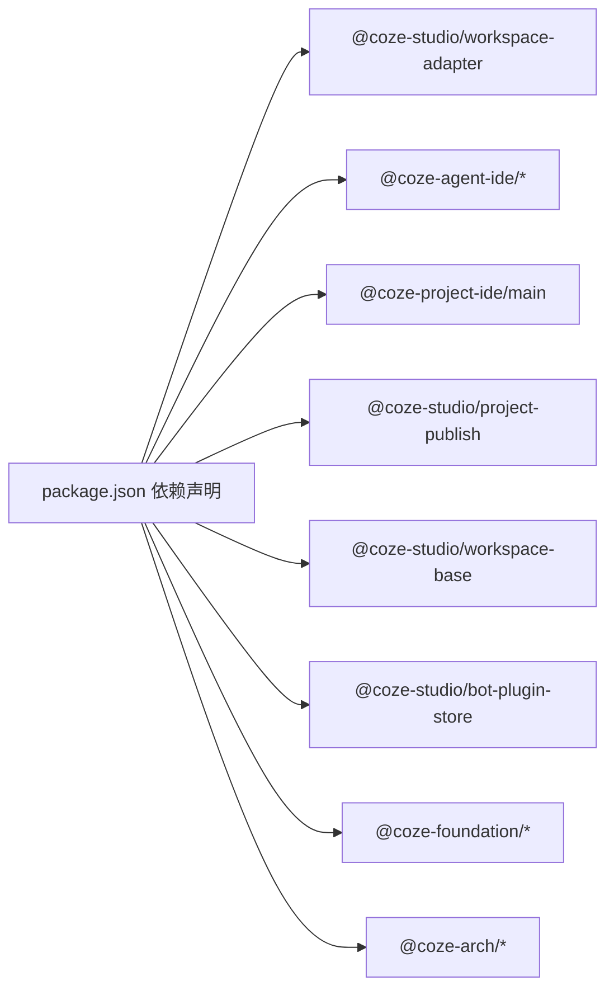

# 智能体开发

<cite>
**本文引用的文件**
- [develop.tsx](file://src/pages/develop.tsx)
- [app.tsx](file://src/app.tsx)
- [layout.tsx](file://src/layout.tsx)
- [index.tsx（路由）](file://src/routes/index.tsx)
- [async-components.tsx](file://src/routes/async-components.tsx)
- [package.json](file://package.json)
- [README.md](file://README.md)
- [library.tsx](file://src/pages/library.tsx)
- [plugin\page.tsx](file://src/pages/plugin/page.tsx)
- [plugin\layout.tsx](file://src/pages/plugin/layout.tsx)
- [plugin\tool\page.tsx](file://src/pages/plugin/tool/page.tsx)
- [plugin\tool\plugin-mock-set\page.tsx](file://src/pages/plugin/tool/plugin-mock-set/page.tsx)
- [plugin\tool\plugin-mock-set\detail\page.tsx](file://src/pages/plugin/tool/plugin-mock-set/detail/page.tsx)
- [explore.tsx](file://src/pages/explore.tsx)
</cite>

## 目录
1. [简介](#简介)
2. [项目结构](#项目结构)
3. [核心组件](#核心组件)
4. [架构总览](#架构总览)
5. [详细组件分析](#详细组件分析)
6. [依赖分析](#依赖分析)
7. [性能考虑](#性能考虑)
8. [故障排查指南](#故障排查指南)
9. [结论](#结论)
10. [附录](#附录)

## 简介
本文件面向在 Coze Studio 中进行智能体开发的工程师与产品人员，系统性阐述 Agent IDE 的使用方法、项目开发流程、发布管理与预览能力。文档从应用入口、路由与布局、到具体页面组件与异步加载机制进行逐层解析，并结合仓库中已实现的路由与页面组件，给出可操作的开发步骤、最佳实践与常见问题处理建议。

## 项目结构
前端应用基于 React + React Router v6 构建，采用动态导入（lazy）与异步组件分包策略，以提升首屏性能与按需加载体验。应用通过全局布局与侧边菜单承载工作区空间下的多模块导航，其中“智能体开发”“资源库”“插件生态”“探索模板/插件”等模块均通过统一的路由配置进行组织。

图表来源
- [app.tsx:24-36](file://src/app.tsx#L24-L36)
- [layout.tsx:19-23](file://src/layout.tsx#L19-L23)
- [index.tsx（路由）:50-297](file://src/routes/index.tsx#L50-L297)
- [async-components.tsx:50-87](file://src/routes/async-components.tsx#L50-L87)
- [develop.tsx:21-24](file://src/pages/develop.tsx#L21-L24)
- [library.tsx:21-24](file://src/pages/library.tsx#L21-L24)

章节来源
- [app.tsx:24-36](file://src/app.tsx#L24-L36)
- [layout.tsx:19-23](file://src/layout.tsx#L19-L23)
- [index.tsx（路由）:50-297](file://src/routes/index.tsx#L50-L297)
- [async-components.tsx:50-87](file://src/routes/async-components.tsx#L50-L87)

## 核心组件
- 应用壳与懒加载：应用通过 Suspense 包裹 RouterProvider，实现路由级异步组件的懒加载与加载态展示。
- 全局布局：引入全局布局适配器，负责顶部导航、侧边菜单与工作区上下文初始化。
- 路由与子模块：路由集中定义了“空间”下的多个子模块，包括“开发”“智能体 IDE”“发布”“资源库”“插件生态”“探索”等。
- 页面容器：各页面通过 useParams 获取空间 ID 或智能体 ID，作为后续数据请求与上下文初始化的关键参数。

章节来源
- [app.tsx:24-36](file://src/app.tsx#L24-L36)
- [layout.tsx:19-23](file://src/layout.tsx#L19-L23)
- [index.tsx（路由）:100-173](file://src/routes/index.tsx#L100-L173)
- [develop.tsx:21-24](file://src/pages/develop.tsx#L21-L24)
- [library.tsx:21-24](file://src/pages/library.tsx#L21-L24)

## 架构总览
下图展示了从应用入口到页面组件的调用链路，以及异步组件的加载关系：

图表来源
- [index.tsx（路由）:118-125](file://src/routes/index.tsx#L118-L125)
- [async-components.tsx:50-51](file://src/routes/async-components.tsx#L50-L51)
- [develop.tsx:21-24](file://src/pages/develop.tsx#L21-L24)

章节来源
- [index.tsx（路由）:118-125](file://src/routes/index.tsx#L118-L125)
- [async-components.tsx:50-51](file://src/routes/async-components.tsx#L50-L51)
- [develop.tsx:21-24](file://src/pages/develop.tsx#L21-L24)

## 详细组件分析

### 开发页（项目开发）
- 职责：作为工作区空间内的“项目开发”入口，接收空间 ID 并渲染对应的工作区开发界面。
- 参数：通过路由参数 space_id 注入，作为后续数据请求与上下文初始化的依据。
- 交互：当缺少 space_id 时，页面返回空内容；实际业务逻辑由 @coze-studio/workspace-adapter/develop 实现。

图表来源
- [develop.tsx:21-24](file://src/pages/develop.tsx#L21-L24)

章节来源
- [develop.tsx:21-24](file://src/pages/develop.tsx#L21-L24)
- [index.tsx（路由）:118-125](file://src/routes/index.tsx#L118-L125)

### 智能体 IDE（Agent IDE）
- 路由结构：位于 /space/:space_id/bot/:bot_id，支持嵌套子路由“publish”用于发布管理。
- 组件构成：
  - AgentIDELayout：智能体 IDE 布局适配器。
  - AgentIDE：智能体编辑器（BotEditor），来自 @coze-agent-ide/entry-adapter。
  - AgentPublishPage：智能体发布页，来自 @coze-agent-ide/agent-publish。
- 参数与行为：
  - 通过 bot_id 识别目标智能体。
  - 发布页支持关闭侧边栏、移动端提示、是否需要编辑器初始化等页面属性控制。

图表来源
- [index.tsx（路由）:127-157](file://src/routes/index.tsx#L127-L157)
- [async-components.tsx:57-73](file://src/routes/async-components.tsx#L57-L73)

章节来源
- [index.tsx（路由）:127-157](file://src/routes/index.tsx#L127-L157)
- [async-components.tsx:57-73](file://src/routes/async-components.tsx#L57-L73)

### 资源库（Library）
- 职责：工作区内资源库入口，页面容器通过 space_id 初始化资源库上下文。
- 使用场景：存放与复用智能体开发所需的素材、脚本、模型等资源。

章节来源
- [library.tsx:21-24](file://src/pages/library.tsx#L21-L24)
- [index.tsx（路由）:175-182](file://src/routes/index.tsx#L175-L182)

### 插件生态（Plugin）
- 路由与布局：
  - /space/:space_id/plugin/:plugin_id 为主入口，配合 PluginLayout 提供插件上下文。
  - 支持工具页 /space/:space_id/plugin/:plugin_id/tool/:tool_id。
  - 支持 Mock 集合列表与详情页。
- 数据与状态：
  - 通过 usePluginStoreInstance 初始化插件存储实例，确保插件资源可用。
  - 资源跳转通过 pluginResourceNavigate 封装的导航函数实现。

图表来源
- [plugin\layout.tsx:22-37](file://src/pages/plugin/layout.tsx#L22-L37)
- [plugin\page.tsx:23-32](file://src/pages/plugin/page.tsx#L23-L32)
- [plugin\tool\page.tsx:23-31](file://src/pages/plugin/tool/page.tsx#L23-L31)
- [plugin\tool\plugin-mock-set\page.tsx:23-33](file://src/pages/plugin/tool/plugin-mock-set/page.tsx#L23-L33)
- [plugin\tool\plugin-mock-set\detail\page.tsx:21-35](file://src/pages/plugin/tool/plugin-mock-set/detail/page.tsx#L21-L35)

章节来源
- [plugin\layout.tsx:22-37](file://src/pages/plugin/layout.tsx#L22-L37)
- [plugin\page.tsx:23-32](file://src/pages/plugin/page.tsx#L23-L32)
- [plugin\tool\page.tsx:23-31](file://src/pages/plugin/tool/page.tsx#L23-L31)
- [plugin\tool\plugin-mock-set\page.tsx:23-33](file://src/pages/plugin/tool/plugin-mock-set/page.tsx#L23-L33)
- [plugin\tool\plugin-mock-set\detail\page.tsx:21-35](file://src/pages/plugin/tool/plugin-mock-set/detail/page.tsx#L21-L35)

### 探索（Explore）
- 职责：提供“插件商店”和“模板市场”的浏览与检索入口。
- 路由：/explore 下包含 plugin 与 template 两个子页，分别由社区生态模块提供页面组件。

章节来源
- [explore.tsx:37-66](file://src/pages/explore.tsx#L37-L66)

## 依赖分析
- 组件依赖：
  - 路由层依赖异步组件映射，实现按需加载与分包。
  - 页面容器依赖 @coze-studio/workspace-adapter 提供的 Develop 与 Library 组件。
  - 智能体 IDE 依赖 @coze-agent-ide 的布局与编辑器适配器，以及发布页组件。
  - 插件生态依赖 @coze-studio/workspace-base 与 @coze-studio/bot-plugin-store。
- 外部依赖：
  - React、React Router、Coze Design、Zustand 等基础库。
  - 工作区与空间 UI 适配器、布局与全局上下文等。

图表来源
- [package.json:19-50](file://package.json#L19-L50)

章节来源
- [package.json:19-50](file://package.json#L19-L50)

## 性能考虑
- 懒加载与分包：通过 React.lazy 与异步组件映射，减少首屏体积，按需加载页面与功能模块。
- Suspense 降级：在异步组件加载期间显示加载态，提升用户体验。
- 路由级 loader：在路由层设置 hasSider、requireAuth、requireBotEditorInit 等标志位，避免不必要的初始化与渲染。
- 本地开发与构建：提供 dev/build/preview/test 等脚本，便于开发与预览。

章节来源
- [app.tsx:26-33](file://src/app.tsx#L26-L33)
- [index.tsx（路由）:122-124](file://src/routes/index.tsx#L122-L124)
- [index.tsx（路由）:151-156](file://src/routes/index.tsx#L151-L156)
- [package.json:11-17](file://package.json#L11-L17)

## 故障排查指南
- 缺少空间 ID 导致页面不渲染
  - 现象：访问 /space/:space_id/develop 或 /space/:space_id/library 时无内容。
  - 原因：页面容器未检测到 space_id。
  - 处理：确认路由参数传递正确，或检查工作区上下文初始化逻辑。
  - 参考路径
    - [develop.tsx:21-24](file://src/pages/develop.tsx#L21-L24)
    - [library.tsx:21-24](file://src/pages/library.tsx#L21-L24)
- 智能体 IDE 无法进入编辑器
  - 现象：访问 /space/:space_id/bot/:bot_id 后空白或报错。
  - 原因：bot_id 缺失、编辑器初始化失败、或布局/编辑器适配器未正确加载。
  - 处理：检查路由参数、确认 requireBotEditorInit 标志位与页面属性设置、验证异步组件映射。
  - 参考路径
    - [index.tsx（路由）:127-157](file://src/routes/index.tsx#L127-L157)
    - [async-components.tsx:57-66](file://src/routes/async-components.tsx#L57-L66)
- 插件页面初始化异常
  - 现象：进入 /space/:space_id/plugin/:plugin_id 报错。
  - 原因：缺少 plugin_id 或 space_id，或插件存储未初始化。
  - 处理：确保参数齐全并在挂载时调用插件存储初始化；检查导航封装函数。
  - 参考路径
    - [plugin\page.tsx:23-32](file://src/pages/plugin/page.tsx#L23-L32)
    - [plugin\layout.tsx:22-37](file://src/pages/plugin/layout.tsx#L22-L37)
- 发布页不可见或加载失败
  - 现象：访问 /space/:space_id/bot/:bot_id/publish 无内容。
  - 原因：路由未匹配、hasSider 设置或 requireBotEditorInit 影响加载。
  - 处理：核对路由嵌套结构与 loader 配置。
  - 参考路径
    - [index.tsx（路由）:136-149](file://src/routes/index.tsx#L136-L149)
    - [async-components.tsx:68-73](file://src/routes/async-components.tsx#L68-L73)

## 结论
本项目通过清晰的路由分层与异步组件加载机制，将“项目开发”“智能体 IDE”“发布管理”“资源库”“插件生态”“探索”等功能模块有机整合。开发者可在工作区空间内完成从项目创建、代码编写、调试运行到版本管理与发布的全流程操作。建议在开发过程中遵循参数校验、懒加载与 loader 标志位的约定，确保页面稳定与性能可控。

## 附录

### 智能体开发完整生命周期（基于现有实现）
- 创建项目/空间
  - 在工作区空间下选择“开发”入口，传入 space_id。
  - 参考路径
    - [develop.tsx:21-24](file://src/pages/develop.tsx#L21-L24)
- 进入智能体 IDE
  - 访问 /space/:space_id/bot/:bot_id，进入智能体编辑器。
  - 参考路径
    - [index.tsx（路由）:127-157](file://src/routes/index.tsx#L127-L157)
- 调试与运行
  - 在 AgentIDE 中进行代码编写与调试（具体编辑器行为由 @coze-agent-ide/entry-adapter 提供）。
  - 参考路径
    - [async-components.tsx:62-66](file://src/routes/async-components.tsx#L62-L66)
- 版本管理与发布
  - 在智能体编辑器中完成版本迭代后，访问 /space/:space_id/bot/:bot_id/publish 进入发布页。
  - 参考路径
    - [index.tsx（路由）:136-149](file://src/routes/index.tsx#L136-L149)
    - [async-components.tsx:68-73](file://src/routes/async-components.tsx#L68-L73)
- 预览与资源复用
  - 使用资源库（/space/:space_id/library）复用素材与脚本。
  - 参考路径
    - [library.tsx:21-24](file://src/pages/library.tsx#L21-L24)
- 插件与生态
  - 通过插件生态入口与工具页扩展能力，必要时使用 Mock 集合进行联调。
  - 参考路径
    - [plugin\layout.tsx:22-37](file://src/pages/plugin/layout.tsx#L22-L37)
    - [plugin\tool\page.tsx:23-31](file://src/pages/plugin/tool/page.tsx#L23-L31)
    - [plugin\tool\plugin-mock-set\page.tsx:23-33](file://src/pages/plugin/tool/plugin-mock-set/page.tsx#L23-L33)
    - [plugin\tool\plugin-mock-set\detail\page.tsx:21-35](file://src/pages/plugin/tool/plugin-mock-set/detail/page.tsx#L21-L35)

### Develop 组件参数与配置要点
- 关键参数
  - space_id：工作区空间标识，用于初始化上下文与数据请求。
- 页面属性（loader）
  - subMenuKey：用于标记当前子模块（如 DEVELOP）。
- 最佳实践
  - 在页面容器中优先校验参数完整性，再进行组件渲染。
  - 对于复杂页面，结合 Suspense 与 loader 标志位优化加载体验。
- 参考路径
  - [develop.tsx:21-24](file://src/pages/develop.tsx#L21-L24)
  - [index.tsx（路由）:122-124](file://src/routes/index.tsx#L122-L124)

### 开发示例与操作步骤
- 快速开始
  - 启动开发服务器：执行开发脚本。
  - 打开浏览器访问 /space/:space_id/develop，进入项目开发页。
  - 在该页中选择或创建智能体，进入 /space/:space_id/bot/:bot_id 进行编辑。
  - 完成后访问 /space/:space_id/bot/:bot_id/publish 进行发布。
- 参考路径
  - [package.json:11-17](file://package.json#L11-L17)
  - [index.tsx（路由）:118-157](file://src/routes/index.tsx#L118-L157)