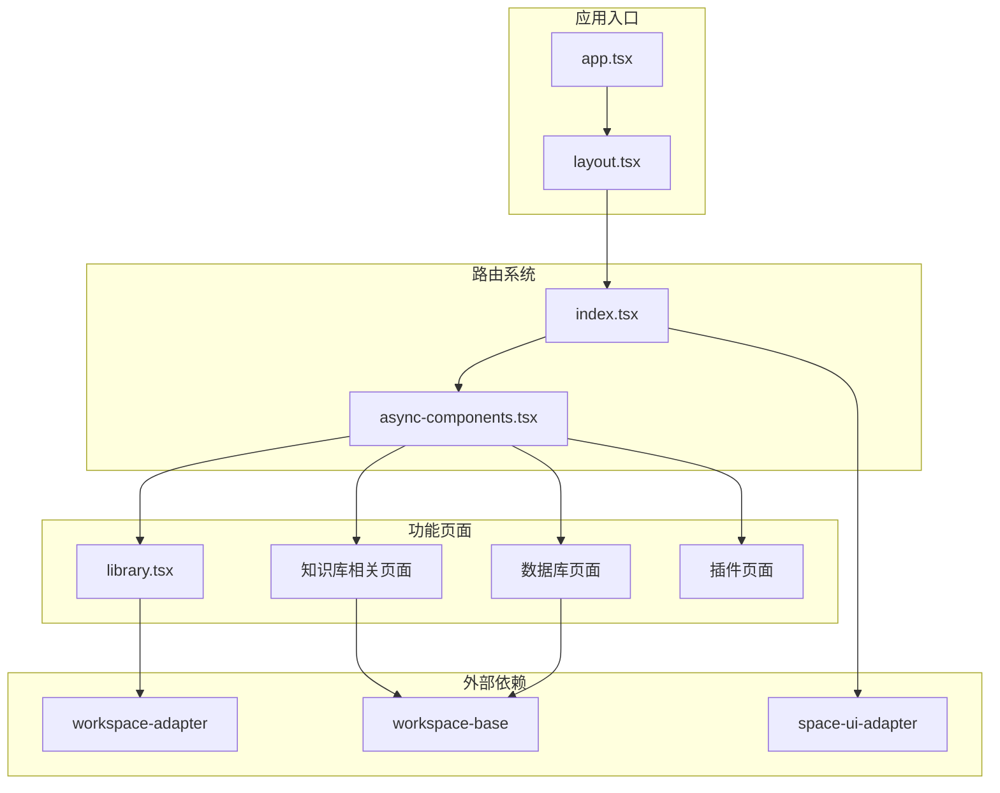
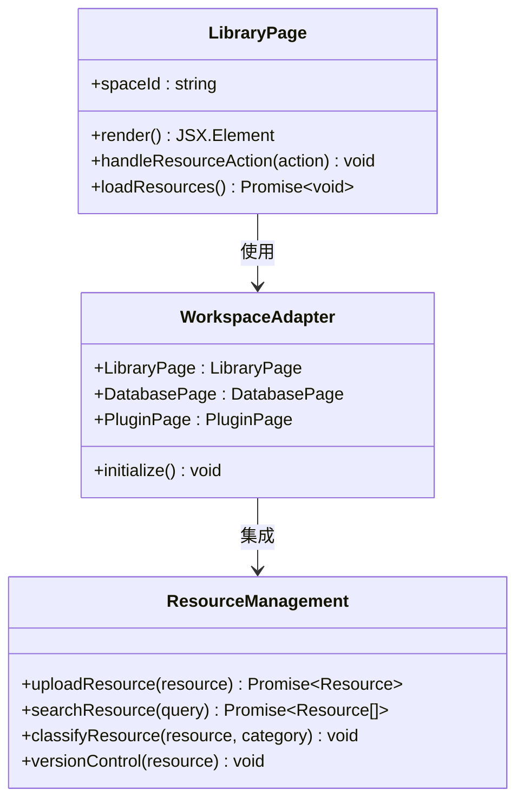
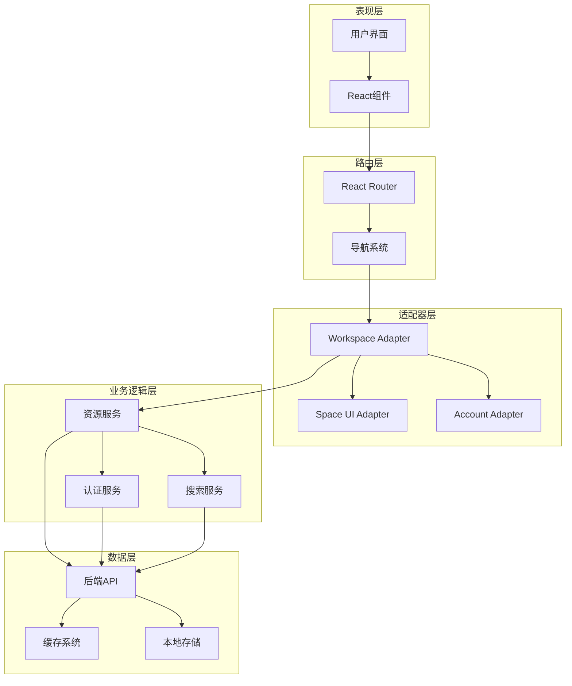
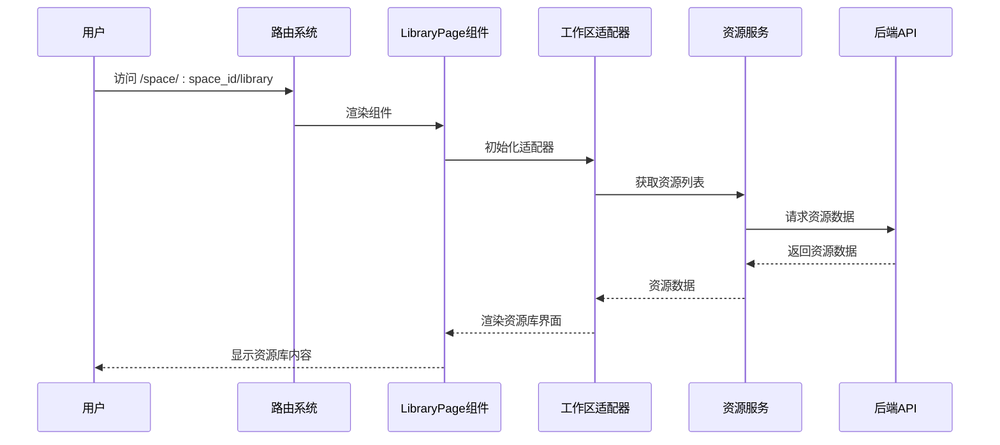
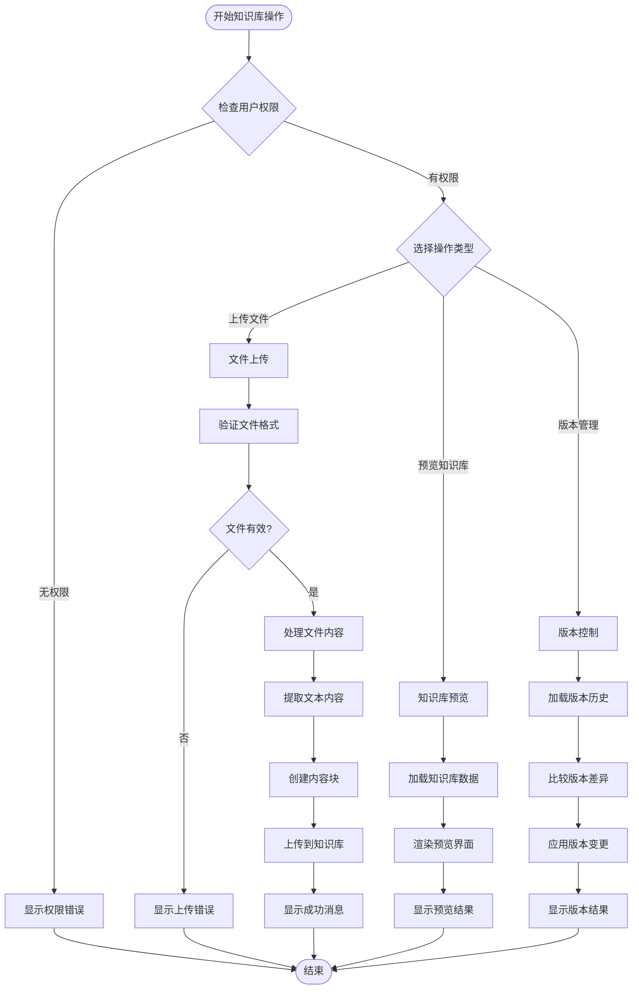
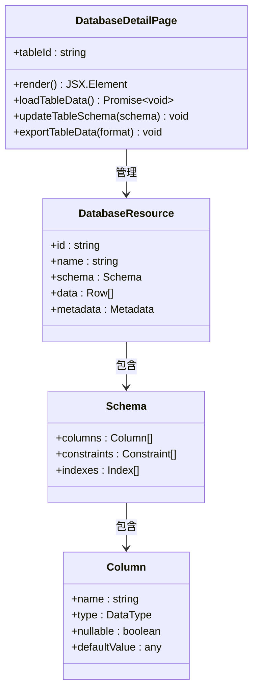
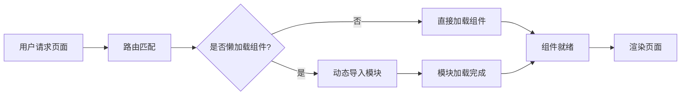

# 资源库管理

<cite>
**本文档引用的文件**
- [src/pages/library.tsx](file://src/pages/library.tsx)
- [src/routes/index.tsx](file://src/routes/index.tsx)
- [src/routes/async-components.tsx](file://src/routes/async-components.tsx)
- [src/app.tsx](file://src/app.tsx)
- [src/layout.tsx](file://src/layout.tsx)
- [package.json](file://package.json)
- [README.md](file://README.md)
</cite>

## 目录
1. [简介](#简介)
2. [项目结构](#项目结构)
3. [核心组件](#核心组件)
4. [架构概览](#架构概览)
5. [详细组件分析](#详细组件分析)
6. [依赖关系分析](#依赖关系分析)
7. [性能考虑](#性能考虑)
8. [故障排除指南](#故障排除指南)
9. [结论](#结论)

## 简介

Coze Studio的资源库管理功能是一个集成了多种资源管理能力的综合平台，主要包含以下核心功能模块：

- **知识库管理**：支持知识库的创建、上传、预览和版本控制
- **数据库资源管理**：提供数据库表的查看和管理功能
- **库存资源管理**：通过工作区适配器实现的资源库统一管理

该系统采用模块化架构设计，通过路由系统实现功能模块的解耦，使用工作区适配器模式实现资源管理功能的扩展性。

## 项目结构

Coze Studio前端应用采用React + Rsbuild的技术栈，资源库管理功能主要分布在以下目录结构中：



**图表来源**
- [src/app.tsx:1-37](file://src/app.tsx#L1-L37)
- [src/layout.tsx:1-24](file://src/layout.tsx#L1-L24)
- [src/routes/index.tsx:1-298](file://src/routes/index.tsx#L1-L298)

**章节来源**
- [src/app.tsx:1-37](file://src/app.tsx#L1-L37)
- [src/layout.tsx:1-24](file://src/layout.tsx#L1-L24)
- [src/routes/index.tsx:1-298](file://src/routes/index.tsx#L1-L298)

## 核心组件

### 资源库主页面组件

资源库管理的核心是`LibraryPage`组件，它通过工作区适配器实现统一的资源管理界面：



**图表来源**
- [src/pages/library.tsx:17-26](file://src/pages/library.tsx#L17-L26)

### 路由系统架构

应用采用React Router进行路由管理，资源库相关路由配置如下：

| 路由路径 | 组件 | 功能描述 | 认证要求 |
|---------|------|----------|----------|
| `/space/:space_id/library` | Library | 资源库主页面 | 是 |
| `/space/:space_id/knowledge/:dataset_id` | KnowledgePreview | 知识库预览 | 是 |
| `/space/:space_id/knowledge/:dataset_id/upload` | KnowledgeUpload | 知识库上传 | 是 |
| `/space/:space_id/database/:table_id` | DatabaseDetail | 数据库详情 | 是 |

**章节来源**
- [src/routes/index.tsx:175-215](file://src/routes/index.tsx#L175-L215)
- [src/routes/async-components.tsx:53-108](file://src/routes/async-components.tsx#L53-L108)

## 架构概览

Coze Studio资源库管理采用分层架构设计，通过工作区适配器实现功能模块的解耦：



**图表来源**
- [src/app.tsx:17-36](file://src/app.tsx#L17-L36)
- [src/layout.tsx:17-23](file://src/layout.tsx#L17-L23)
- [package.json:19-50](file://package.json#L19-L50)

## 详细组件分析

### 资源库管理组件

#### LibraryPage 组件分析

`LibraryPage`组件是资源库管理的核心入口，负责渲染资源库界面并处理用户交互：



**图表来源**
- [src/pages/library.tsx:21-24](file://src/pages/library.tsx#L21-L24)
- [src/routes/index.tsx:175-182](file://src/routes/index.tsx#L175-L182)

#### 知识库管理功能

知识库管理功能包含上传、预览和版本控制等核心能力：



**图表来源**
- [src/routes/index.tsx:184-200](file://src/routes/index.tsx#L184-L200)
- [src/routes/async-components.tsx:89-101](file://src/routes/async-components.tsx#L89-L101)

#### 数据库资源管理

数据库资源管理提供表格详情查看和数据操作功能：



**图表来源**
- [src/routes/async-components.tsx:103-108](file://src/routes/async-components.tsx#L103-L108)
- [src/routes/index.tsx:202-215](file://src/routes/index.tsx#L202-L215)

**章节来源**
- [src/pages/library.tsx:17-26](file://src/pages/library.tsx#L17-L26)
- [src/routes/index.tsx:175-215](file://src/routes/index.tsx#L175-L215)

### 路由系统与导航

#### 路由配置分析

应用的路由系统采用嵌套路由设计，支持多层级的页面导航：

```mermaid
graph TD
ROOT[/] --> LAYOUT[Layout组件]
LAYOUT --> SPACE[space路由]
SPACE --> SPACE_ID[:space_id路由]
SPACE_ID --> DEVELOP[develop页面]
SPACE_ID --> LIBRARY[library页面]
SPACE_ID --> KNOWLEDGE[knowledge路由]
SPACE_ID --> DATABASE[database路由]
SPACE_ID --> PLUGIN[plugin路由]
KNOWLEDGE --> KNOWLEDGE_PREVIEW[知识库预览]
KNOWLEDGE --> KNOWLEDGE_UPLOAD[知识库上传]
DATABASE --> DATABASE_DETAIL[数据库详情]
PLUGIN --> PLUGIN_PAGE[插件页面]
PLUGIN --> PLUGIN_TOOL[插件工具页面]
```

**图表来源**
- [src/routes/index.tsx:78-239](file://src/routes/index.tsx#L78-L239)

#### 异步组件加载

应用使用React.lazy实现组件的异步加载，提高首屏加载性能：

| 组件名称 | 懒加载模块 | 加载时机 |
|---------|-----------|----------|
| Library | ../pages/library | 访问library路由时 |
| KnowledgePreview | @coze-studio/workspace-base/knowledge-preview | 访问知识库预览时 |
| KnowledgeUpload | @coze-studio/workspace-base/knowledge-upload | 访问知识库上传时 |
| DatabaseDetail | @coze-studio/workspace-base | 访问数据库详情时 |
| SpaceLayout | @coze-foundation/space-ui-adapter | 初始化工作区布局时 |

**章节来源**
- [src/routes/async-components.tsx:1-152](file://src/routes/async-components.tsx#L1-L152)

## 依赖关系分析

### 外部依赖分析

Coze Studio资源库管理功能依赖多个内部包和外部库：

```mermaid
graph TB
subgraph "应用依赖"
REACT[react ~18.2.0]
ROUTER[react-router-dom ^6.11.1]
DESIGN[coze-design 0.0.6-alpha]
ZUSTAND[zustand ^4.4.7]
end
subgraph "内部包依赖"
WORKSPACE_ADAPTER[@coze-studio/workspace-adapter]
WORKSPACE_BASE[@coze-studio/workspace-base]
SPACE_UI_ADAPTER[@coze-foundation/space-ui-adapter]
ACCOUNT_ADAPTER[@coze-foundation/account-ui-adapter]
FOUNDATION_SDK[@coze-foundation/foundation-sdk]
end
subgraph "功能模块"
LIBRARY_FEATURE[资源库功能]
KNOWLEDGE_FEATURE[知识库功能]
DATABASE_FEATURE[数据库功能]
PLUGIN_FEATURE[插件功能]
end
REACT --> LIBRARY_FEATURE
ROUTER --> LIBRARY_FEATURE
DESIGN --> LIBRARY_FEATURE
ZUSTAND --> LIBRARY_FEATURE
WORKSPACE_ADAPTER --> LIBRARY_FEATURE
WORKSPACE_BASE --> KNOWLEDGE_FEATURE
WORKSPACE_BASE --> DATABASE_FEATURE
SPACE_UI_ADAPTER --> LIBRARY_FEATURE
ACCOUNT_ADAPTER --> LIBRARY_FEATURE
FOUNDATION_SDK --> LIBRARY_FEATURE
LIBRARY_FEATURE --> KNOWLEDGE_FEATURE
LIBRARY_FEATURE --> DATABASE_FEATURE
LIBRARY_FEATURE --> PLUGIN_FEATURE
```

**图表来源**
- [package.json:19-50](file://package.json#L19-L50)

### 内部包结构

应用使用Rush monorepo管理多个内部包，资源库相关的主要包包括：

- **workspace-adapter**: 提供资源库管理的适配器接口
- **workspace-base**: 提供基础的资源管理功能
- **space-ui-adapter**: 提供工作区UI适配器
- **account-ui-adapter**: 提供账户认证UI适配器

**章节来源**
- [package.json:19-50](file://package.json#L19-L50)

## 性能考虑

### 组件懒加载策略

应用采用React.lazy实现组件的按需加载，减少初始包体积：

- **首屏优化**: 只加载必要的组件，其他组件在需要时再加载
- **缓存机制**: 浏览器会缓存已加载的模块，提升二次访问速度
- **错误边界**: 使用React Error Boundary处理组件加载失败的情况

### 路由懒加载

路由级别的懒加载确保只有当前页面相关的组件才会被加载：



### 缓存策略

应用采用多层次的缓存策略：

- **浏览器缓存**: 静态资源和已加载的模块
- **内存缓存**: 当前页面的状态和数据
- **持久化存储**: 用户偏好设置和登录状态

## 故障排除指南

### 常见问题诊断

#### 资源库页面无法加载

**症状**: 访问资源库页面时出现空白或加载失败

**可能原因**:
1. 工作区适配器未正确初始化
2. 网络请求超时
3. 权限不足

**解决方案**:
1. 检查网络连接和API可用性
2. 验证用户权限和认证状态
3. 查看浏览器开发者工具中的错误日志

#### 知识库上传失败

**症状**: 文件上传过程中断或返回错误

**可能原因**:
1. 文件格式不支持
2. 文件大小超出限制
3. 网络中断

**解决方案**:
1. 检查文件格式和大小限制
2. 确认网络连接稳定
3. 重新尝试上传操作

#### 数据库连接问题

**症状**: 数据库详情页面无法显示数据

**可能原因**:
1. 数据库连接配置错误
2. 权限不足
3. 数据库服务不可用

**解决方案**:
1. 验证数据库连接参数
2. 检查用户数据库权限
3. 确认数据库服务状态

**章节来源**
- [src/app.tsx:24-36](file://src/app.tsx#L24-L36)
- [src/layout.tsx:19-23](file://src/layout.tsx#L19-L23)

## 结论

Coze Studio的资源库管理功能通过模块化的设计和工作区适配器模式，实现了知识库、数据库和库存资源的统一管理。系统具有以下特点：

**架构优势**:
- 分层设计清晰，职责分离明确
- 采用适配器模式，便于功能扩展
- 路由系统支持嵌套和异步加载

**功能特性**:
- 支持多种资源类型的统一管理
- 提供完整的生命周期管理（创建、上传、预览、版本控制）
- 集成权限控制和访问管理

**技术亮点**:
- 使用现代React技术栈
- 实现高性能的懒加载机制
- 提供良好的用户体验和错误处理

该系统为后续的功能扩展和维护提供了良好的基础，建议在实际使用中重点关注权限管理和性能优化方面的问题。