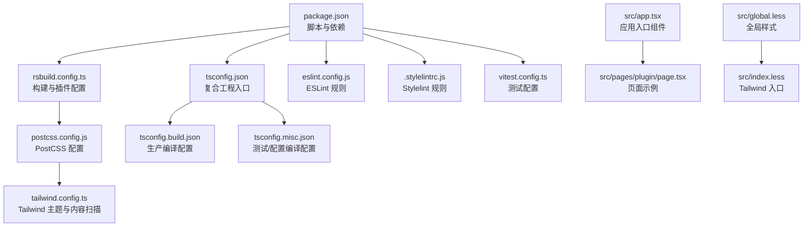
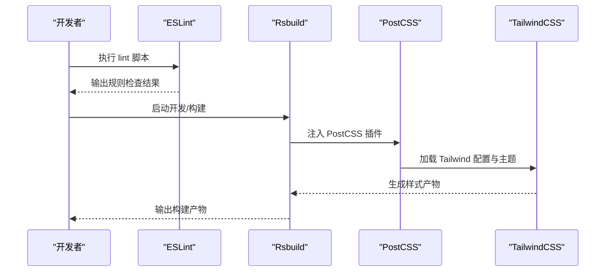
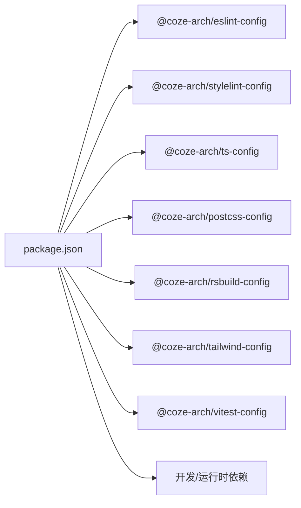

# 代码规范

<cite>
**本文引用的文件**
- [eslint.config.js](file://eslint.config.js)
- [.stylelintrc.js](file://.stylelintrc.js)
- [package.json](file://package.json)
- [tsconfig.json](file://tsconfig.json)
- [tsconfig.build.json](file://tsconfig.build.json)
- [tsconfig.misc.json](file://tsconfig.misc.json)
- [rsbuild.config.ts](file://rsbuild.config.ts)
- [postcss.config.js](file://postcss.config.js)
- [tailwind.config.ts](file://tailwind.config.ts)
- [vitest.config.ts](file://vitest.config.ts)
- [src/app.tsx](file://src/app.tsx)
- [src/pages/plugin/page.tsx](file://src/pages/plugin/page.tsx)
- [src/global.less](file://src/global.less)
- [src/index.less](file://src/index.less)
</cite>

## 目录
1. [引言](#引言)
2. [项目结构](#项目结构)
3. [核心组件](#核心组件)
4. [架构总览](#架构总览)
5. [详细组件分析](#详细组件分析)
6. [依赖分析](#依赖分析)
7. [性能考虑](#性能考虑)
8. [故障排查指南](#故障排查指南)
9. [结论](#结论)
10. [附录](#附录)

## 引言
本文件为 Coze Studio 前端项目的统一代码规范文档，聚焦于 ESLint 规则与代码质量检查、JavaScript/TypeScript 编码规范与命名约定、文件组织原则、Stylelint 配置与 CSS/LESS 编写规范、TypeScript 类型最佳实践、代码格式化工具与自动化流程、以及代码审查检查清单与质量门禁标准。目标是为团队协作提供一致的风格与质量基线。

## 项目结构
该应用采用 Rsbuild 构建，配合 TailwindCSS 与 PostCSS 生态，TypeScript 作为主要语言，Vitest 提供测试能力。关键配置集中在根目录的配置文件中，并通过工作区依赖共享企业级配置包。

图表来源
- [package.json:11-18](file://package.json#L11-L18)
- [rsbuild.config.ts:19-136](file://rsbuild.config.ts#L19-L136)
- [postcss.config.js:1-2](file://postcss.config.js#L1-L2)
- [tailwind.config.ts:17-55](file://tailwind.config.ts#L17-L55)
- [tsconfig.json:1-16](file://tsconfig.json#L1-L16)
- [tsconfig.build.json:1-134](file://tsconfig.build.json#L1-L134)
- [tsconfig.misc.json:1-28](file://tsconfig.misc.json#L1-L28)
- [eslint.config.js:1-7](file://eslint.config.js#L1-L7)
- [.stylelintrc.js:1-6](file://.stylelintrc.js#L1-L6)
- [vitest.config.ts:17-23](file://vitest.config.ts#L17-L23)
- [src/app.tsx:17-37](file://src/app.tsx#L17-L37)
- [src/pages/plugin/page.tsx:17-36](file://src/pages/plugin/page.tsx#L17-L36)
- [src/global.less:1-235](file://src/global.less#L1-L235)
- [src/index.less:1-9](file://src/index.less#L1-L9)

章节来源
- [package.json:11-18](file://package.json#L11-L18)
- [rsbuild.config.ts:19-136](file://rsbuild.config.ts#L19-L136)
- [tsconfig.json:1-16](file://tsconfig.json#L1-L16)
- [tsconfig.build.json:1-134](file://tsconfig.build.json#L1-L134)
- [tsconfig.misc.json:1-28](file://tsconfig.misc.json#L1-L28)
- [eslint.config.js:1-7](file://eslint.config.js#L1-L7)
- [.stylelintrc.js:1-6](file://.stylelintrc.js#L1-L6)
- [postcss.config.js:1-2](file://postcss.config.js#L1-L2)
- [tailwind.config.ts:17-55](file://tailwind.config.ts#L17-L55)
- [vitest.config.ts:17-23](file://vitest.config.ts#L17-L23)
- [src/app.tsx:17-37](file://src/app.tsx#L17-L37)
- [src/pages/plugin/page.tsx:17-36](file://src/pages/plugin/page.tsx#L17-L36)
- [src/global.less:1-235](file://src/global.less#L1-L235)
- [src/index.less:1-9](file://src/index.less#L1-L9)

## 核心组件
- ESLint 规则：通过企业级配置包统一规则，使用 defineConfig 并指定 web 预设与当前包根路径。
- Stylelint 规则：基于企业级配置包，当前未扩展额外规则集。
- TypeScript 编译：复合工程入口，分别针对构建与测试/配置场景提供独立 tsconfig。
- 构建与样式：Rsbuild 注入 PostCSS 插件（Tailwind），Tailwind 读取企业主题与响应式常量，禁用默认重置以避免覆盖既有样式。
- 测试：Vitest 使用企业级配置预设，面向 Web 环境。

章节来源
- [eslint.config.js:1-7](file://eslint.config.js#L1-L7)
- [.stylelintrc.js:1-6](file://.stylelintrc.js#L1-L6)
- [tsconfig.json:1-16](file://tsconfig.json#L1-L16)
- [tsconfig.build.json:1-134](file://tsconfig.build.json#L1-L134)
- [tsconfig.misc.json:1-28](file://tsconfig.misc.json#L1-L28)
- [rsbuild.config.ts:50-54](file://rsbuild.config.ts#L50-L54)
- [tailwind.config.ts:28-54](file://tailwind.config.ts#L28-L54)
- [vitest.config.ts:17-23](file://vitest.config.ts#L17-L23)

## 架构总览
下图展示从开发到构建的关键流程：开发者执行 lint 脚本触发 ESLint；构建阶段由 Rsbuild 注入 PostCSS/Tailwind；TypeScript 编译依据复合工程配置分场景进行。

图表来源
- [package.json:14](file://package.json#L14)
- [rsbuild.config.ts:50-54](file://rsbuild.config.ts#L50-L54)
- [postcss.config.js:1](file://postcss.config.js#L1)
- [tailwind.config.ts:17-55](file://tailwind.config.ts#L17-L55)

## 详细组件分析

### ESLint 配置与规则
- 规则来源：通过企业级配置包统一管理，确保跨项目一致性。
- 预设与范围：使用 web 预设，限定 packageRoot 为当前包根目录，避免误匹配其他包规则。
- 命令：提供 lint 脚本，支持缓存与静默输出，便于 CI/本地快速检查。

建议在团队内统一执行 lint 脚本，确保提交前无严重问题。

章节来源
- [eslint.config.js:1-7](file://eslint.config.js#L1-L7)
- [package.json:14](file://package.json#L14)

### JavaScript/TypeScript 编码规范与命名约定
- 文件命名
  - 页面组件：采用小驼峰或目录即路由的约定，如 src/pages/plugin/page.tsx。
  - 应用入口：src/app.tsx、src/index.tsx。
- 变量与函数
  - 使用小驼峰命名，导出函数与组件首字母大写（如 App）。
  - 布尔变量使用 is/has/can 等前缀，增强可读性。
- 接口与类型
  - 接口以 I 开头或使用语义化名词，避免使用 any，优先使用明确类型。
  - 对外暴露的类型尽量收敛，避免泄露内部实现细节。
- React 组件
  - 函数组件优先，使用 React.FC 或显式 props 类型声明。
  - 将副作用逻辑置于 useEffect 内部，避免在渲染期间产生副作用。
- 导入与模块
  - 优先相对路径，避免隐式全局类型污染。
  - 严格区分运行时依赖与开发依赖，减少打包体积。

章节来源
- [src/app.tsx:24-36](file://src/app.tsx#L24-L36)
- [src/pages/plugin/page.tsx:23-32](file://src/pages/plugin/page.tsx#L23-L32)

### 文件组织原则
- 页面与路由
  - 页面组件放置于 src/pages 下，遵循目录即路由的组织方式。
  - 路由定义集中于 src/routes，异步组件按需加载。
- 样式
  - 全局样式位于 src/global.less，按功能域拆分块注释。
  - Tailwind 入口位于 src/index.less，统一引入基础/组件/工具。
- 配置
  - 构建配置 rsbuild.config.ts、PostCSS 配置 postcss.config.js、Tailwind 配置 tailwind.config.ts 分离职责。
  - TypeScript 复合工程 tsconfig.json 指向 tsconfig.build.json 与 tsconfig.misc.json。

章节来源
- [src/global.less:1-235](file://src/global.less#L1-L235)
- [src/index.less:1-9](file://src/index.less#L1-L9)
- [rsbuild.config.ts:107-125](file://rsbuild.config.ts#L107-L125)
- [tsconfig.json:7-14](file://tsconfig.json#L7-L14)

### Stylelint 配置与 CSS/LESS 规范
- 规则来源：基于企业级 Stylelint 配置包，默认未扩展额外规则集。
- 命名与选择器
  - 类名采用语义化命名，避免过度依赖第三方组件的内部类名。
  - 全局样式中存在对第三方组件类名的选择器，请谨慎使用并标注必要性。
- 样式组织
  - 将全局样式与业务样式分离，避免相互污染。
  - 使用 CSS 变量与主题系统，保持视觉一致性。
- Tailwind 集成
  - 在 index.less 中引入 Tailwind 基础、组件与工具层。
  - Tailwind 配置启用 safelist 以支持动态类名，同时关闭默认重置以避免覆盖既有样式。

章节来源
- [.stylelintrc.js:1-6](file://.stylelintrc.js#L1-L6)
- [src/global.less:115-118](file://src/global.less#L115-L118)
- [src/index.less:1-9](file://src/index.less#L1-L9)
- [tailwind.config.ts:28-54](file://tailwind.config.ts#L28-L54)

### TypeScript 类型定义最佳实践
- 复合工程
  - tsconfig.json 作为复合工程入口，references 指向构建与测试/配置 tsconfig。
  - tsconfig.build.json 设置 jsx、lib、module、target 等生产编译参数。
  - tsconfig.misc.json 用于测试与配置文件的编译，包含 Vitest 与 Node 类型。
- 类型安全
  - 避免使用 any，优先使用联合类型、映射类型与条件类型。
  - 对外部 SDK/库的类型，尽量通过 DefinitelyTyped 或库自带类型约束。
- 泛型使用
  - 在高复用函数/组件中合理使用泛型，保持调用端类型推断清晰。
- 接口设计
  - 接口最小可用原则，避免过度设计；对外接口稳定且文档化。

章节来源
- [tsconfig.json:1-16](file://tsconfig.json#L1-L16)
- [tsconfig.build.json:4-14](file://tsconfig.build.json#L4-L14)
- [tsconfig.misc.json:4-13](file://tsconfig.misc.json#L4-L13)

### 代码格式化与自动化流程
- ESLint 自动化
  - 通过 lint 脚本在本地与 CI 中统一执行，建议在提交前运行。
- 样式检查
  - Stylelint 由企业配置包统一管理，无需额外扩展。
- 构建与样式管线
  - Rsbuild 注入 PostCSS 插件，Tailwind 读取主题与内容扫描，确保样式产物一致。
- 测试与覆盖率
  - Vitest 提供测试与覆盖率统计，测试配置使用企业级预设。

章节来源
- [package.json:14](file://package.json#L14)
- [rsbuild.config.ts:50-54](file://rsbuild.config.ts#L50-L54)
- [postcss.config.js:1](file://postcss.config.js#L1)
- [tailwind.config.ts:25-26](file://tailwind.config.ts#L25-L26)
- [vitest.config.ts:17-23](file://vitest.config.ts#L17-L23)

### 代码审查检查清单与质量门禁
- 代码质量
  - 通过 lint 脚本无错误/警告；无 TODO/FIXME 注释遗留。
  - 无魔法数字/字符串，必要时抽取为常量或枚举。
- TypeScript
  - 无 any；类型声明清晰；导出类型稳定。
- React/TSX
  - 组件职责单一；hooks 使用符合规则；事件处理与副作用封装清晰。
- 样式
  - Tailwind 优先；避免覆盖第三方组件内部类名；全局样式影响面可控。
- 构建与性能
  - 无无关依赖；chunkSplit 参数合理；别名与回退配置正确。
- 测试
  - 新增功能配套单元测试；覆盖率达标；测试命名清晰。

章节来源
- [package.json:14](file://package.json#L14)
- [rsbuild.config.ts:107-125](file://rsbuild.config.ts#L107-L125)
- [tailwind.config.ts:28-54](file://tailwind.config.ts#L28-L54)

## 依赖分析
- 企业级配置包
  - @coze-arch/eslint-config、@coze-arch/stylelint-config、@coze-arch/ts-config、@coze-arch/postcss-config、@coze-arch/rsbuild-config、@coze-arch/tailwind-config、@coze-arch/vitest-config。
- 运行时与开发依赖
  - React、React Router、Zustand、TailwindCSS、TypeScript、Vitest 等。
- 工作区依赖
  - 多个 packages 与 infra 组件通过 workspace:* 引入，确保版本与配置一致性。

图表来源
- [package.json:52-81](file://package.json#L52-L81)

章节来源
- [package.json:52-81](file://package.json#L52-L81)

## 性能考虑
- 构建优化
  - Rsbuild 的 chunkSplit 策略按大小切分，提升缓存命中率。
  - 关闭不必要的默认重置与预检，减少重复样式计算。
- 样式优化
  - Tailwind safelist 支持动态类名，避免无用类导致的体积膨胀。
  - 全局样式仅保留必要项，避免对第三方组件造成样式冲突。

章节来源
- [rsbuild.config.ts:126-132](file://rsbuild.config.ts#L126-L132)
- [tailwind.config.ts:31-36](file://tailwind.config.ts#L31-L36)
- [src/global.less:1-235](file://src/global.less#L1-L235)

## 故障排查指南
- ESLint 报错
  - 确认 lint 脚本已执行；检查规则是否被企业配置包覆盖；必要时在本地临时放宽规则并记录原因。
- 样式异常
  - 检查 Tailwind 内容扫描路径与 safelist 配置；确认未误用第三方组件内部类名。
- 构建失败
  - 查看 Rsbuild 别名与回退配置；核对 polyfill 与模块解析策略。
- 测试问题
  - 确认 Vitest 预设与 Web 环境配置；检查测试文件命名与路径。

章节来源
- [package.json:14](file://package.json#L14)
- [tailwind.config.ts:25-26](file://tailwind.config.ts#L25-L26)
- [rsbuild.config.ts:113-118](file://rsbuild.config.ts#L113-L118)
- [vitest.config.ts:17-23](file://vitest.config.ts#L17-L23)

## 结论
本规范以企业级配置包为核心，结合 Rsbuild、TailwindCSS、TypeScript 与 Vitest，形成统一的代码风格与质量基线。团队应严格遵循 ESLint/Stylelint 规则、TypeScript 类型最佳实践与文件组织原则，并在代码审查中落实质量门禁，确保可维护性与一致性。

## 附录
- 快速参考
  - 执行 lint：npm run lint
  - 启动开发：npm run dev
  - 运行测试：npm run test / npm run test:cov
  - 构建产物：npm run build

章节来源
- [package.json:11-18](file://package.json#L11-L18)