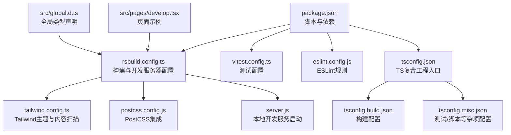
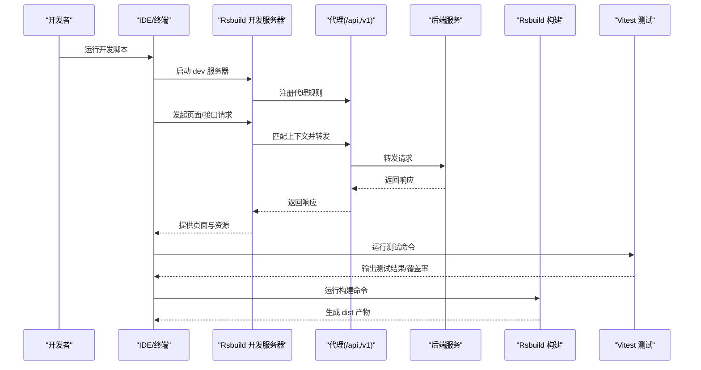
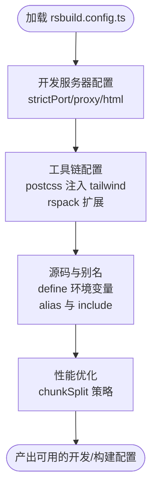
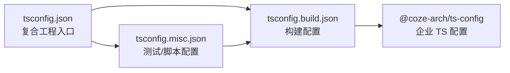
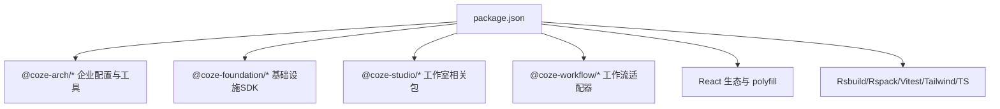

# 开发指南

<cite>
**本文引用的文件**
- [package.json](file://package.json)
- [rsbuild.config.ts](file://rsbuild.config.ts)
- [eslint.config.js](file://eslint.config.js)
- [tsconfig.json](file://tsconfig.json)
- [tsconfig.build.json](file://tsconfig.build.json)
- [tsconfig.misc.json](file://tsconfig.misc.json)
- [tailwind.config.ts](file://tailwind.config.ts)
- [postcss.config.js](file://postcss.config.js)
- [vitest.config.ts](file://vitest.config.ts)
- [README.md](file://README.md)
- [server.js](file://server.js)
- [src/global.d.ts](file://src/global.d.ts)
- [src/pages/develop.tsx](file://src/pages/develop.tsx)
</cite>

## 目录
1. [简介](#简介)
2. [项目结构](#项目结构)
3. [核心组件](#核心组件)
4. [架构总览](#架构总览)
5. [详细组件分析](#详细组件分析)
6. [依赖分析](#依赖分析)
7. [性能考虑](#性能考虑)
8. [故障排查指南](#故障排查指南)
9. [结论](#结论)
10. [附录](#附录)

## 简介
本开发指南面向新加入的开发者，帮助快速搭建 Coze Studio 前端开发环境，掌握 IDE 配置、调试与开发工具链使用；理解代码规范与最佳实践（ESLint、TypeScript、组件开发标准）；熟悉构建工具 Rsbuild 的配置与优化策略（开发服务器、代理、生产构建与性能调优）；掌握测试策略与工具（Vitest）；明确代码审查与提交规范；并提供常见问题排查与扩展新功能模块的方法。

## 项目结构
该应用采用多包工作区结构，核心源码位于 src 目录，构建与配置集中在根级配置文件中，测试位于 __tests__ 目录，样式与主题通过 TailwindCSS 与 PostCSS 集成，开发服务器脚本位于 server.js。

图表来源
- [package.json:11-18](file://package.json#L11-L18)
- [rsbuild.config.ts:19-136](file://rsbuild.config.ts#L19-L136)
- [vitest.config.ts:17-23](file://vitest.config.ts#L17-L23)
- [eslint.config.js:1-7](file://eslint.config.js#L1-L7)
- [tsconfig.json:1-16](file://tsconfig.json#L1-L16)
- [tsconfig.build.json:1-134](file://tsconfig.build.json#L1-L134)
- [tsconfig.misc.json:1-28](file://tsconfig.misc.json#L1-L28)
- [tailwind.config.ts:17-55](file://tailwind.config.ts#L17-L55)
- [postcss.config.js:1-2](file://postcss.config.js#L1-L2)
- [server.js:1-4](file://server.js#L1-L4)
- [src/global.d.ts:17-20](file://src/global.d.ts#L17-L20)
- [src/pages/develop.tsx:17-26](file://src/pages/develop.tsx#L17-L26)

章节来源
- [README.md:1-7](file://README.md#L1-L7)
- [package.json:11-18](file://package.json#L11-L18)

## 核心组件
- 构建与开发服务器：基于 Rsbuild，支持代理、HTML 模板、PostCSS 插件注入、路径回退与忽略警告。
- 测试框架：Vitest，预设 web，支持覆盖率统计。
- 代码质量：ESLint 规则由企业共享配置提供，统一风格。
- 类型系统：TypeScript 复合工程，区分构建与杂项配置，启用装饰器语法。
- 样式体系：TailwindCSS 主题与设计令牌集成，PostCSS 统一配置。
- 全局类型：定义运行时常量与 Rsbuild 类型声明。

章节来源
- [rsbuild.config.ts:26-136](file://rsbuild.config.ts#L26-L136)
- [vitest.config.ts:17-23](file://vitest.config.ts#L17-L23)
- [eslint.config.js:1-7](file://eslint.config.js#L1-L7)
- [tsconfig.json:1-16](file://tsconfig.json#L1-L16)
- [tsconfig.build.json:1-134](file://tsconfig.build.json#L1-L134)
- [tsconfig.misc.json:1-28](file://tsconfig.misc.json#L1-L28)
- [tailwind.config.ts:17-55](file://tailwind.config.ts#L17-L55)
- [postcss.config.js:1-2](file://postcss.config.js#L1-L2)
- [src/global.d.ts:17-20](file://src/global.d.ts#L17-L20)

## 架构总览
下图展示从开发到生产的整体流程：IDE 启动 Rsbuild 开发服务器，请求经代理转发至后端；构建阶段合并样式与资源，输出产物；测试在 Vitest 中执行；最终通过 preview 或部署工具发布。

图表来源
- [package.json:11-18](file://package.json#L11-L18)
- [rsbuild.config.ts:27-43](file://rsbuild.config.ts#L27-L43)
- [vitest.config.ts:17-23](file://vitest.config.ts#L17-L23)

## 详细组件分析

### Rsbuild 构建与开发服务器配置
- 开发服务器
  - 严格端口与代理：配置了对 /api 与 /v1 的代理，目标地址可按需调整。
  - HTML 模板：标题、favicon、模板与跨域属性。
- 工具链
  - PostCSS：注入 TailwindCSS 插件，读取 tailwind.config.ts。
  - Rspack 扩展：为特定文件类型启用 import-watch-loader；回退 path 模块；轮询监听；忽略部分警告。
- 源码与别名
  - define 定义多组运行时环境变量，source.include 包含 packages 与 flags-devtool。
  - alias 将 foundation-sdk 与 react-router-dom 解析到确定位置，提升稳定性。
- 性能
  - 分包策略：按体积拆分，设置最小/最大块大小以平衡加载与缓存。

图表来源
- [rsbuild.config.ts:26-136](file://rsbuild.config.ts#L26-L136)

章节来源
- [rsbuild.config.ts:26-136](file://rsbuild.config.ts#L26-L136)

### TypeScript 配置与复合工程
- 复合工程入口：tsconfig.json 引用构建与杂项配置，确保类型检查与编译分离。
- 构建配置：继承企业 TS 配置，指定 JSX、模块、目标与解析器，包含 src 并排除 node_modules/dist。
- 杂项配置：包含 __tests__、配置文件与脚本目录，启用 Vitest 与 Node 类型，建立与构建配置的引用关系。

图表来源
- [tsconfig.json:1-16](file://tsconfig.json#L1-L16)
- [tsconfig.build.json:1-134](file://tsconfig.build.json#L1-L134)
- [tsconfig.misc.json:1-28](file://tsconfig.misc.json#L1-L28)

章节来源
- [tsconfig.json:1-16](file://tsconfig.json#L1-L16)
- [tsconfig.build.json:1-134](file://tsconfig.build.json#L1-L134)
- [tsconfig.misc.json:1-28](file://tsconfig.misc.json#L1-L28)

### ESLint 与代码规范
- 使用企业共享 ESLint 配置，预设为 web，限定 packageRoot 为当前目录，确保团队风格一致。
- 建议在 IDE 中启用 ESLint 实时检查与自动修复，结合编辑器格式化工具统一风格。

章节来源
- [eslint.config.js:1-7](file://eslint.config.js#L1-L7)

### TailwindCSS 与 PostCSS
- Tailwind 配置：基于设计令牌生成主题，启用响应式断点与 safelist，禁用默认 Preflight 以避免覆盖既有样式。
- PostCSS：统一使用企业配置，Rsbuild 在构建时注入 Tailwind 插件。

章节来源
- [tailwind.config.ts:17-55](file://tailwind.config.ts#L17-L55)
- [postcss.config.js:1-2](file://postcss.config.js#L1-L2)
- [rsbuild.config.ts:50-54](file://rsbuild.config.ts#L50-L54)

### 测试策略与 Vitest
- 预设：web，包含 DOM 环境与类型。
- 命令：提供运行测试与覆盖率统计的脚本，支持 passWithNoTests。
- 建议：为每个页面与组件编写单元测试，覆盖交互逻辑与边界条件；利用覆盖率报告持续改进。

章节来源
- [vitest.config.ts:17-23](file://vitest.config.ts#L17-L23)
- [package.json:16-17](file://package.json#L16-L17)

### 页面与路由示例
- develop 页面：通过路由参数 space_id 动态渲染开发容器组件，体现参数化页面模式。

章节来源
- [src/pages/develop.tsx:17-26](file://src/pages/develop.tsx#L17-L26)

## 依赖分析
- 运行时依赖：React、React Router、Zustand、各类企业与工作室相关 SDK/适配器，以及浏览器兼容 polyfill。
- 开发时依赖：Rsbuild 核心、Rspack、Vitest、TailwindCSS、TypeScript、ESLint 与 PostCSS 企业配置等。
- 依赖关系：通过 workspace:* 指向 monorepo 内部包，形成松耦合高内聚的模块化结构。

图表来源
- [package.json:19-81](file://package.json#L19-L81)

章节来源
- [package.json:19-81](file://package.json#L19-L81)

## 性能考虑
- 分包策略：按体积拆分，合理设置最小/最大块大小，兼顾首屏与缓存命中。
- 资源回退：为 path 模块提供浏览器回退，避免打包错误。
- 忽略警告：针对表达式依赖的警告进行忽略，减少噪音。
- 监听优化：开启轮询监听，改善某些环境下的热更新体验。
- 代理与网络：开发时通过代理直连后端，减少跨域与中间层开销。

章节来源
- [rsbuild.config.ts:68-88](file://rsbuild.config.ts#L68-L88)
- [rsbuild.config.ts:126-132](file://rsbuild.config.ts#L126-L132)

## 故障排查指南
- 热更新不生效或频繁报错
  - 检查 watchOptions.poll 是否开启，确认 IDE 保存行为与文件监听是否正常。
  - 参考路径回退与忽略警告配置，定位具体模块问题。
- 代理请求失败
  - 核对代理上下文与目标地址，确认后端服务可达且未变更端口。
- 样式未生效
  - 确认 Tailwind 内容扫描范围与 safelist 配置，检查 PostCSS 插件注入是否成功。
- TypeScript 报错
  - 检查复合工程引用关系与 include/exclude 设置，确保引用顺序正确。
- 测试异常
  - 使用 passWithNoTests 选项时注意覆盖率统计，必要时清理缓存与构建目录后重试。

章节来源
- [rsbuild.config.ts:68-88](file://rsbuild.config.ts#L68-L88)
- [rsbuild.config.ts:27-43](file://rsbuild.config.ts#L27-L43)
- [tailwind.config.ts:25-54](file://tailwind.config.ts#L25-L54)
- [tsconfig.json:7-14](file://tsconfig.json#L7-L14)
- [package.json:16-17](file://package.json#L16-L17)

## 结论
本指南提供了从环境搭建到日常开发、测试与性能优化的完整路径。建议新开发者优先完成 IDE 与 Rsbuild 开发服务器的配置，再逐步掌握 ESLint、TypeScript、Tailwind/CSS 与 Vitest 的使用规范，最后结合性能与故障排查清单提升开发效率与质量。

## 附录

### 开发环境与 IDE 设置
- Node 版本：使用与项目匹配的 LTS 版本，确保依赖安装稳定。
- IDE 推荐：VSCode，启用 ESLint、Prettier、TypeScript 语言服务与 Tailwind 插件。
- Rsbuild 开发服务器：通过脚本启动，访问本地端口查看页面与代理效果。
- 全局类型：确保 global.d.ts 中的类型声明被 IDE 正确识别。

章节来源
- [package.json:11-18](file://package.json#L11-L18)
- [src/global.d.ts:17-20](file://src/global.d.ts#L17-L20)

### 调试配置与开发工具链
- Rsbuild：代理、HTML 模板、PostCSS、Rspack 扩展、环境变量定义。
- Vitest：web 预设、DOM 环境、覆盖率统计。
- ESLint：企业共享规则，统一风格。
- TailwindCSS：设计令牌、响应式断点、safelist 与插件。

章节来源
- [rsbuild.config.ts:26-136](file://rsbuild.config.ts#L26-L136)
- [vitest.config.ts:17-23](file://vitest.config.ts#L17-L23)
- [eslint.config.js:1-7](file://eslint.config.js#L1-L7)
- [tailwind.config.ts:17-55](file://tailwind.config.ts#L17-L55)

### 代码规范与最佳实践
- ESLint：遵循企业共享规则，保持团队一致性。
- TypeScript：使用复合工程结构，明确构建与杂项配置职责。
- 组件开发：以页面路由参数驱动的模式组织页面组件，确保可测试性与可维护性。

章节来源
- [eslint.config.js:1-7](file://eslint.config.js#L1-L7)
- [tsconfig.json:1-16](file://tsconfig.json#L1-L16)
- [src/pages/develop.tsx:17-26](file://src/pages/develop.tsx#L17-L26)

### 构建工具 Rsbuild 的配置与优化
- 开发服务器：严格端口、代理、HTML 模板与跨域设置。
- 工具链：PostCSS 注入 Tailwind，Rspack 扩展与回退。
- 源码与别名：define 环境变量、include 包含与 alias 解析。
- 性能：分包策略与体积阈值控制。

章节来源
- [rsbuild.config.ts:26-136](file://rsbuild.config.ts#L26-L136)

### 测试策略与工具使用
- 命令：test 与 test:cov，支持 passWithNoTests。
- 预设：web，包含 DOM 与类型。
- 建议：为关键页面与组件编写单元测试，关注交互与边界条件。

章节来源
- [package.json:16-17](file://package.json#L16-L17)
- [vitest.config.ts:17-23](file://vitest.config.ts#L17-L23)

### 代码审查与提交规范
- 代码审查：遵循企业共享 ESLint 规则，确保风格一致；提交前运行 lint 与测试。
- 提交规范：建议使用约定式提交，配合自动化检查与 CI 流水线。

章节来源
- [eslint.config.js:1-7](file://eslint.config.js#L1-L7)
- [package.json:14-17](file://package.json#L14-L17)

### 常见开发问题排查与解决方案
- 热更新与监听：开启轮询监听，检查 IDE 文件保存行为。
- 代理与网络：核对代理上下文与目标地址，确保后端可达。
- 样式与主题：确认 Tailwind 内容扫描与 safelist，检查 PostCSS 插件注入。
- TypeScript：检查复合工程引用与 include/exclude，确保引用顺序正确。
- 测试：清理缓存与构建目录，重新运行测试与覆盖率统计。

章节来源
- [rsbuild.config.ts:68-88](file://rsbuild.config.ts#L68-L88)
- [rsbuild.config.ts:27-43](file://rsbuild.config.ts#L27-L43)
- [tailwind.config.ts:25-54](file://tailwind.config.ts#L25-L54)
- [tsconfig.json:7-14](file://tsconfig.json#L7-L14)
- [package.json:16-17](file://package.json#L16-L17)

### 添加新功能模块与扩展现有功能
- 新增页面：在 src/pages 下创建页面组件，参考 develop 页面的路由参数模式。
- 新增工具链：在 rsbuild.config.ts 中扩展 tools 或 source 配置，确保与现有规则兼容。
- 新增样式：在 tailwind.config.ts 中完善内容扫描与主题扩展，必要时增加 safelist。
- 新增测试：在 __tests__ 中编写对应单元测试，运行 test 或 test:cov 验证。

章节来源
- [src/pages/develop.tsx:17-26](file://src/pages/develop.tsx#L17-L26)
- [rsbuild.config.ts:50-54](file://rsbuild.config.ts#L50-L54)
- [tailwind.config.ts:25-54](file://tailwind.config.ts#L25-L54)
- [package.json:16-17](file://package.json#L16-L17)

### 新加入开发者完整开发流程
- 环境准备：安装 Node、包管理器与 IDE 插件。
- 依赖安装：执行安装命令，确保 workspace:* 依赖正确链接。
- 启动开发：运行 dev 脚本，打开浏览器访问开发服务器。
- 编码规范：遵循 ESLint 与 TypeScript 复合工程结构。
- 构建与预览：运行 build 与 preview，验证产物。
- 测试：运行 test 与 test:cov，确保质量门禁。
- 提交与审查：遵循约定式提交，等待 CI 与代码审查反馈。

章节来源
- [package.json:11-18](file://package.json#L11-L18)
- [README.md:1-7](file://README.md#L1-L7)