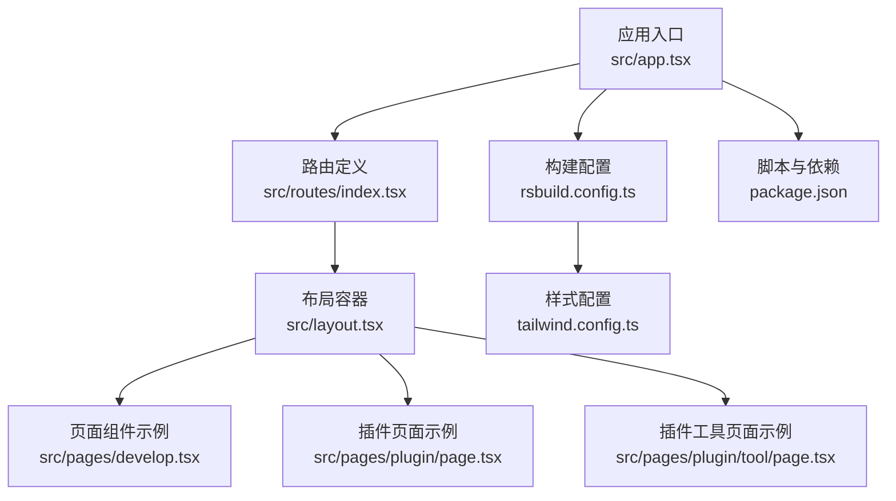
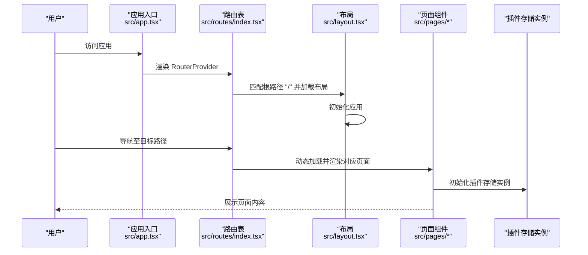
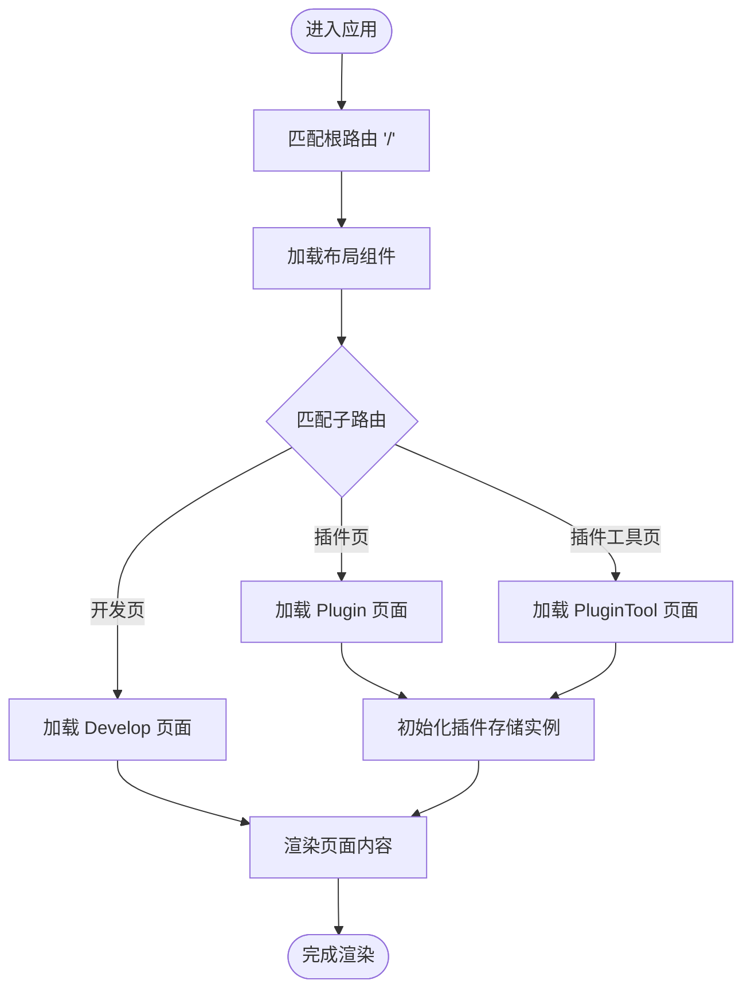
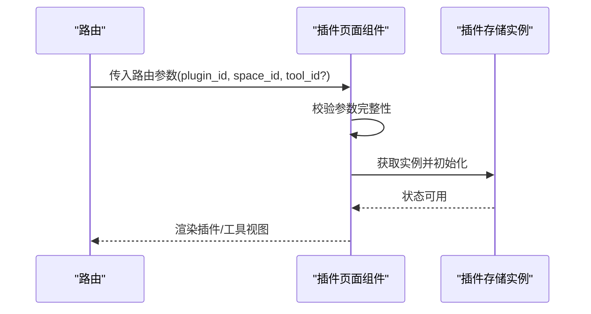
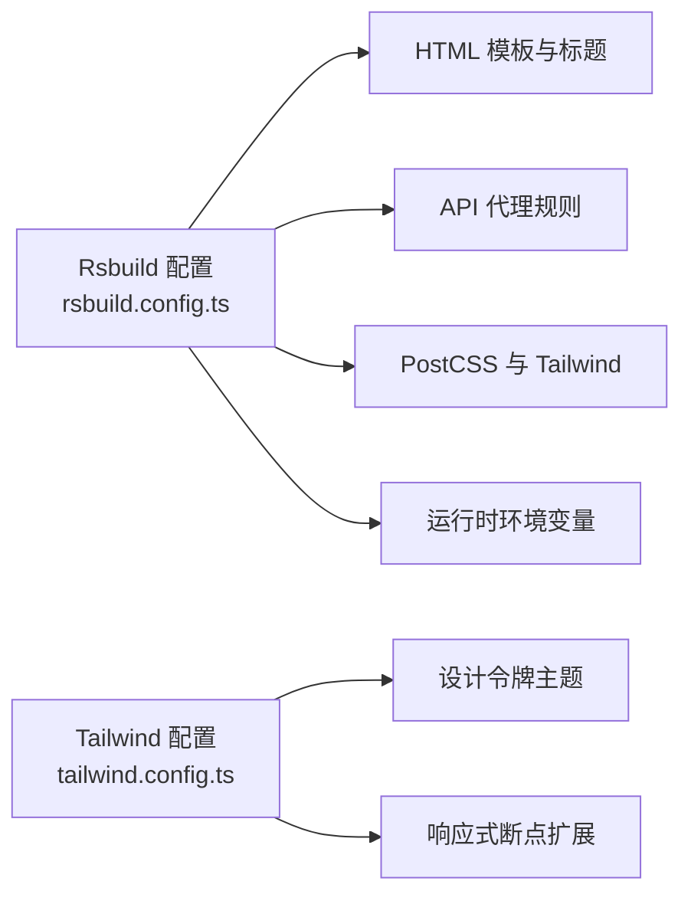
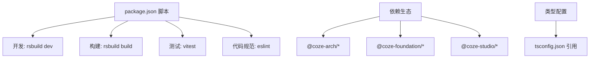

# 开发流程

<cite>
**本文引用的文件**
- [README.md](file://README.md)
- [package.json](file://package.json)
- [rsbuild.config.ts](file://rsbuild.config.ts)
- [eslint.config.js](file://eslint.config.js)
- [vitest.config.ts](file://vitest.config.ts)
- [tailwind.config.ts](file://tailwind.config.ts)
- [tsconfig.json](file://tsconfig.json)
- [src/app.tsx](file://src/app.tsx)
- [src/layout.tsx](file://src/layout.tsx)
- [src/routes/index.tsx](file://src/routes/index.tsx)
- [src/pages/plugin/tool/page.tsx](file://src/pages/plugin/tool/page.tsx)
- [src/pages/plugin/page.tsx](file://src/pages/plugin/page.tsx)
- [src/pages/develop.tsx](file://src/pages/develop.tsx)
- [src/pages/library.tsx](file://src/pages/library.tsx)
</cite>

## 目录
1. [简介](#简介)
2. [项目结构](#项目结构)
3. [核心组件](#核心组件)
4. [架构总览](#架构总览)
5. [详细组件分析](#详细组件分析)
6. [依赖分析](#依赖分析)
7. [性能考虑](#性能考虑)
8. [故障排查指南](#故障排查指南)
9. [结论](#结论)
10. [附录](#附录)

## 简介
本文件面向 Coze Studio 前端团队，系统化梳理从需求分析到代码实现、测试与发布的标准流程；说明如何新增功能模块（路由配置、页面组件开发、状态管理集成）；给出代码评审与合并策略；提供版本发布与部署准备要点；并总结团队协作与沟通规范及新成员入职指引。

## 项目结构
该应用基于 Rsbuild 构建工具，采用 React + React Router 的单页应用架构，通过动态导入实现按需加载与性能优化。项目使用统一的工程化配置与设计体系，结合工作区多包管理，形成可复用的组件与适配层。

图表来源
- [src/app.tsx:1-37](file://src/app.tsx#L1-L37)
- [src/routes/index.tsx:1-298](file://src/routes/index.tsx#L1-L298)
- [src/layout.tsx:1-24](file://src/layout.tsx#L1-L24)
- [src/pages/develop.tsx:1-27](file://src/pages/develop.tsx#L1-L27)
- [src/pages/plugin/page.tsx:1-36](file://src/pages/plugin/page.tsx#L1-L36)
- [src/pages/plugin/tool/page.tsx:1-35](file://src/pages/plugin/tool/page.tsx#L1-L35)
- [rsbuild.config.ts:1-136](file://rsbuild.config.ts#L1-L136)
- [tailwind.config.ts:1-55](file://tailwind.config.ts#L1-L55)
- [package.json:1-84](file://package.json#L1-L84)

章节来源
- [README.md:1-7](file://README.md#L1-L7)
- [package.json:1-84](file://package.json#L1-L84)
- [rsbuild.config.ts:1-136](file://rsbuild.config.ts#L1-L136)
- [tailwind.config.ts:1-55](file://tailwind.config.ts#L1-L55)
- [src/app.tsx:1-37](file://src/app.tsx#L1-L37)
- [src/routes/index.tsx:1-298](file://src/routes/index.tsx#L1-L298)
- [src/layout.tsx:1-24](file://src/layout.tsx#L1-L24)

## 核心组件
- 应用入口与路由
  - 应用通过 RouterProvider 注入路由实例，全局包裹 Suspense 提供加载态占位。
  - 路由集中定义在路由表中，支持嵌套路由、菜单与权限控制、侧边栏开关等元数据。
- 布局与初始化
  - 布局组件负责应用初始化与全局布局渲染，承载各页面子路由。
- 页面组件
  - 页面组件通常从适配层或工作区包引入具体能力，并根据路由参数进行渲染。
  - 插件相关页面通过插件存储实例初始化后渲染具体工具或插件视图。
- 构建与样式
  - Rsbuild 配置统一管理代理、HTML 模板、PostCSS 与 Rspack 扩展规则。
  - Tailwind 通过设计令牌与主题扩展，确保一致的视觉与响应式体验。

章节来源
- [src/app.tsx:1-37](file://src/app.tsx#L1-L37)
- [src/layout.tsx:1-24](file://src/layout.tsx#L1-L24)
- [src/routes/index.tsx:1-298](file://src/routes/index.tsx#L1-L298)
- [src/pages/plugin/tool/page.tsx:1-35](file://src/pages/plugin/tool/page.tsx#L1-L35)
- [src/pages/plugin/page.tsx:1-36](file://src/pages/plugin/page.tsx#L1-L36)
- [src/pages/develop.tsx:1-27](file://src/pages/develop.tsx#L1-L27)
- [src/pages/library.tsx:1-27](file://src/pages/library.tsx#L1-L27)
- [rsbuild.config.ts:1-136](file://rsbuild.config.ts#L1-L136)
- [tailwind.config.ts:1-55](file://tailwind.config.ts#L1-L55)

## 架构总览
下图展示应用启动、路由解析与页面渲染的关键交互：

图表来源
- [src/app.tsx:1-37](file://src/app.tsx#L1-L37)
- [src/routes/index.tsx:1-298](file://src/routes/index.tsx#L1-L298)
- [src/layout.tsx:1-24](file://src/layout.tsx#L1-L24)
- [src/pages/plugin/tool/page.tsx:1-35](file://src/pages/plugin/tool/page.tsx#L1-L35)
- [src/pages/plugin/page.tsx:1-36](file://src/pages/plugin/page.tsx#L1-L36)

## 详细组件分析

### 路由系统与页面渲染
- 路由组织
  - 根路径 "/" 加载全局布局，内部嵌套空间与探索等模块路由。
  - 支持登录页、工作流、搜索、资源库、知识库、数据库、插件商店等多类页面。
  - 子菜单与权限控制通过 loader 返回的元数据统一声明。
- 页面渲染
  - 页面组件通过适配层或工作区包引入具体能力，按需渲染。
  - 插件页面在挂载时初始化插件存储实例，确保工具与插件数据可用。

图表来源
- [src/routes/index.tsx:1-298](file://src/routes/index.tsx#L1-L298)
- [src/pages/develop.tsx:1-27](file://src/pages/develop.tsx#L1-L27)
- [src/pages/plugin/page.tsx:1-36](file://src/pages/plugin/page.tsx#L1-L36)
- [src/pages/plugin/tool/page.tsx:1-35](file://src/pages/plugin/tool/page.tsx#L1-L35)

章节来源
- [src/routes/index.tsx:1-298](file://src/routes/index.tsx#L1-L298)
- [src/pages/develop.tsx:1-27](file://src/pages/develop.tsx#L1-L27)
- [src/pages/plugin/page.tsx:1-36](file://src/pages/plugin/page.tsx#L1-L36)
- [src/pages/plugin/tool/page.tsx:1-35](file://src/pages/plugin/tool/page.tsx#L1-L35)

### 插件页面与状态管理集成
- 插件页面
  - 通过路由参数获取插件与空间标识，校验参数完整性后初始化插件存储实例。
  - 使用插件基础能力组件渲染具体视图。
- 状态管理
  - 插件存储实例通过全局状态管理库提供，页面在挂载时调用初始化逻辑，保证后续读写操作可用。

图表来源
- [src/pages/plugin/tool/page.tsx:1-35](file://src/pages/plugin/tool/page.tsx#L1-L35)
- [src/pages/plugin/page.tsx:1-36](file://src/pages/plugin/page.tsx#L1-L36)

章节来源
- [src/pages/plugin/tool/page.tsx:1-35](file://src/pages/plugin/tool/page.tsx#L1-L35)
- [src/pages/plugin/page.tsx:1-36](file://src/pages/plugin/page.tsx#L1-L36)

### 构建与样式配置
- 构建配置
  - 统一代理规则、HTML 模板与标题、favicon、跨域设置。
  - PostCSS 注入 Tailwind 插件，Rspack 扩展规则用于热更新与别名处理。
  - 定义运行时环境变量，影响 SDK 与平台特性。
- 样式配置
  - 基于设计令牌生成 Tailwind 主题，扩展响应式断点与安全列表，避免未使用类被移除。

图表来源
- [rsbuild.config.ts:1-136](file://rsbuild.config.ts#L1-L136)
- [tailwind.config.ts:1-55](file://tailwind.config.ts#L1-L55)

章节来源
- [rsbuild.config.ts:1-136](file://rsbuild.config.ts#L1-L136)
- [tailwind.config.ts:1-55](file://tailwind.config.ts#L1-L55)

## 依赖分析
- 工程脚本
  - 提供开发、构建、预览、测试与覆盖率等常用命令，便于本地调试与 CI 集成。
- 依赖生态
  - 使用统一的工程化与设计体系包，结合工作区多包管理，提升复用性与一致性。
- 类型配置
  - 多 tsconfig 引用组合，确保类型检查与构建引用关系清晰。

图表来源
- [package.json:1-84](file://package.json#L1-L84)
- [tsconfig.json:1-16](file://tsconfig.json#L1-L16)

章节来源
- [package.json:1-84](file://package.json#L1-L84)
- [tsconfig.json:1-16](file://tsconfig.json#L1-L16)

## 性能考虑
- 代码分割与懒加载
  - 路由级动态导入减少首屏体积，配合分块策略提升加载效率。
- 构建优化
  - 分块大小阈值与 Rspack 配置降低包体，改善冷启动与热更新体验。
- 样式与资源
  - Tailwind 内容扫描与安全列表避免无用样式，提升打包效率。

章节来源
- [rsbuild.config.ts:126-132](file://rsbuild.config.ts#L126-L132)
- [tailwind.config.ts:25-36](file://tailwind.config.ts#L25-L36)

## 故障排查指南
- 路由与页面
  - 若页面无法渲染，请确认路由是否正确匹配且页面组件已导出默认组件。
  - 插件页面缺少必要参数会抛出错误提示，检查路由参数传递。
- 构建与代理
  - API 代理未生效时，检查代理目标地址与上下文配置。
  - HTML 模板与 favicon 未更新时，确认构建配置与资源路径。
- 样式问题
  - Tailwind 类不生效时，检查内容扫描范围与安全列表配置。
- 测试与规范
  - 测试失败或覆盖率异常时，检查 Vitest 预设与覆盖率配置。
  - ESLint 报错时，使用工程化 ESLint 预设统一修复。

章节来源
- [src/pages/plugin/tool/page.tsx:23-27](file://src/pages/plugin/tool/page.tsx#L23-L27)
- [rsbuild.config.ts:25-43](file://rsbuild.config.ts#L25-L43)
- [tailwind.config.ts:25-36](file://tailwind.config.ts#L25-L36)
- [vitest.config.ts:17-22](file://vitest.config.ts#L17-L22)
- [eslint.config.js:1-7](file://eslint.config.js#L1-L7)

## 结论
本流程文档从架构与组件入手，覆盖了从需求到发布的全流程要点：路由与页面开发、状态管理集成、构建与样式配置、测试与规范、以及团队协作与发布准备。建议在实际开发中严格遵循这些规范，以保障交付质量与团队协作效率。

## 附录

### 新功能模块开发流程（从需求到发布）
- 需求与设计
  - 明确功能边界与交互原型，评估对路由、页面与状态的影响。
- 路由配置
  - 在路由表中新增或复用现有布局，声明路径、子菜单与权限元数据。
- 页面组件开发
  - 创建页面组件，按需引入适配层或工作区能力，处理路由参数与初始化逻辑。
  - 对插件类页面，确保在挂载时初始化插件存储实例。
- 状态管理集成
  - 如需全局状态，使用统一的状态管理方案，确保初始化与副作用可控。
- 样式与构建
  - 使用 Tailwind 设计令牌与响应式断点，避免未使用类被移除。
  - 如需新增构建规则，统一在 Rsbuild 配置中扩展。
- 测试与规范
  - 编写单元测试与必要的集成测试，确保覆盖率达标。
  - 运行 ESLint 与格式化检查，保持代码风格一致。
- 本地验证
  - 启动开发服务器，验证路由跳转、页面渲染与交互。
- 提交与评审
  - 提交 Pull Request，遵循评审规范与变更说明。
- 发布准备
  - 更新版本号与发布说明，执行构建与预览验证。
  - 准备部署清单与回滚预案。

### 代码审查与合并策略
- PR 规范
  - 标题简洁明确，描述变更动机与影响范围。
  - 变更最小化，拆分复杂改动为多个小 PR。
  - 附带测试用例与截图/录屏说明。
- 评审要点
  - 路由与页面是否符合既有约定；状态管理是否合理；样式是否统一。
  - 是否满足性能与可维护性要求。
- 合并策略
  - 通过评审后方可合并；优先使用 Squash 合并以保持提交历史整洁。

### 版本发布与部署准备
- 版本管理
  - 使用语义化版本，明确主次补丁变更类型。
- 构建与预览
  - 执行构建命令，核对产物与代理配置。
  - 进行端到端预览，验证关键流程。
- 部署清单
  - 明确静态资源、环境变量与代理配置。
  - 制定回滚步骤与监控指标。

### 团队协作与沟通规范
- 沟通渠道
  - 使用即时通讯与任务看板同步进展与阻塞项。
- 文档与知识沉淀
  - 将流程、规范与常见问题整理为知识库条目。
- 新成员入职指引
  - 熟悉项目结构与开发工具链，完成本地环境搭建与首次 PR。
  - 参与代码评审与结对编程，快速融入团队节奏。