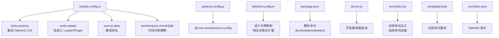
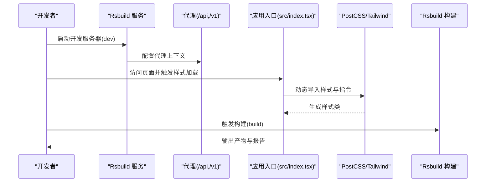
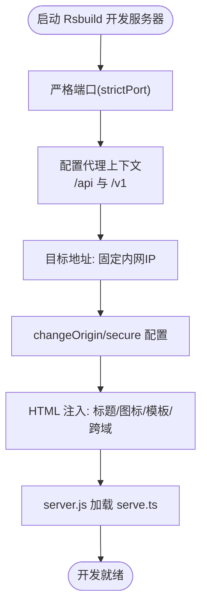
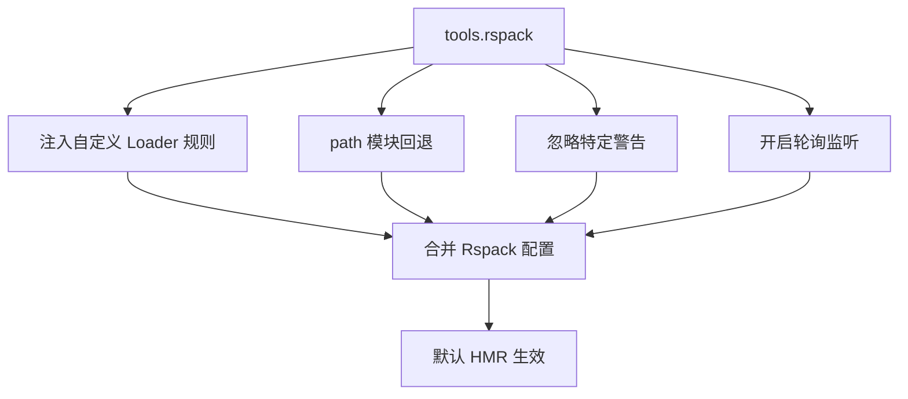
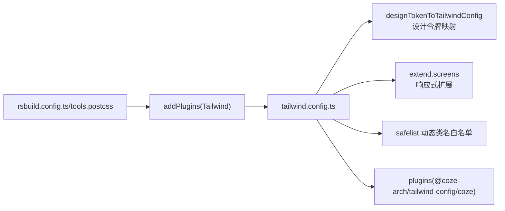
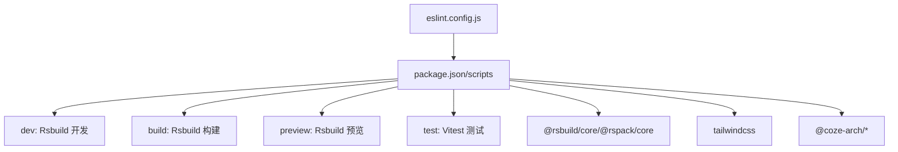

# 构建工具

<cite>
**本文引用的文件**
- [rsbuild.config.ts](file://rsbuild.config.ts)
- [postcss.config.js](file://postcss.config.js)
- [tailwind.config.ts](file://tailwind.config.ts)
- [package.json](file://package.json)
- [server.js](file://server.js)
- [src/index.tsx](file://src/index.tsx)
- [src/global.less](file://src/global.less)
- [src/index.less](file://src/index.less)
- [eslint.config.js](file://eslint.config.js)
</cite>

## 目录
1. [简介](#简介)
2. [项目结构](#项目结构)
3. [核心组件](#核心组件)
4. [架构总览](#架构总览)
5. [详细组件分析](#详细组件分析)
6. [依赖分析](#依赖分析)
7. [性能考量](#性能考量)
8. [故障排查指南](#故障排查指南)
9. [结论](#结论)
10. [附录](#附录)

## 简介
本文件面向 Coze Studio 前端应用的构建与开发流程，聚焦 Rsbuild 配置与优化策略，涵盖开发服务器、热重载、代理、构建流程（代码分割、懒加载、打包优化）、PostCSS 与 Tailwind CSS 集成（设计令牌与主题定制）、生产构建（压缩、缓存、性能监控）、产物分析与性能调优，以及常见问题排查。内容基于仓库中的实际配置文件整理而成，帮助开发者快速上手并高效迭代。

## 项目结构
该应用采用 Rsbuild 作为核心构建工具，配合 PostCSS、Tailwind CSS 实现样式体系，并通过自定义 Rspack 插件与 Loader 完成特定编译需求。关键文件与职责如下：
- 构建配置：rsbuild.config.ts
- 样式配置：postcss.config.js、tailwind.config.ts
- 包管理与脚本：package.json
- 开发服务器入口：server.js
- 应用入口与全局样式：src/index.tsx、src/global.less、src/index.less
- Lint 配置：eslint.config.js

**图表来源**
- [rsbuild.config.ts:1-136](file://rsbuild.config.ts#L1-L136)
- [postcss.config.js:1-2](file://postcss.config.js#L1-L2)
- [tailwind.config.ts:1-55](file://tailwind.config.ts#L1-L55)
- [package.json:1-84](file://package.json#L1-L84)
- [server.js:1-4](file://server.js#L1-L4)
- [src/index.tsx:1-55](file://src/index.tsx#L1-L55)
- [src/global.less:1-235](file://src/global.less#L1-L235)
- [src/index.less:1-9](file://src/index.less#L1-L9)

**章节来源**
- [rsbuild.config.ts:1-136](file://rsbuild.config.ts#L1-L136)
- [postcss.config.js:1-2](file://postcss.config.js#L1-L2)
- [tailwind.config.ts:1-55](file://tailwind.config.ts#L1-L55)
- [package.json:1-84](file://package.json#L1-L84)
- [server.js:1-4](file://server.js#L1-L4)
- [src/index.tsx:1-55](file://src/index.tsx#L1-L55)
- [src/global.less:1-235](file://src/global.less#L1-L235)
- [src/index.less:1-9](file://src/index.less#L1-L9)

## 核心组件
- Rsbuild 配置中心：集中管理开发服务器、代理、HTML 注入、Rspack 扩展、源码定义与别名、性能分包策略等。
- PostCSS/Tailwind 集成：通过 Rsbuild 的 tools.postcss 注入 Tailwind，并由 tailwind.config.ts 提供设计令牌与响应式扩展。
- Rspack 自定义：在 tools.rspack 中注入自定义 Loader 与规则，配置回退模块、忽略警告、轮询监听等。
- 应用入口与样式：src/index.tsx 负责初始化国际化、特性开关与动态样式；全局样式在 global.less 与 index.less 中统一注入。

**章节来源**
- [rsbuild.config.ts:26-136](file://rsbuild.config.ts#L26-L136)
- [tailwind.config.ts:25-54](file://tailwind.config.ts#L25-L54)
- [src/index.tsx:26-52](file://src/index.tsx#L26-L52)

## 架构总览
下图展示从开发到构建的关键流程与组件交互：

**图表来源**
- [rsbuild.config.ts:27-43](file://rsbuild.config.ts#L27-L43)
- [src/index.tsx:18-44](file://src/index.tsx#L18-L44)
- [postcss.config.js:1-2](file://postcss.config.js#L1-L2)
- [tailwind.config.ts:25-54](file://tailwind.config.ts#L25-L54)
- [package.json:11-17](file://package.json#L11-L17)

## 详细组件分析

### Rsbuild 开发服务器与代理
- 严格端口与代理：启用严格端口，配置 /api 与 /v1 两条代理路径，目标地址固定为内网 IP，支持跨域与 Origin 变更。
- HTML 注入：标题、favicon、模板与跨域属性均在 html 字段中集中配置。
- 开发入口：通过 server.js 使用 sucrase 注册后加载 serve.ts，便于 TS/ESM 开发调试。

**图表来源**
- [rsbuild.config.ts:27-49](file://rsbuild.config.ts#L27-L49)
- [server.js:1-4](file://server.js#L1-L4)

**章节来源**
- [rsbuild.config.ts:27-49](file://rsbuild.config.ts#L27-L49)
- [server.js:1-4](file://server.js#L1-L4)

### Rspack 扩展与热重载
- 自定义 Loader：对特定文件类型与排除范围注入自定义 Loader，提升开发体验与增量编译效率。
- 回退模块：为 path 模块提供浏览器回退，避免运行时缺失。
- 忽略警告：针对表达式依赖等常见告警进行忽略，减少噪音。
- 轮询监听：开启 poll，改善部分文件系统的监听稳定性。
- 热重载：结合 Rsbuild 默认 HMR 行为，实现快速刷新。

**图表来源**
- [rsbuild.config.ts:55-89](file://rsbuild.config.ts#L55-L89)

**章节来源**
- [rsbuild.config.ts:55-89](file://rsbuild.config.ts#L55-L89)

### PostCSS 与 Tailwind CSS 集成
- PostCSS 配置：通过 Rsbuild 的 tools.postcss 注入 Tailwind 插件，指向 tailwind.config.ts。
- Tailwind 配置：基于设计令牌转换函数将设计令牌映射为 Tailwind 主题；扩展响应式断点与 safelist；关闭预编译以避免覆盖既有样式；引入 Coze 插件增强组件生态。

**图表来源**
- [rsbuild.config.ts:50-54](file://rsbuild.config.ts#L50-L54)
- [tailwind.config.ts:25-54](file://tailwind.config.ts#L25-L54)

**章节来源**
- [rsbuild.config.ts:50-54](file://rsbuild.config.ts#L50-L54)
- [tailwind.config.ts:25-54](file://tailwind.config.ts#L25-L54)

### 源码定义、别名与装饰器
- define：注入多组运行时常量，如 React 版本标识、SDK 区域与范围、Taro 平台与环境等，便于条件编译与运行时行为控制。
- include：显式包含 packages 与特定包（如 marked、@dagrejs、@tanstack）以兼容较新语法。
- alias：将 foundation-sdk 与 react-router-dom 显式解析到具体包，确保打包一致性。
- decorators：启用 legacy 装饰器模式，兼容 inversify 等依赖。

**章节来源**
- [rsbuild.config.ts:91-125](file://rsbuild.config.ts#L91-L125)

### 性能与代码分割
- chunkSplit：按大小策略拆分代码块，设置最小与最大阈值，平衡请求数与单块体积，提升缓存命中与首屏加载速度。

**章节来源**
- [rsbuild.config.ts:126-132](file://rsbuild.config.ts#L126-L132)

### 应用入口与样式加载
- 国际化与特性开关：启动时初始化 i18n 与特性开关，支持本地存储语言偏好。
- 动态样式：按需导入 Markdown Box 样式，避免全量引入。
- 全局样式：global.less 提供基础布局与字体、滚动条等全局样式；index.less 引入 Tailwind 指令，确保样式体系生效。

**章节来源**
- [src/index.tsx:26-52](file://src/index.tsx#L26-L52)
- [src/global.less:1-235](file://src/global.less#L1-L235)
- [src/index.less:1-9](file://src/index.less#L1-L9)

## 依赖分析
- 脚本命令：dev、build、preview、test 等脚本通过 cross-env 控制环境变量，确保开发与构建一致性。
- 外部依赖：@rsbuild/core、@rspack/core、tailwindcss、@coze-arch/* 系列包构成构建与样式生态。
- Lint：基于 @coze-arch/eslint-config 定义 Web 环境规则。

**图表来源**
- [package.json:11-17](file://package.json#L11-L17)
- [eslint.config.js:1-7](file://eslint.config.js#L1-L7)

**章节来源**
- [package.json:11-17](file://package.json#L11-L17)
- [eslint.config.js:1-7](file://eslint.config.js#L1-L7)

## 性能考量
- 代码分割：通过 chunkSplit 策略控制分块大小，建议结合路由级懒加载进一步细化。
- 懒加载：推荐对大体积页面或组件采用动态 import，降低首屏 JS 体积。
- 缓存策略：利用稳定哈希与持久化缓存，结合 CDN 与 HTTP 缓存头提升二次加载速度。
- 压缩与 Tree Shaking：确保生产构建开启压缩与副作用标记，减少无效代码。
- 性能监控：结合 Rsdoctor 插件进行构建性能分析与依赖体积剖析。

[本节为通用指导，无需“章节来源”]

## 故障排查指南
- 代理请求失败
  - 症状：访问 /api 或 /v1 返回 404 或跨域错误。
  - 排查：确认代理目标地址是否可达，context 是否匹配；检查 changeOrigin/secure 设置。
  - 参考：[rsbuild.config.ts:29-42](file://rsbuild.config.ts#L29-L42)
- 样式未生效或类名冲突
  - 症状：Tailwind 类名无效或样式被覆盖。
  - 排查：确认 index.less 中已引入 Tailwind 指令；检查 tailwind.config.ts 的 content 与 safelist；避免 preflight 导致的全局覆盖。
  - 参考：[src/index.less:1-3](file://src/index.less#L1-L3)、[tailwind.config.ts:25-54](file://tailwind.config.ts#L25-L54)
- 路径解析错误
  - 症状：模块找不到或运行时报错。
  - 排查：核对 alias 配置与实际包路径；确认 fallback 是否正确。
  - 参考：[rsbuild.config.ts:113-118](file://rsbuild.config.ts#L113-L118)、[rsbuild.config.ts:76-80](file://rsbuild.config.ts#L76-L80)
- 开发服务器端口占用
  - 症状：启动失败提示端口被占用。
  - 排查：启用 strictPort 或更换端口；确认代理端口与后端一致。
  - 参考：[rsbuild.config.ts:28](file://rsbuild.config.ts#L28)
- 轮询监听导致 CPU 占用高
  - 症状：开发机 CPU 占用偏高。
  - 排查：确认 poll 已启用；在支持 inotify 的系统上可考虑禁用轮询。
  - 参考：[rsbuild.config.ts:81-83](file://rsbuild.config.ts#L81-L83)
- 装饰器或语法报错
  - 症状：使用 @injectable 等装饰器时报错。
  - 排查：确认 decorators.version 设置为 legacy；必要时 include 对应包。
  - 参考：[rsbuild.config.ts:122-124](file://rsbuild.config.ts#L122-L124)、[rsbuild.config.ts:107-112](file://rsbuild.config.ts#L107-L112)

## 结论
本项目以 Rsbuild 为核心，结合 Tailwind CSS 与 PostCSS，形成可维护、可扩展的前端工程化方案。通过代理、热重载、代码分割与懒加载等策略，兼顾开发体验与生产性能。建议在后续迭代中持续关注构建体积与首屏加载指标，配合性能监控工具进行持续优化。

## 附录
- 常用命令
  - 开发：执行 dev 脚本，启动带代理的开发服务器。
  - 构建：执行 build 脚本，输出生产产物。
  - 预览：执行 preview 脚本，本地预览构建结果。
  - 测试：执行 test 脚本，运行单元测试。
- Lint：遵循 eslint.config.js 的 Web 规则，保持代码风格一致。

**章节来源**
- [package.json:11-17](file://package.json#L11-L17)
- [eslint.config.js:1-7](file://eslint.config.js#L1-L7)