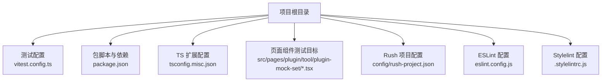
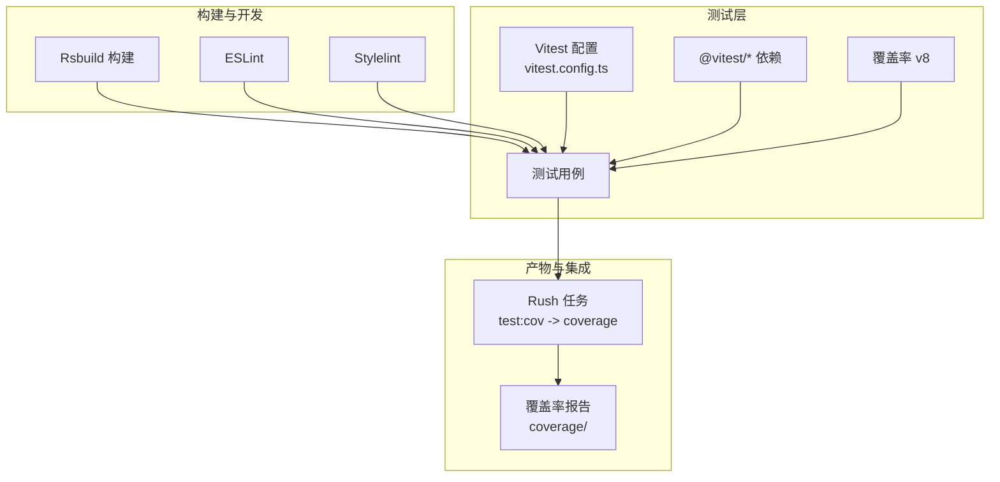
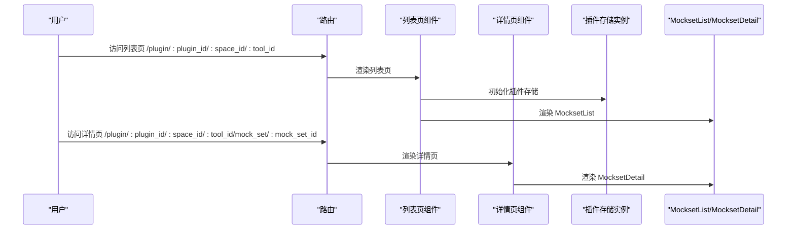
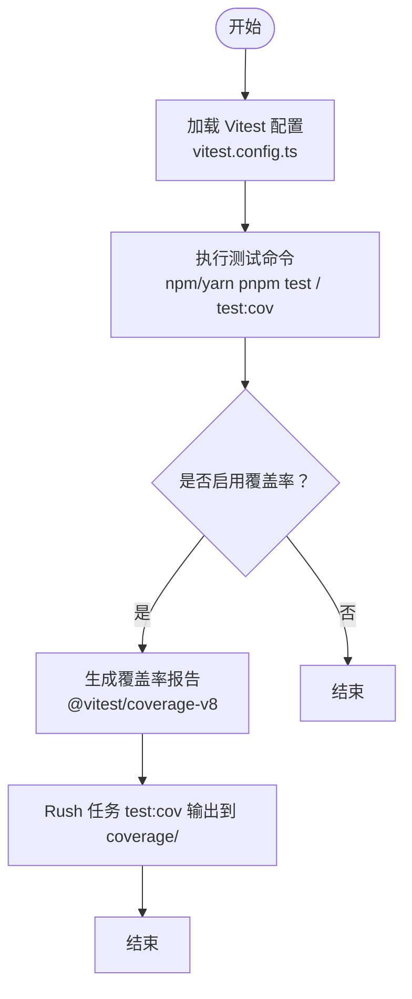
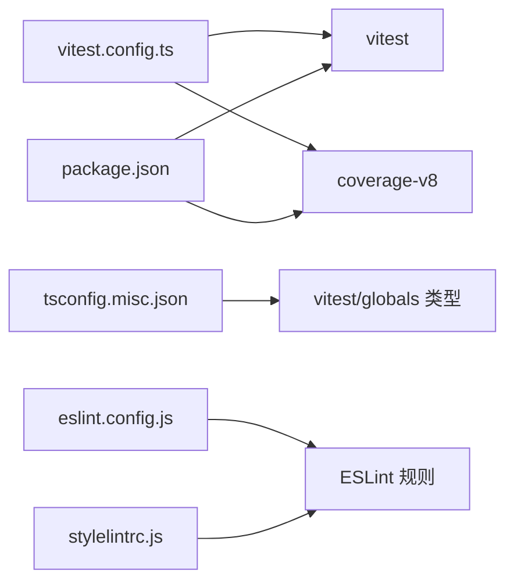

# 测试策略

<cite>
**本文引用的文件**
- [vitest.config.ts](file://vitest.config.ts)
- [package.json](file://package.json)
- [tsconfig.misc.json](file://tsconfig.misc.json)
- [page.tsx（插件工具页）](file://src/pages/plugin/tool/plugin-mock-set/page.tsx)
- [page.tsx（插件工具详情页）](file://src/pages/plugin/tool/plugin-mock-set/detail/page.tsx)
- [rush-project.json](file://config/rush-project.json)
- [eslint.config.js](file://eslint.config.js)
- [.stylelintrc.js](file://.stylelintrc.js)
</cite>

## 目录
1. [简介](#简介)
2. [项目结构](#项目结构)
3. [核心组件](#核心组件)
4. [架构总览](#架构总览)
5. [详细组件分析](#详细组件分析)
6. [依赖分析](#依赖分析)
7. [性能考虑](#性能考虑)
8. [故障排查指南](#故障排查指南)
9. [结论](#结论)
10. [附录](#附录)

## 简介
本文件面向 Coze Studio 前端应用的测试策略与实施指南，聚焦于 Vitest 配置与测试环境设置，覆盖单元测试、集成测试与端到端测试的配置要点；明确测试文件组织与命名规范、测试用例编写最佳实践；给出 API Mock 与组件 Mock 的策略与数据准备方法；制定测试覆盖率与质量标准；说明测试运行命令与 CI/CD 集成方式；并提供常见问题的调试方法与性能优化建议，最后为新功能开发提供测试指导。

## 项目结构
Coze Studio 前端采用 Rsbuild 构建，使用 Vitest 作为测试框架，并通过统一的 @coze-arch/vitest-config 提供 Web 环境预设。测试相关的关键文件与目录如下：
- 测试配置：vitest.config.ts
- 包脚本与依赖：package.json
- TypeScript 扩展配置（含 Vitest 类型注入）：tsconfig.misc.json
- 页面组件（可作为集成测试目标）：src/pages/plugin/tool/plugin-mock-set/*.tsx
- Rush 项目配置（定义测试产物输出目录）：config/rush-project.json
- 代码质量配置：eslint.config.js、.stylelintrc.js

图表来源
- [vitest.config.ts:1-23](file://vitest.config.ts#L1-L23)
- [package.json:11-18](file://package.json#L11-L18)
- [tsconfig.misc.json:12](file://tsconfig.misc.json#L12)
- [page.tsx（插件工具页）:1-37](file://src/pages/plugin/tool/plugin-mock-set/page.tsx#L1-L37)
- [page.tsx（插件工具详情页）:1-39](file://src/pages/plugin/tool/plugin-mock-set/detail/page.tsx#L1-L39)
- [rush-project.json:9-11](file://config/rush-project.json#L9-L11)
- [eslint.config.js:1-6](file://eslint.config.js#L1-L6)
- [.stylelintrc.js:1-5](file://.stylelintrc.js#L1-L5)

章节来源
- [vitest.config.ts:1-23](file://vitest.config.ts#L1-L23)
- [package.json:11-18](file://package.json#L11-L18)
- [tsconfig.misc.json:12](file://tsconfig.misc.json#L12)
- [page.tsx（插件工具页）:1-37](file://src/pages/plugin/tool/plugin-mock-set/page.tsx#L1-L37)
- [page.tsx（插件工具详情页）:1-39](file://src/pages/plugin/tool/plugin-mock-set/detail/page.tsx#L1-L39)
- [rush-project.json:9-11](file://config/rush-project.json#L9-L11)
- [eslint.config.js:1-6](file://eslint.config.js#L1-L6)
- [.stylelintrc.js:1-5](file://.stylelintrc.js#L1-L5)

## 核心组件
- 测试框架与配置
  - 使用 Vitest 作为测试运行器与断言库，通过 @coze-arch/vitest-config 提供 Web 环境预设，简化配置复杂度。
  - 关键配置项：dirname、preset（web），确保在浏览器模拟环境中执行测试。
- 覆盖率与报告
  - 通过 @vitest/coverage-v8 实现覆盖率统计，支持多种报告格式与阈值控制。
- 脚本与产物
  - test 与 test:cov 脚本分别用于运行测试与生成覆盖率报告；Rush 任务 test:cov 指定输出目录为 coverage。
- 类型注入
  - 在 tsconfig.misc.json 中引入 vitest/globals 类型，使测试文件中可直接使用 expect、describe、it 等全局类型。

章节来源
- [vitest.config.ts:17-22](file://vitest.config.ts#L17-L22)
- [package.json:16-17](file://package.json#L16-L17)
- [package.json:74-79](file://package.json#L74-L79)
- [tsconfig.misc.json:12](file://tsconfig.misc.json#L12)
- [rush-project.json:9-11](file://config/rush-project.json#L9-L11)

## 架构总览
下图展示测试体系在项目中的位置与交互关系：

图表来源
- [vitest.config.ts:17-22](file://vitest.config.ts#L17-L22)
- [package.json:74-79](file://package.json#L74-L79)
- [rush-project.json:9-11](file://config/rush-project.json#L9-L11)

## 详细组件分析

### 组件一：插件工具 Mock 集合页面（集成测试目标）
该页面由两个路由页面组成，均以参数驱动渲染，适合进行集成测试与组件级测试：
- 列表页：根据路由参数加载 MocksetList 并初始化插件存储实例。
- 详情页：根据路由参数加载 MocksetDetail。

图表来源
- [page.tsx（插件工具页）:22-33](file://src/pages/plugin/tool/plugin-mock-set/page.tsx#L22-L33)
- [page.tsx（插件工具详情页）:21-35](file://src/pages/plugin/tool/plugin-mock-set/detail/page.tsx#L21-L35)

章节来源
- [page.tsx（插件工具页）:1-37](file://src/pages/plugin/tool/plugin-mock-set/page.tsx#L1-L37)
- [page.tsx（插件工具详情页）:1-39](file://src/pages/plugin/tool/plugin-mock-set/detail/page.tsx#L1-L39)

### 组件二：测试配置与运行流程
- 配置入口：vitest.config.ts 使用 @coze-arch/vitest-config 的 defineConfig，设置 dirname 与 web 预设。
- 运行命令：package.json 中提供 test 与 test:cov 两种模式，后者启用覆盖率。
- 覆盖率输出：Rush 任务 test:cov 将产物输出至 coverage 目录。

图表来源
- [vitest.config.ts:17-22](file://vitest.config.ts#L17-L22)
- [package.json:16-17](file://package.json#L16-L17)
- [rush-project.json:9-11](file://config/rush-project.json#L9-L11)

章节来源
- [vitest.config.ts:1-23](file://vitest.config.ts#L1-L23)
- [package.json:11-18](file://package.json#L11-L18)
- [rush-project.json:9-11](file://config/rush-project.json#L9-L11)

## 依赖分析
- 测试框架与覆盖率
  - Vitest 与 @vitest/coverage-v8 提供测试执行与覆盖率统计能力。
- 类型与编译
  - tsconfig.misc.json 引入 vitest/globals 类型，确保测试文件具备完整的类型支持。
- 代码质量
  - eslint.config.js 与 .stylelintrc.js 为代码风格与静态检查提供基础，有助于减少测试失败的非功能性因素。

图表来源
- [vitest.config.ts:17-22](file://vitest.config.ts#L17-L22)
- [package.json:74-79](file://package.json#L74-L79)
- [tsconfig.misc.json:12](file://tsconfig.misc.json#L12)
- [eslint.config.js:1-6](file://eslint.config.js#L1-L6)
- [.stylelintrc.js:1-5](file://.stylelintrc.js#L1-L5)

章节来源
- [package.json:74-79](file://package.json#L74-L79)
- [tsconfig.misc.json:12](file://tsconfig.misc.json#L12)
- [eslint.config.js:1-6](file://eslint.config.js#L1-L6)
- [.stylelintrc.js:1-5](file://.stylelintrc.js#L1-L5)

## 性能考虑
- 测试并发与隔离
  - 合理拆分测试文件，避免单文件内过多异步测试导致串行化；利用 Vitest 的并发特性提升吞吐。
- Mock 策略
  - 对外部 API 与第三方 SDK 使用 Mock，减少真实网络请求与初始化开销；对组件 Mock 时尽量最小化副作用。
- 覆盖率与速度平衡
  - 在本地开发阶段优先运行快速测试集，仅在 CI 中开启覆盖率收集；必要时使用覆盖率阈值放宽策略，保证反馈速度。
- 构建与缓存
  - 利用 Rsbuild 的增量构建与缓存机制，缩短测试前的构建时间；在 CI 中复用缓存以加速流水线。

## 故障排查指南
- 测试无法启动或报错
  - 检查 vitest.config.ts 的配置是否正确加载；确认 preset 与 dirname 设置无误。
  - 确认 tsconfig.misc.json 已引入 vitest/globals 类型，避免类型缺失导致的编译错误。
- 路由参数缺失导致页面抛错
  - 插件工具页面在缺少必要路由参数时会抛出错误，需在测试中提供完整参数或使用 MemoryRouter 进行模拟。
- 覆盖率报告为空或不准确
  - 确保使用 test:cov 命令；检查 Rush 任务输出目录是否被正确配置；确认被测代码路径已包含在覆盖率扫描范围内。
- CI 失败但本地成功
  - 核对 CI 环境变量与 Node 版本；确保依赖安装一致；检查覆盖率阈值与报告格式差异。

章节来源
- [vitest.config.ts:17-22](file://vitest.config.ts#L17-L22)
- [tsconfig.misc.json:12](file://tsconfig.misc.json#L12)
- [page.tsx（插件工具页）:23-26](file://src/pages/plugin/tool/plugin-mock-set/page.tsx#L23-L26)
- [page.tsx（插件工具详情页）:22-26](file://src/pages/plugin/tool/plugin-mock-set/detail/page.tsx#L22-L26)
- [rush-project.json:9-11](file://config/rush-project.json#L9-L11)

## 结论
本测试策略基于 Vitest 与 Rsbuild，结合 @coze-arch/vitest-config 的 Web 预设，形成从配置、运行到覆盖率与 CI 集成的完整闭环。针对插件工具 Mock 集合页面，建议以路由参数驱动的组件渲染为核心测试对象，配合 API 与组件 Mock，实现高可靠性的单元与集成测试。通过合理的覆盖率与质量标准、清晰的文件组织与命名规范，以及完善的故障排查与性能优化建议，可有效支撑新功能开发与持续交付。

## 附录

### 测试文件组织与命名规范
- 文件命名
  - 单元测试文件以 .test.ts/.test.tsx 结尾；集成测试文件以 .spec.ts/.spec.tsx 结尾；端到端测试文件以 .e2e.ts 结尾。
- 目录结构
  - 将测试文件与被测模块同名放置，便于定位；或在根目录下建立 __tests__ 统一存放，但需在 tsconfig.include 中显式包含。
- 命名建议
  - describe 使用“模块/组件名称”；it 使用“行为 + 预期结果”的语义化描述；beforeEach/afterEach 仅做轻量清理。

### 测试用例编写最佳实践
- 断言与可读性
  - 使用明确的断言语义与上下文信息；对异步逻辑使用 await 与超时控制。
- 数据与状态
  - 使用工厂函数或固定测试数据，避免随机性；对全局状态（如 Store）进行快照与恢复。
- Mock 与隔离
  - 对外部依赖进行 Mock，避免真实网络与持久化操作；对组件进行浅渲染或快照测试，减少渲染成本。

### API Mock 与组件 Mock 策略
- API Mock
  - 使用 Vitest 的 msw 或 fetch Mock，拦截特定接口路径与方法；对错误场景与边界条件进行覆盖。
- 组件 Mock
  - 使用 React Testing Library 的 render 与 fireEvent；对复杂子组件进行替换或浅渲染；对路由与上下文使用 MemoryRouter 与 Provider 包装。

### 测试覆盖率要求与质量标准
- 覆盖率指标
  - 行、分支、函数、语句覆盖率建议不低于 80%，关键路径不低于 90%。
- 报告与阈值
  - 在 CI 中启用覆盖率报告并设置阈值；对新增代码要求至少达到基线覆盖率。
- 质量门禁
  - 未达标的 PR 不允许合并；覆盖率下降超过阈值需进行回归修复。

### 测试运行命令与 CI/CD 集成
- 本地运行
  - npm run test：运行所有测试（无覆盖率）。
  - npm run test:cov：运行测试并生成覆盖率报告。
- CI 集成
  - 使用 Rush 任务 test:cov，产物输出到 coverage 目录；在 CI 中上传覆盖率报告并与平台对接。

章节来源
- [package.json:16-17](file://package.json#L16-L17)
- [rush-project.json:9-11](file://config/rush-project.json#L9-L11)