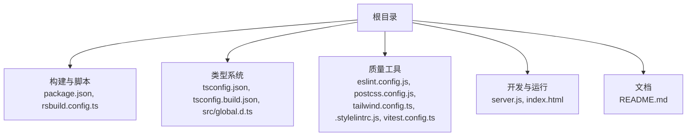
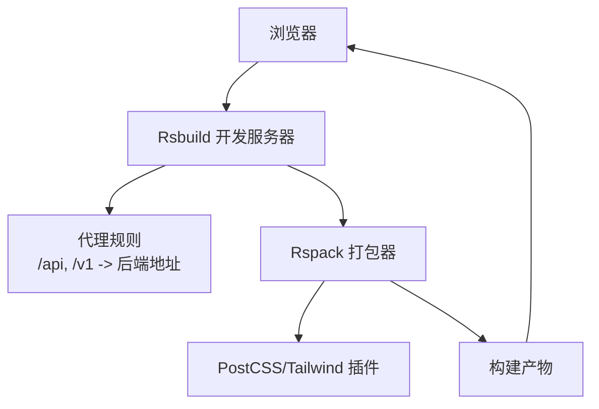
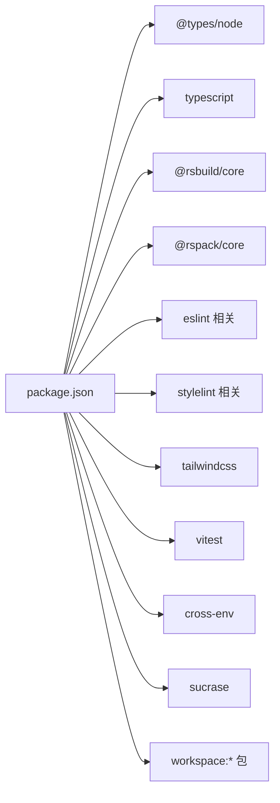

# 环境配置

<cite>
**本文引用的文件**
- [package.json](file://package.json)
- [rsbuild.config.ts](file://rsbuild.config.ts)
- [tsconfig.json](file://tsconfig.json)
- [tsconfig.build.json](file://tsconfig.build.json)
- [eslint.config.js](file://eslint.config.js)
- [postcss.config.js](file://postcss.config.js)
- [tailwind.config.ts](file://tailwind.config.ts)
- [.stylelintrc.js](file://.stylelintrc.js)
- [vitest.config.ts](file://vitest.config.ts)
- [server.js](file://server.js)
- [src/global.d.ts](file://src/global.d.ts)
- [README.md](file://README.md)
</cite>

## 目录
1. [简介](#简介)
2. [项目结构](#项目结构)
3. [核心组件](#核心组件)
4. [架构总览](#架构总览)
5. [详细组件分析](#详细组件分析)
6. [依赖分析](#依赖分析)
7. [性能考虑](#性能考虑)
8. [故障排查指南](#故障排查指南)
9. [结论](#结论)
10. [附录](#附录)

## 简介
本文件面向 Coze Studio 前端应用的开发者，提供从零到一的开发环境搭建与配置说明，涵盖 Node.js 版本要求、包管理器选择、依赖安装、初始化配置（TypeScript、构建工具 Rsbuild）、开发服务器与代理设置、环境变量、本地开发流程、IDE 推荐配置以及常见问题排查。目标是帮助开发者快速、稳定地搭建可用的开发环境。

## 项目结构
该应用为基于 Rsbuild 的 React 单页应用，采用多包工作区结构，核心目录与文件如下：
- 根级构建与脚本：package.json、rsbuild.config.ts
- 类型系统：tsconfig.json、tsconfig.build.json、src/global.d.ts
- 质量工具：eslint.config.js、postcss.config.js、tailwind.config.ts、.stylelintrc.js、vitest.config.ts
- 开发与运行：server.js、index.html
- 文档：README.md

章节来源
- [README.md:1-7](file://README.md#L1-L7)
- [package.json:11-18](file://package.json#L11-L18)

## 核心组件
- 包管理与脚本
  - 使用 npm 脚本驱动构建、开发、预览、测试与 lint。脚本通过 cross-env 设置环境变量后调用 rsbuild 执行。
- 构建工具 Rsbuild
  - 通过 rsbuild.config.ts 配置开发服务器、HTML 模板、PostCSS 插件、Rspack 自定义规则、源码别名与全局常量注入等。
- TypeScript
  - 采用复合工程模式，tsconfig.json 引用 tsconfig.build.json 与 tsconfig.misc.json；tsconfig.build.json 继承统一的 web 配置并指定 JSX、模块系统、目标语言等。
- 质量工具链
  - ESLint、Stylelint、PostCSS、TailwindCSS、Vitest 分别在对应配置文件中集中管理。
- 开发服务器与代理
  - server.js 使用 sucrase 注册后加载 scripts/serve.ts；rsbuild.config.ts 内置开发服务器与 API 代理（/api、/v1）。

章节来源
- [package.json:11-18](file://package.json#L11-L18)
- [rsbuild.config.ts:26-43](file://rsbuild.config.ts#L26-L43)
- [tsconfig.json:7-14](file://tsconfig.json#L7-L14)
- [tsconfig.build.json:2-14](file://tsconfig.build.json#L2-L14)
- [eslint.config.js:1-7](file://eslint.config.js#L1-L7)
- [postcss.config.js:1-2](file://postcss.config.js#L1-L2)
- [tailwind.config.ts:28-54](file://tailwind.config.ts#L28-L54)
- [.stylelintrc.js:1-6](file://.stylelintrc.js#L1-L6)
- [vitest.config.ts:17-22](file://vitest.config.ts#L17-L22)
- [server.js:1-4](file://server.js#L1-L4)

## 架构总览
下图展示本地开发时的请求流与工具链关系：浏览器请求经 Rsbuild 开发服务器转发至后端 API，同时 Rsbuild 将资源交由 Rspack 打包并按需注入全局常量与样式插件。

图表来源
- [rsbuild.config.ts:27-43](file://rsbuild.config.ts#L27-L43)
- [rsbuild.config.ts:50-89](file://rsbuild.config.ts#L50-L89)

章节来源
- [rsbuild.config.ts:26-89](file://rsbuild.config.ts#L26-L89)

## 详细组件分析

### Node.js 与包管理器
- Node.js 版本
  - TypeScript 类型声明依赖 @types/node，当前版本为 18.18.9；建议使用与之兼容的 LTS 版本以避免类型不匹配导致的编译或运行期问题。
- 包管理器
  - 仓库使用 npm 工作区（workspace:*）进行多包管理，建议使用 npm 作为默认包管理器，以保证 workspace 解析与脚本执行一致性。
- 安装依赖
  - 在项目根目录执行安装命令，确保一次性安装所有 workspace 依赖，并正确解析本地包。

章节来源
- [package.json:71-72](file://package.json#L71-L72)
- [package.json:20-50](file://package.json#L20-L50)

### TypeScript 配置
- 复合工程
  - tsconfig.json 通过 references 引入 tsconfig.build.json 与 tsconfig.misc.json，形成复合工程结构，便于增量编译与跨包引用。
- 构建配置
  - tsconfig.build.json 继承统一 web 配置，启用 isolatedModules、ESNext 模块与 ES2020 目标，配合 bundler 模式解析，适合现代打包器。
- 全局声明
  - src/global.d.ts 声明了 IS_OVERSEA 等全局常量类型，供源码与 Rsbuild define 注入使用。

章节来源
- [tsconfig.json:7-14](file://tsconfig.json#L7-L14)
- [tsconfig.build.json:2-14](file://tsconfig.build.json#L2-L14)
- [src/global.d.ts:17-20](file://src/global.d.ts#L17-L20)

### Rsbuild 构建与开发服务器
- 开发脚本
  - dev 脚本通过 cross-env 设置 IS_OPEN_SOURCE 与 CUSTOM_VERSION 后启动 rsbuild dev，严格端口与代理已内嵌配置。
- 服务器与代理
  - server.strictPort 保证端口占用冲突时直接失败；/api 与 /v1 路由转发至配置的目标地址，支持跨域与非安全连接。
- HTML 模板与图标
  - 指定标题、favicon、模板与跨域属性，适配多端部署。
- PostCSS 与 Tailwind
  - 通过 tools.postcss 注入 tailwind 插件，读取 tailwind.config.ts；content 来源由设计体系提供，确保按需生成样式。
- Rspack 自定义
  - 添加 import-watch-loader 规则用于特定文件类型监听；回退 path 模块至浏览器等价实现；开启轮询监听；忽略部分警告。
- 源码注入与别名
  - define 中注入多组运行时常量（如区域、版本、Taro 平台等），source.alias 将部分 SDK 重定向到本地解析结果，提升稳定性。
- 性能分包
  - chunkSplit 采用 split-by-size 策略，控制单 chunk 大小范围，平衡首屏与缓存友好性。

章节来源
- [package.json:13](file://package.json#L13)
- [rsbuild.config.ts:26-49](file://rsbuild.config.ts#L26-L49)
- [rsbuild.config.ts:50-89](file://rsbuild.config.ts#L50-L89)
- [rsbuild.config.ts:91-125](file://rsbuild.config.ts#L91-L125)
- [rsbuild.config.ts:126-132](file://rsbuild.config.ts#L126-L132)
- [tailwind.config.ts:25-54](file://tailwind.config.ts#L25-L54)

### 环境变量与全局常量
- 运行时注入
  - Rsbuild define 注入多组 process.env.* 常量，例如 TARO 平台、SDK 区域与范围、运行时入口等，确保不同环境下的行为一致。
- 全局类型
  - src/global.d.ts 声明 IS_OVERSEA 等全局常量类型，避免类型检查报错。

章节来源
- [rsbuild.config.ts:92-106](file://rsbuild.config.ts#L92-L106)
- [src/global.d.ts:17-20](file://src/global.d.ts#L17-L20)

### 代理设置与后端对接
- 代理上下文
  - /api 与 /v1 两个前缀被代理到后端目标地址，changeOrigin 与 secure 可根据实际网络与证书情况调整。
- 本地联调建议
  - 如需本地调试后端服务，可将 API_PROXY_TARGET 指向本机或其他后端地址；若端口变化，同步更新 rsbuild.config.ts 中的代理目标。

章节来源
- [rsbuild.config.ts:25](file://rsbuild.config.ts#L25)
- [rsbuild.config.ts:29-42](file://rsbuild.config.ts#L29-L42)

### 开发服务器与本地运行
- server.js
  - 通过 sucrase/register 加载 scripts/serve.ts，便于在开发阶段使用 TypeScript 语法运行本地服务脚本。
- index.html
  - Rsbuild 以该文件为模板生成最终页面，确保标题、favicon、跨域等属性正确注入。

章节来源
- [server.js:1-4](file://server.js#L1-L4)
- [rsbuild.config.ts:44](file://rsbuild.config.ts#L44)

### 质量工具配置
- ESLint
  - 使用 @coze-arch/eslint-config，preset 为 web，packageRoot 指向当前目录，确保团队风格一致。
- Stylelint
  - 使用 @coze-arch/stylelint-config，无额外扩展。
- PostCSS
  - 通过 postcss.config.js 引用 @coze-arch/postcss-config，统一 PostCSS 行为。
- TailwindCSS
  - tailwind.config.ts 基于设计令牌生成主题，content 来自内容扫描工具，支持动态类名白名单与预编译关闭。
- Vitest
  - 使用 @coze-arch/vitest-config，preset 为 web，适配前端单元测试场景。

章节来源
- [eslint.config.js:1-7](file://eslint.config.js#L1-L7)
- [.stylelintrc.js:1-6](file://.stylelintrc.js#L1-L6)
- [postcss.config.js:1-2](file://postcss.config.js#L1-L2)
- [tailwind.config.ts:28-54](file://tailwind.config.ts#L28-L54)
- [vitest.config.ts:17-22](file://vitest.config.ts#L17-L22)

### 本地开发流程
- 启动开发服务器
  - 执行 npm run dev，Rsbuild 严格端口启动并加载代理与全局常量。
- 修改与热更新
  - 源码变更触发 Rspack 重新打包，watchOptions.poll 启用轮询以提升监听稳定性。
- 联调后端
  - 通过 /api 与 /v1 访问后端接口，必要时调整代理目标地址。
- 预览与构建
  - 使用 npm run preview 预览生产构建；npm run build 产出 dist。

章节来源
- [package.json:13](file://package.json#L13)
- [package.json:15](file://package.json#L15)
- [package.json:12](file://package.json#L12)
- [rsbuild.config.ts:27-43](file://rsbuild.config.ts#L27-L43)
- [rsbuild.config.ts:81-83](file://rsbuild.config.ts#L81-L83)

## 依赖分析
- 运行时依赖
  - React 18、React Router、Zustand、@coze-* 系列企业级包等，构成应用主体功能。
- 开发时依赖
  - Rsbuild 核心、Rspack、TypeScript、ESLint、Stylelint、TailwindCSS、Vitest、cross-env、sucrase 等，覆盖构建、类型、质量与测试。
- 工作区依赖
  - 多个 workspace:* 包，表明项目采用 Rush/PNPM 工作区管理，需在根目录统一安装与构建。

图表来源
- [package.json:19-50](file://package.json#L19-L50)
- [package.json:52-81](file://package.json#L52-L81)

章节来源
- [package.json:19-81](file://package.json#L19-L81)

## 性能考虑
- 分包策略
  - 使用 chunkSplit split-by-size，结合最小/最大阈值，减少大包体积，提升缓存命中率与首屏性能。
- 监听与警告
  - 开启轮询监听与忽略特定警告，降低开发期噪音与误报。
- 模块解析
  - 使用 bundler 模式解析与 exportsPresence 关闭，适配现代打包器，减少不必要的校验开销。

章节来源
- [rsbuild.config.ts:126-132](file://rsbuild.config.ts#L126-L132)
- [rsbuild.config.ts:81-87](file://rsbuild.config.ts#L81-L87)
- [rsbuild.config.ts:11-13](file://rsbuild.config.ts#L11-L13)

## 故障排查指南
- 端口占用
  - 若端口被占用，strictPort 会使开发服务器直接失败。请释放端口或调整 Rsbuild 端口配置。
- 代理无法访问后端
  - 检查 API_PROXY_TARGET 是否指向正确的后端地址；确认 /api 与 /v1 代理规则是否生效；必要时开启 secure 或调整 changeOrigin。
- 类型错误或全局常量未识别
  - 确认 src/global.d.ts 中的类型声明存在且未被排除；Rsbuild define 中的常量拼写与大小写需一致。
- 样式未生效或 Tailwind 未扫描到内容
  - 检查 tailwind.config.ts 的 content 配置与扫描路径；确保构建时已注入 PostCSS 插件。
- 浏览器无法热更新
  - 若监听异常，确认 watchOptions.poll 是否启用；检查文件是否被 exclude 列表误伤。
- Lint 报错
  - 使用 npm run lint 执行 ESLint/Stylelint；根据提示修复规则冲突或新增配置。

章节来源
- [rsbuild.config.ts:27-43](file://rsbuild.config.ts#L27-L43)
- [rsbuild.config.ts:25](file://rsbuild.config.ts#L25)
- [rsbuild.config.ts:92-106](file://rsbuild.config.ts#L92-L106)
- [src/global.d.ts:17-20](file://src/global.d.ts#L17-L20)
- [tailwind.config.ts:28-54](file://tailwind.config.ts#L28-L54)
- [rsbuild.config.ts:50-54](file://rsbuild.config.ts#L50-L54)
- [rsbuild.config.ts:81-83](file://rsbuild.config.ts#L81-L83)
- [eslint.config.js:1-7](file://eslint.config.js#L1-L7)
- [.stylelintrc.js:1-6](file://.stylelintrc.js#L1-L6)

## 结论
通过以上配置与流程，开发者可在本地快速搭建并稳定运行 Coze Studio 前端应用。建议优先使用与 @types/node 兼容的 Node.js LTS 版本，统一使用 npm 管理 workspace 依赖，并遵循 Rsbuild 与 TypeScript 的复合工程结构。遇到问题时，可依据“故障排查指南”逐项定位与解决。

## 附录
- 快速清单
  - 安装 Node.js（与 @types/node 兼容的 LTS）
  - 使用 npm 安装工作区依赖
  - 执行 npm run dev 启动开发服务器
  - 如需联调后端，修改 rsbuild.config.ts 中的 API_PROXY_TARGET
  - 使用 npm run lint、npm run test、npm run build 等脚本完成质量与构建