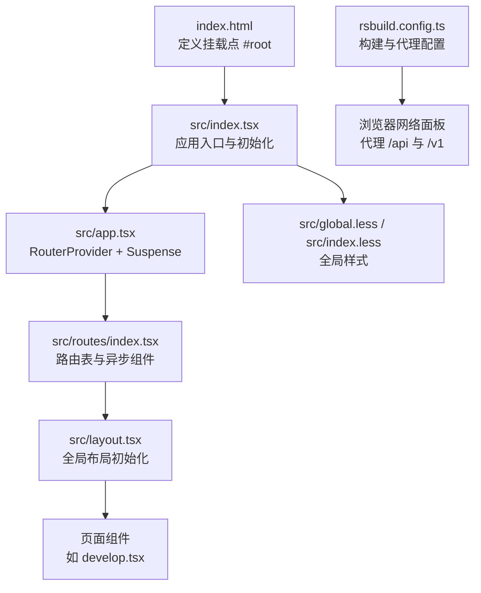
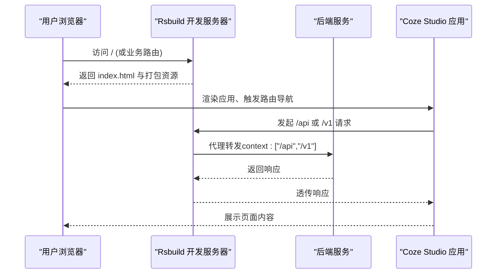
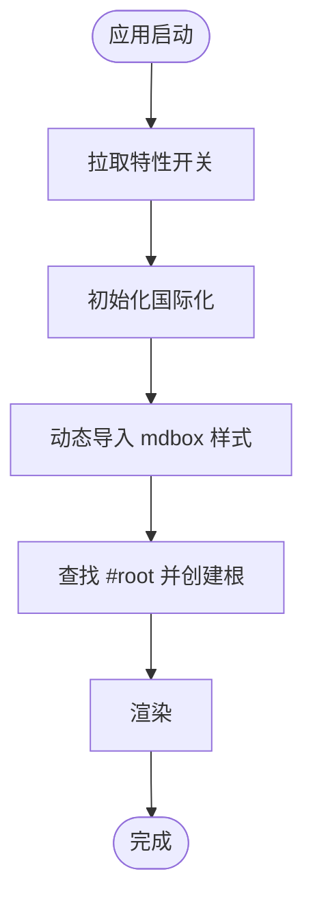
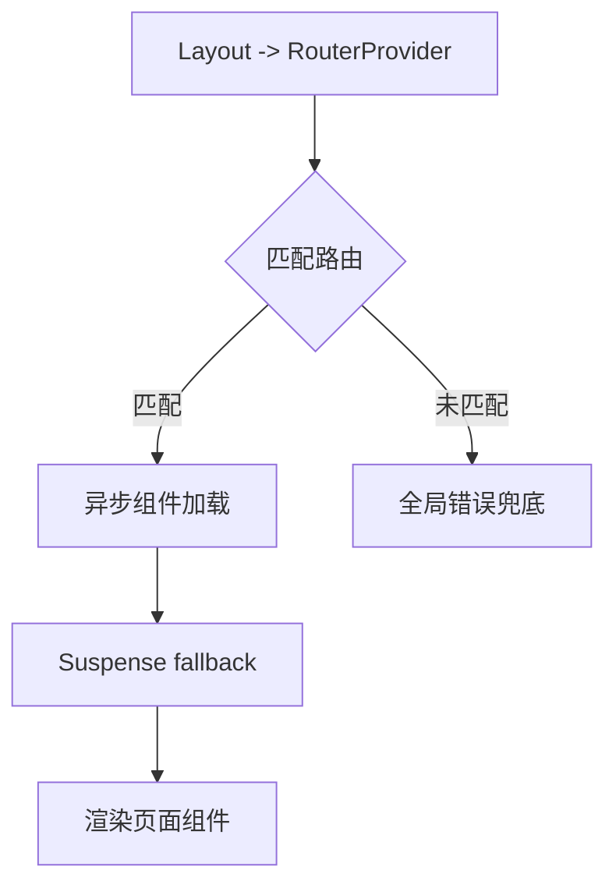
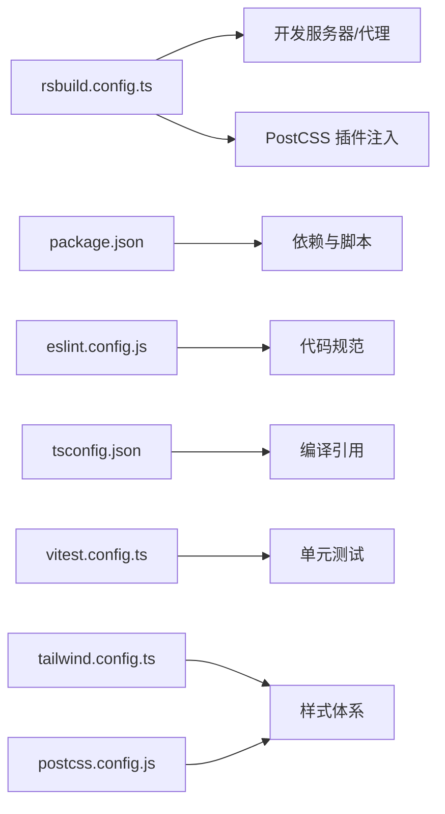

# 调试与故障排除

<cite>
**本文引用的文件**
- [package.json](file://package.json)
- [rsbuild.config.ts](file://rsbuild.config.ts)
- [server.js](file://server.js)
- [src/index.tsx](file://src/index.tsx)
- [src/app.tsx](file://src/app.tsx)
- [src/layout.tsx](file://src/layout.tsx)
- [src/routes/index.tsx](file://src/routes/index.tsx)
- [src/pages/develop.tsx](file://src/pages/develop.tsx)
- [index.html](file://index.html)
- [eslint.config.js](file://eslint.config.js)
- [tsconfig.json](file://tsconfig.json)
- [vitest.config.ts](file://vitest.config.ts)
- [tailwind.config.ts](file://tailwind.config.ts)
- [postcss.config.js](file://postcss.config.js)
- [src/global.less](file://src/global.less)
- [src/index.less](file://src/index.less)
</cite>

## 目录
1. [简介](#简介)
2. [项目结构](#项目结构)
3. [核心组件](#核心组件)
4. [架构总览](#架构总览)
5. [详细组件分析](#详细组件分析)
6. [依赖分析](#依赖分析)
7. [性能考虑](#性能考虑)
8. [故障排除指南](#故障排除指南)
9. [结论](#结论)
10. [附录](#附录)

## 简介
本指南面向 Coze Studio 前端开发者，提供系统化的调试与故障排除方法，覆盖浏览器开发者工具、React DevTools、网络请求调试、常见错误类型与排查、性能诊断（内存泄漏、渲染性能、包体积）、日志与错误监控、Source Map 溯源、以及开发工具链问题的替代方案。文档以仓库现有配置与代码为依据，结合实际文件路径帮助快速定位问题。

## 项目结构
该应用采用 Rsbuild 构建，基于 React 18 与 React Router v6，使用 TailwindCSS 与 PostCSS 进行样式处理，并通过异步组件实现路由级代码分割。入口在 HTML 中挂载根节点，初始化国际化、特性开关与全局样式后渲染应用。

图表来源
- [index.html:1-13](file://index.html#L1-L13)
- [src/index.tsx:1-55](file://src/index.tsx#L1-L55)
- [src/app.tsx:1-37](file://src/app.tsx#L1-L37)
- [src/routes/index.tsx:1-298](file://src/routes/index.tsx#L1-L298)
- [src/layout.tsx:1-24](file://src/layout.tsx#L1-L24)
- [src/pages/develop.tsx:1-27](file://src/pages/develop.tsx#L1-L27)
- [src/global.less:1-235](file://src/global.less#L1-L235)
- [src/index.less:1-9](file://src/index.less#L1-L9)
- [rsbuild.config.ts:25-43](file://rsbuild.config.ts#L25-L43)

章节来源
- [index.html:1-13](file://index.html#L1-L13)
- [src/index.tsx:1-55](file://src/index.tsx#L1-L55)
- [src/app.tsx:1-37](file://src/app.tsx#L1-L37)
- [src/routes/index.tsx:1-298](file://src/routes/index.tsx#L1-L298)
- [src/layout.tsx:1-24](file://src/layout.tsx#L1-L24)
- [src/pages/develop.tsx:1-27](file://src/pages/develop.tsx#L1-L27)
- [src/global.less:1-235](file://src/global.less#L1-L235)
- [src/index.less:1-9](file://src/index.less#L1-L9)
- [rsbuild.config.ts:25-43](file://rsbuild.config.ts#L25-L43)

## 核心组件
- 应用入口与初始化：负责国际化、特性开关拉取、动态样式导入与根节点渲染。
- 应用外壳：包裹全局布局并统一错误兜底。
- 路由系统：集中声明页面与菜单、鉴权要求、侧边栏与移动端提示等元数据。
- 页面组件：按需加载具体业务页面，如开发页。
- 样式体系：全局样式与 Tailwind 基础、组件、实用工具三段式引入。

章节来源
- [src/index.tsx:26-52](file://src/index.tsx#L26-L52)
- [src/app.tsx:24-36](file://src/app.tsx#L24-L36)
- [src/routes/index.tsx:50-297](file://src/routes/index.tsx#L50-L297)
- [src/pages/develop.tsx:21-24](file://src/pages/develop.tsx#L21-L24)
- [src/global.less:1-235](file://src/global.less#L1-L235)
- [src/index.less:1-9](file://src/index.less#L1-L9)

## 架构总览
下图展示从浏览器到服务端的关键交互路径，包括本地开发代理与路由懒加载流程。

图表来源
- [rsbuild.config.ts:25-43](file://rsbuild.config.ts#L25-L43)
- [src/routes/index.tsx:50-297](file://src/routes/index.tsx#L50-L297)
- [src/index.tsx:45-51](file://src/index.tsx#L45-L51)

## 详细组件分析

### 入口与初始化流程
- 初始化步骤包括特性开关拉取、国际化初始化、动态样式导入，随后创建根节点并渲染应用外壳。
- 若未找到挂载节点，会抛出错误，便于早期发现 DOM 结构问题。

图表来源
- [src/index.tsx:26-52](file://src/index.tsx#L26-L52)
- [index.html:9-11](file://index.html#L9-L11)

章节来源
- [src/index.tsx:26-52](file://src/index.tsx#L26-L52)
- [index.html:9-11](file://index.html#L9-L11)

### 路由与页面加载
- 使用 React Router v6 的异步组件实现按需加载，配合 Suspense 提供加载态。
- 路由表集中声明菜单、鉴权、侧边栏与移动端提示等元信息，便于统一治理。

图表来源
- [src/app.tsx:24-36](file://src/app.tsx#L24-L36)
- [src/routes/index.tsx:50-297](file://src/routes/index.tsx#L50-L297)
- [src/layout.tsx:19-23](file://src/layout.tsx#L19-L23)

章节来源
- [src/app.tsx:24-36](file://src/app.tsx#L24-L36)
- [src/routes/index.tsx:50-297](file://src/routes/index.tsx#L50-L297)
- [src/layout.tsx:19-23](file://src/layout.tsx#L19-L23)

### 开发页组件
- 通过路由参数解析空间 ID，并将该 ID 传递给具体业务组件，实现页面级数据注入。

章节来源
- [src/pages/develop.tsx:21-24](file://src/pages/develop.tsx#L21-L24)

### 样式与主题
- 全局样式统一字体、尺寸与滚动条；Tailwind 通过 PostCSS 注入，content 动态扫描确保按需生成。
- 重要：关闭预设重置以避免与既有样式冲突。

章节来源
- [src/global.less:1-235](file://src/global.less#L1-L235)
- [tailwind.config.ts:28-54](file://tailwind.config.ts#L28-L54)
- [postcss.config.js:1-2](file://postcss.config.js#L1-L2)
- [src/index.less:1-9](file://src/index.less#L1-L9)

## 依赖分析
- 构建与开发：Rsbuild 作为核心构建工具，提供代理、PostCSS 插件注入、别名与装饰器支持。
- 路由与外壳：React Router v6 + 自研全局布局与错误兜底组件。
- 工具链：ESLint 规则、TypeScript 引用配置、Vitest 测试配置、Tailwind/PostCSS 主题与响应式配置。

图表来源
- [rsbuild.config.ts:25-133](file://rsbuild.config.ts#L25-L133)
- [package.json:11-17](file://package.json#L11-L17)
- [eslint.config.js:1-7](file://eslint.config.js#L1-7)
- [tsconfig.json:1-16](file://tsconfig.json#L1-L16)
- [vitest.config.ts:17-23](file://vitest.config.ts#L17-L23)
- [tailwind.config.ts:28-54](file://tailwind.config.ts#L28-L54)
- [postcss.config.js:1-2](file://postcss.config.js#L1-L2)

章节来源
- [rsbuild.config.ts:25-133](file://rsbuild.config.ts#L25-L133)
- [package.json:11-17](file://package.json#L11-L17)
- [eslint.config.js:1-7](file://eslint.config.js#L1-7)
- [tsconfig.json:1-16](file://tsconfig.json#L1-L16)
- [vitest.config.ts:17-23](file://vitest.config.ts#L17-L23)
- [tailwind.config.ts:28-54](file://tailwind.config.ts#L28-L54)
- [postcss.config.js:1-2](file://postcss.config.js#L1-L2)

## 性能考虑
- 包体积与分包：启用 chunkSplit 按大小拆分，建议结合 Rsdoctor 分析包构成与重复依赖。
- 样式体积：Tailwind content 动态扫描，避免无用类导致体积膨胀；必要时使用 safelist 与按需引入。
- 渲染性能：Suspense 与异步组件减少首屏阻塞；避免在渲染路径中执行重型计算。
- 网络与缓存：代理仅用于开发环境，生产环境应配置正确的 CDN 与缓存策略。

章节来源
- [rsbuild.config.ts:126-132](file://rsbuild.config.ts#L126-L132)
- [tailwind.config.ts:28-54](file://tailwind.config.ts#L28-L54)

## 故障排除指南

### 浏览器开发者工具使用
- Elements：检查 #root 是否存在、样式是否被覆盖。
- Network：确认 /api 与 /v1 请求是否命中代理目标地址；查看状态码与响应头。
- Sources：启用 Source Map 后断点调试；结合 React DevTools 定位组件。
- Performance/Memory：录制性能与内存快照，识别异常峰值与泄漏。

章节来源
- [rsbuild.config.ts:25-43](file://rsbuild.config.ts#L25-L43)
- [index.html:9-11](file://index.html#L9-L11)

### React DevTools 配置与使用
- 在应用入口初始化阶段（国际化、特性开关）设置断点，验证上下文初始化顺序。
- 利用 Profiler 分析组件渲染次数与耗时，优先优化高频更新组件。
- 结合 Suspense 的 fallback 渲染，定位异步组件加载卡顿点。

章节来源
- [src/index.tsx:36-43](file://src/index.tsx#L36-L43)
- [src/app.tsx:26-33](file://src/app.tsx#L26-L33)

### 网络请求调试
- 代理配置：确认 context 与 target 地址正确；若后端地址变更，同步更新代理目标。
- 跨域与 Origin：changeOrigin 与 secure 配置需与后端一致。
- 请求拦截：可在浏览器扩展或代理层增加请求日志以便追踪。

章节来源
- [rsbuild.config.ts:25-43](file://rsbuild.config.ts#L25-L43)

### 常见错误类型与排查
- 构建错误
  - TypeScript 引用配置：检查 references 与复合编译设置。
  - PostCSS/Tailwind：确认 content 扫描范围与插件链路。
  - 装饰器与别名：确保装饰器版本与别名解析生效。
- 运行时错误
  - 根节点缺失：入口处对 #root 的校验失败会抛错，检查 index.html。
  - 国际化与特性开关：初始化失败会导致页面空白，检查初始化逻辑与超时。
  - 路由错误：全局错误兜底组件生效时，查看控制台堆栈与路由 loader 返回值。
- 样式问题
  - Tailwind 未生效：确认 content 扫描与 @tailwind 指令顺序。
  - 样式覆盖：全局样式可能影响第三方组件，必要时调整作用域或优先级。

章节来源
- [tsconfig.json:7-14](file://tsconfig.json#L7-L14)
- [postcss.config.js:1-2](file://postcss.config.js#L1-2)
- [tailwind.config.ts:28-54](file://tailwind.config.ts#L28-L54)
- [rsbuild.config.ts:113-124](file://rsbuild.config.ts#L113-L124)
- [src/index.tsx:45-51](file://src/index.tsx#L45-L51)
- [src/index.tsx:36-43](file://src/index.tsx#L36-L43)
- [src/routes/index.tsx:80-96](file://src/routes/index.tsx#L80-L96)
- [src/global.less:1-235](file://src/global.less#L1-L235)

### 性能问题诊断
- 内存泄漏检测
  - 使用 Memory 面板录制快照，对比多次 GC 后仍存活的对象；关注事件监听器与定时器未清理。
- 渲染性能分析
  - 使用 Performance 面板录制，观察长任务与主线程阻塞；结合 React Profiler 定位热点组件。
- Bundle 分析
  - 使用 Rsdoctor 插件生成依赖关系与体积报告，识别大体积模块与重复依赖。

章节来源
- [package.json:69-70](file://package.json#L69-L70)
- [rsbuild.config.ts:126-132](file://rsbuild.config.ts#L126-L132)

### 日志记录与错误监控
- 日志策略：在关键初始化（国际化、特性开关、路由加载）输出日志；区分开发与生产环境级别。
- 错误边界：利用全局错误兜底组件捕获未处理异常，避免整页崩溃。
- 监控集成：建议接入前端监控平台，上报错误堆栈与用户行为轨迹。

章节来源
- [src/routes/index.tsx:80-96](file://src/routes/index.tsx#L80-L96)
- [src/app.tsx:24-36](file://src/app.tsx#L24-L36)

### 使用 Source Map 进行源码调试
- 开发模式默认启用 Source Map；若断点无效，请确认浏览器已启用“启用 Source Map”并刷新页面。
- 对于异步组件与动态导入，确保在相应模块设置断点；必要时在 loader 或初始化函数中设置断点。

章节来源
- [rsbuild.config.ts:25-43](file://rsbuild.config.ts#L25-L43)

### 开发工具链问题与替代方案
- ESLint 规则不生效
  - 检查 eslint.config.js 的 preset 与 packageRoot；确认编辑器使用的 ESLint 版本与工作区一致。
- TypeScript 编译异常
  - 检查 tsconfig 引用与 composite 设置；清理编译缓存后重试。
- 测试无法运行
  - 检查 vitest.config.ts 的 web 预设与 dirname；确保测试环境与浏览器兼容。
- 样式不生效
  - 确认 PostCSS 插件链与 Tailwind content 范围；尝试重启开发服务器。

章节来源
- [eslint.config.js:1-7](file://eslint.config.js#L1-L7)
- [tsconfig.json:7-14](file://tsconfig.json#L7-L14)
- [vitest.config.ts:17-23](file://vitest.config.ts#L17-L23)
- [postcss.config.js:1-2](file://postcss.config.js#L1-L2)
- [tailwind.config.ts:28-54](file://tailwind.config.ts#L28-L54)

## 结论
本指南基于仓库现有配置与代码，提供了从入口初始化、路由与页面加载、样式体系到网络代理与性能诊断的完整调试路径。建议在日常开发中结合浏览器开发者工具、React DevTools、Source Map 与 Rsdoctor，形成“发现问题—定位问题—验证修复”的闭环流程，持续提升开发效率与稳定性。

## 附录

### 快速检查清单
- 入口与 DOM：#root 存在且可渲染。
- 代理与网络：/api 与 /v1 请求可达，状态正常。
- 样式与主题：Tailwind 指令顺序正确，content 扫描范围合理。
- 构建与脚本：Rsbuild 开发与构建命令可用，Source Map 正常。
- 错误监控：全局错误兜底组件生效，关键初始化有日志。