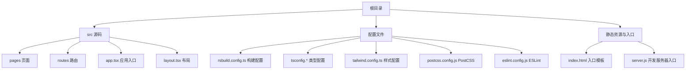
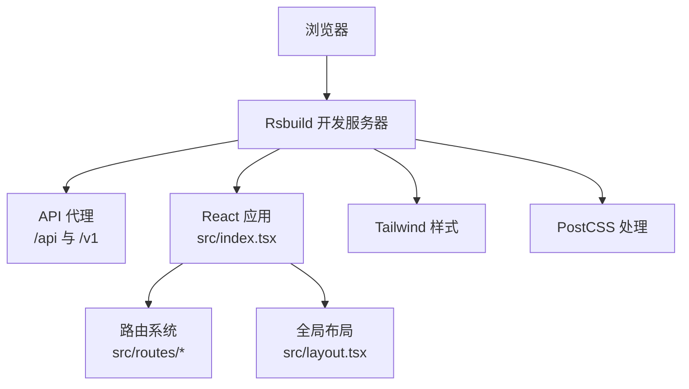
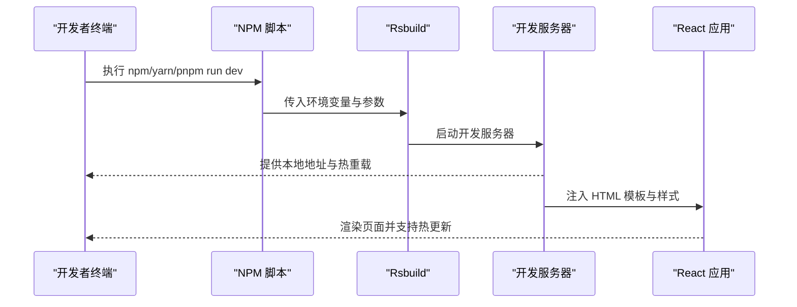
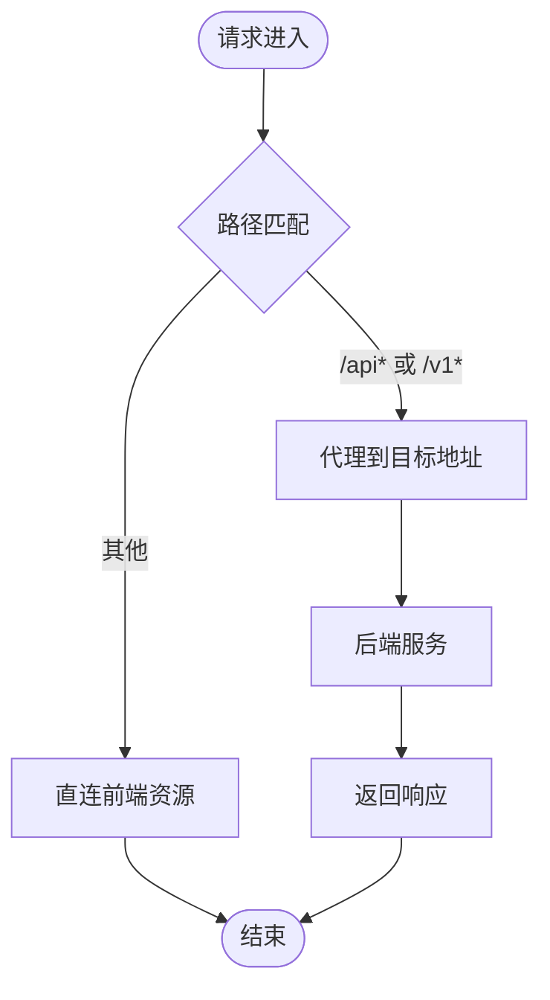
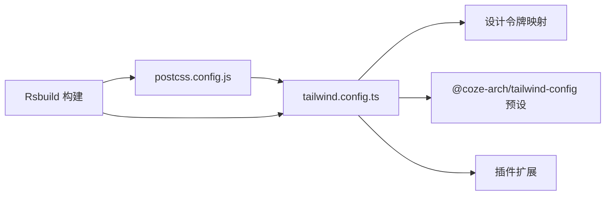

# 快速开始

<cite>
**本文引用的文件**
- [package.json](file://package.json)
- [README.md](file://README.md)
- [rsbuild.config.ts](file://rsbuild.config.ts)
- [server.js](file://server.js)
- [tsconfig.json](file://tsconfig.json)
- [tsconfig.build.json](file://tsconfig.build.json)
- [tsconfig.misc.json](file://tsconfig.misc.json)
- [tailwind.config.ts](file://tailwind.config.ts)
- [postcss.config.js](file://postcss.config.js)
- [eslint.config.js](file://eslint.config.js)
- [src/index.tsx](file://src/index.tsx)
- [src/app.tsx](file://src/app.tsx)
- [src/layout.tsx](file://src/layout.tsx)
- [index.html](file://index.html)
</cite>

## 目录
1. [简介](#简介)
2. [项目结构](#项目结构)
3. [核心组件](#核心组件)
4. [架构总览](#架构总览)
5. [详细组件分析](#详细组件分析)
6. [依赖分析](#依赖分析)
7. [性能考虑](#性能考虑)
8. [故障排除指南](#故障排除指南)
9. [结论](#结论)
10. [附录](#附录)

## 简介
本指南面向首次接触 Coze Studio 前端应用的新开发者，帮助你在最短时间内完成环境准备、依赖安装与本地开发运行。项目基于 Rsbuild 构建工具与 React 技术栈，集成了路由、国际化、样式体系与测试框架等能力。

## 项目结构
该应用采用“单体前端应用”组织方式，核心目录与文件如下：
- 根目录包含构建配置、类型配置、样式与脚本入口等
- 源码位于 src 目录，包含页面、路由、全局样式与应用入口
- 配置文件集中于根目录，便于统一管理

图表来源
- [rsbuild.config.ts:1-136](file://rsbuild.config.ts#L1-L136)
- [tsconfig.json:1-16](file://tsconfig.json#L1-L16)
- [tsconfig.build.json:1-134](file://tsconfig.build.json#L1-L134)
- [tsconfig.misc.json:1-28](file://tsconfig.misc.json#L1-L28)
- [tailwind.config.ts:1-55](file://tailwind.config.ts#L1-L55)
- [postcss.config.js:1-2](file://postcss.config.js#L1-L2)
- [eslint.config.js:1-7](file://eslint.config.js#L1-L7)
- [src/index.tsx:1-55](file://src/index.tsx#L1-L55)
- [src/app.tsx:1-37](file://src/app.tsx#L1-L37)
- [src/layout.tsx:1-24](file://src/layout.tsx#L1-L24)
- [index.html:1-13](file://index.html#L1-L13)
- [server.js:1-4](file://server.js#L1-L4)

章节来源
- [README.md:1-7](file://README.md#L1-L7)
- [rsbuild.config.ts:1-136](file://rsbuild.config.ts#L1-L136)
- [tsconfig.json:1-16](file://tsconfig.json#L1-L16)
- [tsconfig.build.json:1-134](file://tsconfig.build.json#L1-L134)
- [tsconfig.misc.json:1-28](file://tsconfig.misc.json#L1-L28)
- [tailwind.config.ts:1-55](file://tailwind.config.ts#L1-L55)
- [postcss.config.js:1-2](file://postcss.config.js#L1-L2)
- [eslint.config.js:1-7](file://eslint.config.js#L1-L7)
- [src/index.tsx:1-55](file://src/index.tsx#L1-L55)
- [src/app.tsx:1-37](file://src/app.tsx#L1-L37)
- [src/layout.tsx:1-24](file://src/layout.tsx#L1-L24)
- [index.html:1-13](file://index.html#L1-L13)
- [server.js:1-4](file://server.js#L1-L4)

## 核心组件
- 应用入口与初始化：负责初始化国际化、特性开关、Markdown 样式注入，并挂载 React 根节点
- 应用外壳：包裹路由与加载态，提供统一的页面骨架
- 全局布局：通过适配层接入全局布局能力
- 构建与开发：Rsbuild 提供开发服务器、代理、热重载与打包能力

章节来源
- [src/index.tsx:1-55](file://src/index.tsx#L1-L55)
- [src/app.tsx:1-37](file://src/app.tsx#L1-L37)
- [src/layout.tsx:1-24](file://src/layout.tsx#L1-L24)

## 架构总览
下图展示了从浏览器到构建工具与代理服务的整体流程：

图表来源
- [rsbuild.config.ts:25-43](file://rsbuild.config.ts#L25-L43)
- [src/index.tsx:1-55](file://src/index.tsx#L1-L55)
- [src/app.tsx:1-37](file://src/app.tsx#L1-L37)
- [src/layout.tsx:1-24](file://src/layout.tsx#L1-L24)
- [tailwind.config.ts:25-54](file://tailwind.config.ts#L25-L54)
- [postcss.config.js:1-2](file://postcss.config.js#L1-L2)

## 详细组件分析

### 启动与开发流程（开发服务器）

图表来源
- [package.json:11-17](file://package.json#L11-L17)
- [rsbuild.config.ts:25-43](file://rsbuild.config.ts#L25-L43)
- [src/index.tsx:1-55](file://src/index.tsx#L1-L55)
- [index.html:1-13](file://index.html#L1-L13)

章节来源
- [package.json:11-17](file://package.json#L11-L17)
- [rsbuild.config.ts:25-43](file://rsbuild.config.ts#L25-L43)
- [src/index.tsx:1-55](file://src/index.tsx#L1-L55)
- [index.html:1-13](file://index.html#L1-L13)

### 代理与后端通信

图表来源
- [rsbuild.config.ts:25-43](file://rsbuild.config.ts#L25-L43)

章节来源
- [rsbuild.config.ts:25-43](file://rsbuild.config.ts#L25-L43)

### 样式与主题链路

图表来源
- [tailwind.config.ts:17-54](file://tailwind.config.ts#L17-L54)
- [postcss.config.js:1-2](file://postcss.config.js#L1-L2)
- [rsbuild.config.ts:50-54](file://rsbuild.config.ts#L50-L54)

章节来源
- [tailwind.config.ts:17-54](file://tailwind.config.ts#L17-L54)
- [postcss.config.js:1-2](file://postcss.config.js#L1-L2)
- [rsbuild.config.ts:50-54](file://rsbuild.config.ts#L50-L54)

## 依赖分析
- 包管理器：推荐使用 pnpm（monorepo 工作区），以获得最佳的依赖解析与链接体验
- 运行时依赖：React、React Router、Zustand、Coze 生态相关包等
- 开发依赖：Rsbuild、TypeScript、Tailwind、Vitest、ESLint 等

章节来源
- [package.json:19-81](file://package.json#L19-L81)

## 性能考虑
- 分包策略：按体积拆分代码块，提升缓存命中率
- 解析与回退：为 path 模块提供浏览器回退，减少打包体积
- 监听与忽略：启用轮询监听与忽略部分警告，提升开发稳定性

章节来源
- [rsbuild.config.ts:126-132](file://rsbuild.config.ts#L126-L132)
- [rsbuild.config.ts:76-88](file://rsbuild.config.ts#L76-L88)

## 故障排除指南
- 无法启动开发服务器
  - 检查端口占用与严格端口配置
  - 参考：[rsbuild.config.ts:27-28](file://rsbuild.config.ts#L27-L28)
- 请求被代理失败
  - 确认代理目标地址与上下文匹配
  - 参考：[rsbuild.config.ts:25-43](file://rsbuild.config.ts#L25-L43)
- 样式未生效或 Tailwind 未扫描到类名
  - 检查内容扫描范围与预设配置
  - 参考：[tailwind.config.ts:25-54](file://tailwind.config.ts#L25-L54)
- TypeScript 编译报错
  - 校验 tsconfig 引用关系与编译选项
  - 参考：[tsconfig.json:1-16](file://tsconfig.json#L1-L16)、[tsconfig.build.json:1-134](file://tsconfig.build.json#L1-L134)、[tsconfig.misc.json:1-28](file://tsconfig.misc.json#L1-L28)
- ESLint 规则不生效
  - 确认 ESLint 配置与包管理器一致
  - 参考：[eslint.config.js:1-7](file://eslint.config.js#L1-L7)
- PostCSS 插件未执行
  - 确认 Rsbuild 已注入 PostCSS 并加载配置
  - 参考：[postcss.config.js:1-2](file://postcss.config.js#L1-L2)、[rsbuild.config.ts:50-54](file://rsbuild.config.ts#L50-L54)

## 结论
按照本指南完成环境准备与依赖安装后，你将能够通过开发脚本快速启动本地服务，并在浏览器中看到应用页面。如遇问题，请根据“故障排除指南”逐项检查对应配置文件与网络代理设置。

## 附录

### 环境与依赖安装
- Node.js 版本：建议使用 LTS 版本（18.x 或更高）
- 包管理器：优先使用 pnpm（工作区）
- 安装命令示例（请在仓库根目录执行）：
  - pnpm install
- 如需预览生产构建：
  - pnpm run preview

章节来源
- [package.json:11-17](file://package.json#L11-L17)
- [README.md:1-7](file://README.md#L1-L7)

### 开发环境配置
- 启动开发服务器：执行开发脚本
  - pnpm run dev
- 热重载：Rsbuild 默认启用，修改源码后自动刷新
- 代理配置：已内置 /api 与 /v1 前缀代理，目标地址可在配置中调整
  - 参考：[rsbuild.config.ts:25-43](file://rsbuild.config.ts#L25-L43)

章节来源
- [package.json:11-17](file://package.json#L11-L17)
- [rsbuild.config.ts:25-43](file://rsbuild.config.ts#L25-L43)

### 关键配置文件说明
- 构建配置：Rsbuild 配置文件，定义代理、HTML 模板、PostCSS 插件、别名与性能策略
  - 参考：[rsbuild.config.ts:1-136](file://rsbuild.config.ts#L1-L136)
- 类型配置：分拆为构建与杂项两类 tsconfig，统一引用架构配置
  - 参考：[tsconfig.json:1-16](file://tsconfig.json#L1-L16)、[tsconfig.build.json:1-134](file://tsconfig.build.json#L1-L134)、[tsconfig.misc.json:1-28](file://tsconfig.misc.json#L1-L28)
- 样式配置：Tailwind 集成设计令牌与预设，开启内容扫描与插件
  - 参考：[tailwind.config.ts:1-55](file://tailwind.config.ts#L1-L55)
- PostCSS：加载架构提供的配置
  - 参考：[postcss.config.js:1-2](file://postcss.config.js#L1-L2)
- Lint 配置：基于架构 ESLint 预设
  - 参考：[eslint.config.js:1-7](file://eslint.config.js#L1-L7)
- 入口模板：HTML 模板与 favicon、标题等
  - 参考：[index.html:1-13](file://index.html#L1-L13)
- 开发服务器入口：使用 Sucrase 注册后加载服务脚本
  - 参考：[server.js:1-4](file://server.js#L1-L4)

章节来源
- [rsbuild.config.ts:1-136](file://rsbuild.config.ts#L1-L136)
- [tsconfig.json:1-16](file://tsconfig.json#L1-L16)
- [tsconfig.build.json:1-134](file://tsconfig.build.json#L1-L134)
- [tsconfig.misc.json:1-28](file://tsconfig.misc.json#L1-L28)
- [tailwind.config.ts:1-55](file://tailwind.config.ts#L1-L55)
- [postcss.config.js:1-2](file://postcss.config.js#L1-L2)
- [eslint.config.js:1-7](file://eslint.config.js#L1-L7)
- [index.html:1-13](file://index.html#L1-L13)
- [server.js:1-4](file://server.js#L1-L4)

### 常用命令
- 开发：pnpm run dev
- 构建：pnpm run build
- 预览：pnpm run preview
- 测试：pnpm run test / pnpm run test:cov
- 代码检查：pnpm run lint

章节来源
- [package.json:11-17](file://package.json#L11-L17)