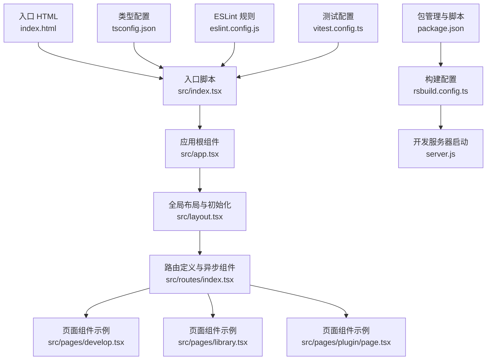
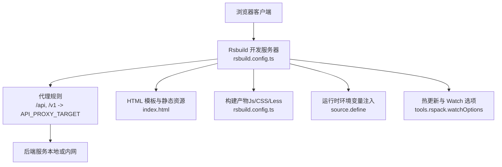
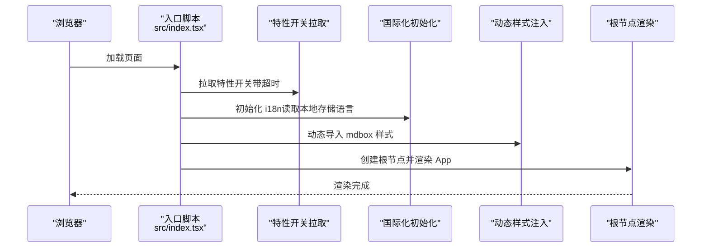
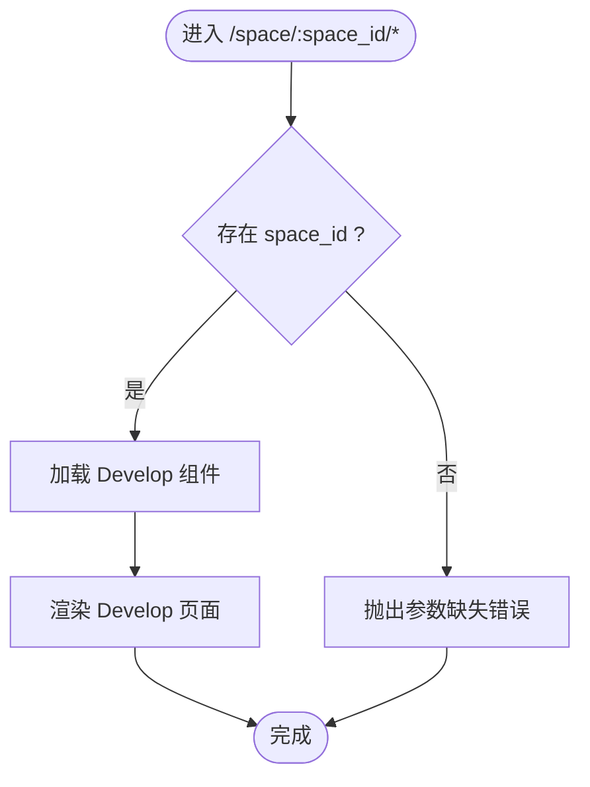
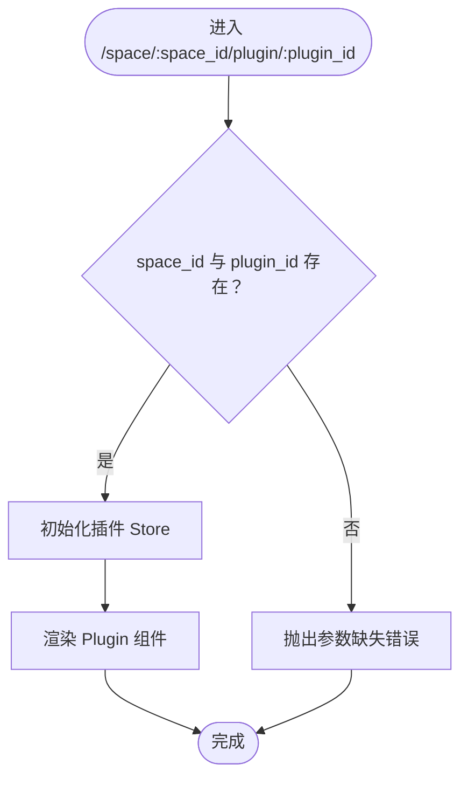

# 故障排除

<cite>
**本文引用的文件**
- [package.json](file://package.json)
- [rsbuild.config.ts](file://rsbuild.config.ts)
- [server.js](file://server.js)
- [src/index.tsx](file://src/index.tsx)
- [src/app.tsx](file://src/app.tsx)
- [src/layout.tsx](file://src/layout.tsx)
- [src/routes/index.tsx](file://src/routes/index.tsx)
- [src/pages/develop.tsx](file://src/pages/develop.tsx)
- [src/pages/library.tsx](file://src/pages/library.tsx)
- [src/pages/plugin/page.tsx](file://src/pages/plugin/page.tsx)
- [tsconfig.json](file://tsconfig.json)
- [eslint.config.js](file://eslint.config.js)
- [vitest.config.ts](file://vitest.config.ts)
- [index.html](file://index.html)
</cite>

## 目录
1. [简介](#简介)
2. [项目结构](#项目结构)
3. [核心组件](#核心组件)
4. [架构总览](#架构总览)
5. [详细组件分析](#详细组件分析)
6. [依赖与版本问题排查](#依赖与版本问题排查)
7. [性能问题与优化](#性能问题与优化)
8. [调试与日志解读](#调试与日志解读)
9. [常见问题与解决方案](#常见问题与解决方案)
10. [结论](#结论)
11. [附录](#附录)

## 简介
本指南面向 Coze Studio 前端开发者，聚焦于开发环境配置、构建错误、运行时异常与性能问题的系统化排查与修复路径。内容覆盖 Rsbuild 构建配置、代理与资源加载、路由与页面初始化流程、错误边界与全局布局、测试与质量工具链等，并提供基于仓库实际配置的可操作排障步骤与图示。

## 项目结构
前端应用位于 apps/coze-studio，采用 React + Rsbuild 架构，通过异步组件实现按需加载，路由由 react-router-dom 驱动，全局样式与主题通过 PostCSS/Tailwind 配置注入，开发服务器由 Sucrase 注册后启动本地服务脚本。

图表来源
- [index.html](file://index.html)
- [src/index.tsx](file://src/index.tsx)
- [src/app.tsx](file://src/app.tsx)
- [src/layout.tsx](file://src/layout.tsx)
- [src/routes/index.tsx](file://src/routes/index.tsx)
- [src/pages/develop.tsx](file://src/pages/develop.tsx)
- [src/pages/library.tsx](file://src/pages/library.tsx)
- [src/pages/plugin/page.tsx](file://src/pages/plugin/page.tsx)
- [rsbuild.config.ts](file://rsbuild.config.ts)
- [server.js](file://server.js)
- [package.json](file://package.json)
- [tsconfig.json](file://tsconfig.json)
- [eslint.config.js](file://eslint.config.js)
- [vitest.config.ts](file://vitest.config.ts)

章节来源
- [package.json](file://package.json)
- [rsbuild.config.ts](file://rsbuild.config.ts)
- [server.js](file://server.js)
- [src/index.tsx](file://src/index.tsx)
- [src/app.tsx](file://src/app.tsx)
- [src/layout.tsx](file://src/layout.tsx)
- [src/routes/index.tsx](file://src/routes/index.tsx)
- [tsconfig.json](file://tsconfig.json)
- [eslint.config.js](file://eslint.config.js)
- [vitest.config.ts](file://vitest.config.ts)
- [index.html](file://index.html)

## 核心组件
- 应用入口与初始化：在入口脚本中完成国际化、特性开关拉取、动态样式注入与根节点渲染。
- 应用根组件：包裹 Suspense 提供加载态，使用 RouterProvider 渲染路由树。
- 全局布局：调用全局初始化钩子并渲染全局布局容器。
- 路由体系：集中定义主应用路由、权限与侧边菜单、异步组件懒加载与错误边界。
- 页面组件：空间维度下的功能页面（如开发页、库页、插件页）通过参数驱动渲染。

章节来源
- [src/index.tsx](file://src/index.tsx)
- [src/app.tsx](file://src/app.tsx)
- [src/layout.tsx](file://src/layout.tsx)
- [src/routes/index.tsx](file://src/routes/index.tsx)
- [src/pages/develop.tsx](file://src/pages/develop.tsx)
- [src/pages/library.tsx](file://src/pages/library.tsx)
- [src/pages/plugin/page.tsx](file://src/pages/plugin/page.tsx)

## 架构总览
下图展示从浏览器到后端 API 的请求链路与本地开发代理配置，以及关键构建与运行时配置对请求的影响。

图表来源
- [rsbuild.config.ts](file://rsbuild.config.ts)
- [index.html](file://index.html)

章节来源
- [rsbuild.config.ts](file://rsbuild.config.ts)
- [index.html](file://index.html)

## 详细组件分析

### 初始化流程与错误边界
- 初始化顺序：特性开关拉取 → 国际化初始化 → 动态样式注入 → 根节点挂载。
- 错误边界：路由层设置全局错误元素，用于捕获子路由渲染异常；Suspense 提供加载态兜底。
- 关键点：若找不到挂载节点会抛出异常；国际化语言选择受本地存储与环境变量影响。

图表来源
- [src/index.tsx](file://src/index.tsx)
- [src/app.tsx](file://src/app.tsx)

章节来源
- [src/index.tsx](file://src/index.tsx)
- [src/app.tsx](file://src/app.tsx)
- [src/routes/index.tsx](file://src/routes/index.tsx)

### 路由与页面渲染
- 主路由：包含文档跳转、登录页、工作区（空间）相关路由、探索页、搜索页等。
- 异步组件：通过懒加载减少首屏体积，提升初始渲染性能。
- 错误边界：每个路由组可设置独立错误元素，统一处理渲染异常。

图表来源
- [src/pages/develop.tsx](file://src/pages/develop.tsx)
- [src/routes/index.tsx](file://src/routes/index.tsx)

章节来源
- [src/pages/develop.tsx](file://src/pages/develop.tsx)
- [src/routes/index.tsx](file://src/routes/index.tsx)

### 插件页面初始化
- 参数校验：插件页需要同时具备 space_id 与 plugin_id，否则抛出明确错误。
- Store 初始化：首次渲染时触发插件 Store 初始化，确保后续状态可用。

图表来源
- [src/pages/plugin/page.tsx](file://src/pages/plugin/page.tsx)

章节来源
- [src/pages/plugin/page.tsx](file://src/pages/plugin/page.tsx)

## 依赖与版本问题排查
- 构建工具链：Rsbuild 版本与 Rspack 版本在 devDependencies 中声明，需确保版本兼容与锁定一致。
- 工作空间依赖：大量依赖以 workspace:* 形式声明，需保证 monorepo 内部版本同步与构建产物一致性。
- 浏览器兼容：fallback 配置引入 path-browserify，避免打包期 Node polyfill 缺失导致的运行时错误。
- 类型与测试：TypeScript 复合工程与 Vitest 配置分别约束编译与测试行为，避免类型不一致引发的构建失败。

常见问题与对策
- 构建失败（模块解析错误）：检查 workspace 依赖是否已构建且版本匹配；确认别名与解析规则未被覆盖。
- 运行时缺少 polyfill：确认 path-browserify fallback 生效；检查忽略警告策略是否影响诊断。
- 版本冲突：优先使用统一的 Node/TS/Rsbuild 版本；对第三方包进行锁定或降级以验证问题范围。

章节来源
- [package.json](file://package.json)
- [rsbuild.config.ts](file://rsbuild.config.ts)
- [tsconfig.json](file://tsconfig.json)
- [vitest.config.ts](file://vitest.config.ts)

## 性能问题与优化
- 分包策略：按体积拆分 chunk，设定最小/最大阈值，降低单块体积，提升缓存命中与并行下载效率。
- 懒加载：异步组件按需加载，减少首屏 JS 体积与白屏时间。
- Watch 与热更新：开启轮询监听，便于文件系统事件不敏感场景下的增量编译。
- 样式注入：动态导入样式，避免一次性注入过多样式造成阻塞。

优化建议
- 使用 Rsdoctor 插件进行构建分析，识别大体积模块与重复依赖。
- 对频繁更新的路由组件启用更细粒度的懒加载与缓存策略。
- 结合浏览器性能面板观察主线程占用与长任务，定位渲染瓶颈。

章节来源
- [rsbuild.config.ts](file://rsbuild.config.ts)
- [package.json](file://package.json)

## 调试与日志解读
- 浏览器开发者工具
  - 控制台：查看初始化阶段抛出的错误（如找不到挂载节点、参数缺失）。
  - 网络面板：核对 /api 与 /v1 请求是否命中代理目标地址；关注响应码与耗时。
  - 性能面板：记录首次内容绘制、首次有效绘制与交互延迟。
- 日志与错误边界
  - 全局错误元素用于捕获子路由渲染异常；可在错误边界中输出上下文信息辅助定位。
  - 特性开关拉取失败会触发超时逻辑，可通过网络面板确认接口可达性与返回格式。
- 开发服务器
  - 启动脚本通过 Sucrase 注册后执行服务脚本；若启动失败，检查 Node 版本与依赖安装状态。

章节来源
- [rsbuild.config.ts](file://rsbuild.config.ts)
- [server.js](file://server.js)
- [src/routes/index.tsx](file://src/routes/index.tsx)
- [src/index.tsx](file://src/index.tsx)

## 常见问题与解决方案
- 找不到挂载节点
  - 现象：应用初始化时报错，无法创建根节点。
  - 排查：确认 index.html 中存在 id 为 root 的容器；检查模板注入与构建产物是否正确。
  - 参考路径：[入口脚本初始化逻辑](file://src/index.tsx)
- 参数缺失导致页面渲染失败
  - 现象：插件页或开发页抛出“需要 plugin id 和 space id”等错误。
  - 排查：确认路由参数是否完整传递；检查父级路由是否正确重定向至目标页面。
  - 参考路径：[插件页参数校验](file://src/pages/plugin/page.tsx)，[开发页参数使用](file://src/pages/develop.tsx)
- 代理请求失败
  - 现象：网络面板显示 /api 或 /v1 请求 404/502。
  - 排查：确认 API_PROXY_TARGET 是否可达；检查后端服务端口与跨域配置；核对 changeOrigin 与 secure 设置。
  - 参考路径：[代理配置](file://rsbuild.config.ts)
- 样式或主题异常
  - 现象：界面样式错乱或主题不生效。
  - 排查：确认 Tailwind 插件已注入；检查 Less/CSS 解析规则与别名；验证动态样式注入时机。
  - 参考路径：[PostCSS 注入与样式加载](file://rsbuild.config.ts)，[入口样式导入](file://src/index.tsx)
- 国际化语言不生效
  - 现象：界面语言未按预期切换。
  - 排查：检查本地存储中的语言键值；确认初始化时的语言选择逻辑。
  - 参考路径：[国际化初始化](file://src/index.tsx)
- 构建失败或类型错误
  - 现象：构建报错或类型检查失败。
  - 排查：统一 Node/TS/Rsbuild 版本；清理缓存后重新安装依赖；检查复合工程引用关系。
  - 参考路径：[Tsconfig 引用](file://tsconfig.json)，[包脚本与依赖](file://package.json)

## 结论
通过梳理入口初始化、路由与页面渲染、代理与构建配置、错误边界与性能策略，开发者可以快速定位并解决 Coze Studio 前端开发中的典型问题。建议在日常开发中结合 Rsdoctor、浏览器性能面板与网络面板进行持续监控，并保持依赖与工具链版本的一致性，以获得稳定高效的开发体验。

## 附录
- 社区支持与问题反馈渠道
  - 仓库内问题反馈：通过 Issues 提交问题，附上复现步骤、环境信息与日志截图。
  - 讨论区：在 Discussions 中发起话题，寻求社区经验与最佳实践。
  - 版本与变更：关注 Rsbuild 与相关生态的更新，及时评估升级风险与迁移成本。