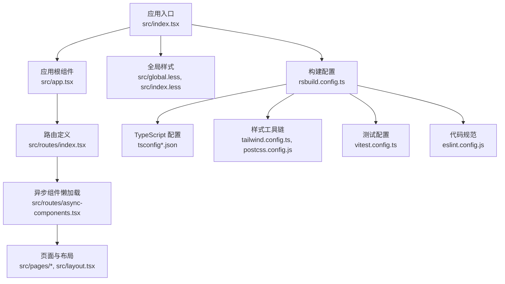
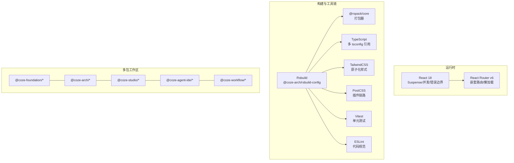
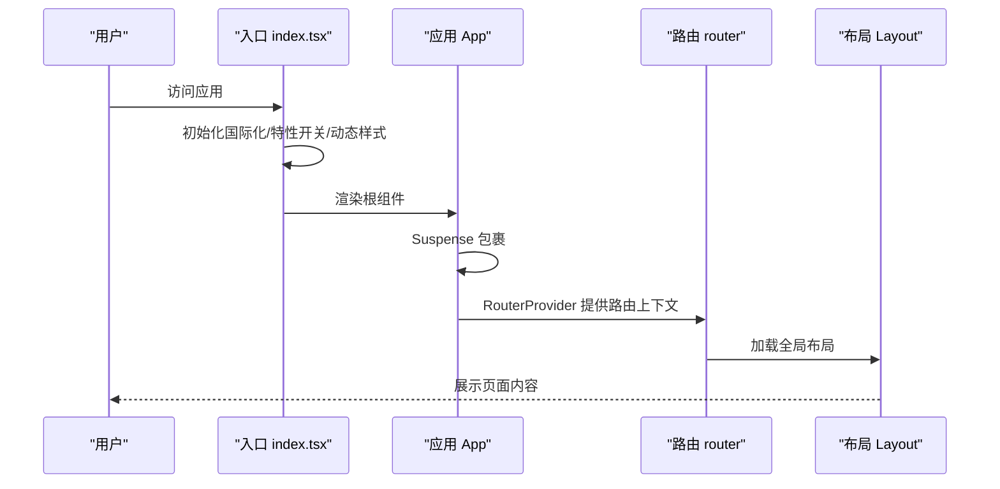
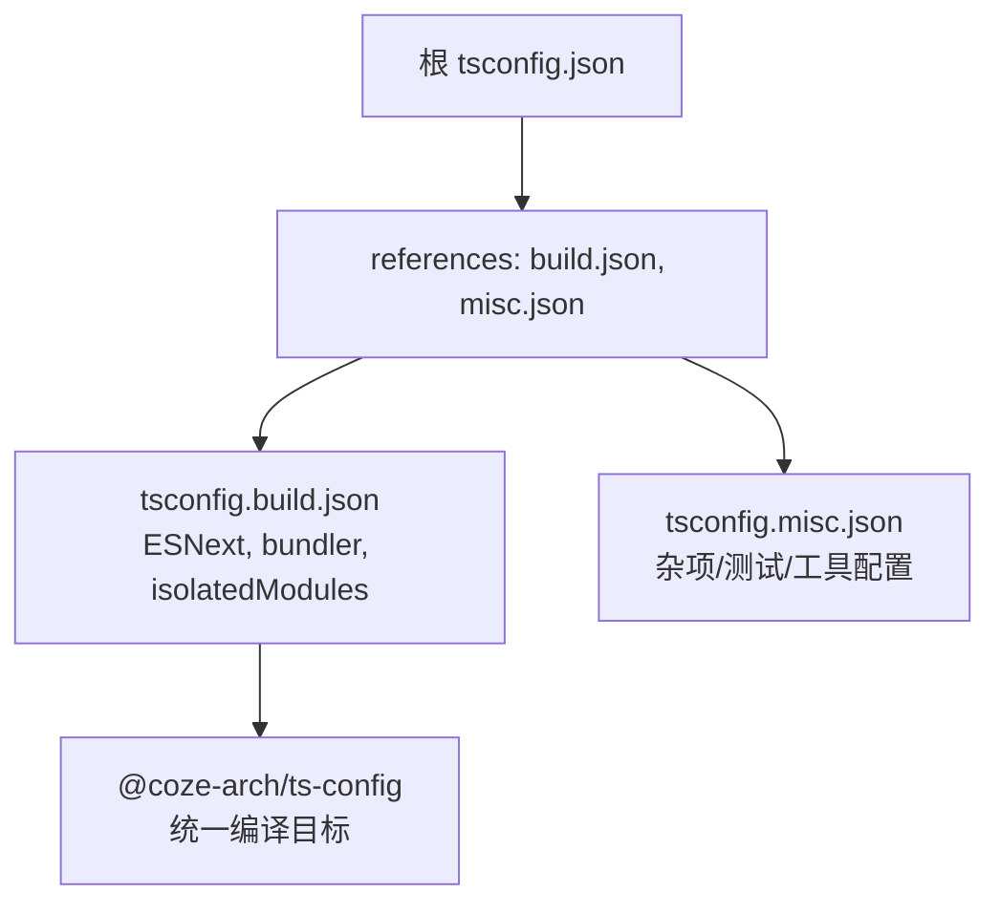
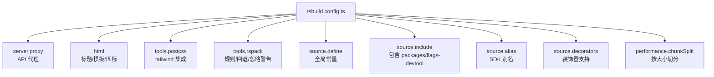
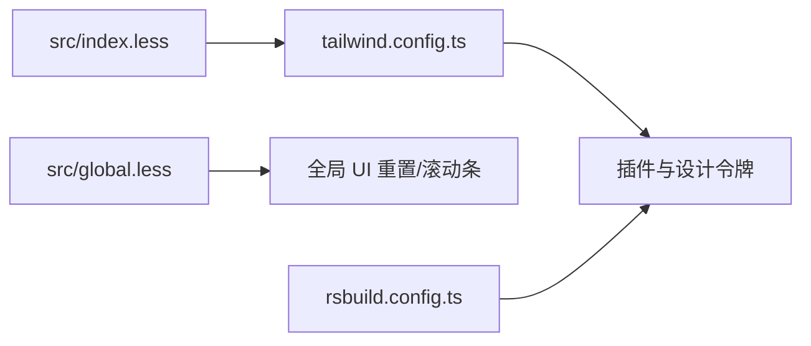
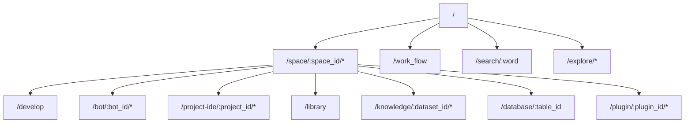
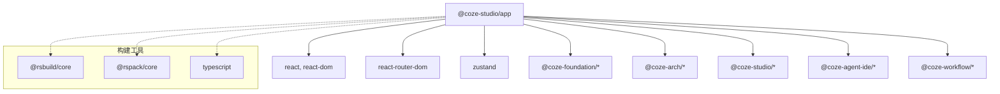

# 技术选型与架构决策

<cite>
**本文引用的文件**
- [package.json](file://package.json)
- [rsbuild.config.ts](file://rsbuild.config.ts)
- [tsconfig.json](file://tsconfig.json)
- [tsconfig.build.json](file://tsconfig.build.json)
- [tailwind.config.ts](file://tailwind.config.ts)
- [eslint.config.js](file://eslint.config.js)
- [postcss.config.js](file://postcss.config.js)
- [vitest.config.ts](file://vitest.config.ts)
- [src/index.tsx](file://src/index.tsx)
- [src/app.tsx](file://src/app.tsx)
- [src/layout.tsx](file://src/layout.tsx)
- [src/routes/index.tsx](file://src/routes/index.tsx)
- [src/routes/async-components.tsx](file://src/routes/async-components.tsx)
- [src/global.less](file://src/global.less)
- [src/index.less](file://src/index.less)
- [README.md](file://README.md)
</cite>

## 目录
1. [引言](#引言)
2. [项目结构](#项目结构)
3. [核心组件](#核心组件)
4. [架构总览](#架构总览)
5. [详细组件分析](#详细组件分析)
6. [依赖关系分析](#依赖关系分析)
7. [性能考量](#性能考量)
8. [故障排查指南](#故障排查指南)
9. [结论](#结论)
10. [附录](#附录)

## 引言
本文件面向 Coze Studio 前端的技术选型与架构决策，围绕 React 18、TypeScript、Rsbuild 等核心技术展开，系统说明其选择原因、协同机制、权衡考量（性能/可维护性/开发效率）、版本兼容与升级策略、评估标准与替代方案对比，并结合仓库现状给出技术债管理与架构演进建议。同时，阐述技术栈对项目特性（如多模块 IDE、工作流、插件生态）的支持能力。

## 项目结构
该前端应用采用多包工作区组织，核心入口位于 apps/coze-studio，通过 Rsbuild 构建，TypeScript 提供类型保障，TailwindCSS 与 Less 组合实现样式体系，配合 Vitest 进行单元测试，ESLint 与 PostCSS 规范与后处理流程。

图表来源
- [src/index.tsx:1-55](file://src/index.tsx#L1-L55)
- [src/app.tsx:1-37](file://src/app.tsx#L1-L37)
- [src/routes/index.tsx:1-298](file://src/routes/index.tsx#L1-L298)
- [src/routes/async-components.tsx:1-153](file://src/routes/async-components.tsx#L1-L153)
- [rsbuild.config.ts:1-136](file://rsbuild.config.ts#L1-L136)
- [tsconfig.json:1-16](file://tsconfig.json#L1-L16)
- [tsconfig.build.json:1-134](file://tsconfig.build.json#L1-L134)
- [tailwind.config.ts:1-55](file://tailwind.config.ts#L1-L55)
- [postcss.config.js:1-2](file://postcss.config.js#L1-L2)
- [vitest.config.ts:1-23](file://vitest.config.ts#L1-L23)
- [eslint.config.js:1-7](file://eslint.config.js#L1-L7)

章节来源
- [README.md:1-7](file://README.md#L1-L7)
- [package.json:1-84](file://package.json#L1-L84)

## 核心组件
- 应用入口与初始化：负责国际化、特性开关拉取、动态样式注入以及根节点挂载。
- 应用根组件：统一的 Suspense 包裹与 RouterProvider，提供全局加载态与错误兜底。
- 路由系统：基于 React Router v6 的嵌套路由，支持权限控制、侧边栏菜单、移动端提示等。
- 异步组件：通过 React.lazy 动态导入，拆分页面与模块，降低首屏体积。
- 样式体系：Tailwind 与 Less 双轨并行，Tailwind 用于原子化样式，Less 用于全局与主题定制。
- 构建与工具链：Rsbuild 作为构建内核，Rspack 作为打包器，PostCSS/Tailwind 处理样式，ESLint/Vitest 规范与测试。

章节来源
- [src/index.tsx:26-55](file://src/index.tsx#L26-L55)
- [src/app.tsx:24-37](file://src/app.tsx#L24-L37)
- [src/routes/index.tsx:50-298](file://src/routes/index.tsx#L50-L298)
- [src/routes/async-components.tsx:17-153](file://src/routes/async-components.tsx#L17-L153)
- [src/layout.tsx:19-24](file://src/layout.tsx#L19-L24)

## 架构总览
整体采用“多包工作区 + 自研构建配置”的架构，核心思想是：
- 以 React 18 为核心运行时，利用 Suspense、并发渲染与错误边界提升用户体验与稳定性。
- 以 Rsbuild 为统一构建入口，内置 Rspack 打包器，结合自研 @coze-arch/* 配置，形成可复用的工程化能力。
- 以 TypeScript 保证类型安全，结合多份 tsconfig 实现复合工程的编译隔离与引用关系。
- 以 Tailwind 与 Less 双轨样式体系支撑设计系统与业务样式，配合 PostCSS 插件链路。
- 以 Vitest 与 ESLint 形成测试与规范闭环，保障质量与一致性。

图表来源
- [package.json:19-51](file://package.json#L19-L51)
- [rsbuild.config.ts:19-136](file://rsbuild.config.ts#L19-L136)
- [tsconfig.json:7-14](file://tsconfig.json#L7-L14)
- [tsconfig.build.json:2-14](file://tsconfig.build.json#L2-L14)
- [tailwind.config.ts:25-54](file://tailwind.config.ts#L25-L54)
- [postcss.config.js:1-2](file://postcss.config.js#L1-L2)
- [vitest.config.ts:17-22](file://vitest.config.ts#L17-L22)
- [eslint.config.js:1-7](file://eslint.config.js#L1-L7)

## 详细组件分析

### React 18 选型与协同
- 选择理由
  - 并发渲染与 Suspense：在大型 IDE 与复杂页面中，Suspense 可以优雅地处理异步数据与组件加载，避免白屏与重复渲染。
  - 错误边界：全局错误兜底与局部容错，提升稳定性。
  - 生态成熟：与 React Router、状态管理、UI 组件库深度集成。
- 在本项目中的体现
  - 应用根组件包裹 Suspense，并提供全局错误元素。
  - 路由层通过 React Router v6 的 loader 与懒加载实现按需加载与权限控制。
  - 与 @coze-arch/coze-design、@coze-foundation/* 等包协同，形成一致的 UI 与交互体验。

图表来源
- [src/index.tsx:33-55](file://src/index.tsx#L33-L55)
- [src/app.tsx:24-37](file://src/app.tsx#L24-L37)
- [src/layout.tsx:19-24](file://src/layout.tsx#L19-L24)
- [src/routes/index.tsx:50-298](file://src/routes/index.tsx#L50-L298)

章节来源
- [src/app.tsx:17-36](file://src/app.tsx#L17-L36)
- [src/layout.tsx:17-23](file://src/layout.tsx#L17-L23)
- [src/routes/index.tsx:17-48](file://src/routes/index.tsx#L17-L48)

### TypeScript 选型与工程化
- 选择理由
  - 类型安全：在多包协作中，类型约束能显著降低接口变更带来的风险。
  - 工程化：通过复合 tsconfig 与 references，实现增量编译与模块间引用关系管理。
- 在本项目中的体现
  - 根 tsconfig 引用 build 与 misc 两套配置，分别覆盖构建与杂项场景。
  - build 配置启用 ESNext 模块、bundler 解析、isolatedModules 等，适配现代打包器。
  - 多包共享 @coze-arch/ts-config，统一编译目标与库别名。

图表来源
- [tsconfig.json:7-14](file://tsconfig.json#L7-L14)
- [tsconfig.build.json:2-14](file://tsconfig.build.json#L2-L14)

章节来源
- [tsconfig.json:1-16](file://tsconfig.json#L1-L16)
- [tsconfig.build.json:1-134](file://tsconfig.build.json#L1-L134)

### Rsbuild 与 Rspack 选型
- 选择理由
  - 高性能：基于 Rspack 的快速打包与增量构建，适合大体量前端工程。
  - 易扩展：通过 defineConfig 与工具链钩子，可灵活接入 PostCSS、别名、回退等。
  - 与生态契合：与 @coze-arch/* 配置深度绑定，形成统一的工程化基座。
- 在本项目中的体现
  - 使用 @coze-arch/rsbuild-config 作为默认配置，统一环境变量与构建行为。
  - 配置代理、HTML 注入、PostCSS 插件、路径回退（path-browserify）、watchOptions 等。
  - 性能优化：chunkSplit 按大小切分，减少单 chunk 体积，提升缓存命中。

图表来源
- [rsbuild.config.ts:26-136](file://rsbuild.config.ts#L26-L136)

章节来源
- [rsbuild.config.ts:19-136](file://rsbuild.config.ts#L19-L136)
- [package.json:68-80](file://package.json#L68-L80)

### 样式体系与设计系统
- 选择理由
  - Tailwind 原子化：快速搭建界面，减少手写样式成本。
  - Less 全局与主题：满足复杂主题与全局样式需求。
  - 设计令牌：通过设计令牌映射到 Tailwind，统一视觉语言。
- 在本项目中的体现
  - tailwind.config.ts 读取设计令牌与响应式常量，开启 safelist 与插件。
  - index.less 引入 Tailwind 基础、组件与工具类，global.less 定义全局重置与滚动条样式。
  - Rsbuild 中注入 tailwind 插件，确保样式链路完整。

图表来源
- [tailwind.config.ts:25-54](file://tailwind.config.ts#L25-L54)
- [src/index.less:1-9](file://src/index.less#L1-L9)
- [src/global.less:1-235](file://src/global.less#L1-L235)
- [rsbuild.config.ts:50-54](file://rsbuild.config.ts#L50-L54)

章节来源
- [tailwind.config.ts:1-55](file://tailwind.config.ts#L1-L55)
- [src/index.less:1-9](file://src/index.less#L1-L9)
- [src/global.less:1-235](file://src/global.less#L1-L235)
- [rsbuild.config.ts:50-54](file://rsbuild.config.ts#L50-L54)

### 路由与模块化
- 选择理由
  - 嵌套路由：清晰表达空间/工作区/页面层级，便于权限与菜单联动。
  - 懒加载：结合 React.lazy 与 loader，实现按需加载与权限校验。
- 在本项目中的体现
  - 路由表集中定义，包含登录页、工作区、IDE、发布页、知识库、数据库、插件商店、探索页等。
  - 异步组件集中导出，统一懒加载策略与错误处理。

图表来源
- [src/routes/index.tsx:50-298](file://src/routes/index.tsx#L50-L298)
- [src/routes/async-components.tsx:17-153](file://src/routes/async-components.tsx#L17-L153)

章节来源
- [src/routes/index.tsx:1-298](file://src/routes/index.tsx#L1-L298)
- [src/routes/async-components.tsx:1-153](file://src/routes/async-components.tsx#L1-L153)

### 测试与规范
- 测试：Vitest 配置继承 @coze-arch/vitest-config，支持 web 环境与覆盖率。
- 规范：ESLint 配置继承 @coze-arch/eslint-config，统一规则与包根目录。
- PostCSS：通过 @coze-arch/postcss-config 统一插件链路。

章节来源
- [vitest.config.ts:17-22](file://vitest.config.ts#L17-L22)
- [eslint.config.js:1-7](file://eslint.config.js#L1-L7)
- [postcss.config.js:1-2](file://postcss.config.js#L1-L2)

## 依赖关系分析
- 运行时依赖
  - React 18 与 React DOM：应用核心运行时。
  - React Router DOM：路由与导航。
  - Zustand：轻量状态管理。
  - @coze-* 生态：foundation、studio、agent-ide、workflow 等模块化包。
- 开发依赖
  - Rsbuild 与 Rspack：构建与打包。
  - TypeScript 与相关类型：类型检查与工程化。
  - TailwindCSS、PostCSS、ESLint、Vitest：样式、规范与测试。

图表来源
- [package.json:19-80](file://package.json#L19-L80)

章节来源
- [package.json:19-80](file://package.json#L19-L80)

## 性能考量
- 体积与加载
  - 按需加载：通过 React.lazy 与路由 loader，减少首屏脚本体积。
  - 分包策略：Rsbuild chunkSplit 按大小切分，避免超大 chunk 导致缓存失效。
  - 依赖回退：path-browserify 回退，避免 Node polyfill 带来的额外体积。
- 编译与构建
  - ESNext + bundler 解析：提升打包效率与 Tree Shaking 效果。
  - isolatedModules：加速增量编译。
- 运行时
  - Suspense：避免重复渲染与闪烁，提升感知性能。
  - 错误边界：防止异常扩散，保持页面可用性。

章节来源
- [rsbuild.config.ts:126-132](file://rsbuild.config.ts#L126-L132)
- [rsbuild.config.ts:68-88](file://rsbuild.config.ts#L68-L88)
- [tsconfig.build.json:8-13](file://tsconfig.build.json#L8-L13)
- [src/app.tsx:24-36](file://src/app.tsx#L24-L36)

## 故障排查指南
- 构建阶段
  - 代理不通：检查 rsbuild.server.proxy 的目标地址与上下文匹配。
  - 样式缺失：确认 tailwind 插件是否正确注入，content 路径是否包含业务源码。
  - 路径解析失败：检查 alias 与 fallback 配置，尤其是 @coze-arch/* 与 react-router-dom。
- 运行时
  - 页面空白：检查 Suspense fallback 与错误边界是否生效。
  - 路由不跳转：确认 loader 返回的 requireAuth 与 hasSider 是否符合预期。
  - 国际化/特性开关：确认初始化顺序与超时配置。

章节来源
- [rsbuild.config.ts:26-43](file://rsbuild.config.ts#L26-L43)
- [rsbuild.config.ts:50-88](file://rsbuild.config.ts#L50-L88)
- [src/index.tsx:26-43](file://src/index.tsx#L26-L43)
- [src/routes/index.tsx:82-96](file://src/routes/index.tsx#L82-L96)

## 结论
本项目在 React 18、TypeScript、Rsbuild 的组合下，形成了高性能、可维护、可扩展的前端工程基座。通过多包工作区与自研工程化配置，实现了跨团队协作与一致性交付。未来可在以下方面持续演进：
- 版本升级：建立明确的升级窗口与回归策略，优先升级构建链路与核心依赖。
- 技术债：逐步收敛动态 import 的分散性，统一懒加载策略；完善错误边界与监控埋点。
- 架构演进：在现有路由与模块基础上，引入更细粒度的微前端或模块联邦，进一步提升独立演进能力。

## 附录

### 技术选型评估标准
- 性能：构建速度、首屏体积、运行时渲染效率、缓存命中率。
- 可维护性：类型覆盖、模块化程度、配置复用、文档与规范。
- 开发效率：热更新、调试体验、测试覆盖率、问题定位速度。
- 生态与社区：周边工具链成熟度、升级频率与兼容性。

### 替代方案对比（概念性）
- 构建工具：Webpack（生态成熟但配置复杂）、Vite（开发体验佳但生态差异）、Rsbuild（与 Rspack 高度契合，适合大工程）。
- 路由：Next.js App Router（约定式路由，但与现有路由体系差异较大），当前方案更贴合现有嵌套路由与权限模型。
- 状态管理：Redux Toolkit（功能完备但样板代码较多），Zustand 更轻量，契合当前规模。

### 版本兼容性与升级策略
- React 18：与 Suspense/并发渲染兼容良好，升级需关注第三方库的兼容性与错误边界使用。
- Rsbuild/Rspack：遵循官方升级节奏，先在预发验证，再灰度到线上。
- TypeScript：以 @coze-arch/ts-config 为基准，逐步提升目标版本，确保多包引用一致。
- TailwindCSS：与设计令牌解耦，升级时优先验证 safelist 与插件链路。

### 对项目特性实现的支持
- 多 IDE 场景：通过异步组件与路由 loader，实现 IDE 与发布页的按需加载与权限控制。
- 工作流与插件生态：路由与模块化设计便于扩展新的页面与适配器。
- 国际化与主题：i18n 初始化与 Tailwind 设计令牌映射，支持多语言与主题切换。