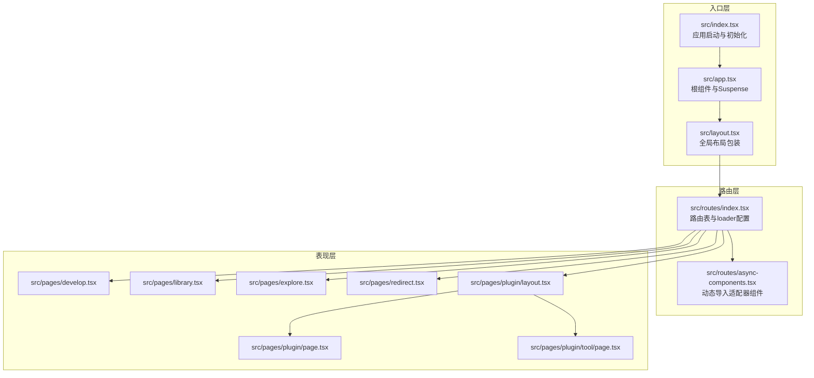
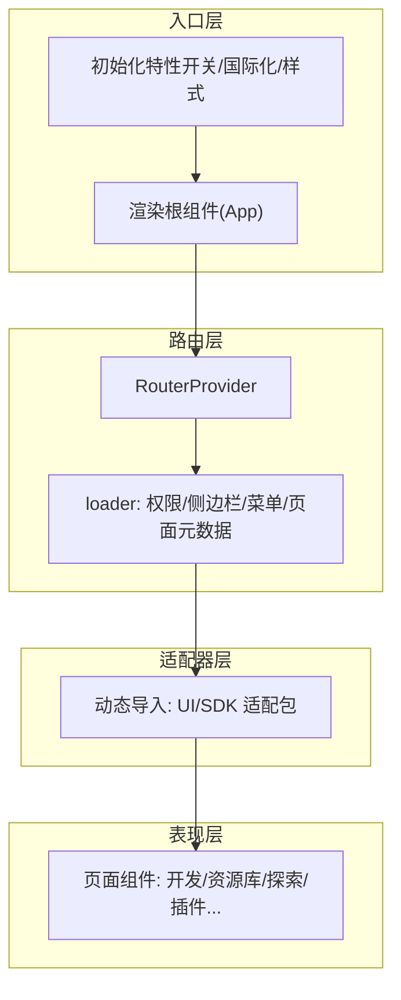
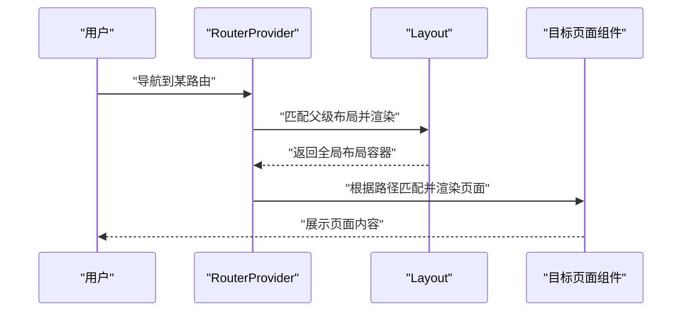
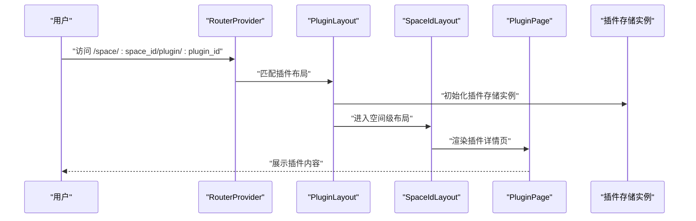
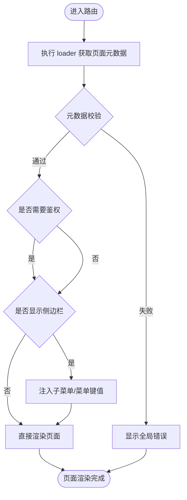
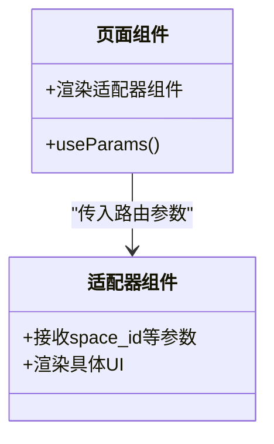
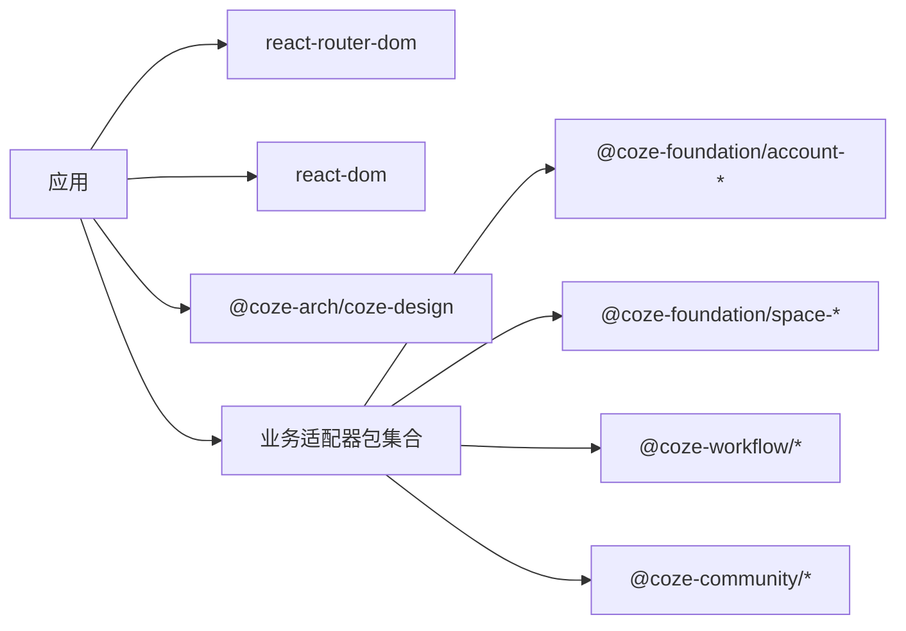

# 整体架构模式

<cite>
**本文引用的文件**
- [src/app.tsx](file://src/app.tsx)
- [src/index.tsx](file://src/index.tsx)
- [src/layout.tsx](file://src/layout.tsx)
- [src/routes/index.tsx](file://src/routes/index.tsx)
- [src/routes/async-components.tsx](file://src/routes/async-components.tsx)
- [src/pages/develop.tsx](file://src/pages/develop.tsx)
- [src/pages/library.tsx](file://src/pages/library.tsx)
- [src/pages/plugin/layout.tsx](file://src/pages/plugin/layout.tsx)
- [src/pages/plugin/page.tsx](file://src/pages/plugin/page.tsx)
- [src/pages/plugin/tool/page.tsx](file://src/pages/plugin/tool/page.tsx)
- [src/pages/redirect.tsx](file://src/pages/redirect.tsx)
- [src/pages/explore.tsx](file://src/pages/explore.tsx)
- [package.json](file://package.json)
- [rsbuild.config.ts](file://rsbuild.config.ts)
- [README.md](file://README.md)
</cite>

## 目录
1. [引言](#引言)
2. [项目结构](#项目结构)
3. [核心组件](#核心组件)
4. [架构总览](#架构总览)
5. [详细组件分析](#详细组件分析)
6. [依赖分析](#依赖分析)
7. [性能考量](#性能考量)
8. [故障排查指南](#故障排查指南)
9. [结论](#结论)
10. [附录](#附录)

## 引言
本文件面向 Coze Studio 前端应用的整体架构模式，系统性阐述其分层设计与模块化/组件化策略，明确表现层、路由层、适配器层的职责边界，解析系统边界与组件间依赖关系，并给出架构决策的技术考量（如 React Router 的选型、Suspense 模式与懒加载的配合）。同时，结合现有代码结构绘制架构图与流程图，帮助读者快速理解并高效维护该前端体系。

## 项目结构
Coze Studio 前端采用“入口 -> 路由 -> 页面/适配器”的分层组织方式：
- 入口层：负责应用初始化、国际化、特性开关拉取与渲染根组件。
- 路由层：集中声明路由表，统一处理错误边界、权限与侧边菜单等横切能力。
- 适配器层：通过动态导入对接多个业务域的 UI/SDK 适配包，实现跨域解耦。
- 表现层：具体页面组件按功能域拆分，复用适配器与共享 UI 组件。

**图表来源**
- [src/index.tsx:33-52](file://src/index.tsx#L33-L52)
- [src/app.tsx:24-36](file://src/app.tsx#L24-L36)
- [src/layout.tsx:19-23](file://src/layout.tsx#L19-L23)
- [src/routes/index.tsx:50-298](file://src/routes/index.tsx#L50-L298)
- [src/routes/async-components.tsx:17-153](file://src/routes/async-components.tsx#L17-L153)
- [src/pages/develop.tsx:21-26](file://src/pages/develop.tsx#L21-L26)
- [src/pages/library.tsx:21-26](file://src/pages/library.tsx#L21-L26)
- [src/pages/explore.tsx:37-66](file://src/pages/explore.tsx#L37-L66)
- [src/pages/redirect.tsx:19-24](file://src/pages/redirect.tsx#L19-L24)
- [src/pages/plugin/layout.tsx:22-38](file://src/pages/plugin/layout.tsx#L22-L38)
- [src/pages/plugin/page.tsx:23-33](file://src/pages/plugin/page.tsx#L23-L33)
- [src/pages/plugin/tool/page.tsx:22-32](file://src/pages/plugin/tool/page.tsx#L22-L32)

**章节来源**
- [src/index.tsx:33-52](file://src/index.tsx#L33-L52)
- [src/app.tsx:24-36](file://src/app.tsx#L24-L36)
- [src/layout.tsx:19-23](file://src/layout.tsx#L19-L23)
- [src/routes/index.tsx:50-298](file://src/routes/index.tsx#L50-L298)
- [src/routes/async-components.tsx:17-153](file://src/routes/async-components.tsx#L17-L153)
- [README.md:1-7](file://README.md#L1-L7)

## 核心组件
- 应用入口与初始化
  - 初始化特性开关、国际化与样式资源，再挂载根组件。
  - 关键路径参考：[src/index.tsx:33-52](file://src/index.tsx#L33-L52)。
- 根组件与 Suspense
  - 使用 Suspense 包裹 RouterProvider，统一兜底加载态；路由层通过 loader 控制页面级加载行为。
  - 关键路径参考：[src/app.tsx:24-36](file://src/app.tsx#L24-L36)。
- 全局布局包装
  - 通过全局适配器注入初始化钩子与通用布局容器。
  - 关键路径参考：[src/layout.tsx:19-23](file://src/layout.tsx#L19-L23)。
- 路由表与 loader
  - 集中声明所有路由，统一设置是否需要侧边栏、是否鉴权、子菜单与菜单键值等横切信息。
  - 关键路径参考：[src/routes/index.tsx:50-298](file://src/routes/index.tsx#L50-L298)。
- 动态导入与适配器
  - 将各业务域 UI/SDK 以 lazy 导入，降低首屏体积，提升可维护性。
  - 关键路径参考：[src/routes/async-components.tsx:17-153](file://src/routes/async-components.tsx#L17-L153)。

**章节来源**
- [src/index.tsx:26-52](file://src/index.tsx#L26-L52)
- [src/app.tsx:24-36](file://src/app.tsx#L24-L36)
- [src/layout.tsx:19-23](file://src/layout.tsx#L19-L23)
- [src/routes/index.tsx:50-298](file://src/routes/index.tsx#L50-L298)
- [src/routes/async-components.tsx:17-153](file://src/routes/async-components.tsx#L17-L153)

## 架构总览
Coze Studio 采用“入口层 -> 路由层 -> 适配器层 -> 表现层”的分层架构：
- 表现层：页面组件按功能域拆分，如工作区开发页、资源库、探索页、插件页等。
- 路由层：集中管理路由与 loader，统一处理权限、侧边栏、菜单与页面元数据。
- 适配器层：通过动态导入对接多个业务域 UI/SDK，实现跨域解耦与版本隔离。
- 入口层：负责初始化、国际化、特性开关与样式资源，再渲染根组件。

**图表来源**
- [src/index.tsx:33-52](file://src/index.tsx#L33-L52)
- [src/app.tsx:24-36](file://src/app.tsx#L24-L36)
- [src/routes/index.tsx:50-298](file://src/routes/index.tsx#L50-L298)
- [src/routes/async-components.tsx:17-153](file://src/routes/async-components.tsx#L17-L153)

## 详细组件分析

### 路由与页面交互序列
以下序列图展示了从用户访问到页面渲染的关键调用链，体现路由层与表现层的协作：

**图表来源**
- [src/app.tsx:24-36](file://src/app.tsx#L24-L36)
- [src/layout.tsx:19-23](file://src/layout.tsx#L19-L23)
- [src/routes/index.tsx:50-298](file://src/routes/index.tsx#L50-L298)

**章节来源**
- [src/app.tsx:24-36](file://src/app.tsx#L24-L36)
- [src/layout.tsx:19-23](file://src/layout.tsx#L19-L23)
- [src/routes/index.tsx:50-298](file://src/routes/index.tsx#L50-L298)

### 插件域页面的适配器交互
插件域页面通过 Provider 注入上下文，再由页面组件消费状态完成初始化与渲染，体现“适配器层”对“表现层”的解耦支撑。

**图表来源**
- [src/routes/index.tsx:218-237](file://src/routes/index.tsx#L218-L237)
- [src/pages/plugin/layout.tsx:22-38](file://src/pages/plugin/layout.tsx#L22-L38)
- [src/pages/plugin/page.tsx:23-33](file://src/pages/plugin/page.tsx#L23-L33)

**章节来源**
- [src/pages/plugin/layout.tsx:22-38](file://src/pages/plugin/layout.tsx#L22-L38)
- [src/pages/plugin/page.tsx:23-33](file://src/pages/plugin/page.tsx#L23-L33)
- [src/routes/index.tsx:218-237](file://src/routes/index.tsx#L218-L237)

### 路由加载与错误处理流程
路由层通过 loader 返回页面元数据，统一控制侧边栏、鉴权与菜单；errorElement 提供全局错误兜底。

**图表来源**
- [src/routes/index.tsx:80-96](file://src/routes/index.tsx#L80-L96)
- [src/routes/index.tsx:100-108](file://src/routes/index.tsx#L100-L108)
- [src/routes/index.tsx:262-294](file://src/routes/index.tsx#L262-L294)

**章节来源**
- [src/routes/index.tsx:80-96](file://src/routes/index.tsx#L80-L96)
- [src/routes/index.tsx:100-108](file://src/routes/index.tsx#L100-L108)
- [src/routes/index.tsx:262-294](file://src/routes/index.tsx#L262-L294)

### 页面级参数与适配器映射
页面组件通过 useParams 获取路由参数，再将参数传递给对应适配器组件，实现参数驱动的页面渲染。

**图表来源**
- [src/pages/develop.tsx:21-26](file://src/pages/develop.tsx#L21-L26)
- [src/pages/library.tsx:21-26](file://src/pages/library.tsx#L21-L26)

**章节来源**
- [src/pages/develop.tsx:21-26](file://src/pages/develop.tsx#L21-L26)
- [src/pages/library.tsx:21-26](file://src/pages/library.tsx#L21-L26)

## 依赖分析
- 技术栈与构建工具
  - 基于 React 18 与 React Router v6，使用 Rsbuild 构建，启用代理、PostCSS、TailwindCSS 等能力。
  - 参考路径：[package.json:19-51](file://package.json#L19-L51)，[rsbuild.config.ts:26-135](file://rsbuild.config.ts#L26-L135)。
- 外部依赖与适配器
  - 通过 workspace:* 与本地包管理器对接多个适配器包，如 account、space、workflow、community 等。
  - 参考路径：[package.json:20-44](file://package.json#L20-L44)。
- 动态导入与懒加载
  - 路由层与页面层广泛使用 lazy 导入，降低首屏体积，提升可维护性。
  - 参考路径：[src/routes/async-components.tsx:17-153](file://src/routes/async-components.tsx#L17-L153)。

**图表来源**
- [package.json:19-51](file://package.json#L19-L51)
- [package.json:20-44](file://package.json#L20-L44)

**章节来源**
- [package.json:19-51](file://package.json#L19-L51)
- [package.json:20-44](file://package.json#L20-L44)
- [rsbuild.config.ts:26-135](file://rsbuild.config.ts#L26-L135)

## 性能考量
- 代码分割与懒加载
  - 通过 lazy 导入与路由 loader 分离页面逻辑，减少首屏依赖，提升 TTI。
  - 参考路径：[src/routes/async-components.tsx:17-153](file://src/routes/async-components.tsx#L17-L153)。
- 构建优化
  - Rsbuild 启用 chunkSplit 按大小拆分，避免单块过大；PostCSS/TailwindCSS 配置按需引入。
  - 参考路径：[rsbuild.config.ts:126-132](file://rsbuild.config.ts#L126-L132)，[rsbuild.config.ts:50-54](file://rsbuild.config.ts#L50-L54)。
- 运行时优化
  - Suspense 统一加载态，减少白屏时间；loader 中控制页面元数据，避免重复请求。
  - 参考路径：[src/app.tsx:24-36](file://src/app.tsx#L24-L36)，[src/routes/index.tsx:50-298](file://src/routes/index.tsx#L50-L298)。

**章节来源**
- [src/routes/async-components.tsx:17-153](file://src/routes/async-components.tsx#L17-L153)
- [rsbuild.config.ts:126-132](file://rsbuild.config.ts#L126-L132)
- [rsbuild.config.ts:50-54](file://rsbuild.config.ts#L50-L54)
- [src/app.tsx:24-36](file://src/app.tsx#L24-L36)
- [src/routes/index.tsx:50-298](file://src/routes/index.tsx#L50-L298)

## 故障排查指南
- 路由跳转后空白或白屏
  - 检查 Suspense fallback 是否正确渲染，确认 RouterProvider 的错误兜底是否生效。
  - 参考路径：[src/app.tsx:24-36](file://src/app.tsx#L24-L36)。
- 页面未显示侧边栏或菜单异常
  - 检查对应路由的 loader 是否返回 hasSider 与 subMenu 等元数据。
  - 参考路径：[src/routes/index.tsx:100-108](file://src/routes/index.tsx#L100-L108)，[src/routes/index.tsx:262-294](file://src/routes/index.tsx#L262-L294)。
- 插件页面参数缺失报错
  - 确认路由参数 space_id、plugin_id 是否存在，页面组件应进行参数校验与初始化。
  - 参考路径：[src/pages/plugin/layout.tsx:22-38](file://src/pages/plugin/layout.tsx#L22-L38)，[src/pages/plugin/page.tsx:23-33](file://src/pages/plugin/page.tsx#L23-L33)。
- 文档页跳转
  - 文档路由会重定向至官网，检查 Redirect 组件逻辑。
  - 参考路径：[src/pages/redirect.tsx:19-24](file://src/pages/redirect.tsx#L19-L24)。

**章节来源**
- [src/app.tsx:24-36](file://src/app.tsx#L24-L36)
- [src/routes/index.tsx:100-108](file://src/routes/index.tsx#L100-L108)
- [src/routes/index.tsx:262-294](file://src/routes/index.tsx#L262-L294)
- [src/pages/plugin/layout.tsx:22-38](file://src/pages/plugin/layout.tsx#L22-L38)
- [src/pages/plugin/page.tsx:23-33](file://src/pages/plugin/page.tsx#L23-L33)
- [src/pages/redirect.tsx:19-24](file://src/pages/redirect.tsx#L19-L24)

## 结论
Coze Studio 前端以“入口层 -> 路由层 -> 适配器层 -> 表现层”的分层架构实现了高内聚、低耦合的设计。通过 React Router v6 的路由表与 loader、Suspense 的统一加载态、以及大量 lazy 导入，系统在可扩展性、可维护性与性能方面均具备良好基础。未来可在以下方向持续演进：
- 进一步细化“适配器层”的抽象，沉淀通用能力（如权限、埋点、国际化）。
- 在路由层引入更细粒度的缓存策略与预加载机制，优化关键路径体验。
- 探索基于模块联邦的多应用共享与热更新方案，提升开发效率与部署灵活性。

## 附录
- 构建与开发环境
  - 使用 Rsbuild 构建，支持代理、PostCSS、TailwindCSS 与 watch 模式。
  - 参考路径：[README.md:1-7](file://README.md#L1-L7)，[rsbuild.config.ts:26-135](file://rsbuild.config.ts#L26-L135)。
- 依赖清单
  - 关键依赖包括 react-router-dom、react、react-dom、@coze-arch/*、@coze-foundation/*、@coze-community/* 等。
  - 参考路径：[package.json:19-51](file://package.json#L19-L51)