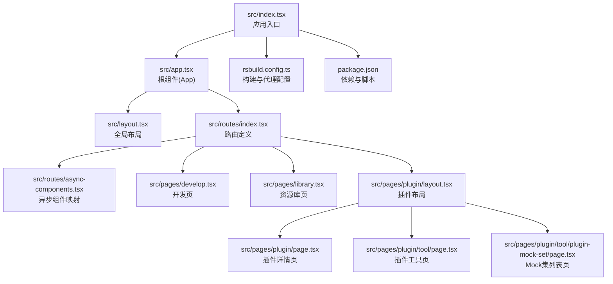
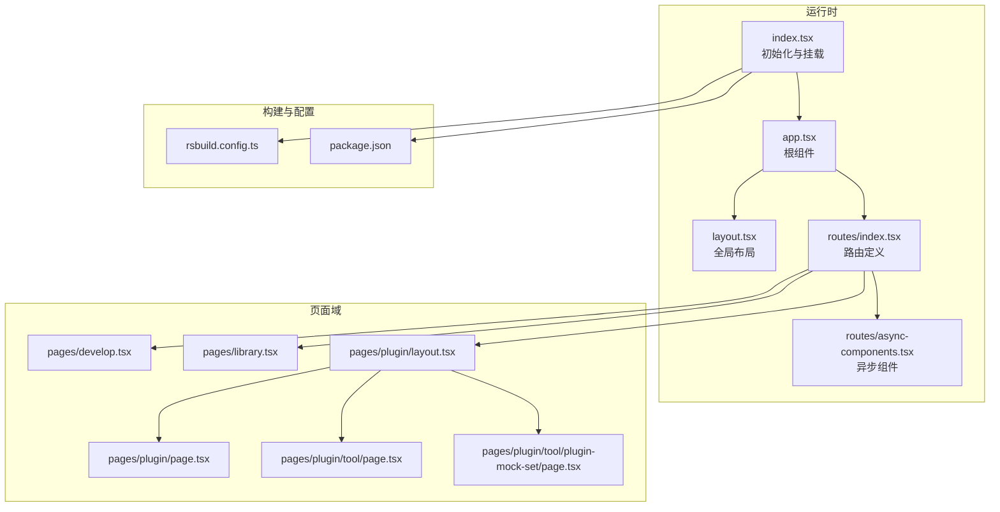
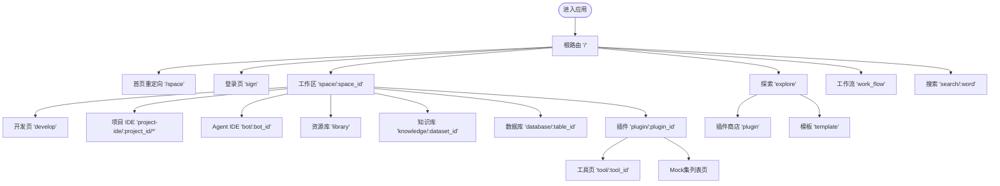
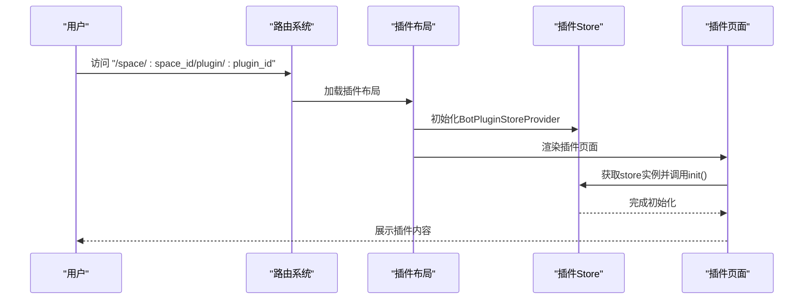
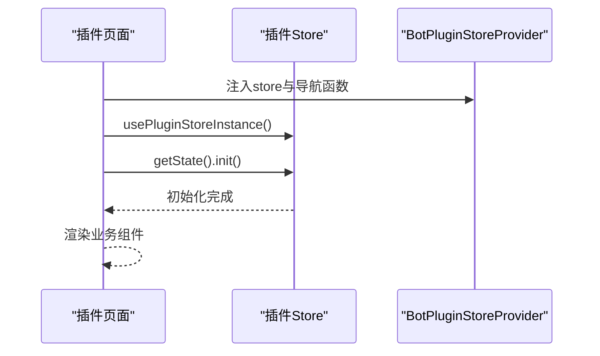
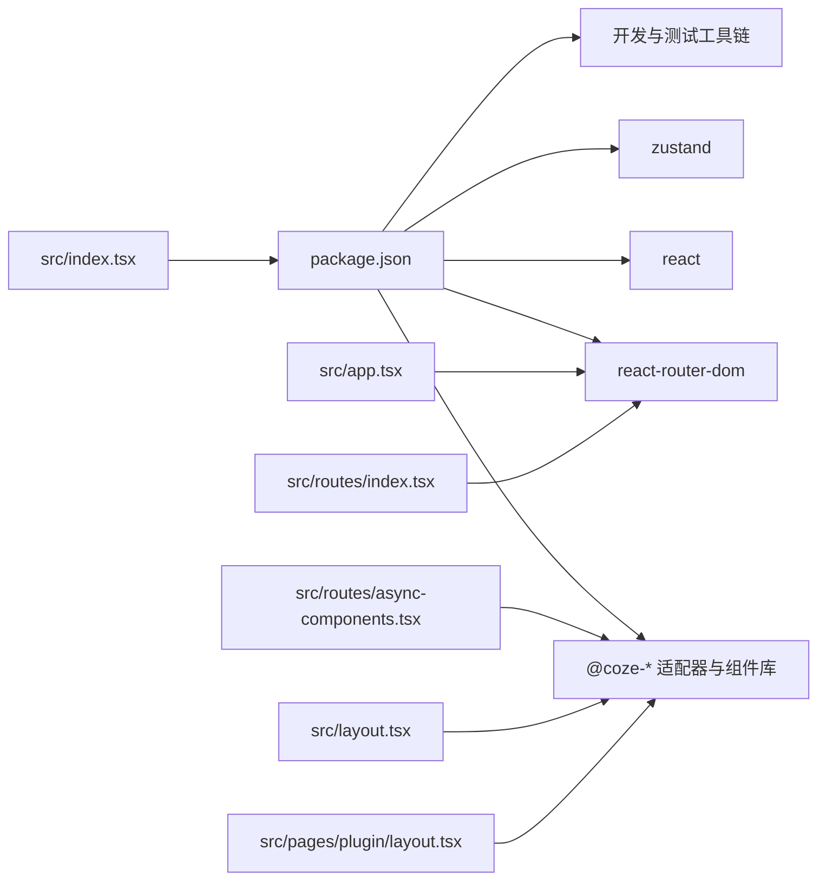

# 架构设计

<cite>
**本文引用的文件**
- [src/app.tsx](file://src/app.tsx)
- [src/index.tsx](file://src/index.tsx)
- [src/layout.tsx](file://src/layout.tsx)
- [src/routes/index.tsx](file://src/routes/index.tsx)
- [src/routes/async-components.tsx](file://src/routes/async-components.tsx)
- [src/pages/plugin/layout.tsx](file://src/pages/plugin/layout.tsx)
- [src/pages/plugin/page.tsx](file://src/pages/plugin/page.tsx)
- [src/pages/plugin/tool/page.tsx](file://src/pages/plugin/tool/page.tsx)
- [src/pages/plugin/tool/plugin-mock-set/page.tsx](file://src/pages/plugin/tool/plugin-mock-set/page.tsx)
- [src/pages/develop.tsx](file://src/pages/develop.tsx)
- [src/pages/library.tsx](file://src/pages/library.tsx)
- [rsbuild.config.ts](file://rsbuild.config.ts)
- [package.json](file://package.json)
- [README.md](file://README.md)
</cite>

## 目录
1. [引言](#引言)
2. [项目结构](#项目结构)
3. [核心组件](#核心组件)
4. [架构总览](#架构总览)
5. [详细组件分析](#详细组件分析)
6. [依赖关系分析](#依赖关系分析)
7. [性能考量](#性能考量)
8. [故障排查指南](#故障排查指南)
9. [结论](#结论)
10. [附录](#附录)

## 引言
本文件为 Coze Studio 前端应用的架构设计文档，聚焦于整体架构模式（分层与模块化）、路由系统（嵌套路由、懒加载、权限控制）、状态管理（Zustand 使用与数据流）、组件组织（全局布局、页面组件、异步组件）以及技术选型与架构权衡。文档同时给出系统边界、组件交互与数据流向图示，并提供架构演进与未来规划建议。

## 项目结构
Coze Studio 采用基于功能域的模块化组织：顶层入口负责初始化与根组件挂载；路由层集中定义嵌套路由与懒加载页面；页面层按功能域拆分（如插件、工作区、探索等），并通过异步组件实现按需加载；构建层通过 Rsbuild 配置代理、样式与打包策略。

图表来源
- [src/index.tsx:1-55](file://src/index.tsx#L1-L55)
- [src/app.tsx:1-37](file://src/app.tsx#L1-L37)
- [src/layout.tsx:1-24](file://src/layout.tsx#L1-L24)
- [src/routes/index.tsx:1-298](file://src/routes/index.tsx#L1-L298)
- [src/routes/async-components.tsx:1-153](file://src/routes/async-components.tsx#L1-L153)
- [src/pages/develop.tsx:1-27](file://src/pages/develop.tsx#L1-L27)
- [src/pages/library.tsx:1-27](file://src/pages/library.tsx#L1-L27)
- [src/pages/plugin/layout.tsx:1-41](file://src/pages/plugin/layout.tsx#L1-L41)
- [src/pages/plugin/page.tsx:1-36](file://src/pages/plugin/page.tsx#L1-L36)
- [src/pages/plugin/tool/page.tsx:1-35](file://src/pages/plugin/tool/page.tsx#L1-L35)
- [src/pages/plugin/tool/plugin-mock-set/page.tsx:1-36](file://src/pages/plugin/tool/plugin-mock-set/page.tsx#L1-L36)
- [rsbuild.config.ts:1-136](file://rsbuild.config.ts#L1-L136)
- [package.json:1-84](file://package.json#L1-L84)

章节来源
- [src/index.tsx:1-55](file://src/index.tsx#L1-L55)
- [src/app.tsx:1-37](file://src/app.tsx#L1-L37)
- [src/layout.tsx:1-24](file://src/layout.tsx#L1-L24)
- [src/routes/index.tsx:1-298](file://src/routes/index.tsx#L1-L298)
- [src/routes/async-components.tsx:1-153](file://src/routes/async-components.tsx#L1-L153)
- [rsbuild.config.ts:1-136](file://rsbuild.config.ts#L1-L136)
- [package.json:1-84](file://package.json#L1-L84)
- [README.md:1-7](file://README.md#L1-L7)

## 核心组件
- 应用入口与初始化
  - 入口负责国际化、特性开关拉取、动态样式注入与根节点渲染。
  - 关键路径：[src/index.tsx:1-55](file://src/index.tsx#L1-L55)
- 根组件与全局布局
  - 根组件包裹 Suspense 并注入 RouterProvider；全局布局通过适配器统一承载侧边栏、菜单与错误兜底。
  - 关键路径：[src/app.tsx:1-37](file://src/app.tsx#L1-L37)、[src/layout.tsx:1-24](file://src/layout.tsx#L1-L24)
- 路由系统
  - 使用 createBrowserRouter 定义主路由与嵌套路由，结合 loader 控制权限、侧边栏与菜单项。
  - 关键路径：[src/routes/index.tsx:1-298](file://src/routes/index.tsx#L1-L298)
- 异步组件与懒加载
  - 通过 lazy 按需加载页面与布局，降低首屏体积，提升加载性能。
  - 关键路径：[src/routes/async-components.tsx:1-153](file://src/routes/async-components.tsx#L1-L153)
- 页面组件
  - 功能域页面按需渲染，如开发页、资源库页、插件相关页等。
  - 关键路径：[src/pages/develop.tsx:1-27](file://src/pages/develop.tsx#L1-L27)、[src/pages/library.tsx:1-27](file://src/pages/library.tsx#L1-L27)、[src/pages/plugin/layout.tsx:1-41](file://src/pages/plugin/layout.tsx#L1-L41)、[src/pages/plugin/page.tsx:1-36](file://src/pages/plugin/page.tsx#L1-L36)、[src/pages/plugin/tool/page.tsx:1-35](file://src/pages/plugin/tool/page.tsx#L1-L35)、[src/pages/plugin/tool/plugin-mock-set/page.tsx:1-36](file://src/pages/plugin/tool/plugin-mock-set/page.tsx#L1-L36)

章节来源
- [src/index.tsx:1-55](file://src/index.tsx#L1-L55)
- [src/app.tsx:1-37](file://src/app.tsx#L1-L37)
- [src/layout.tsx:1-24](file://src/layout.tsx#L1-L24)
- [src/routes/index.tsx:1-298](file://src/routes/index.tsx#L1-L298)
- [src/routes/async-components.tsx:1-153](file://src/routes/async-components.tsx#L1-L153)
- [src/pages/develop.tsx:1-27](file://src/pages/develop.tsx#L1-L27)
- [src/pages/library.tsx:1-27](file://src/pages/library.tsx#L1-L27)
- [src/pages/plugin/layout.tsx:1-41](file://src/pages/plugin/layout.tsx#L1-L41)
- [src/pages/plugin/page.tsx:1-36](file://src/pages/plugin/page.tsx#L1-L36)
- [src/pages/plugin/tool/page.tsx:1-35](file://src/pages/plugin/tool/page.tsx#L1-L35)
- [src/pages/plugin/tool/plugin-mock-set/page.tsx:1-36](file://src/pages/plugin/tool/plugin-mock-set/page.tsx#L1-L36)

## 架构总览
Coze Studio 采用“入口初始化 → 路由驱动 → 异步组件渲染”的前端架构。入口负责全局初始化；路由层承担导航、权限与菜单控制；页面层按功能域组织；构建层通过 Rsbuild 提供代理、样式与打包优化。

图表来源
- [src/index.tsx:1-55](file://src/index.tsx#L1-L55)
- [src/app.tsx:1-37](file://src/app.tsx#L1-L37)
- [src/layout.tsx:1-24](file://src/layout.tsx#L1-L24)
- [src/routes/index.tsx:1-298](file://src/routes/index.tsx#L1-L298)
- [src/routes/async-components.tsx:1-153](file://src/routes/async-components.tsx#L1-L153)
- [src/pages/develop.tsx:1-27](file://src/pages/develop.tsx#L1-L27)
- [src/pages/library.tsx:1-27](file://src/pages/library.tsx#L1-L27)
- [src/pages/plugin/layout.tsx:1-41](file://src/pages/plugin/layout.tsx#L1-L41)
- [src/pages/plugin/page.tsx:1-36](file://src/pages/plugin/page.tsx#L1-L36)
- [src/pages/plugin/tool/page.tsx:1-35](file://src/pages/plugin/tool/page.tsx#L1-L35)
- [src/pages/plugin/tool/plugin-mock-set/page.tsx:1-36](file://src/pages/plugin/tool/plugin-mock-set/page.tsx#L1-L36)
- [rsbuild.config.ts:1-136](file://rsbuild.config.ts#L1-L136)
- [package.json:1-84](file://package.json#L1-L84)

## 详细组件分析

### 路由系统设计
- 嵌套路由结构
  - 主路由以“/”为根，内部包含登录、工作区、探索、工作流、搜索等多级子路由；工作区下进一步嵌套空间 ID、项目 IDE、Agent IDE、知识库、数据库、插件等。
  - 关键路径：[src/routes/index.tsx:78-296](file://src/routes/index.tsx#L78-L296)
- 懒加载实现
  - 所有页面与布局均通过 lazy 导入，配合 Suspense 提供加载态，减少首屏包体。
  - 关键路径：[src/routes/async-components.tsx:1-153](file://src/routes/async-components.tsx#L1-L153)
- 权限控制机制
  - 通过 loader 返回 requireAuth、hasSider 等标志位，驱动布局与菜单显示逻辑；部分页面还返回 subMenu、menuKey 等用于侧边栏与面包屑联动。
  - 关键路径：[src/routes/index.tsx:102-107](file://src/routes/index.tsx#L102-L107)、[src/routes/index.tsx:151-156](file://src/routes/index.tsx#L151-L156)

图表来源
- [src/routes/index.tsx:50-296](file://src/routes/index.tsx#L50-L296)

章节来源
- [src/routes/index.tsx:1-298](file://src/routes/index.tsx#L1-L298)
- [src/routes/async-components.tsx:1-153](file://src/routes/async-components.tsx#L1-L153)

### 组件系统组织
- 全局布局
  - 通过 GlobalLayout 适配器统一承载侧边栏、菜单与错误兜底，入口调用 useAppInit 完成应用初始化。
  - 关键路径：[src/layout.tsx:1-24](file://src/layout.tsx#L1-L24)
- 页面组件
  - 开发页与资源库页根据当前空间 ID 渲染对应功能组件。
  - 插件域页面通过 BotPluginStoreProvider 注入 store 实例与导航函数，页面在 mount 后主动初始化 store。
  - 关键路径：[src/pages/develop.tsx:1-27](file://src/pages/develop.tsx#L1-L27)、[src/pages/library.tsx:1-27](file://src/pages/library.tsx#L1-L27)、[src/pages/plugin/layout.tsx:1-41](file://src/pages/plugin/layout.tsx#L1-L41)、[src/pages/plugin/page.tsx:1-36](file://src/pages/plugin/page.tsx#L1-L36)、[src/pages/plugin/tool/page.tsx:1-35](file://src/pages/plugin/tool/page.tsx#L1-L35)、[src/pages/plugin/tool/plugin-mock-set/page.tsx:1-36](file://src/pages/plugin/tool/plugin-mock-set/page.tsx#L1-L36)

图表来源
- [src/pages/plugin/layout.tsx:22-37](file://src/pages/plugin/layout.tsx#L22-L37)
- [src/pages/plugin/page.tsx:23-31](file://src/pages/plugin/page.tsx#L23-L31)

章节来源
- [src/layout.tsx:1-24](file://src/layout.tsx#L1-L24)
- [src/pages/develop.tsx:1-27](file://src/pages/develop.tsx#L1-L27)
- [src/pages/library.tsx:1-27](file://src/pages/library.tsx#L1-L27)
- [src/pages/plugin/layout.tsx:1-41](file://src/pages/plugin/layout.tsx#L1-L41)
- [src/pages/plugin/page.tsx:1-36](file://src/pages/plugin/page.tsx#L1-L36)
- [src/pages/plugin/tool/page.tsx:1-35](file://src/pages/plugin/tool/page.tsx#L1-L35)
- [src/pages/plugin/tool/plugin-mock-set/page.tsx:1-36](file://src/pages/plugin/tool/plugin-mock-set/page.tsx#L1-L36)

### 状态管理架构（Zustand）
- 使用模式
  - 插件域页面通过 usePluginStoreInstance 获取 store 实例，并在组件挂载时调用 init() 完成初始化。
  - 关键路径：[src/pages/plugin/page.tsx:25-31](file://src/pages/plugin/page.tsx#L25-L31)、[src/pages/plugin/tool/page.tsx:24-30](file://src/pages/plugin/tool/page.tsx#L24-L30)、[src/pages/plugin/tool/plugin-mock-set/page.tsx:24-30](file://src/pages/plugin/tool/plugin-mock-set/page.tsx#L24-L30)
- 数据流管理
  - 页面组件仅负责触发初始化与渲染具体业务组件；store 内部负责状态与副作用管理，避免页面直接耦合底层数据源。
  - 关键路径：[src/pages/plugin/layout.tsx:30-34](file://src/pages/plugin/layout.tsx#L30-L34)

图表来源
- [src/pages/plugin/layout.tsx:30-34](file://src/pages/plugin/layout.tsx#L30-L34)
- [src/pages/plugin/page.tsx:25-31](file://src/pages/plugin/page.tsx#L25-L31)

章节来源
- [src/pages/plugin/page.tsx:1-36](file://src/pages/plugin/page.tsx#L1-L36)
- [src/pages/plugin/tool/page.tsx:1-35](file://src/pages/plugin/tool/page.tsx#L1-L35)
- [src/pages/plugin/tool/plugin-mock-set/page.tsx:1-36](file://src/pages/plugin/tool/plugin-mock-set/page.tsx#L1-L36)
- [src/pages/plugin/layout.tsx:1-41](file://src/pages/plugin/layout.tsx#L1-L41)

### 技术选型与架构权衡
- 路由与渲染
  - 采用 React Router v6 与 createBrowserRouter，支持嵌套路由与 loader 控制权限与菜单，兼顾易用性与性能。
  - 关键路径：[src/routes/index.tsx:17-50](file://src/routes/index.tsx#L17-L50)
- 懒加载与体积控制
  - lazy + Suspense 的组合有效降低首屏体积；Rsbuild chunkSplit 策略进一步优化分包大小。
  - 关键路径：[src/routes/async-components.tsx:17-153](file://src/routes/async-components.tsx#L17-L153)、[rsbuild.config.ts:126-132](file://rsbuild.config.ts#L126-L132)
- 构建与代理
  - Rsbuild 提供代理、PostCSS、别名与装饰器支持，满足多包协作与工程化需求。
  - 关键路径：[rsbuild.config.ts:26-43](file://rsbuild.config.ts#L26-L43)、[rsbuild.config.ts:113-118](file://rsbuild.config.ts#L113-L118)
- 状态管理
  - Zustand 轻量、易上手，适合中后台应用的状态管理；与 Provider 模式结合，避免全局污染。
  - 关键路径：[package.json:49-50](file://package.json#L49-L50)

章节来源
- [src/routes/index.tsx:1-298](file://src/routes/index.tsx#L1-L298)
- [src/routes/async-components.tsx:1-153](file://src/routes/async-components.tsx#L1-L153)
- [rsbuild.config.ts:1-136](file://rsbuild.config.ts#L1-L136)
- [package.json:1-84](file://package.json#L1-L84)

## 依赖关系分析
- 外部依赖
  - React、React Router、Zustand、Coze 生态适配器与业务组件库构成主要运行时依赖。
  - 关键路径：[package.json:19-51](file://package.json#L19-L51)
- 构建依赖
  - Rsbuild、Tailwind、TypeScript、Vitest 等提供开发与测试支撑。
  - 关键路径：[package.json:52-81](file://package.json#L52-L81)
- 运行时环境
  - 通过 defineConfig 注入环境变量与跨域代理，保障开发体验与接口可达性。
  - 关键路径：[rsbuild.config.ts:92-106](file://rsbuild.config.ts#L92-L106)、[rsbuild.config.ts:25-43](file://rsbuild.config.ts#L25-L43)

图表来源
- [package.json:19-81](file://package.json#L19-L81)
- [src/index.tsx:17-24](file://src/index.tsx#L17-L24)
- [src/app.tsx:17-22](file://src/app.tsx#L17-L22)
- [src/routes/index.tsx:17-48](file://src/routes/index.tsx#L17-L48)
- [src/routes/async-components.tsx:17-153](file://src/routes/async-components.tsx#L17-L153)
- [src/layout.tsx:17-23](file://src/layout.tsx#L17-L23)
- [src/pages/plugin/layout.tsx:19-20](file://src/pages/plugin/layout.tsx#L19-L20)

章节来源
- [package.json:1-84](file://package.json#L1-L84)
- [rsbuild.config.ts:1-136](file://rsbuild.config.ts#L1-L136)

## 性能考量
- 分包与懒加载
  - 通过 lazy 与 chunkSplit 策略控制包体大小，优先加载必要模块，提升首屏速度。
  - 关键路径：[src/routes/async-components.tsx:17-153](file://src/routes/async-components.tsx#L17-L153)、[rsbuild.config.ts:126-132](file://rsbuild.config.ts#L126-L132)
- 构建优化
  - PostCSS、别名与 fallback 配置减少解析成本；watchOptions 与忽略警告提升开发稳定性。
  - 关键路径：[rsbuild.config.ts:50-89](file://rsbuild.config.ts#L50-L89)
- 渲染优化
  - Suspense 提供统一加载态，避免白屏；loader 返回的 hasSider、requireAuth 等标志位减少无效渲染。
  - 关键路径：[src/app.tsx:24-35](file://src/app.tsx#L24-L35)、[src/routes/index.tsx:102-107](file://src/routes/index.tsx#L102-L107)

## 故障排查指南
- 路由无权限或菜单异常
  - 检查对应路由 loader 是否正确设置 requireAuth、hasSider、subMenu、menuKey 等标志位。
  - 关键路径：[src/routes/index.tsx:102-107](file://src/routes/index.tsx#L102-L107)、[src/routes/index.tsx:151-156](file://src/routes/index.tsx#L151-L156)
- 插件页面渲染失败
  - 确认插件与空间 ID 参数存在；检查插件布局是否正确注入 Provider 与导航函数；确认页面在 mount 后调用 store.init()。
  - 关键路径：[src/pages/plugin/layout.tsx:22-37](file://src/pages/plugin/layout.tsx#L22-L37)、[src/pages/plugin/page.tsx:23-31](file://src/pages/plugin/page.tsx#L23-L31)
- 构建代理或样式问题
  - 检查代理目标与上下文配置；确认 Tailwind 插件与别名配置生效。
  - 关键路径：[rsbuild.config.ts:25-43](file://rsbuild.config.ts#L25-L43)、[rsbuild.config.ts:51-54](file://rsbuild.config.ts#L51-L54)、[rsbuild.config.ts:113-118](file://rsbuild.config.ts#L113-L118)

章节来源
- [src/routes/index.tsx:102-107](file://src/routes/index.tsx#L102-L107)
- [src/routes/index.tsx:151-156](file://src/routes/index.tsx#L151-L156)
- [src/pages/plugin/layout.tsx:22-37](file://src/pages/plugin/layout.tsx#L22-L37)
- [src/pages/plugin/page.tsx:23-31](file://src/pages/plugin/page.tsx#L23-L31)
- [rsbuild.config.ts:25-43](file://rsbuild.config.ts#L25-L43)
- [rsbuild.config.ts:51-54](file://rsbuild.config.ts#L51-L54)
- [rsbuild.config.ts:113-118](file://rsbuild.config.ts#L113-L118)

## 结论
Coze Studio 采用清晰的分层与模块化架构：入口负责初始化，路由层承担导航与权限，页面层按功能域组织并通过异步组件实现性能优化；状态管理采用轻量的 Zustand，结合 Provider 模式实现解耦。该架构在可维护性、可扩展性与开发效率之间取得良好平衡，适合持续演进与团队协作。

## 附录
- 架构演进与未来规划
  - 可引入路由级缓存与预取策略，进一步优化交互流畅度。
  - 在插件域逐步沉淀通用 store 与 hooks，形成可复用的状态抽象。
  - 持续优化分包策略与 Tree Shaking，降低运行时体积。
- 安全性、可扩展性与可维护性
  - 安全性：通过 loader 统一权限校验，结合错误边界与日志上报完善安全监控。
  - 可扩展性：保持页面与布局的低耦合，新增功能域以现有路由与异步组件模式快速接入。
  - 可维护性：统一的初始化流程与构建配置，降低新成员上手成本。