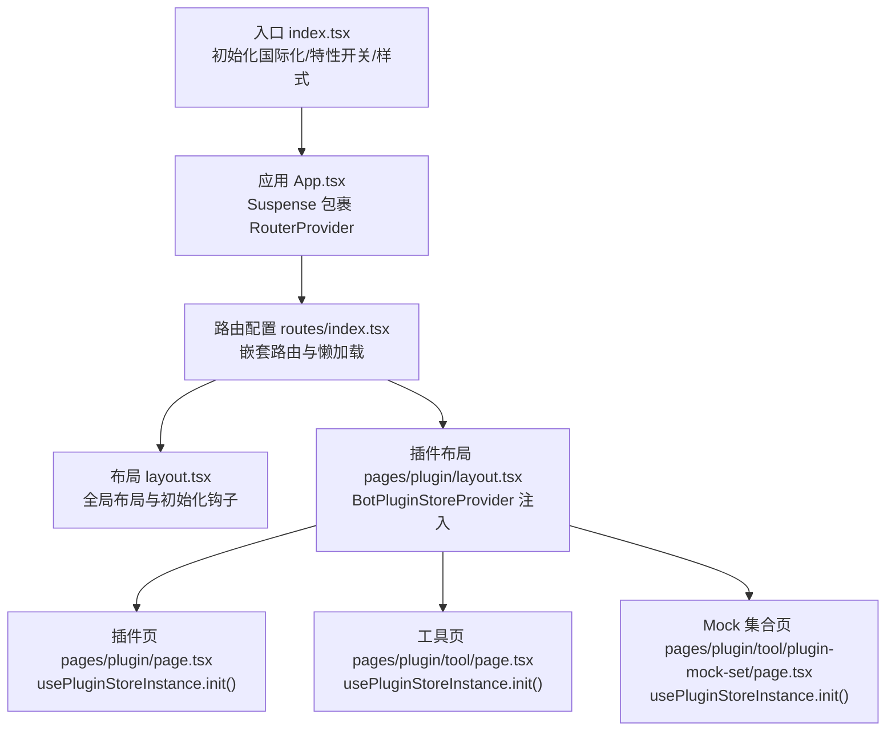
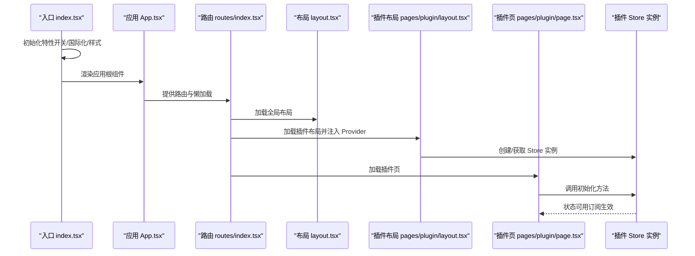
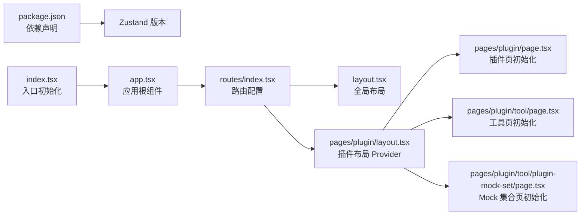

# 状态管理架构

<cite>
**本文引用的文件**
- [src/index.tsx](file://src/index.tsx)
- [src/app.tsx](file://src/app.tsx)
- [src/layout.tsx](file://src/layout.tsx)
- [src/routes/index.tsx](file://src/routes/index.tsx)
- [src/routes/async-components.tsx](file://src/routes/async-components.tsx)
- [src/pages/plugin/layout.tsx](file://src/pages/plugin/layout.tsx)
- [src/pages/plugin/page.tsx](file://src/pages/plugin/page.tsx)
- [src/pages/plugin/tool/page.tsx](file://src/pages/plugin/tool/page.tsx)
- [src/pages/plugin/tool/plugin-mock-set/page.tsx](file://src/pages/plugin/tool/plugin-mock-set/page.tsx)
- [package.json](file://package.json)
</cite>

## 目录
1. [引言](#引言)
2. [项目结构](#项目结构)
3. [核心组件](#核心组件)
4. [架构总览](#架构总览)
5. [详细组件分析](#详细组件分析)
6. [依赖关系分析](#依赖关系分析)
7. [性能考量](#性能考量)
8. [故障排查指南](#故障排查指南)
9. [结论](#结论)
10. [附录](#附录)

## 引言
本文件面向 Coze Studio 前端的状态管理架构，聚焦于 Zustand 在项目中的使用模式与设计理念，系统梳理状态定义、更新机制、订阅模式、持久化与同步策略，并结合组件生命周期给出最佳实践与性能优化建议。由于仓库中状态管理主要通过外部包提供的 Store 实例进行访问（如 bot-plugin-store），本文以“使用方视角”描述状态管理的数据流与集成方式，帮助读者快速理解并正确使用状态层。

## 项目结构
Coze Studio 前端采用 React + React Router 的单页应用结构，路由按模块拆分并通过动态导入实现懒加载。状态管理通过外部包提供的 Store 实例注入到页面层级，页面在挂载时触发初始化逻辑，随后由具体业务组件消费状态。

图表来源
- [src/index.tsx:33-52](file://src/index.tsx#L33-L52)
- [src/app.tsx:24-36](file://src/app.tsx#L24-L36)
- [src/routes/index.tsx:50-298](file://src/routes/index.tsx#L50-L298)
- [src/layout.tsx:19-23](file://src/layout.tsx#L19-L23)
- [src/pages/plugin/layout.tsx:22-37](file://src/pages/plugin/layout.tsx#L22-L37)
- [src/pages/plugin/page.tsx:23-32](file://src/pages/plugin/page.tsx#L23-L32)
- [src/pages/plugin/tool/page.tsx:22-31](file://src/pages/plugin/tool/page.tsx#L22-L31)
- [src/pages/plugin/tool/plugin-mock-set/page.tsx:21-34](file://src/pages/plugin/tool/plugin-mock-set/page.tsx#L21-L34)

章节来源
- [src/index.tsx:17-52](file://src/index.tsx#L17-L52)
- [src/app.tsx:17-36](file://src/app.tsx#L17-L36)
- [src/routes/index.tsx:17-298](file://src/routes/index.tsx#L17-L298)

## 核心组件
- 应用入口与初始化
  - 初始化特性开关、国际化与样式资源，确保运行环境就绪后再渲染应用。
- 应用根组件
  - 使用 Suspense 包裹 RouterProvider，统一处理异步组件加载态。
- 路由与布局
  - 路由配置集中管理，插件模块通过专用布局组件注入状态 Provider。
- 插件状态注入与使用
  - 插件布局组件通过 Provider 将 Store 实例注入子树；页面组件在首次挂载时调用初始化方法，随后由业务组件订阅状态变化。

章节来源
- [src/index.tsx:26-52](file://src/index.tsx#L26-L52)
- [src/app.tsx:24-36](file://src/app.tsx#L24-L36)
- [src/layout.tsx:19-23](file://src/layout.tsx#L19-L23)
- [src/pages/plugin/layout.tsx:22-37](file://src/pages/plugin/layout.tsx#L22-L37)
- [src/pages/plugin/page.tsx:23-32](file://src/pages/plugin/page.tsx#L23-L32)
- [src/pages/plugin/tool/page.tsx:22-31](file://src/pages/plugin/tool/page.tsx#L22-L31)
- [src/pages/plugin/tool/plugin-mock-set/page.tsx:21-34](file://src/pages/plugin/tool/plugin-mock-set/page.tsx#L21-L34)

## 架构总览
下图展示从入口到页面组件的状态管理数据流：入口负责环境初始化，路由与布局负责状态注入，页面在挂载时触发初始化，业务组件通过订阅获取状态并驱动 UI 更新。

图表来源
- [src/index.tsx:33-52](file://src/index.tsx#L33-L52)
- [src/app.tsx:24-36](file://src/app.tsx#L24-L36)
- [src/routes/index.tsx:50-298](file://src/routes/index.tsx#L50-L298)
- [src/layout.tsx:19-23](file://src/layout.tsx#L19-L23)
- [src/pages/plugin/layout.tsx:22-37](file://src/pages/plugin/layout.tsx#L22-L37)
- [src/pages/plugin/page.tsx:23-32](file://src/pages/plugin/page.tsx#L23-L32)

## 详细组件分析

### 组件：入口与初始化（index.tsx）
- 职责
  - 拉取特性开关并设置默认值
  - 初始化国际化实例
  - 动态引入 Markdown 组件样式
  - 渲染应用根组件
- 设计要点
  - 将耗时的初始化操作前置，避免首屏阻塞
  - 使用本地存储决定语言初始值，兼顾多地区部署

章节来源
- [src/index.tsx:26-52](file://src/index.tsx#L26-L52)

### 组件：应用根（App.tsx）
- 职责
  - 使用 Suspense 包裹 RouterProvider，统一处理异步组件加载态
- 设计要点
  - 通过统一的加载占位提升用户体验
  - 与路由懒加载配合，减少首屏体积

章节来源
- [src/app.tsx:24-36](file://src/app.tsx#L24-L36)

### 组件：全局布局（layout.tsx）
- 职责
  - 调用全局初始化钩子，确保布局级能力可用
- 设计要点
  - 将初始化逻辑下沉至布局层，保证所有子路由均可受益

章节来源
- [src/layout.tsx:19-23](file://src/layout.tsx#L19-L23)

### 组件：插件布局（pages/plugin/layout.tsx）
- 职责
  - 通过 Provider 将 Store 实例注入子树
  - 接收导航回调，用于资源跳转
- 设计要点
  - 将状态注入与导航解耦，便于复用与测试
  - 参数校验确保必要信息完整

章节来源
- [src/pages/plugin/layout.tsx:22-37](file://src/pages/plugin/layout.tsx#L22-L37)

### 组件：插件页（pages/plugin/page.tsx）
- 职责
  - 读取路由参数，获取 Store 实例并在挂载时初始化
  - 渲染插件主视图
- 设计要点
  - 在副作用中执行初始化，避免阻塞渲染
  - 参数校验失败时抛出错误，便于快速定位问题

章节来源
- [src/pages/plugin/page.tsx:23-32](file://src/pages/plugin/page.tsx#L23-L32)

### 组件：工具页（pages/plugin/tool/page.tsx）
- 职责
  - 读取路由参数，获取 Store 实例并在挂载时初始化
  - 渲染工具视图
- 设计要点
  - 与插件页保持一致的初始化流程，确保状态一致性

章节来源
- [src/pages/plugin/tool/page.tsx:22-31](file://src/pages/plugin/tool/page.tsx#L22-L31)

### 组件：Mock 集合页（pages/plugin/tool/plugin-mock-set/page.tsx）
- 职责
  - 读取路由参数，获取 Store 实例并在挂载时初始化
  - 渲染 Mock 集合列表
- 设计要点
  - 通过列表组件消费状态，实现数据驱动的 UI 更新

章节来源
- [src/pages/plugin/tool/plugin-mock-set/page.tsx:21-34](file://src/pages/plugin/tool/plugin-mock-set/page.tsx#L21-L34)

### 组件：路由与懒加载（routes/index.tsx 与 routes/async-components.tsx）
- 职责
  - 定义嵌套路由与菜单项
  - 通过动态导入实现组件懒加载
- 设计要点
  - 将路由与懒加载分离，便于维护与扩展
  - 插件模块路由清晰，利于状态注入点的定位

章节来源
- [src/routes/index.tsx:50-298](file://src/routes/index.tsx#L50-L298)
- [src/routes/async-components.tsx:17-153](file://src/routes/async-components.tsx#L17-L153)

### 组件：依赖声明（package.json）
- 职责
  - 声明对 Zustand 的依赖版本
- 设计要点
  - 明确状态库版本，便于升级与兼容性管理

章节来源
- [package.json:49-50](file://package.json#L49-L50)

## 依赖关系分析
- 入口依赖
  - 国际化、特性开关、样式资源初始化
- 应用依赖
  - 路由与懒加载
- 路由与布局依赖
  - 插件布局 Provider 注入 Store 实例
- 页面依赖
  - Store 实例初始化与状态订阅

图表来源
- [package.json:49-50](file://package.json#L49-L50)
- [src/index.tsx:33-52](file://src/index.tsx#L33-L52)
- [src/app.tsx:24-36](file://src/app.tsx#L24-L36)
- [src/routes/index.tsx:50-298](file://src/routes/index.tsx#L50-L298)
- [src/layout.tsx:19-23](file://src/layout.tsx#L19-L23)
- [src/pages/plugin/layout.tsx:22-37](file://src/pages/plugin/layout.tsx#L22-L37)
- [src/pages/plugin/page.tsx:23-32](file://src/pages/plugin/page.tsx#L23-L32)
- [src/pages/plugin/tool/page.tsx:22-31](file://src/pages/plugin/tool/page.tsx#L22-L31)
- [src/pages/plugin/tool/plugin-mock-set/page.tsx:21-34](file://src/pages/plugin/tool/plugin-mock-set/page.tsx#L21-L34)

章节来源
- [package.json:49-50](file://package.json#L49-L50)
- [src/index.tsx:33-52](file://src/index.tsx#L33-L52)
- [src/app.tsx:24-36](file://src/app.tsx#L24-L36)
- [src/routes/index.tsx:50-298](file://src/routes/index.tsx#L50-L298)
- [src/layout.tsx:19-23](file://src/layout.tsx#L19-L23)
- [src/pages/plugin/layout.tsx:22-37](file://src/pages/plugin/layout.tsx#L22-L37)
- [src/pages/plugin/page.tsx:23-32](file://src/pages/plugin/page.tsx#L23-L32)
- [src/pages/plugin/tool/page.tsx:22-31](file://src/pages/plugin/tool/page.tsx#L22-L31)
- [src/pages/plugin/tool/plugin-mock-set/page.tsx:21-34](file://src/pages/plugin/tool/plugin-mock-set/page.tsx#L21-L34)

## 性能考量
- 懒加载与代码分割
  - 通过动态导入与路由懒加载降低首屏体积，提升首屏渲染速度。
- Suspense 统一占位
  - 在应用根部使用 Suspense 统一处理异步组件加载态，改善交互体验。
- 初始化时机
  - 将耗时初始化前置到入口，避免在页面渲染阶段阻塞。
- 订阅粒度
  - 仅在需要的状态片段上进行订阅，避免不必要的重渲染。
- 状态拆分
  - 将全局状态与局部状态分离，减少跨组件通信成本。
- 持久化策略
  - 对关键状态进行持久化，结合恢复逻辑提升稳定性与可回退性。

## 故障排查指南
- 页面无渲染或白屏
  - 检查入口初始化是否完成再渲染应用根组件
  - 确认 Suspense 占位是否正确显示
- 路由参数缺失导致报错
  - 页面在挂载前进行参数校验，若缺失则抛出错误
  - 检查路由配置与参数传递是否一致
- 状态未更新或不生效
  - 确认页面在挂载时已调用初始化方法
  - 检查 Provider 是否正确注入到页面层级
- 国际化或特性开关异常
  - 检查入口初始化逻辑是否成功执行
  - 核对本地存储键值与默认语言设置

章节来源
- [src/index.tsx:33-52](file://src/index.tsx#L33-L52)
- [src/app.tsx:24-36](file://src/app.tsx#L24-L36)
- [src/pages/plugin/page.tsx:23-32](file://src/pages/plugin/page.tsx#L23-L32)
- [src/pages/plugin/tool/page.tsx:22-31](file://src/pages/plugin/tool/page.tsx#L22-L31)
- [src/pages/plugin/tool/plugin-mock-set/page.tsx:21-34](file://src/pages/plugin/tool/plugin-mock-set/page.tsx#L21-L34)

## 结论
Coze Studio 的状态管理以“外部 Store 实例 + Provider 注入”的方式组织，强调初始化时机与订阅粒度的控制。通过路由懒加载与入口初始化，项目在性能与可维护性之间取得平衡。建议在后续演进中进一步明确全局/局部状态边界、完善状态持久化与恢复策略，并持续优化订阅范围与渲染路径，以获得更佳的用户体验与开发效率。

## 附录
- 最佳实践清单
  - 在入口完成环境初始化，避免在页面渲染阶段阻塞
  - 使用 Provider 将 Store 注入到需要的状态域
  - 在页面挂载时统一触发初始化，确保状态可用
  - 仅订阅必要的状态片段，减少重渲染
  - 对关键状态进行持久化，提供恢复与调试能力
- 扩展性与维护性建议
  - 明确状态域划分，避免跨域耦合
  - 规范初始化流程与错误处理
  - 逐步引入类型安全与状态快照工具，提升可维护性