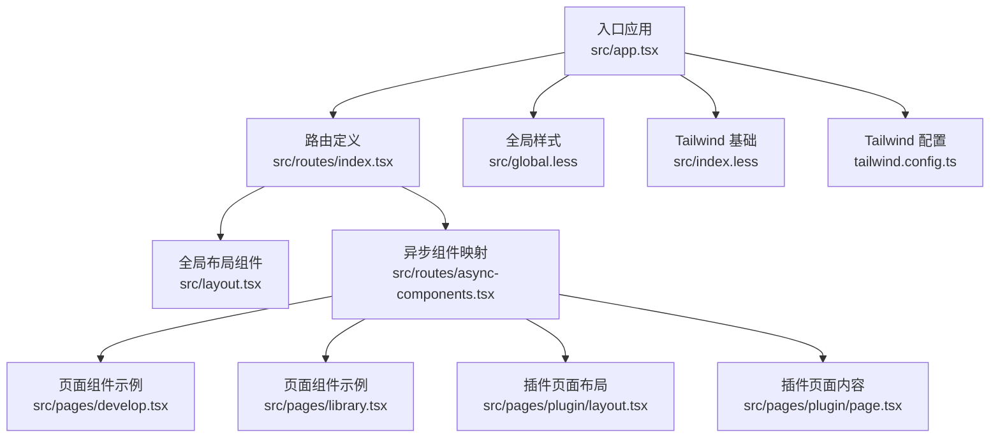
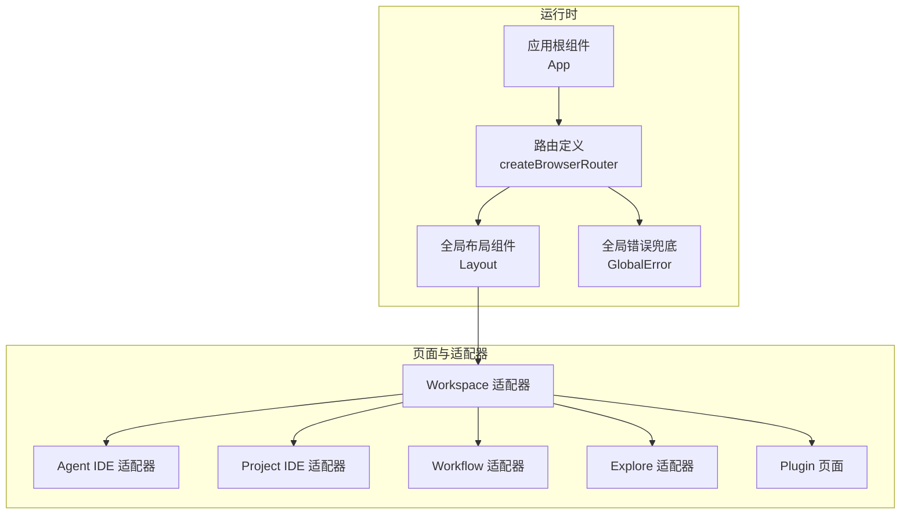
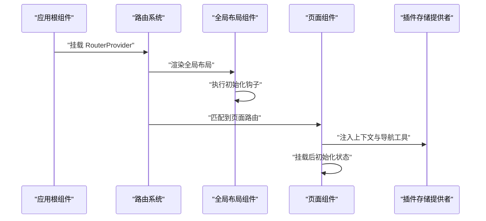
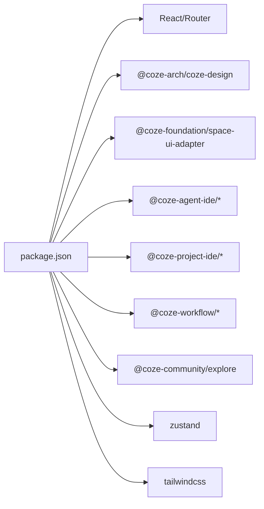

# 组件系统架构

<cite>
**本文引用的文件**
- [src/app.tsx](file://src/app.tsx)
- [src/layout.tsx](file://src/layout.tsx)
- [src/routes/index.tsx](file://src/routes/index.tsx)
- [src/routes/async-components.tsx](file://src/routes/async-components.tsx)
- [src/pages/plugin/layout.tsx](file://src/pages/plugin/layout.tsx)
- [src/pages/plugin/page.tsx](file://src/pages/plugin/page.tsx)
- [src/pages/develop.tsx](file://src/pages/develop.tsx)
- [src/pages/library.tsx](file://src/pages/library.tsx)
- [src/pages/explore.tsx](file://src/pages/explore.tsx)
- [src/pages/docs.tsx](file://src/pages/docs.tsx)
- [package.json](file://package.json)
- [src/global.less](file://src/global.less)
- [src/index.less](file://src/index.less)
- [tailwind.config.ts](file://tailwind.config.ts)
- [index.html](file://index.html)
</cite>

## 目录
1. [引言](#引言)
2. [项目结构](#项目结构)
3. [核心组件](#核心组件)
4. [架构总览](#架构总览)
5. [详细组件分析](#详细组件分析)
6. [依赖分析](#依赖分析)
7. [性能考虑](#性能考虑)
8. [故障排查指南](#故障排查指南)
9. [结论](#结论)
10. [附录](#附录)

## 引言
本文件面向 Coze Studio 前端应用的组件系统，系统性梳理其分层设计（全局布局组件、页面组件、异步组件）、组合与复用策略、生命周期与状态传递、异步加载与性能优化、样式系统与主题定制、开发最佳实践、测试与调试方法，以及与路由系统的集成关系。目标是帮助开发者快速理解并高效扩展组件体系。

## 项目结构
该应用采用“入口 -> 路由 -> 布局/页面”的清晰分层：
- 入口层：应用根组件负责挂载路由与全局加载占位。
- 路由层：集中定义路由树与各子模块的懒加载页面。
- 布局层：全局布局组件负责统一的顶部/侧边导航、权限校验等。
- 页面层：具体业务页面，部分页面通过外部适配器或内部模块渲染。
- 样式层：全局样式 + Tailwind 配置，支持主题变量与响应式断点。

图表来源
- [src/app.tsx:1-37](file://src/app.tsx#L1-L37)
- [src/routes/index.tsx:1-298](file://src/routes/index.tsx#L1-L298)
- [src/layout.tsx:1-24](file://src/layout.tsx#L1-L24)
- [src/routes/async-components.tsx:1-153](file://src/routes/async-components.tsx#L1-L153)
- [src/pages/develop.tsx:1-27](file://src/pages/develop.tsx#L1-L27)
- [src/pages/library.tsx:1-27](file://src/pages/library.tsx#L1-L27)
- [src/pages/plugin/layout.tsx:1-41](file://src/pages/plugin/layout.tsx#L1-L41)
- [src/pages/plugin/page.tsx:1-36](file://src/pages/plugin/page.tsx#L1-L36)
- [src/global.less:1-235](file://src/global.less#L1-L235)
- [src/index.less:1-9](file://src/index.less#L1-L9)
- [tailwind.config.ts:25-54](file://tailwind.config.ts#L25-L54)

章节来源
- [src/app.tsx:1-37](file://src/app.tsx#L1-L37)
- [src/routes/index.tsx:1-298](file://src/routes/index.tsx#L1-L298)
- [src/layout.tsx:1-24](file://src/layout.tsx#L1-L24)
- [src/routes/async-components.tsx:1-153](file://src/routes/async-components.tsx#L1-L153)
- [src/pages/develop.tsx:1-27](file://src/pages/develop.tsx#L1-L27)
- [src/pages/library.tsx:1-27](file://src/pages/library.tsx#L1-L27)
- [src/pages/plugin/layout.tsx:1-41](file://src/pages/plugin/layout.tsx#L1-L41)
- [src/pages/plugin/page.tsx:1-36](file://src/pages/plugin/page.tsx#L1-L36)
- [src/global.less:1-235](file://src/global.less#L1-L235)
- [src/index.less:1-9](file://src/index.less#L1-L9)
- [tailwind.config.ts:25-54](file://tailwind.config.ts#L25-L54)

## 核心组件
- 应用根组件：负责全局 Suspense 加载态与 RouterProvider 渲染。
- 全局布局组件：封装全局初始化与顶层布局容器。
- 路由与懒加载：集中声明路由树与异步组件映射，按需加载。
- 页面组件：业务页面，部分通过外部适配器或内部模块渲染。
- 样式系统：全局样式 + Tailwind 基础 + 主题配置。

章节来源
- [src/app.tsx:17-36](file://src/app.tsx#L17-L36)
- [src/layout.tsx:17-23](file://src/layout.tsx#L17-L23)
- [src/routes/index.tsx:23-48](file://src/routes/index.tsx#L23-L48)
- [src/routes/async-components.tsx:17-153](file://src/routes/async-components.tsx#L17-L153)
- [src/global.less:1-235](file://src/global.less#L1-L235)
- [src/index.less:1-9](file://src/index.less#L1-L9)
- [tailwind.config.ts:25-54](file://tailwind.config.ts#L25-L54)

## 架构总览
整体采用“路由驱动 + 懒加载 + 布局复用”的架构模式：
- 路由层集中管理路径、菜单、权限与子模块加载策略。
- 布局层统一承载全局导航、侧边栏与错误兜底。
- 页面层聚焦具体业务，通过外部适配器或内部模块实现功能。
- 样式层通过 Tailwind 与主题变量实现一致的视觉与交互体验。

图表来源
- [src/app.tsx:22-36](file://src/app.tsx#L22-L36)
- [src/routes/index.tsx:48-298](file://src/routes/index.tsx#L48-L298)
- [src/layout.tsx:17-23](file://src/layout.tsx#L17-L23)

## 详细组件分析

### 全局布局组件
职责：
- 初始化全局应用状态。
- 承载全局布局容器，供子路由渲染。

实现要点：
- 使用全局初始化钩子进行应用级准备。
- 返回全局布局容器，作为所有子路由的父容器。

章节来源
- [src/layout.tsx:17-23](file://src/layout.tsx#L17-L23)

### 路由与异步组件
职责：
- 定义完整路由树，包含文档、登录、工作区、IDE、发布页、知识库、数据库、插件商店、模板等。
- 将页面组件映射为异步组件，按需加载，降低首屏体积。

实现要点：
- 使用路由懒加载函数映射到外部适配器或内部页面。
- 在 loader 中注入菜单、权限、侧边栏显示等元数据。
- 子路由嵌套清晰，便于权限与菜单联动。

章节来源
- [src/routes/index.tsx:48-298](file://src/routes/index.tsx#L48-L298)
- [src/routes/async-components.tsx:17-153](file://src/routes/async-components.tsx#L17-L153)

### 页面组件与组合模式
职责：
- 插件页面：通过插件布局组件注入上下文与导航工具，再渲染插件主内容。
- 开发页/资源库页：根据空间 ID 渲染对应适配器页面。
- 探索页：二次路由组织插件与模板两类页面。

实现要点：
- 插件页面在挂载后初始化插件存储实例，确保状态可用。
- 页面组件通过参数校验保证必要上下文存在，避免渲染异常。
- 二级路由通过 loader 注入类型或菜单配置，实现差异化展示。

章节来源
- [src/pages/plugin/layout.tsx:17-41](file://src/pages/plugin/layout.tsx#L17-L41)
- [src/pages/plugin/page.tsx:17-36](file://src/pages/plugin/page.tsx#L17-L36)
- [src/pages/develop.tsx:17-27](file://src/pages/develop.tsx#L17-L27)
- [src/pages/library.tsx:17-27](file://src/pages/library.tsx#L17-L27)
- [src/pages/explore.tsx:17-67](file://src/pages/explore.tsx#L17-L67)

### 生命周期与状态传递
- 应用级生命周期：在根组件中通过 Suspense 提供全局加载态；在布局组件中执行初始化钩子。
- 页面级生命周期：页面组件在挂载后初始化插件存储实例，确保后续状态读写可用。
- 状态传递：通过上下文提供者（如插件存储提供者）向子树注入状态与导航工具，实现跨层级共享。

图表来源
- [src/app.tsx:22-36](file://src/app.tsx#L22-L36)
- [src/layout.tsx:17-23](file://src/layout.tsx#L17-L23)
- [src/pages/plugin/layout.tsx:22-38](file://src/pages/plugin/layout.tsx#L22-L38)
- [src/pages/plugin/page.tsx:23-33](file://src/pages/plugin/page.tsx#L23-L33)

### 异步加载与性能优化
- 懒加载策略：路由层统一使用懒加载函数映射页面，按需下载模块。
- 加载态：根组件包裹 Suspense 并提供全局加载指示器，提升用户体验。
- 体积控制：通过拆分外部适配器与内部页面，减少单次加载体积。
- 错误兜底：路由层配置全局错误组件，统一处理渲染异常。

章节来源
- [src/routes/async-components.tsx:17-153](file://src/routes/async-components.tsx#L17-L153)
- [src/app.tsx:24-36](file://src/app.tsx#L24-L36)
- [src/routes/index.tsx:78-82](file://src/routes/index.tsx#L78-L82)

### 样式系统与主题定制
- 全局样式：统一字体、背景、滚动条等基础样式，避免第三方库重置导致的抖动。
- Tailwind 基础：引入 Tailwind 基础、组件与实用工具类，确保样式一致性。
- 主题配置：Tailwind 配置扩展设计令牌与断点，并继承主题预设，支持动态类名安全输出。
- 动态类名：通过 safelist 与 pattern 配置允许动态生成的类名生效。

章节来源
- [src/global.less:1-235](file://src/global.less#L1-L235)
- [src/index.less:1-9](file://src/index.less#L1-L9)
- [tailwind.config.ts:25-54](file://tailwind.config.ts#L25-L54)

### 组件与路由的集成关系
- 路由驱动页面渲染：路由定义决定页面组件的加载时机与上下文。
- 子路由嵌套：工作区、插件等模块通过多级嵌套路由组织页面与菜单。
- 元数据注入：loader 中注入 hasSider、requireAuth、subMenu、menuKey 等，驱动布局与菜单行为。
- 文档与跳转：文档路由直接重定向至外部站点，简化维护成本。

章节来源
- [src/routes/index.tsx:50-298](file://src/routes/index.tsx#L50-L298)
- [src/pages/docs.tsx:17-27](file://src/pages/docs.tsx#L17-L27)

## 依赖分析
- 外部依赖：React、React Router、Coze Design、Space UI Adapter、Agent IDE Adapter、Project IDE、Workflow Adapter、Explore Adapter、Zustand 等。
- 内部依赖：Workspace Adapter、Workspace Base、Bot Plugin Store 等。
- 样式依赖：Tailwind 预设与主题配置，确保一致的视觉语言。

图表来源
- [package.json:19-51](file://package.json#L19-L51)

章节来源
- [package.json:19-51](file://package.json#L19-L51)

## 性能考虑
- 按需加载：通过懒加载减少首屏脚本体积，提升初始渲染速度。
- Suspense 占位：在异步组件加载期间提供统一的加载反馈，改善感知性能。
- 路由级错误兜底：避免单个页面异常影响整体稳定性。
- Tailwind 按需：结合 safelist 与设计令牌，减少未使用样式的打包体积。
- 最佳实践建议：
  - 将大体量页面拆分为独立模块并通过懒加载导入。
  - 在 loader 中尽量只做轻量计算，避免阻塞渲染。
  - 对频繁切换的页面使用缓存策略（如 keep-alive）以减少重复渲染。
  - 合理使用主题变量与断点，避免重复定义样式。

[本节为通用指导，无需特定文件引用]

## 故障排查指南
- 页面空白或白屏
  - 检查路由懒加载是否正确返回默认导出。
  - 确认全局 Suspense 是否覆盖到根组件。
- 参数缺失导致渲染异常
  - 页面组件应校验路由参数，缺失时抛出明确错误以便定位。
- 插件页面无法初始化
  - 确保插件存储提供者已注入必要上下文与导航工具。
- 样式错乱或主题不生效
  - 检查 Tailwind 配置与主题预设是否正确加载。
  - 确认全局样式未被覆盖或冲突。

章节来源
- [src/routes/async-components.tsx:17-153](file://src/routes/async-components.tsx#L17-L153)
- [src/app.tsx:24-36](file://src/app.tsx#L24-L36)
- [src/pages/plugin/layout.tsx:22-38](file://src/pages/plugin/layout.tsx#L22-L38)
- [tailwind.config.ts:25-54](file://tailwind.config.ts#L25-L54)

## 结论
该组件系统通过“路由驱动 + 懒加载 + 布局复用”的架构，实现了清晰的分层与高复用的页面组合模式。配合统一的样式与主题体系，能够在保证开发效率的同时，获得良好的性能与可维护性。建议在扩展新页面时遵循现有模式，优先使用懒加载与上下文提供者，确保一致的用户体验与开发体验。

[本节为总结，无需特定文件引用]

## 附录
- 入口与挂载
  - 应用根组件挂载路由并提供全局加载态。
  - HTML 根节点为应用挂载点。
- 样式与主题
  - 全局样式与 Tailwind 基础位于入口处。
  - Tailwind 配置集中管理主题与断点。

章节来源
- [src/app.tsx:22-36](file://src/app.tsx#L22-L36)
- [index.html:1-12](file://index.html#L1-L12)
- [src/global.less:1-235](file://src/global.less#L1-L235)
- [src/index.less:1-9](file://src/index.less#L1-L9)
- [tailwind.config.ts:25-54](file://tailwind.config.ts#L25-L54)