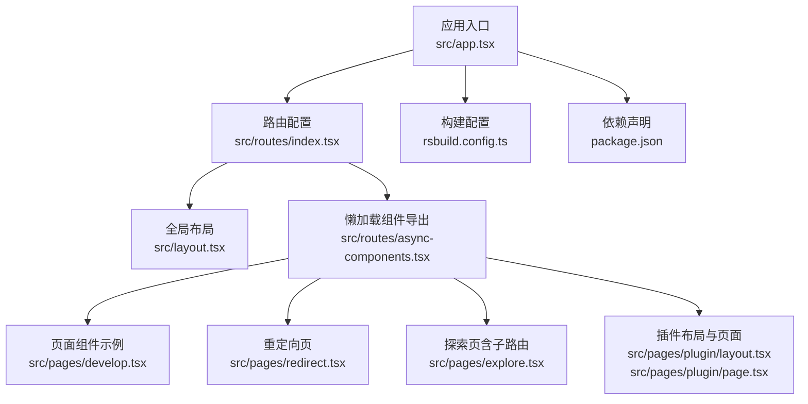
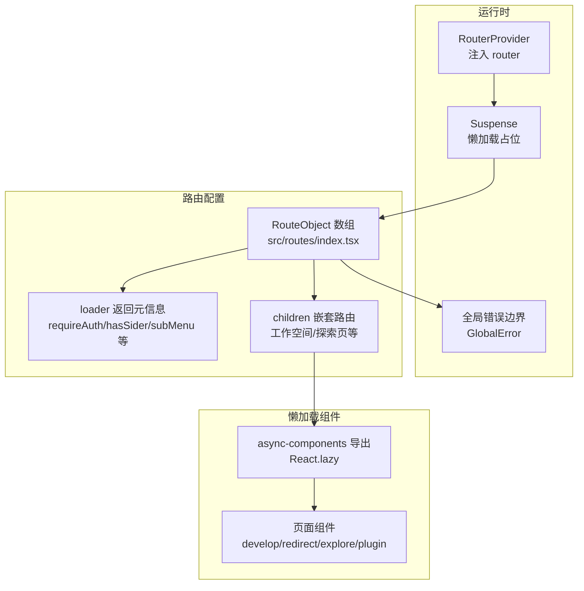
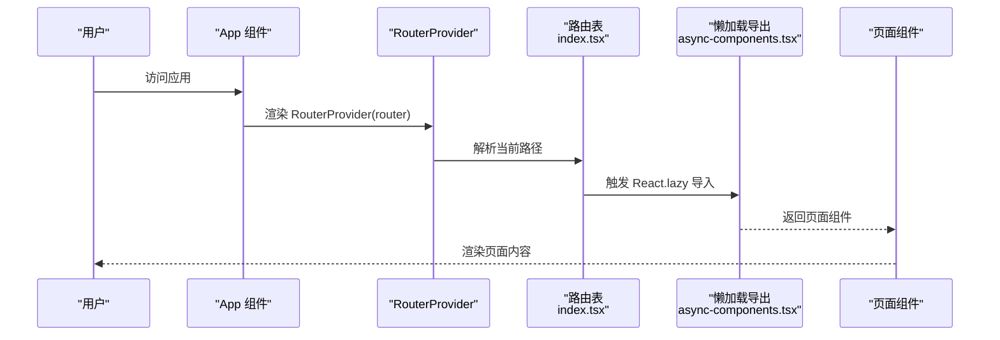
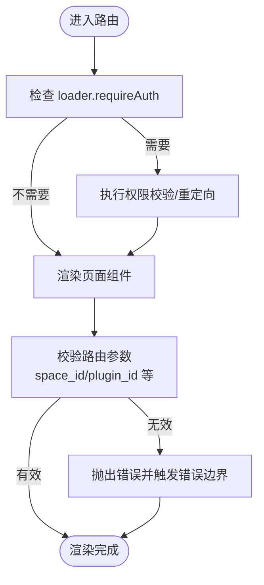
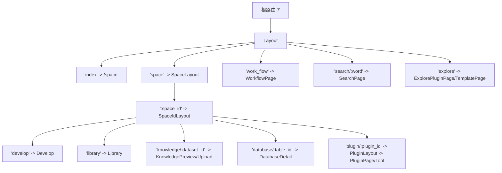
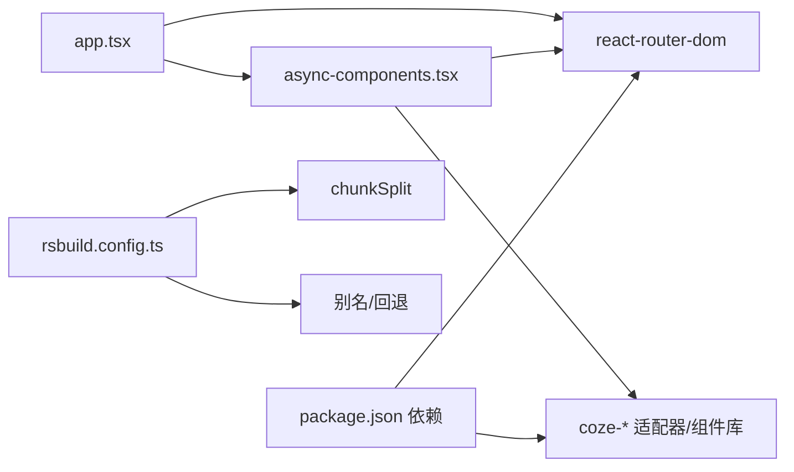

# 路由系统设计

<cite>
**本文引用的文件**
- [src/routes/index.tsx](file://src/routes/index.tsx)
- [src/routes/async-components.tsx](file://src/routes/async-components.tsx)
- [src/app.tsx](file://src/app.tsx)
- [src/layout.tsx](file://src/layout.tsx)
- [src/pages/develop.tsx](file://src/pages/develop.tsx)
- [src/pages/plugin/layout.tsx](file://src/pages/plugin/layout.tsx)
- [src/pages/plugin/page.tsx](file://src/pages/plugin/page.tsx)
- [src/pages/redirect.tsx](file://src/pages/redirect.tsx)
- [src/pages/explore.tsx](file://src/pages/explore.tsx)
- [rsbuild.config.ts](file://rsbuild.config.ts)
- [package.json](file://package.json)
</cite>

## 目录
1. [简介](#简介)
2. [项目结构](#项目结构)
3. [核心组件](#核心组件)
4. [架构总览](#架构总览)
5. [详细组件分析](#详细组件分析)
6. [依赖分析](#依赖分析)
7. [性能考虑](#性能考虑)
8. [故障排查指南](#故障排查指南)
9. [结论](#结论)
10. [附录](#附录)

## 简介
本文件面向 Coze Studio 的前端路由系统，系统基于 React Router v6 的 createBrowserRouter 构建，采用嵌套路由与懒加载相结合的方式组织应用结构。本文将从路由配置对象结构、路径匹配规则、权限控制与重定向逻辑、懒加载与代码分割、路由守卫与权限验证、最佳实践与常见模式、性能优化与调试方法等维度进行深入解析，并给出与 React Router 集成及可扩展点的建议。

## 项目结构
Coze Studio 前端路由相关的核心目录与文件如下：
- 路由配置入口：src/routes/index.tsx
- 懒加载组件导出：src/routes/async-components.tsx
- 应用根组件与路由提供者：src/app.tsx
- 全局布局与初始化：src/layout.tsx
- 页面级组件示例：src/pages/develop.tsx、src/pages/redirect.tsx、src/pages/explore.tsx
- 插件工作区布局与页面：src/pages/plugin/layout.tsx、src/pages/plugin/page.tsx
- 构建与打包配置：rsbuild.config.ts
- 依赖声明：package.json

图表来源
- [src/app.tsx:22-36](file://src/app.tsx#L22-L36)
- [src/routes/index.tsx:50-298](file://src/routes/index.tsx#L50-L298)
- [src/routes/async-components.tsx:17-153](file://src/routes/async-components.tsx#L17-L153)
- [src/layout.tsx:17-23](file://src/layout.tsx#L17-L23)
- [src/pages/develop.tsx:17-26](file://src/pages/develop.tsx#L17-L26)
- [src/pages/redirect.tsx:17-26](file://src/pages/redirect.tsx#L17-L26)
- [src/pages/explore.tsx:17-66](file://src/pages/explore.tsx#L17-L66)
- [src/pages/plugin/layout.tsx:17-40](file://src/pages/plugin/layout.tsx#L17-L40)
- [src/pages/plugin/page.tsx:17-35](file://src/pages/plugin/page.tsx#L17-L35)
- [rsbuild.config.ts:17-136](file://rsbuild.config.ts#L17-L136)
- [package.json:19-51](file://package.json#L19-L51)

章节来源
- [src/routes/index.tsx:50-298](file://src/routes/index.tsx#L50-L298)
- [src/routes/async-components.tsx:17-153](file://src/routes/async-components.tsx#L17-L153)
- [src/app.tsx:22-36](file://src/app.tsx#L22-L36)
- [src/layout.tsx:17-23](file://src/layout.tsx#L17-L23)
- [rsbuild.config.ts:17-136](file://rsbuild.config.ts#L17-L136)
- [package.json:19-51](file://package.json#L19-L51)

## 核心组件
- 路由配置对象数组：通过 createBrowserRouter 创建路由器实例，内部包含多层级的 RouteObject 定义，涵盖文档重定向、登录页、工作空间嵌套路由、探索页子路由、工作流与搜索页等。
- 懒加载组件导出：统一在 async-components.tsx 中以 React.lazy 方式按需导入各页面与布局组件，结合 Suspense 提供加载态。
- 应用根组件：App 使用 RouterProvider 注入 router，并包裹 Suspense 以处理懒加载组件的加载状态。
- 全局布局：Layout 组件负责应用初始化与全局布局容器。
- 页面组件：如 develop、redirect、explore、plugin 等页面组件，承担具体业务渲染与交互。

章节来源
- [src/routes/index.tsx:50-298](file://src/routes/index.tsx#L50-L298)
- [src/routes/async-components.tsx:17-153](file://src/routes/async-components.tsx#L17-L153)
- [src/app.tsx:22-36](file://src/app.tsx#L22-L36)
- [src/layout.tsx:17-23](file://src/layout.tsx#L17-L23)
- [src/pages/develop.tsx:17-26](file://src/pages/develop.tsx#L17-L26)
- [src/pages/redirect.tsx:17-26](file://src/pages/redirect.tsx#L17-L26)
- [src/pages/explore.tsx:17-66](file://src/pages/explore.tsx#L17-L66)
- [src/pages/plugin/layout.tsx:17-40](file://src/pages/plugin/layout.tsx#L17-L40)
- [src/pages/plugin/page.tsx:17-35](file://src/pages/plugin/page.tsx#L17-L35)

## 架构总览
Coze Studio 路由系统采用“配置驱动 + 懒加载 + 嵌套路由”的架构：
- 配置驱动：所有路由在单一文件中集中管理，便于维护与演进。
- 懒加载：通过 React.lazy 与 Suspense 实现按需加载，减少首屏体积。
- 嵌套路由：利用 children 字段组织父子关系，支持复杂业务场景（如工作空间 -> 空间ID -> 子功能页）。
- 权限控制：通过 loader 返回的元数据（如 requireAuth、hasSider、subMenu 等）驱动布局与菜单行为。
- 错误边界：顶层 errorElement 提供全局错误兜底。

图表来源
- [src/app.tsx:22-36](file://src/app.tsx#L22-L36)
- [src/routes/index.tsx:50-298](file://src/routes/index.tsx#L50-L298)
- [src/routes/async-components.tsx:17-153](file://src/routes/async-components.tsx#L17-L153)

章节来源
- [src/app.tsx:22-36](file://src/app.tsx#L22-L36)
- [src/routes/index.tsx:50-298](file://src/routes/index.tsx#L50-L298)
- [src/routes/async-components.tsx:17-153](file://src/routes/async-components.tsx#L17-L153)

## 详细组件分析

### 路由配置对象结构与参数
- 路径匹配与嵌套
  - 根路径 '/' 下挂载 Layout，并设置 index 重定向到 '/space'。
  - 工作空间路由 'space' -> ':space_id' -> 子功能页（develop、project-ide、library、knowledge、database、plugin 等），形成多层嵌套。
  - 探索页 'explore' 作为独立模块，children 包含 plugin 与 template 两个子路由。
  - 文档与认证相关路径 '/open/docs/*'、'/docs/*'、'/information/auth/success' 统一通过 Redirect 组件处理跳转。
- loader 返回的元信息
  - hasSider：是否显示侧边栏。
  - requireAuth：是否需要鉴权。
  - subMenu/menuKey：用于驱动侧边菜单与子菜单渲染。
  - subMenuKey/pageModeByQuery/showMobileTips/requireBotEditorInit 等：用于控制页面行为与提示。
- 重定向逻辑
  - 文档与认证成功页通过 Redirect 组件在客户端执行跳转至外部站点。

章节来源
- [src/routes/index.tsx:50-298](file://src/routes/index.tsx#L50-L298)
- [src/pages/redirect.tsx:17-26](file://src/pages/redirect.tsx#L17-L26)

### 懒加载组件与代码分割
- 动态导入策略
  - 所有页面与布局组件均通过 React.lazy 在 async-components.tsx 中导出，按需加载。
  - 部分组件来自企业内包或第三方适配器，确保模块化与解耦。
- 代码分割技术
  - 构建配置中启用 chunkSplit 策略，按大小切分代码块，避免单块过大影响加载性能。
  - Rsbuild 配置中对特定模块与路径进行别名与回退处理，保证运行时兼容性。

图表来源
- [src/app.tsx:22-36](file://src/app.tsx#L22-L36)
- [src/routes/index.tsx:50-298](file://src/routes/index.tsx#L50-L298)
- [src/routes/async-components.tsx:17-153](file://src/routes/async-components.tsx#L17-L153)

章节来源
- [src/routes/async-components.tsx:17-153](file://src/routes/async-components.tsx#L17-L153)
- [rsbuild.config.ts:126-132](file://rsbuild.config.ts#L126-L132)

### 路由守卫与权限验证
- 权限控制机制
  - 通过 loader 返回 requireAuth 控制是否需要登录态；结合上层布局与菜单组件共同完成权限校验与导航。
  - hasSider/subMenu/menuKey 等字段用于控制侧边栏显示与菜单项高亮。
- 页面级守卫
  - 插件工作区布局在渲染前校验 space_id 与 plugin_id 参数，缺失则抛错，避免无效渲染。
  - 开发页根据 space_id 决定是否渲染，未提供时返回空。
- 全局错误边界
  - 根路由 errorElement 设置为 GlobalError，统一捕获渲染异常。

图表来源
- [src/routes/index.tsx:50-298](file://src/routes/index.tsx#L50-L298)
- [src/pages/plugin/layout.tsx:22-28](file://src/pages/plugin/layout.tsx#L22-L28)
- [src/pages/develop.tsx:21-24](file://src/pages/develop.tsx#L21-L24)

章节来源
- [src/routes/index.tsx:50-298](file://src/routes/index.tsx#L50-L298)
- [src/pages/plugin/layout.tsx:22-28](file://src/pages/plugin/layout.tsx#L22-L28)
- [src/pages/develop.tsx:21-24](file://src/pages/develop.tsx#L21-L24)

### 嵌套路由设计原理与实现
- 设计原则
  - 以“工作空间”为核心上下文，通过 ':space_id' 参数承载上下文，子路由围绕该上下文展开。
  - 子功能页（develop、project-ide、library、knowledge、database、plugin）各自独立，互不干扰。
  - 探索页作为独立模块，children 以 plugin/template 两类资源为主。
- 实现要点
  - 使用 index 重定向简化默认页访问。
  - 子路由中通过 loader 注入 subMenuKey/pageModeByQuery 等参数，驱动页面行为。
  - 插件工作区通过 Provider 将导航函数注入子树，保证资源跳转一致性。

图表来源
- [src/routes/index.tsx:78-294](file://src/routes/index.tsx#L78-L294)

章节来源
- [src/routes/index.tsx:78-294](file://src/routes/index.tsx#L78-L294)

### 页面组件与导航协作
- 插件工作区
  - 布局组件在渲染前校验参数并注入资源导航函数，页面组件初始化插件存储实例后渲染插件主体。
- 开发页
  - 根据 space_id 渲染开发界面，未提供时返回空，避免无意义渲染。
- 探索页
  - 通过独立的 exploreRouter 定义子路由，支持 plugin 与 template 两种类型切换。

章节来源
- [src/pages/plugin/layout.tsx:17-40](file://src/pages/plugin/layout.tsx#L17-L40)
- [src/pages/plugin/page.tsx:17-35](file://src/pages/plugin/page.tsx#L17-L35)
- [src/pages/develop.tsx:17-26](file://src/pages/develop.tsx#L17-L26)
- [src/pages/explore.tsx:37-66](file://src/pages/explore.tsx#L37-L66)

## 依赖分析
- 外部依赖
  - react-router-dom：提供路由能力与 RouterProvider。
  - @coze-* 系列适配器与组件库：提供布局、菜单、工作区等功能组件。
- 内部依赖
  - async-components.tsx 作为懒加载统一出口，被路由配置引用。
  - app.tsx 作为根组件，注入 router 并包裹 Suspense。
- 构建工具链
  - Rsbuild 配置开启 chunkSplit、别名与回退，提升打包与运行时稳定性。

图表来源
- [package.json:19-51](file://package.json#L19-L51)
- [src/routes/async-components.tsx:17-153](file://src/routes/async-components.tsx#L17-L153)
- [src/app.tsx:17-36](file://src/app.tsx#L17-L36)
- [rsbuild.config.ts:113-132](file://rsbuild.config.ts#L113-L132)

章节来源
- [package.json:19-51](file://package.json#L19-L51)
- [src/routes/async-components.tsx:17-153](file://src/routes/async-components.tsx#L17-L153)
- [src/app.tsx:17-36](file://src/app.tsx#L17-L36)
- [rsbuild.config.ts:113-132](file://rsbuild.config.ts#L113-L132)

## 性能考虑
- 代码分割
  - 启用 chunkSplit 策略，按大小拆分代码块，降低首屏体积与等待时间。
- 懒加载
  - 使用 React.lazy 与 Suspense，仅在访问对应路由时加载组件。
- 构建优化
  - 配置别名与回退，避免运行时解析开销。
  - 忽略部分警告，减少构建噪音，聚焦关键问题。
- 运行时优化
  - 全局布局与初始化在根组件完成，减少重复渲染。
  - 页面组件按需渲染，未提供必要参数时直接返回空，避免无效计算。

章节来源
- [rsbuild.config.ts:126-132](file://rsbuild.config.ts#L126-L132)
- [src/routes/async-components.tsx:17-153](file://src/routes/async-components.tsx#L17-L153)
- [src/layout.tsx:17-23](file://src/layout.tsx#L17-L23)

## 故障排查指南
- 路由无法匹配或空白页
  - 检查根路由 index 是否正确重定向到 '/space'。
  - 确认嵌套路由路径与参数是否一致（如 ':space_id' 缺失会导致页面为空）。
- 权限相关问题
  - 若出现未授权跳转，检查对应路由 loader 的 requireAuth 与 hasSider 配置。
  - 确认菜单 subMenu 与 menuKey 是否正确传入。
- 懒加载失败
  - 查看网络面板确认动态导入请求是否成功。
  - 检查 Suspense fallback 是否正常显示。
- 插件工作区报错
  - 当缺少 space_id 或 plugin_id 时会抛错，需在上层路由确保参数传递。
- 全局错误边界
  - 出现渲染异常时，GlobalError 会接管展示，便于定位问题。

章节来源
- [src/routes/index.tsx:50-298](file://src/routes/index.tsx#L50-L298)
- [src/pages/plugin/layout.tsx:22-28](file://src/pages/plugin/layout.tsx#L22-L28)
- [src/app.tsx:24-36](file://src/app.tsx#L24-L36)

## 结论
Coze Studio 的路由系统以配置驱动为核心，结合 React Router 的嵌套路由与懒加载能力，实现了清晰的业务分层与良好的性能表现。通过 loader 返回的元信息，系统在布局、菜单与页面行为层面实现了统一的控制点；同时，借助构建期的代码分割与运行期的懒加载策略，显著降低了首屏负担。未来可在以下方面持续优化：进一步细化权限粒度、增强路由元信息的类型约束、完善路由变更的监控与埋点，以及在探索页与插件工作区引入更细粒度的缓存与预取策略。

## 附录
- 最佳实践
  - 将所有路由集中在单一配置文件中，便于统一治理。
  - 优先使用懒加载组件，配合 Suspense 提升用户体验。
  - 通过 loader 注入必要的元信息，避免在组件内重复判断。
  - 对嵌套路由使用 index 重定向，保持默认页的一致性。
- 常见使用模式
  - 工作空间上下文：':space_id' 作为上下文参数贯穿子路由。
  - 插件工作区：在布局层注入导航函数，页面层专注业务渲染。
  - 探索页模块：独立的 exploreRouter，子路由按类型区分。
- 与 React Router 的集成与扩展点
  - 可在现有 loader 基础上扩展鉴权中间件与埋点逻辑。
  - 可通过自定义 errorElement 与错误边界组合，实现更精细的错误处理。
  - 可在路由表中增加拦截器模式，实现前置校验与权限控制。