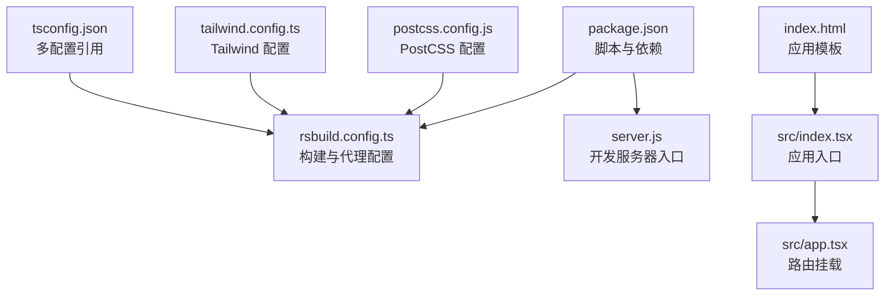
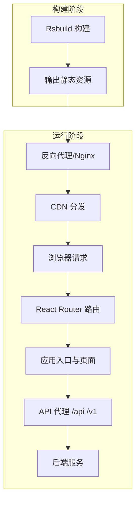
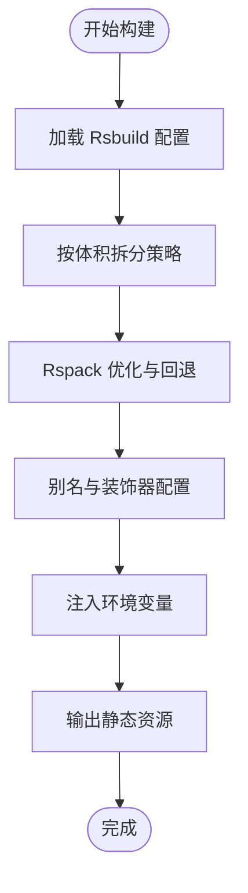
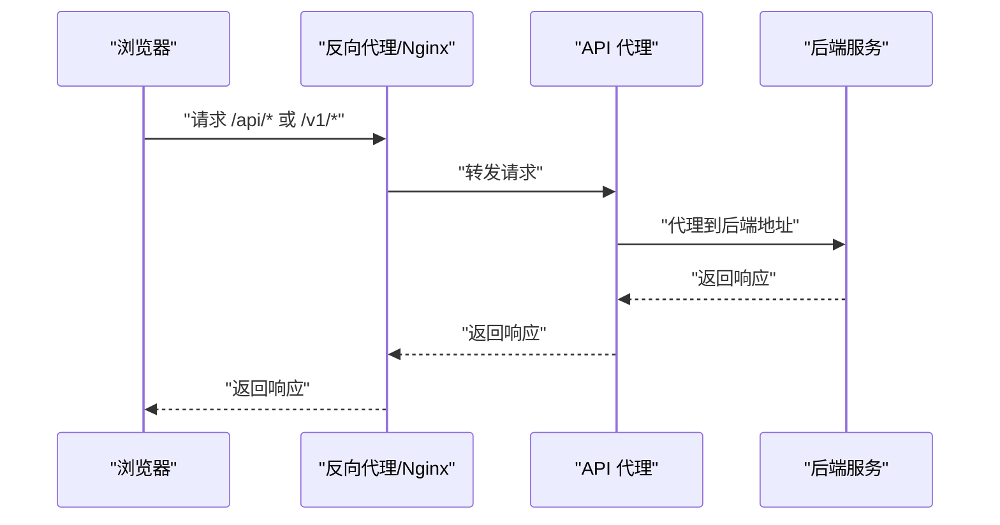
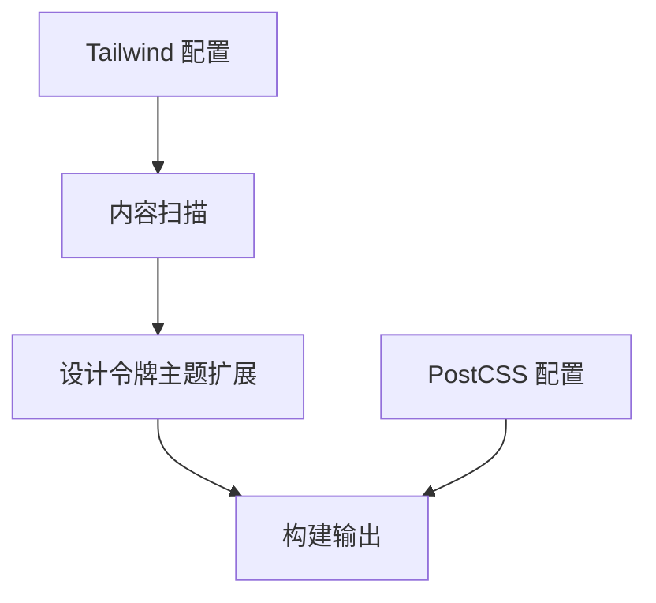
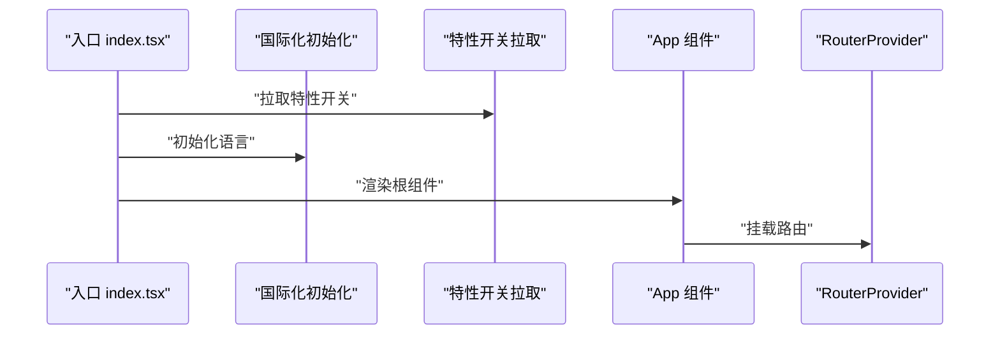
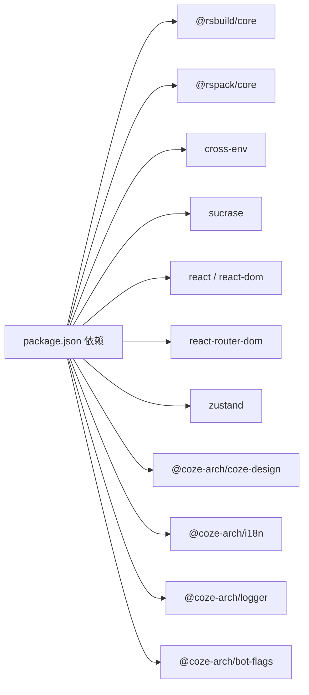

# 部署指南

<cite>
**本文引用的文件**
- [package.json](file://package.json)
- [rsbuild.config.ts](file://rsbuild.config.ts)
- [server.js](file://server.js)
- [index.html](file://index.html)
- [README.md](file://README.md)
- [tailwind.config.ts](file://tailwind.config.ts)
- [postcss.config.js](file://postcss.config.js)
- [tsconfig.json](file://tsconfig.json)
- [src/index.tsx](file://src/index.tsx)
- [src/app.tsx](file://src/app.tsx)
</cite>

## 目录
1. [简介](#简介)
2. [项目结构](#项目结构)
3. [核心组件](#核心组件)
4. [架构总览](#架构总览)
5. [详细组件分析](#详细组件分析)
6. [依赖分析](#依赖分析)
7. [性能考虑](#性能考虑)
8. [故障排查指南](#故障排查指南)
9. [结论](#结论)
10. [附录](#附录)

## 简介
本指南面向生产环境的 Coze Studio 前端应用部署，覆盖构建优化、静态资源处理与服务器配置，并提供 Docker 容器化、云平台与传统服务器三种部署方案。同时说明环境变量与敏感信息管理、负载均衡与 CDN 缓存策略、监控与日志配置、性能优化与容量规划、回滚与灾备策略，以及常见问题排查方法，确保部署流程的安全性与可靠性。

## 项目结构
该前端应用基于 Rsbuild 构建工具，采用 React + React Router 的单页应用（SPA）架构，使用 TailwindCSS 与 Less 进行样式组织，通过 Rspack 打包器进行模块解析与按需打包。关键目录与文件如下：
- 构建与运行：Rsbuild 配置、启动脚本、预览命令
- 样式系统：PostCSS、TailwindCSS 配置
- 应用入口：HTML 模板、React 入口与路由挂载
- 类型与配置：TypeScript 多配置引用

图表来源
- [package.json:11-17](file://package.json#L11-L17)
- [rsbuild.config.ts:26-43](file://rsbuild.config.ts#L26-L43)
- [server.js:1-4](file://server.js#L1-L4)
- [index.html:1-13](file://index.html#L1-L13)
- [src/index.tsx:33-52](file://src/index.tsx#L33-L52)
- [src/app.tsx:22-36](file://src/app.tsx#L22-L36)
- [postcss.config.js:1-2](file://postcss.config.js#L1-L2)
- [tailwind.config.ts:25-54](file://tailwind.config.ts#L25-L54)
- [tsconfig.json:1-16](file://tsconfig.json#L1-L16)

章节来源
- [README.md:1-7](file://README.md#L1-L7)
- [package.json:11-17](file://package.json#L11-L17)
- [rsbuild.config.ts:26-43](file://rsbuild.config.ts#L26-L43)
- [index.html:1-13](file://index.html#L1-L13)
- [src/index.tsx:33-52](file://src/index.tsx#L33-L52)
- [src/app.tsx:22-36](file://src/app.tsx#L22-L36)
- [postcss.config.js:1-2](file://postcss.config.js#L1-L2)
- [tailwind.config.ts:25-54](file://tailwind.config.ts#L25-L54)
- [tsconfig.json:1-16](file://tsconfig.json#L1-L16)

## 核心组件
- 构建与打包
  - 使用 Rsbuild 作为构建引擎，Rspack 作为打包器，支持按需加载与模块回退（如 path-browserify），并配置了忽略特定警告以提升稳定性。
  - HTML 模板与标题、favicon、跨域属性在配置中集中管理。
- 开发与代理
  - 提供本地开发代理，将 /api 与 /v1 请求转发到后端服务地址，便于前后端联调。
- 样式体系
  - PostCSS 通过统一配置注入，TailwindCSS 从设计令牌生成主题与响应式断点，内容扫描范围由工程约定函数确定。
- 应用入口
  - React 入口负责国际化初始化、特性开关拉取、动态样式注入，并渲染根组件与路由。

章节来源
- [rsbuild.config.ts:50-90](file://rsbuild.config.ts#L50-L90)
- [rsbuild.config.ts:44-49](file://rsbuild.config.ts#L44-L49)
- [rsbuild.config.ts:26-43](file://rsbuild.config.ts#L26-L43)
- [postcss.config.js:1-2](file://postcss.config.js#L1-L2)
- [tailwind.config.ts:25-54](file://tailwind.config.ts#L25-L54)
- [src/index.tsx:26-52](file://src/index.tsx#L26-L52)

## 架构总览
下图展示生产部署的关键路径：构建产物生成、静态资源分发、浏览器请求与路由、API 代理与后端交互。

图表来源
- [rsbuild.config.ts:26-43](file://rsbuild.config.ts#L26-L43)
- [src/index.tsx:33-52](file://src/index.tsx#L33-L52)
- [src/app.tsx:22-36](file://src/app.tsx#L22-L36)

## 详细组件分析

### 构建与打包配置
- 性能拆包策略
  - 启用按体积拆分策略，设置最小与最大分块大小，有助于减少首屏体积并提升缓存命中率。
- Rspack 优化
  - 模块回退与忽略警告，提升兼容性与稳定性；watchOptions 设置为轮询模式，适配部分容器或文件系统场景。
- 别名与装饰器
  - 通过别名解决依赖解析冲突，启用装饰器兼容以支持特定库。
- Source Define
  - 注入运行时环境变量，如区域、版本范围、Taro 平台等，用于控制 SDK 与运行时行为。

图表来源
- [rsbuild.config.ts:126-132](file://rsbuild.config.ts#L126-L132)
- [rsbuild.config.ts:55-89](file://rsbuild.config.ts#L55-L89)
- [rsbuild.config.ts:113-125](file://rsbuild.config.ts#L113-L125)
- [rsbuild.config.ts:92-106](file://rsbuild.config.ts#L92-L106)

章节来源
- [rsbuild.config.ts:126-132](file://rsbuild.config.ts#L126-L132)
- [rsbuild.config.ts:55-89](file://rsbuild.config.ts#L55-L89)
- [rsbuild.config.ts:113-125](file://rsbuild.config.ts#L113-L125)
- [rsbuild.config.ts:92-106](file://rsbuild.config.ts#L92-L106)

### 开发代理与 API 交互
- 代理规则
  - 将 /api 与 /v1 请求转发至指定后端地址，支持跨域与非安全连接配置，便于本地联调。
- 生产注意事项
  - 生产环境应通过反向代理或网关统一暴露 API，避免直接暴露后端地址。

图表来源
- [rsbuild.config.ts:26-43](file://rsbuild.config.ts#L26-L43)

章节来源
- [rsbuild.config.ts:26-43](file://rsbuild.config.ts#L26-L43)

### 样式与主题配置
- Tailwind 内容扫描
  - 通过工程约定函数收集内容，确保未使用的样式被正确移除，减少产物体积。
- 设计令牌与响应式
  - 主题扩展来自设计令牌 JSON，响应式断点来自常量，保证视觉一致性与移动端体验。
- PostCSS 集成
  - 统一的 PostCSS 配置，确保构建链路一致。

图表来源
- [tailwind.config.ts:25-54](file://tailwind.config.ts#L25-L54)
- [postcss.config.js:1-2](file://postcss.config.js#L1-L2)

章节来源
- [tailwind.config.ts:25-54](file://tailwind.config.ts#L25-L54)
- [postcss.config.js:1-2](file://postcss.config.js#L1-L2)

### 应用入口与路由
- 国际化与特性开关
  - 初始化语言与特性开关，确保运行时行为符合预期。
- 路由挂载
  - 使用 Suspense 提供加载态，RouterProvider 渲染路由树。

图表来源
- [src/index.tsx:26-52](file://src/index.tsx#L26-L52)
- [src/app.tsx:22-36](file://src/app.tsx#L22-L36)

章节来源
- [src/index.tsx:26-52](file://src/index.tsx#L26-L52)
- [src/app.tsx:22-36](file://src/app.tsx#L22-L36)

## 依赖分析
- 构建与运行
  - Rsbuild 与 Rspack 为核心构建工具链；cross-env 用于跨平台注入环境变量；sucrase 用于开发服务器热加载。
- 样式与主题
  - TailwindCSS 与 PostCSS 配置由统一架构包提供，确保团队一致性。
- 应用层依赖
  - React、React Router、Zustand、设计体系与全局适配层等，构成应用基础能力。

图表来源
- [package.json:19-51](file://package.json#L19-L51)
- [package.json:68-81](file://package.json#L68-L81)

章节来源
- [package.json:19-51](file://package.json#L19-L51)
- [package.json:68-81](file://package.json#L68-L81)

## 性能考虑
- 构建优化
  - 启用按体积拆分策略，合理设置分块上下限，降低首屏体积并提升缓存复用。
  - 使用 Rspack 与模块回退，减少运行时错误与兼容性问题。
- 资源与缓存
  - 通过 CDN 与反向代理实现强缓存与按版本命名策略，结合 ETag/Last-Modified 实现协商缓存。
- 网络与路由
  - SPA 路由由浏览器历史模式管理，确保静态资源可被正确缓存与回源。
- 监控与日志
  - 建议接入前端埋点与错误上报，结合服务端日志进行全链路追踪。

章节来源
- [rsbuild.config.ts:126-132](file://rsbuild.config.ts#L126-L132)
- [rsbuild.config.ts:55-89](file://rsbuild.config.ts#L55-L89)

## 故障排查指南
- 构建失败
  - 检查 Rsbuild/Rspack 版本与配置是否匹配；确认 Node 版本满足要求；查看忽略警告是否影响打包结果。
- 代理无效
  - 确认开发代理目标地址与上下文匹配；生产环境请通过反向代理统一暴露 API。
- 样式异常
  - 检查 Tailwind 内容扫描范围与 PostCSS 插件顺序；确认设计令牌与主题扩展配置正确。
- 路由白屏或空白
  - 检查入口渲染逻辑与 Suspense fallback；确认 HTML 模板根节点存在且唯一。
- 国际化与特性开关
  - 确认初始化顺序与网络可达性；必要时增加降级策略与超时处理。

章节来源
- [rsbuild.config.ts:26-43](file://rsbuild.config.ts#L26-L43)
- [rsbuild.config.ts:55-89](file://rsbuild.config.ts#L55-L89)
- [tailwind.config.ts:25-54](file://tailwind.config.ts#L25-L54)
- [src/index.tsx:33-52](file://src/index.tsx#L33-L52)
- [index.html:9-12](file://index.html#L9-L12)

## 结论
通过 Rsbuild 与 Rspack 的组合，配合 TailwindCSS 与统一 PostCSS 配置，Coze Studio 前端具备良好的可维护性与可扩展性。生产部署建议采用反向代理 + CDN + 缓存策略，结合监控与日志体系，确保高可用与高性能。按体积拆分与模块回退等优化手段，可有效提升用户体验与运维效率。

## 附录

### 环境变量与敏感信息管理
- 注入方式
  - 通过构建期注入运行时环境变量，控制 SDK 区域、版本范围与平台等行为。
- 敏感信息
  - 不应在前端注入后端密钥；API 密钥与会话令牌应由后端管理并通过受控接口下发。

章节来源
- [rsbuild.config.ts:92-106](file://rsbuild.config.ts#L92-L106)

### 部署方案概览
- Docker 容器化
  - 使用 Nginx 镜像承载静态资源，挂载构建产物；通过环境变量控制运行参数。
- 云平台部署
  - 使用对象存储或 CDN 分发静态资源，结合反向代理与 WAF；按需开启灰度与蓝绿发布。
- 传统服务器部署
  - 在 Web 服务器上部署静态资源，配置 gzip/HTTP/2 与缓存头；使用进程管理器守护进程。

章节来源
- [rsbuild.config.ts:44-49](file://rsbuild.config.ts#L44-L49)

### 负载均衡、缓存与 CDN
- 负载均衡
  - 前端静态资源无状态，可水平扩展；后端 API 通过网关或 LB 做健康检查与熔断。
- 缓存策略
  - 对静态资源启用强缓存；对 HTML 与动态接口启用协商缓存；对 API 响应体根据业务设定 TTL。
- CDN
  - 将构建产物上传至 CDN，结合边缘缓存与回源策略，降低延迟并提升可用性。

章节来源
- [rsbuild.config.ts:126-132](file://rsbuild.config.ts#L126-L132)

### 监控与日志
- 前端监控
  - 接入错误上报与性能指标采集，记录路由切换、首屏时间与错误堆栈。
- 日志配置
  - 控制台日志分级输出；生产环境避免打印敏感信息；结合后端日志进行关联分析。

章节来源
- [src/index.tsx:18-20](file://src/index.tsx#L18-L20)

### 容量规划与回滚策略
- 容量规划
  - 基于峰值并发与带宽估算，预留 20%-30% 缓冲；对热点资源提前缓存。
- 回滚策略
  - 采用蓝绿或金丝雀发布，保留上一版本镜像/实例；出现问题快速回滚。
- 灾难恢复
  - 多地域部署与自动切换；定期备份构建产物与配置；演练故障转移流程。

章节来源
- [package.json:11-17](file://package.json#L11-L17)