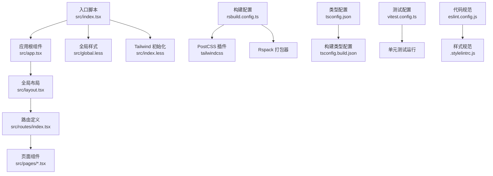
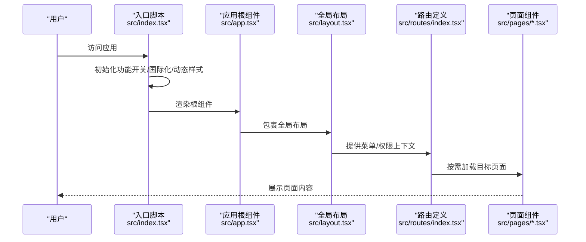
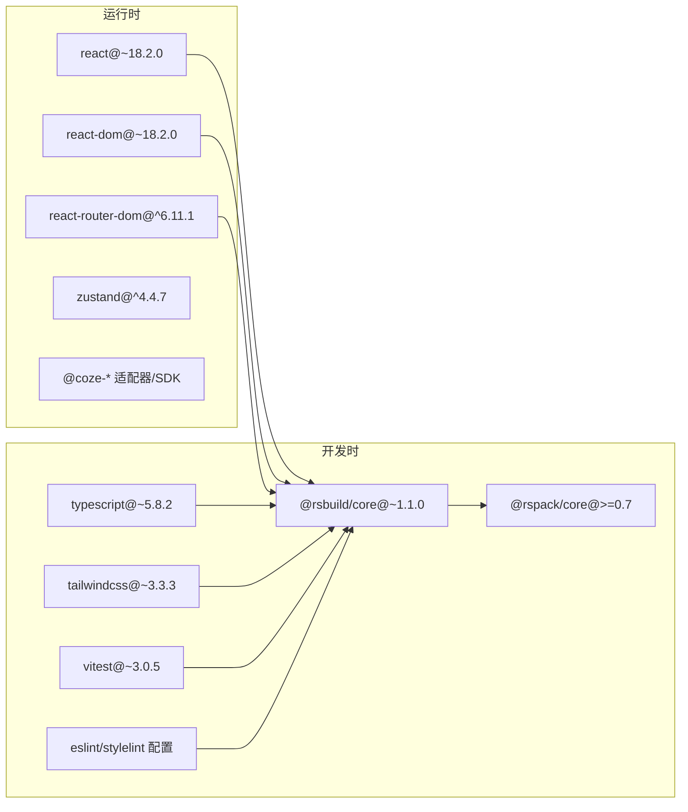

# 技术栈

<cite>
**本文引用的文件**
- [package.json](file://package.json)
- [rsbuild.config.ts](file://rsbuild.config.ts)
- [tsconfig.json](file://tsconfig.json)
- [tsconfig.build.json](file://tsconfig.build.json)
- [tsconfig.misc.json](file://tsconfig.misc.json)
- [eslint.config.js](file://eslint.config.js)
- [.stylelintrc.js](file://.stylelintrc.js)
- [postcss.config.js](file://postcss.config.js)
- [tailwind.config.ts](file://tailwind.config.ts)
- [vitest.config.ts](file://vitest.config.ts)
- [src/index.tsx](file://src/index.tsx)
- [src/app.tsx](file://src/app.tsx)
- [src/layout.tsx](file://src/layout.tsx)
- [src/routes/index.tsx](file://src/routes/index.tsx)
- [src/pages/develop.tsx](file://src/pages/develop.tsx)
- [src/pages/library.tsx](file://src/pages/library.tsx)
- [src/pages/explore.tsx](file://src/pages/explore.tsx)
- [src/global.less](file://src/global.less)
- [src/index.less](file://src/index.less)
</cite>

## 目录
1. [引言](#引言)
2. [项目结构](#项目结构)
3. [核心组件](#核心组件)
4. [架构总览](#架构总览)
5. [详细组件分析](#详细组件分析)
6. [依赖分析](#依赖分析)
7. [性能考虑](#性能考虑)
8. [故障排查指南](#故障排查指南)
9. [结论](#结论)
10. [附录：学习路径建议](#附录学习路径建议)

## 引言
本文件面向 Coze Studio 前端团队与新成员，系统化梳理并解释项目采用的技术栈与工具链，重点覆盖以下方面：
- 核心技术选型：React 18.2.0、TypeScript 5.8.2、Rsbuild 1.1.0 等
- 工具链与质量保障：ESLint、Stylelint、Tailwind CSS、Vitest
- 构建与样式系统：Rsbuild 配置、PostCSS、Tailwind 集成与设计令牌映射
- 路由与页面组织：React Router v6 的动态路由与异步组件加载
- 开发体验与工程化：环境变量注入、代理、别名、polyfill 回退与按需打包策略

目标是帮助初学者快速上手，同时为有经验的开发者提供深入的架构洞察与最佳实践。

## 项目结构
该前端应用采用“单体应用 + 多包工作区”的组织方式，入口位于 src/index.tsx，应用根组件在 src/app.tsx，全局布局在 src/layout.tsx，路由集中在 src/routes/index.tsx，并通过异步组件实现按需加载。样式体系以 Tailwind CSS 为核心，结合 PostCSS 与设计令牌进行主题扩展。

图表来源
- [src/index.tsx:1-55](file://src/index.tsx#L1-L55)
- [src/app.tsx:1-37](file://src/app.tsx#L1-L37)
- [src/layout.tsx:1-24](file://src/layout.tsx#L1-L24)
- [src/routes/index.tsx:1-298](file://src/routes/index.tsx#L1-L298)
- [rsbuild.config.ts:1-136](file://rsbuild.config.ts#L1-L136)
- [tsconfig.json:1-16](file://tsconfig.json#L1-L16)
- [tsconfig.build.json:1-134](file://tsconfig.build.json#L1-L134)
- [vitest.config.ts:1-23](file://vitest.config.ts#L1-L23)
- [eslint.config.js:1-7](file://eslint.config.js#L1-L7)
- [.stylelintrc.js:1-6](file://.stylelintrc.js#L1-L6)
- [src/global.less:1-235](file://src/global.less#L1-L235)
- [src/index.less:1-9](file://src/index.less#L1-L9)

章节来源
- [src/index.tsx:1-55](file://src/index.tsx#L1-L55)
- [src/app.tsx:1-37](file://src/app.tsx#L1-L37)
- [src/layout.tsx:1-24](file://src/layout.tsx#L1-L24)
- [src/routes/index.tsx:1-298](file://src/routes/index.tsx#L1-L298)
- [rsbuild.config.ts:1-136](file://rsbuild.config.ts#L1-L136)
- [tsconfig.json:1-16](file://tsconfig.json#L1-L16)
- [tsconfig.build.json:1-134](file://tsconfig.build.json#L1-L134)
- [tsconfig.misc.json:1-28](file://tsconfig.misc.json#L1-L28)
- [vitest.config.ts:1-23](file://vitest.config.ts#L1-L23)
- [eslint.config.js:1-7](file://eslint.config.js#L1-L7)
- [.stylelintrc.js:1-6](file://.stylelintrc.js#L1-L6)
- [src/global.less:1-235](file://src/global.less#L1-L235)
- [src/index.less:1-9](file://src/index.less#L1-L9)

## 核心组件
- React 18.2.0：提供函数式组件、并发特性（Suspense、startTransition）与服务端渲染友好的能力，支撑复杂交互与多模块协作。
- TypeScript 5.8.2：强类型保障，配合复合 tsconfig 与多引用配置，实现严格类型检查与增量编译优化。
- Rsbuild 1.1.0：基于 Rspack 的现代化构建工具，提供开箱即用的开发体验与高性能打包能力。
- Tailwind CSS 3.3.x：原子类驱动的实用优先样式系统，结合设计令牌与主题扩展，统一视觉语言。
- ESLint 与 Stylelint：统一代码风格与样式规范，保障团队一致性。
- Vitest：轻量级测试运行器，支持 Web 环境与覆盖率统计。

章节来源
- [package.json:19-81](file://package.json#L19-L81)
- [rsbuild.config.ts:44-54](file://rsbuild.config.ts#L44-L54)
- [tailwind.config.ts:17-54](file://tailwind.config.ts#L17-L54)
- [eslint.config.js:1-7](file://eslint.config.js#L1-L7)
- [.stylelintrc.js:1-6](file://.stylelintrc.js#L1-L6)
- [vitest.config.ts:17-22](file://vitest.config.ts#L17-L22)

## 架构总览
应用启动流程从入口文件开始，初始化国际化、功能开关与样式，随后挂载 React 根节点并进入路由体系。全局布局负责空间与菜单上下文，路由按需加载页面模块，页面内部再调用适配器或业务组件完成具体功能。

图表来源
- [src/index.tsx:26-52](file://src/index.tsx#L26-L52)
- [src/app.tsx:24-36](file://src/app.tsx#L24-L36)
- [src/layout.tsx:19-23](file://src/layout.tsx#L19-L23)
- [src/routes/index.tsx:50-297](file://src/routes/index.tsx#L50-L297)
- [src/pages/develop.tsx:21-24](file://src/pages/develop.tsx#L21-L24)
- [src/pages/library.tsx:21-24](file://src/pages/library.tsx#L21-L24)
- [src/pages/explore.tsx:37-66](file://src/pages/explore.tsx#L37-L66)

## 详细组件分析

### 构建与打包：Rsbuild + Rspack
- 配置要点
  - HTML 注入：标题、favicon、模板与跨域属性
  - 代理：针对 /api 与 /v1 的后端接口转发
  - PostCSS：集成 tailwindcss 并传入自定义配置路径
  - Rspack 自定义：规则注入 import-watch-loader、path polyfill 回退、忽略特定警告、轮询监听
  - 源码定义：注入多组运行时环境变量，用于 SDK 区域、范围、平台等判定
  - include/alias：包含多包源码并重定向部分依赖解析
  - 性能：分包策略按体积拆分，控制 chunk 尺寸范围
- 优势
  - 快速冷启动与热更新
  - 与现代浏览器语法兼容良好
  - 易于扩展插件生态

章节来源
- [rsbuild.config.ts:26-133](file://rsbuild.config.ts#L26-L133)

### 类型系统：TypeScript 复合工程
- 结构
  - 根 tsconfig 引用构建与杂项配置
  - 构建配置继承企业级 web tsconfig，启用隔离模块与 bundler 解析
  - 杂项配置启用 vitest/node 类型，便于测试与工具脚本
- 价值
  - 分层清晰、增量编译高效
  - 多包共享类型约定，降低耦合成本

章节来源
- [tsconfig.json:1-16](file://tsconfig.json#L1-L16)
- [tsconfig.build.json:1-134](file://tsconfig.build.json#L1-L134)
- [tsconfig.misc.json:1-28](file://tsconfig.misc.json#L1-L28)

### 样式系统：Tailwind CSS + 设计令牌
- 配置要点
  - 内容扫描：基于 @coze-arch/tailwind-config 的工具函数收集扫描范围
  - 主题扩展：屏幕断点、颜色与尺寸令牌映射
  - 插件：引入企业级 Tailwind 插件以增强组件化能力
  - 关闭 Preflight：避免与既有样式冲突
  - 安全列表：对动态类名进行白名单放行
- 与 PostCSS 集成
  - 通过 Rsbuild tools.postcss 注入 tailwindcss 插件
- 与全局样式协同
  - 在 index.less 中引入 Tailwind 原子类，global.less 提供基础排版与滚动条样式

章节来源
- [tailwind.config.ts:17-54](file://tailwind.config.ts#L17-L54)
- [postcss.config.js:1-2](file://postcss.config.js#L1-L2)
- [src/index.less:1-9](file://src/index.less#L1-L9)
- [src/global.less:1-235](file://src/global.less#L1-L235)

### 路由与页面：React Router v6 + 异步组件
- 路由组织
  - 使用 createBrowserRouter 定义主应用路由，嵌套路由覆盖空间、资源库、知识库、数据库、插件等模块
  - 页面加载器（loader）统一注入侧边栏、鉴权、菜单键等上下文信息
- 动态导入
  - 页面组件通过懒加载与异步组件实现按需加载，减少首屏体积
- 错误边界
  - 全局错误组件包裹，提升异常场景下的用户体验

章节来源
- [src/routes/index.tsx:50-297](file://src/routes/index.tsx#L50-L297)
- [src/pages/develop.tsx:21-24](file://src/pages/develop.tsx#L21-L24)
- [src/pages/library.tsx:21-24](file://src/pages/library.tsx#L21-L24)
- [src/pages/explore.tsx:37-66](file://src/pages/explore.tsx#L37-L66)

### 启动与上下文：入口、布局与国际化
- 入口初始化
  - 拉起功能开关、初始化 i18n、动态导入 mdbox 样式
  - 创建根节点并渲染应用
- 全局布局
  - 通过 @coze-foundation/global-adapter 提供空间与菜单上下文
- 应用根组件
  - 使用 Suspense 提供加载占位，RouterProvider 管理路由

章节来源
- [src/index.tsx:26-52](file://src/index.tsx#L26-L52)
- [src/layout.tsx:19-23](file://src/layout.tsx#L19-L23)
- [src/app.tsx:24-36](file://src/app.tsx#L24-L36)

### 质量与测试：ESLint、Stylelint、Vitest
- ESLint
  - 基于企业级配置，指定 packageRoot，统一 Web 项目规则
- Stylelint
  - 基于企业级配置，无额外扩展
- Vitest
  - Web 环境预设，支持覆盖率统计

章节来源
- [eslint.config.js:1-7](file://eslint.config.js#L1-L7)
- [.stylelintrc.js:1-6](file://.stylelintrc.js#L1-L6)
- [vitest.config.ts:17-22](file://vitest.config.ts#L17-L22)

## 依赖分析
- 运行时依赖
  - React 生态：react、react-dom、react-router-dom、react-error-boundary
  - 状态管理：zustand
  - 适配器与 SDK：多套 @coze-* 命名空间的适配层与 SDK
  - 工具：path-browserify
- 开发依赖
  - 构建：@rsbuild/core、@rspack/core、webpack
  - 规范：@coze-arch/eslint-config、@coze-arch/stylelint-config、tailwindcss
  - 测试：vitest、@vitest/coverage-v8
  - 工程化：cross-env、sucrase、@coze-arch/rsbuild-config 等

图表来源
- [package.json:19-81](file://package.json#L19-L81)

章节来源
- [package.json:19-81](file://package.json#L19-L81)

## 性能考虑
- 分包策略：按体积拆分，控制单 chunk 最大/最小阈值，降低缓存失效概率
- 懒加载：路由级异步组件与页面级动态导入，显著减少首屏 JS 体积
- Polyfill 回退：对 path 模块进行浏览器回退，避免打包器缺失导致的运行时错误
- 监听优化：开启轮询监听，改善某些环境下的热更新稳定性
- 环境变量裁剪：通过 define 注入常量，使 Tree-Shaking 更彻底

章节来源
- [rsbuild.config.ts:126-132](file://rsbuild.config.ts#L126-L132)
- [rsbuild.config.ts:76-88](file://rsbuild.config.ts#L76-L88)
- [src/routes/index.tsx:24-48](file://src/routes/index.tsx#L24-L48)

## 故障排查指南
- 构建失败（缺少 path 模块）
  - 现象：运行时报错提示无法找到 path
  - 处理：Rsbuild 已在 fallback 中回退到 path-browserify，确认依赖安装与别名解析
- 热更新不生效
  - 现象：保存文件后无变化
  - 处理：检查 ignoreWarnings 是否屏蔽了关键告警；确认 watchOptions.poll 已启用
- Tailwind 样式未生效
  - 现象：原子类无效或样式被覆盖
  - 处理：确认 index.less 中已引入 Tailwind 指令；检查 tailwind.config.ts 的 content 与 safelist；避免 Preflight 冲突
- 路由跳转异常
  - 现象：页面空白或 404
  - 处理：核对路由层级与 loader 上下文；确认异步组件是否正确导出默认组件
- 代理请求失败
  - 现象：/api 或 /v1 请求 404
  - 处理：检查 API_PROXY_TARGET 与 context 配置；确认后端服务可达

章节来源
- [rsbuild.config.ts:76-88](file://rsbuild.config.ts#L76-L88)
- [rsbuild.config.ts:25-43](file://rsbuild.config.ts#L25-L43)
- [tailwind.config.ts:25-54](file://tailwind.config.ts#L25-L54)
- [src/routes/index.tsx:50-297](file://src/routes/index.tsx#L50-L297)

## 结论
本项目以 React 18 + TypeScript 为基础，借助 Rsbuild 1.1.0 实现高性能构建与开发体验；Tailwind CSS 与设计令牌确保一致的视觉体系；ESLint/Stylelint/Vitest 形成完善的质量保障闭环。通过路由异步加载与分包策略，兼顾首屏性能与模块化演进。整体技术栈在保证工程化效率的同时，提供了良好的扩展性与可维护性。

## 附录：学习路径建议
- 初学者
  - React 基础：组件、Hooks、事件处理、状态管理
  - TypeScript 基础：类型声明、接口、泛型、编译配置
  - 构建工具入门：Rsbuild 基本命令、配置结构与常用选项
  - 样式系统：Tailwind 原子类、响应式断点、主题扩展
  - 路由与导航：React Router v6 的路由定义与懒加载
- 进阶者
  - 工程化：复合 tsconfig、多包引用、类型检查与增量编译
  - 规范与测试：ESLint/Stylelint 规则定制、Vitest 编写与覆盖率
  - 性能优化：分包策略、懒加载、Polyfill 回退与监听优化
  - 适配器与 SDK：理解 @coze-* 适配层职责与调用方式
- 实践建议
  - 从最小可运行页面入手，逐步接入路由与布局
  - 使用异步组件与 loader 组织页面上下文
  - 通过 Ts 推断与类型约束减少运行时错误
  - 借助 Rsbuild 的 dev/preview 能力快速验证改动