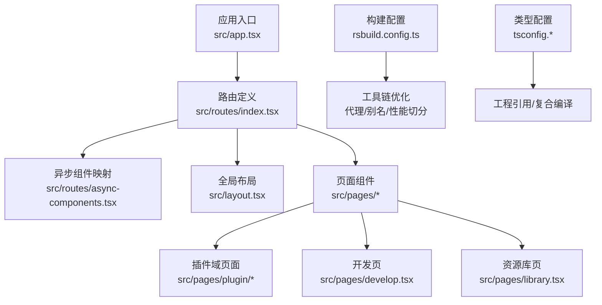
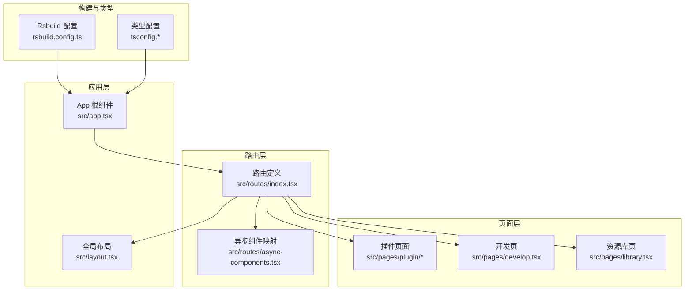
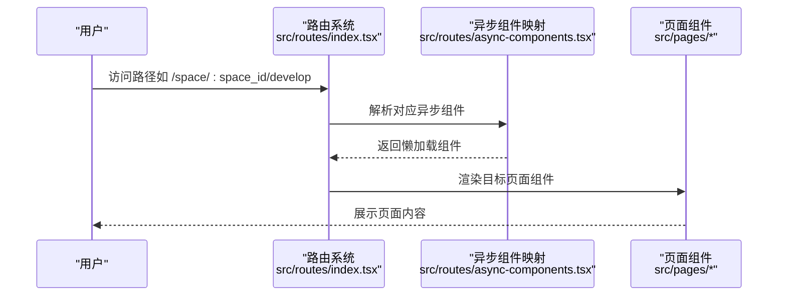
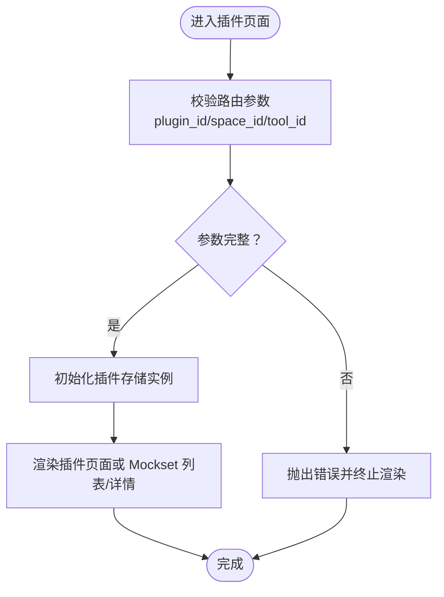
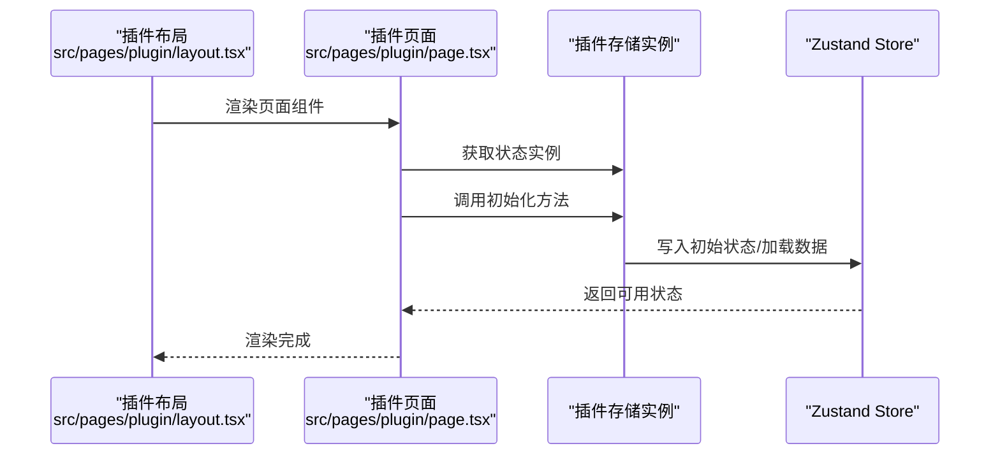
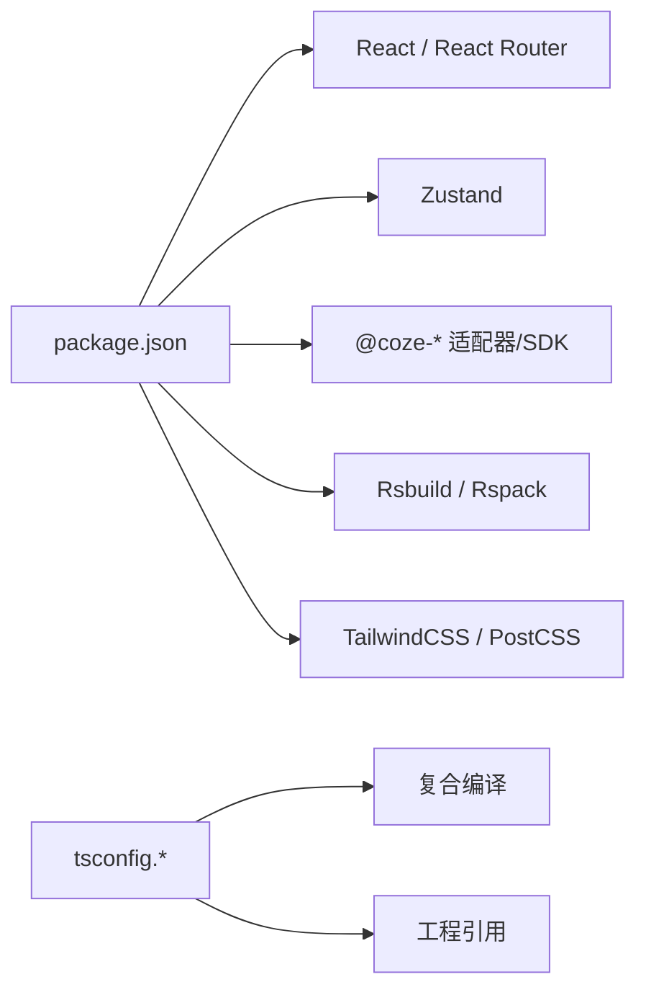

# 架构设计

<cite>
**本文引用的文件**
- [src/app.tsx](file://src/app.tsx)
- [src/layout.tsx](file://src/layout.tsx)
- [src/routes/index.tsx](file://src/routes/index.tsx)
- [src/routes/async-components.tsx](file://src/routes/async-components.tsx)
- [src/pages/plugin/layout.tsx](file://src/pages/plugin/layout.tsx)
- [src/pages/plugin/page.tsx](file://src/pages/plugin/page.tsx)
- [src/pages/plugin/tool/plugin-mock-set/page.tsx](file://src/pages/plugin/tool/plugin-mock-set/page.tsx)
- [src/pages/plugin/tool/plugin-mock-set/detail/page.tsx](file://src/pages/plugin/tool/plugin-mock-set/detail/page.tsx)
- [src/pages/develop.tsx](file://src/pages/develop.tsx)
- [src/pages/library.tsx](file://src/pages/library.tsx)
- [rsbuild.config.ts](file://rsbuild.config.ts)
- [package.json](file://package.json)
- [tsconfig.json](file://tsconfig.json)
- [tsconfig.build.json](file://tsconfig.build.json)
- [tsconfig.misc.json](file://tsconfig.misc.json)
- [README.md](file://README.md)
</cite>

## 目录
1. [引言](#引言)
2. [项目结构](#项目结构)
3. [核心组件](#核心组件)
4. [架构总览](#架构总览)
5. [详细组件分析](#详细组件分析)
6. [依赖分析](#依赖分析)
7. [性能考量](#性能考量)
8. [故障排查指南](#故障排查指南)
9. [结论](#结论)
10. [附录](#附录)

## 引言
本架构设计文档面向 Coze Studio 前端应用，聚焦于整体架构理念与设计原则：Monorepo 架构、模块化设计、组件化开发；路由系统（嵌套路由、懒加载、权限控制）；状态管理（Zustand 使用模式与数据流）；组件分层（从应用根组件到页面组件的层级关系）；构建工具链（Rsbuild 的优化策略）。文档通过架构图与组件关系图帮助开发者快速理解系统设计，并强调可扩展性与可维护性。

## 项目结构
Coze Studio 采用 Monorepo 管理多包协作，前端应用位于 apps/coze-studio，核心目录与职责如下：
- src/app.tsx：应用根组件，挂载 RouterProvider 并包裹全局加载占位。
- src/layout.tsx：全局布局适配器，负责应用初始化与顶层布局容器。
- src/routes/index.tsx：路由定义与嵌套路由配置，统一声明主应用路由树。
- src/routes/async-components.tsx：异步组件映射，集中导出路由对应的动态加载组件。
- src/pages/*：页面级组件，按功能域拆分（如 plugin、develop、library 等），作为路由子组件使用。
- rsbuild.config.ts：构建配置，包含代理、HTML 注入、PostCSS 插件、Rspack 自定义规则、别名与性能切分策略。
- package.json：依赖与脚本，声明 React、React Router、Zustand 等核心依赖及工作区包。
- tsconfig.*：类型系统与工程引用配置，支撑多包编译与类型检查。

**图表来源**
- [src/app.tsx:1-37](file://src/app.tsx#L1-L37)
- [src/layout.tsx:1-24](file://src/layout.tsx#L1-L24)
- [src/routes/index.tsx:1-298](file://src/routes/index.tsx#L1-L298)
- [src/routes/async-components.tsx:1-153](file://src/routes/async-components.tsx#L1-L153)
- [rsbuild.config.ts:1-136](file://rsbuild.config.ts#L1-L136)
- [tsconfig.json:1-16](file://tsconfig.json#L1-L16)
- [tsconfig.build.json:1-134](file://tsconfig.build.json#L1-L134)
- [tsconfig.misc.json:1-27](file://tsconfig.misc.json#L1-L27)

**章节来源**
- [src/app.tsx:1-37](file://src/app.tsx#L1-L37)
- [src/layout.tsx:1-24](file://src/layout.tsx#L1-L24)
- [src/routes/index.tsx:1-298](file://src/routes/index.tsx#L1-L298)
- [src/routes/async-components.tsx:1-153](file://src/routes/async-components.tsx#L1-L153)
- [rsbuild.config.ts:1-136](file://rsbuild.config.ts#L1-L136)
- [package.json:1-84](file://package.json#L1-L84)
- [tsconfig.json:1-16](file://tsconfig.json#L1-L16)
- [tsconfig.build.json:1-134](file://tsconfig.build.json#L1-L134)
- [tsconfig.misc.json:1-27](file://tsconfig.misc.json#L1-L27)
- [README.md:1-7](file://README.md#L1-L7)

## 核心组件
- 应用根组件 App：通过 RouterProvider 挂载路由，使用 Suspense 提供全局加载占位，确保异步组件加载时的用户体验。
- 全局布局 Layout：调用全局初始化钩子并渲染全局布局容器，承载侧边栏、菜单与内容区域。
- 路由系统：基于 createBrowserRouter 定义主路由树，支持嵌套路由、索引路由、重定向与错误边界。
- 异步组件映射：集中导出各路由对应的懒加载组件，便于按需加载与代码分割。
- 页面组件：按功能域拆分，如插件域、开发页、资源库页等，作为路由子组件使用。
- 构建配置：Rsbuild 配置包含代理、HTML 注入、PostCSS 插件、Rspack 自定义规则、别名与性能切分策略。
- 类型系统：复合编译与工程引用，支撑多包协同开发与类型安全。

**章节来源**
- [src/app.tsx:1-37](file://src/app.tsx#L1-L37)
- [src/layout.tsx:1-24](file://src/layout.tsx#L1-L24)
- [src/routes/index.tsx:1-298](file://src/routes/index.tsx#L1-L298)
- [src/routes/async-components.tsx:1-153](file://src/routes/async-components.tsx#L1-L153)
- [rsbuild.config.ts:1-136](file://rsbuild.config.ts#L1-L136)
- [tsconfig.json:1-16](file://tsconfig.json#L1-L16)
- [tsconfig.build.json:1-134](file://tsconfig.build.json#L1-L134)
- [tsconfig.misc.json:1-27](file://tsconfig.misc.json#L1-L27)

## 架构总览
Coze Studio 采用“应用根组件 → 全局布局 → 路由系统 → 页面组件”的分层架构。路由系统以嵌套方式组织工作区、插件、知识库、数据库等业务域，结合懒加载实现按需加载与代码分割。全局布局负责菜单、侧边栏与错误边界，页面组件通过工作区上下文与状态管理完成具体业务逻辑。

**图表来源**
- [src/app.tsx:1-37](file://src/app.tsx#L1-L37)
- [src/layout.tsx:1-24](file://src/layout.tsx#L1-L24)
- [src/routes/index.tsx:1-298](file://src/routes/index.tsx#L1-L298)
- [src/routes/async-components.tsx:1-153](file://src/routes/async-components.tsx#L1-L153)
- [src/pages/plugin/layout.tsx:1-41](file://src/pages/plugin/layout.tsx#L1-L41)
- [src/pages/plugin/page.tsx:1-36](file://src/pages/plugin/page.tsx#L1-L36)
- [src/pages/develop.tsx:1-27](file://src/pages/develop.tsx#L1-L27)
- [src/pages/library.tsx:1-27](file://src/pages/library.tsx#L1-L27)
- [rsbuild.config.ts:1-136](file://rsbuild.config.ts#L1-L136)
- [tsconfig.json:1-16](file://tsconfig.json#L1-L16)
- [tsconfig.build.json:1-134](file://tsconfig.build.json#L1-L134)
- [tsconfig.misc.json:1-27](file://tsconfig.misc.json#L1-L27)

## 详细组件分析

### 路由系统设计
- 嵌套路由：以“/”为主入口，内部嵌套工作区空间、插件、知识库、数据库、探索等子路由，形成清晰的业务域层次。
- 懒加载策略：通过异步组件映射集中导出各路由组件，结合路由 loader 返回元信息（如是否需要侧边栏、是否需要认证、子菜单等），实现按需加载与运行时配置。
- 权限控制：在路由 loader 中设置 requireAuth 字段，结合全局错误边界与登录页路由，统一处理未授权访问。
- 错误边界：全局错误组件作为 errorElement 统一兜底，提升异常场景下的用户体验。

**图表来源**
- [src/routes/index.tsx:1-298](file://src/routes/index.tsx#L1-L298)
- [src/routes/async-components.tsx:1-153](file://src/routes/async-components.tsx#L1-L153)

**章节来源**
- [src/routes/index.tsx:1-298](file://src/routes/index.tsx#L1-L298)
- [src/routes/async-components.tsx:1-153](file://src/routes/async-components.tsx#L1-L153)

### 插件域页面组件
- 插件布局：在插件域路由中注入插件存储 Provider，绑定资源导航函数，确保插件相关页面共享状态与导航能力。
- 插件页面：在进入插件页面时初始化插件存储实例，保证后续操作的数据一致性。
- Mockset 列表与详情：通过路由参数解析插件 ID、工具 ID、空间 ID、MockSet ID，校验参数完整性后渲染对应组件。

**图表来源**
- [src/pages/plugin/layout.tsx:1-41](file://src/pages/plugin/layout.tsx#L1-L41)
- [src/pages/plugin/page.tsx:1-36](file://src/pages/plugin/page.tsx#L1-L36)
- [src/pages/plugin/tool/plugin-mock-set/page.tsx:1-37](file://src/pages/plugin/tool/plugin-mock-set/page.tsx#L1-L37)
- [src/pages/plugin/tool/plugin-mock-set/detail/page.tsx:1-39](file://src/pages/plugin/tool/plugin-mock-set/detail/page.tsx#L1-L39)

**章节来源**
- [src/pages/plugin/layout.tsx:1-41](file://src/pages/plugin/layout.tsx#L1-L41)
- [src/pages/plugin/page.tsx:1-36](file://src/pages/plugin/page.tsx#L1-L36)
- [src/pages/plugin/tool/plugin-mock-set/page.tsx:1-37](file://src/pages/plugin/tool/plugin-mock-set/page.tsx#L1-L37)
- [src/pages/plugin/tool/plugin-mock-set/detail/page.tsx:1-39](file://src/pages/plugin/tool/plugin-mock-set/detail/page.tsx#L1-L39)

### 开发页与资源库页
- 开发页：根据工作区 ID 渲染开发页面，作为工作区内的主要开发入口。
- 资源库页：根据工作区 ID 渲染资源库页面，承载资源管理与浏览功能。

**章节来源**
- [src/pages/develop.tsx:1-27](file://src/pages/develop.tsx#L1-L27)
- [src/pages/library.tsx:1-27](file://src/pages/library.tsx#L1-L27)

### 状态管理与数据流（Zustand）
- 状态容器：在插件域布局中注入插件存储 Provider，使页面组件可通过 hooks 获取状态实例。
- 初始化流程：页面组件在挂载时调用状态实例的初始化方法，确保数据准备就绪后再进行渲染。
- 数据流：路由 loader 提供页面元信息（如是否需要侧边栏、是否需要认证），页面组件通过状态容器与上下文完成数据拉取与更新。

**图表来源**
- [src/pages/plugin/layout.tsx:1-41](file://src/pages/plugin/layout.tsx#L1-L41)
- [src/pages/plugin/page.tsx:1-36](file://src/pages/plugin/page.tsx#L1-L36)

**章节来源**
- [src/pages/plugin/layout.tsx:1-41](file://src/pages/plugin/layout.tsx#L1-L41)
- [src/pages/plugin/page.tsx:1-36](file://src/pages/plugin/page.tsx#L1-L36)

## 依赖分析
- 应用依赖：React、React Router、Zustand、全局适配器与工作区适配器等，统一通过工作区包管理。
- 构建依赖：Rsbuild、Rspack、TailwindCSS、PostCSS 插件等，用于开发与生产构建。
- 类型依赖：复合编译与工程引用，确保多包类型安全与增量编译。

**图表来源**
- [package.json:1-84](file://package.json#L1-L84)
- [tsconfig.json:1-16](file://tsconfig.json#L1-L16)
- [tsconfig.build.json:1-134](file://tsconfig.build.json#L1-L134)
- [tsconfig.misc.json:1-27](file://tsconfig.misc.json#L1-L27)

**章节来源**
- [package.json:1-84](file://package.json#L1-L84)
- [tsconfig.json:1-16](file://tsconfig.json#L1-L16)
- [tsconfig.build.json:1-134](file://tsconfig.build.json#L1-L134)
- [tsconfig.misc.json:1-27](file://tsconfig.misc.json#L1-L27)

## 性能考量
- 代码分割：通过异步组件映射与路由懒加载，减少首屏体积，提升加载速度。
- 构建优化：Rsbuild 配置启用按大小切分策略，合理划分 chunk，避免过大 bundle 导致加载缓慢。
- 运行时优化：Rspack 自定义规则与别名配置，减少重复依赖与解析开销；PostCSS 插件按需引入，降低样式处理成本。
- 开发体验：热更新与代理配置，提升本地开发效率。

**章节来源**
- [src/routes/async-components.tsx:1-153](file://src/routes/async-components.tsx#L1-L153)
- [src/routes/index.tsx:1-298](file://src/routes/index.tsx#L1-L298)
- [rsbuild.config.ts:1-136](file://rsbuild.config.ts#L1-L136)

## 故障排查指南
- 路由参数缺失：插件页面组件在渲染前会校验路由参数，若缺失将抛出错误并终止渲染。请确认路径中包含必要的 ID 参数。
- 登录与权限：登录页与 requireAuth 配置共同保障未授权访问的正确处理。若出现权限问题，请检查路由 loader 的 requireAuth 设置与全局错误边界。
- 异步组件加载失败：若懒加载组件无法加载，请检查异步组件映射与打包配置，确保路径与别名正确。
- 构建异常：若构建阶段出现警告或错误，请检查 Rsbuild 配置中的别名、工具链插件与忽略规则。

**章节来源**
- [src/pages/plugin/layout.tsx:1-41](file://src/pages/plugin/layout.tsx#L1-L41)
- [src/pages/plugin/page.tsx:1-36](file://src/pages/plugin/page.tsx#L1-L36)
- [src/routes/index.tsx:1-298](file://src/routes/index.tsx#L1-L298)
- [rsbuild.config.ts:1-136](file://rsbuild.config.ts#L1-L136)

## 结论
Coze Studio 通过 Monorepo 与模块化设计，结合嵌套路由、懒加载与权限控制，构建了清晰可维护的前端架构。Zustand 的状态管理模式与页面组件的数据流配合，进一步提升了可扩展性与可维护性。Rsbuild 的构建优化策略确保了开发与生产的高效与稳定。该架构为后续功能扩展与团队协作提供了坚实基础。

## 附录
- 快速开始：参考 README 中的 Rsbuild 与 React 说明，了解项目初始化与基础功能。
- 类型系统：复合编译与工程引用配置，确保多包协同开发的类型安全与增量编译效率。

**章节来源**
- [README.md:1-7](file://README.md#L1-L7)
- [tsconfig.json:1-16](file://tsconfig.json#L1-L16)
- [tsconfig.build.json:1-134](file://tsconfig.build.json#L1-L134)
- [tsconfig.misc.json:1-27](file://tsconfig.misc.json#L1-L27)