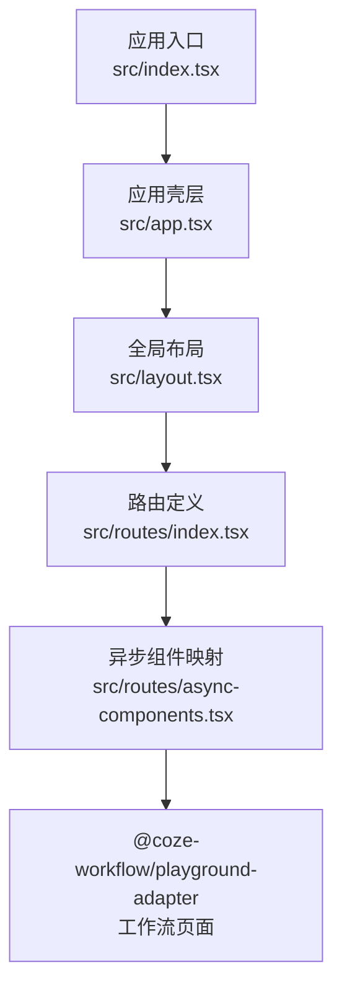
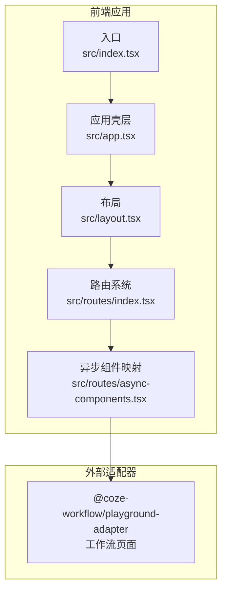
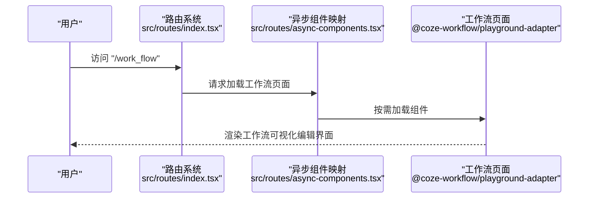
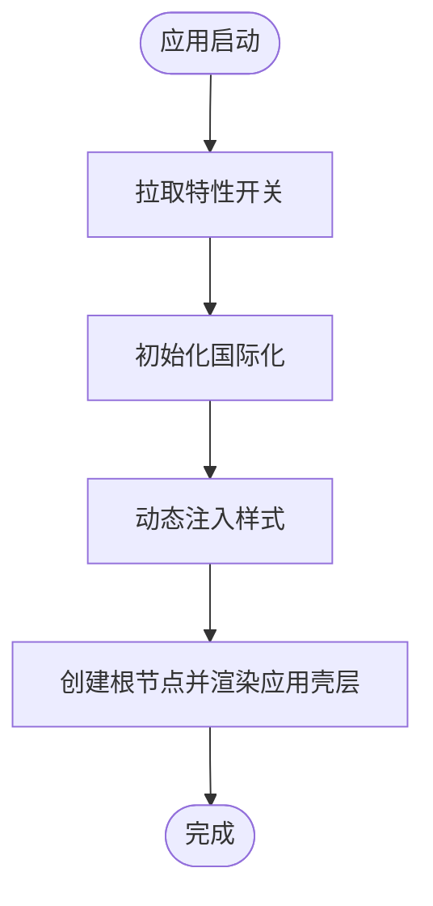
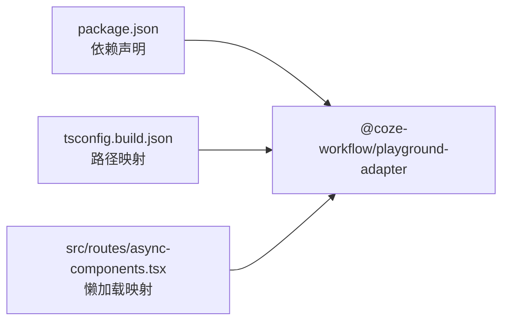

# 工作流构建工具

<cite>
**本文引用的文件**
- [README.md](file://README.md)
- [package.json](file://package.json)
- [tsconfig.build.json](file://tsconfig.build.json)
- [src/index.tsx](file://src/index.tsx)
- [src/app.tsx](file://src/app.tsx)
- [src/layout.tsx](file://src/layout.tsx)
- [src/routes/index.tsx](file://src/routes/index.tsx)
- [src/routes/async-components.tsx](file://src/routes/async-components.tsx)
</cite>

## 目录
1. [简介](#简介)
2. [项目结构](#项目结构)
3. [核心组件](#核心组件)
4. [架构总览](#架构总览)
5. [详细组件分析](#详细组件分析)
6. [依赖关系分析](#依赖关系分析)
7. [性能考虑](#性能考虑)
8. [故障排查指南](#故障排查指南)
9. [结论](#结论)
10. [附录](#附录)

## 简介
本项目是一个基于前端技术栈的“工作流构建工具”前端应用，通过路由与动态加载机制，将工作流可视化编辑能力集成到统一的开发工作台中。该工具通过异步组件的方式引入工作流适配层，支持在浏览器端进行工作流的可视化设计、连线与配置，并提供调试与发布能力。

## 项目结构
前端采用 React + Rsbuild 构建，入口文件负责国际化、特性开关拉取与样式初始化；应用通过路由系统挂载全局布局，并按需懒加载各功能页面（含工作流页面）。工作流页面由外部适配包提供，确保功能模块化与可扩展性。

图表来源
- [src/index.tsx:33-52](file://src/index.tsx#L33-L52)
- [src/app.tsx:24-36](file://src/app.tsx#L24-L36)
- [src/layout.tsx:19-23](file://src/layout.tsx#L19-L23)
- [src/routes/index.tsx:50-298](file://src/routes/index.tsx#L50-L298)
- [src/routes/async-components.tsx:110-115](file://src/routes/async-components.tsx#L110-L115)

章节来源
- [README.md:1-7](file://README.md#L1-L7)
- [package.json:11-17](file://package.json#L11-L17)
- [src/index.tsx:17-52](file://src/index.tsx#L17-L52)
- [src/app.tsx:17-36](file://src/app.tsx#L17-L36)
- [src/layout.tsx:17-23](file://src/layout.tsx#L17-L23)
- [src/routes/index.tsx:50-298](file://src/routes/index.tsx#L50-L298)
- [src/routes/async-components.tsx:110-115](file://src/routes/async-components.tsx#L110-L115)

## 核心组件
- 应用入口与初始化：负责特性开关拉取、国际化初始化与样式注入，随后渲染应用壳层。
- 应用壳层：包裹路由与骨架屏，提供统一的加载体验。
- 全局布局：承载导航与侧边栏等全局 UI 结构。
- 路由系统：集中管理页面路由与权限控制，其中工作流页面通过异步组件方式引入。
- 异步组件映射：将具体页面组件延迟加载，降低首屏体积并提升交互速度。

章节来源
- [src/index.tsx:26-52](file://src/index.tsx#L26-L52)
- [src/app.tsx:24-36](file://src/app.tsx#L24-L36)
- [src/layout.tsx:19-23](file://src/layout.tsx#L19-L23)
- [src/routes/index.tsx:242-250](file://src/routes/index.tsx#L242-L250)
- [src/routes/async-components.tsx:110-115](file://src/routes/async-components.tsx#L110-L115)

## 架构总览
工作流构建工具采用“路由 + 动态加载 + 外部适配器”的架构模式：
- 路由层：定义工作流页面路径与权限要求。
- 组件层：通过异步组件按需加载工作流页面。
- 适配层：由 @coze-workflow/playground-adapter 提供工作流可视化编辑能力。
- 集成层：通过 tsconfig 的路径映射与 workspace 配置，将适配包纳入构建链路。

图表来源
- [src/routes/index.tsx:242-250](file://src/routes/index.tsx#L242-L250)
- [src/routes/async-components.tsx:110-115](file://src/routes/async-components.tsx#L110-L115)
- [src/layout.tsx:19-23](file://src/layout.tsx#L19-L23)
- [src/app.tsx:24-36](file://src/app.tsx#L24-L36)
- [src/index.tsx:33-52](file://src/index.tsx#L33-L52)

## 详细组件分析

### 路由与工作流页面集成
- 路由定义：在主路由中新增工作流页面路径，设置是否需要侧边栏与鉴权。
- 权限控制：通过 loader 返回 requireAuth 控制访问权限。
- 页面加载：通过异步组件映射，按需加载工作流页面组件。

图表来源
- [src/routes/index.tsx:242-250](file://src/routes/index.tsx#L242-L250)
- [src/routes/async-components.tsx:110-115](file://src/routes/async-components.tsx#L110-L115)

章节来源
- [src/routes/index.tsx:242-250](file://src/routes/index.tsx#L242-L250)
- [src/routes/async-components.tsx:110-115](file://src/routes/async-components.tsx#L110-L115)

### 应用初始化与国际化
- 特性开关：启动时拉取功能开关，用于控制功能启用状态。
- 国际化：根据本地存储或环境变量初始化语言。
- 样式：动态注入 Markdown 渲染样式，保证内容展示一致性。
- 渲染：创建根节点并渲染应用壳层。

图表来源
- [src/index.tsx:26-52](file://src/index.tsx#L26-L52)

章节来源
- [src/index.tsx:26-52](file://src/index.tsx#L26-L52)

### 设计理念与适用场景
- 可视化设计：通过外部适配器提供节点拖拽、连线绘制与流程配置能力，满足低代码/无代码场景。
- 模块化集成：采用异步组件与工作台路由体系，便于在统一平台内扩展新功能。
- 权限与空间：结合工作区与空间概念，支持多团队协作与资源隔离。
- 适用场景：自动化任务编排、数据处理流水线、业务流程编排、智能体工作流等。

章节来源
- [src/routes/index.tsx:242-250](file://src/routes/index.tsx#L242-L250)
- [src/routes/async-components.tsx:110-115](file://src/routes/async-components.tsx#L110-L115)

### 创建示例与配置指南（基于现有结构）
- 访问路径：通过路由访问工作流页面，路径为 "/work_flow"。
- 权限要求：页面加载器要求登录态，确保只有认证用户可访问。
- 页面加载：通过异步组件按需加载工作流页面，减少首屏负担。
- 集成方式：工作流页面由 @coze-workflow/playground-adapter 提供，通过 tsconfig 路径映射与 workspace 配置接入。

章节来源
- [src/routes/index.tsx:242-250](file://src/routes/index.tsx#L242-L250)
- [src/routes/async-components.tsx:110-115](file://src/routes/async-components.tsx#L110-L115)
- [tsconfig.build.json:129-131](file://tsconfig.build.json#L129-L131)

### 执行机制与调试功能（基于适配器职责）
- 执行机制：工作流页面由 @coze-workflow/playground-adapter 提供，其内部实现工作流的执行引擎与调试面板。
- 调试功能：通常包含断点、单步执行、变量检查与日志输出等能力，具体以适配器实现为准。
- 发布与导出：工作流页面可能提供导出、发布或部署能力，便于在生产环境中运行。

章节来源
- [src/routes/async-components.tsx:110-115](file://src/routes/async-components.tsx#L110-L115)

## 依赖关系分析
- 外部依赖：工作流页面依赖 @coze-workflow/playground-adapter，通过异步组件映射引入。
- 构建配置：tsconfig 中对 playground 适配器的 tsconfig 进行了路径映射，确保类型与构建正确。
- 包管理：package.json 中声明了工作流适配器为 workspace:*，表明其为本地包并参与 monorepo 构建。

图表来源
- [package.json:44](file://package.json#L44)
- [tsconfig.build.json:129-131](file://tsconfig.build.json#L129-L131)
- [src/routes/async-components.tsx:110-115](file://src/routes/async-components.tsx#L110-L115)

章节来源
- [package.json:44](file://package.json#L44)
- [tsconfig.build.json:129-131](file://tsconfig.build.json#L129-L131)
- [src/routes/async-components.tsx:110-115](file://src/routes/async-components.tsx#L110-L115)

## 性能考虑
- 按需加载：通过异步组件与路由懒加载，降低首屏资源体积，提升初始渲染性能。
- 路由缓存：合理利用浏览器历史与缓存策略，避免重复加载相同页面。
- 样式与脚本：动态注入样式与国际化资源，避免阻塞主线程。
- 依赖拆分：将工作流页面作为独立适配器，便于单独优化与版本迭代。

章节来源
- [src/routes/async-components.tsx:110-115](file://src/routes/async-components.tsx#L110-L115)
- [src/index.tsx:26-52](file://src/index.tsx#L26-L52)

## 故障排查指南
- 页面无法访问：确认路由中工作流页面路径与权限配置是否正确。
- 组件未加载：检查异步组件映射与网络请求是否成功，确认 @coze-workflow/playground-adapter 是否可用。
- 国际化异常：检查本地存储的语言键值与初始化逻辑，确保语言切换正常。
- 样式缺失：确认动态样式注入是否执行，以及样式文件是否存在。

章节来源
- [src/routes/index.tsx:242-250](file://src/routes/index.tsx#L242-L250)
- [src/routes/async-components.tsx:110-115](file://src/routes/async-components.tsx#L110-L115)
- [src/index.tsx:36-43](file://src/index.tsx#L36-L43)

## 结论
本工作流构建工具通过清晰的路由与异步组件架构，将工作流可视化编辑能力无缝集成至开发工作台。借助外部适配器，系统具备良好的扩展性与模块化特性，适用于多种自动化与编排场景。后续可在适配器层面完善执行引擎与调试能力，并持续优化性能与用户体验。

## 附录
- 快速访问
  - 工作流页面路径："/work_flow"
  - 权限要求：requireAuth: true
  - 页面加载：异步组件懒加载
  - 适配器依赖：@coze-workflow/playground-adapter

章节来源
- [src/routes/index.tsx:242-250](file://src/routes/index.tsx#L242-L250)
- [src/routes/async-components.tsx:110-115](file://src/routes/async-components.tsx#L110-L115)