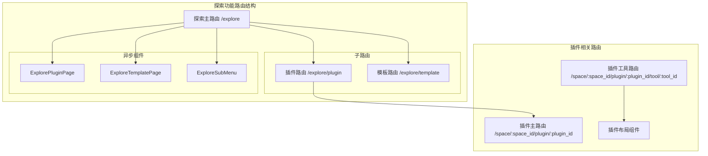
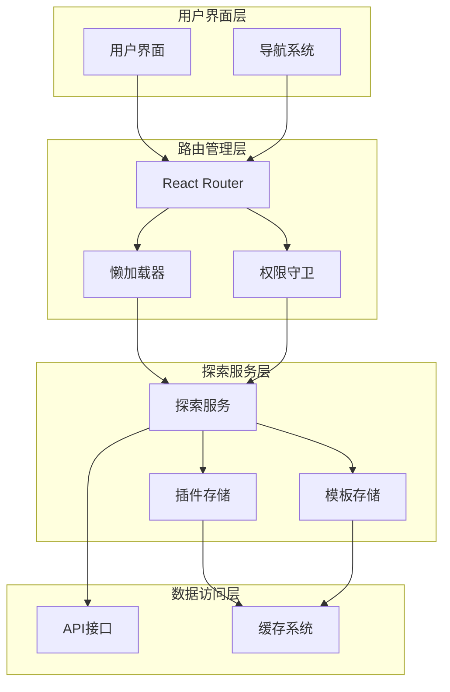
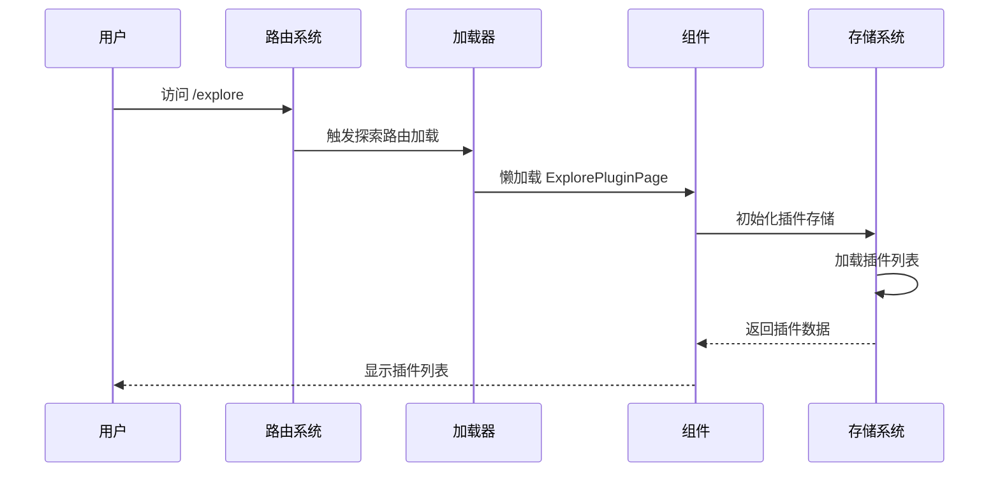
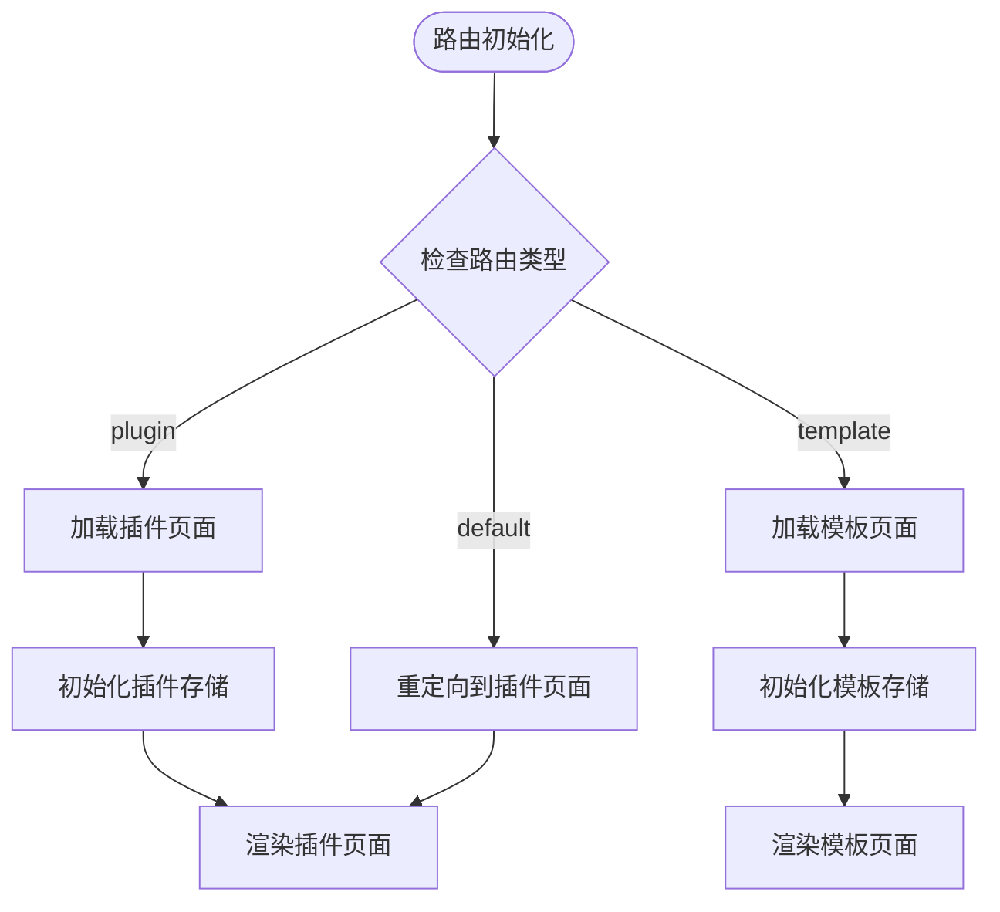
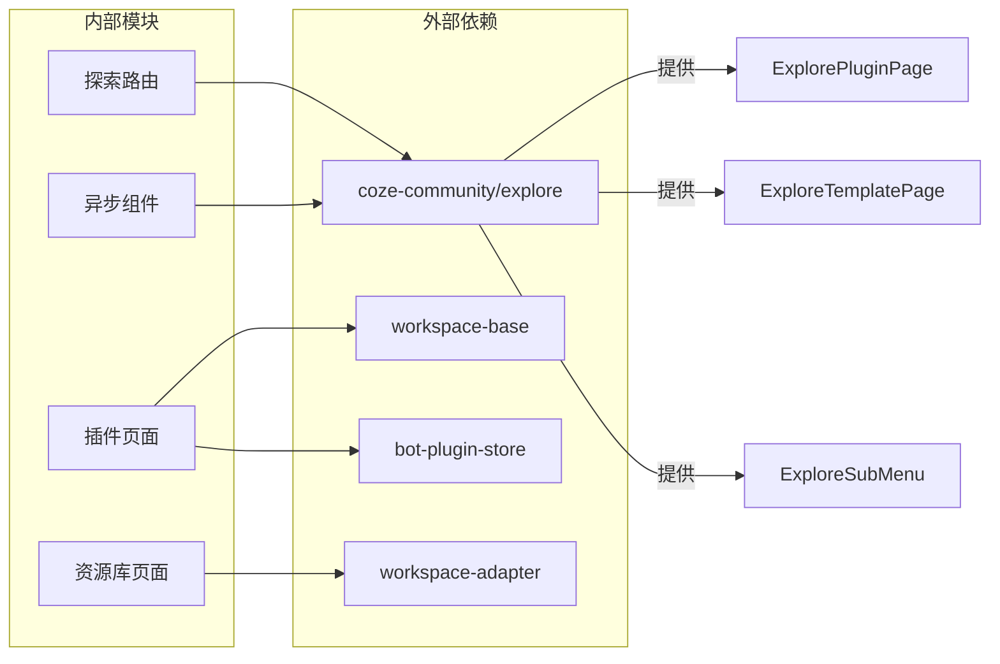

# 探索发现功能

<cite>
**本文档引用的文件**
- [src/pages/explore.tsx](file://src/pages/explore.tsx)
- [src/routes/index.tsx](file://src/routes/index.tsx)
- [src/routes/async-components.tsx](file://src/routes/async-components.tsx)
- [src/pages/plugin/page.tsx](file://src/pages/plugin/page.tsx)
- [src/pages/plugin/tool/page.tsx](file://src/pages/plugin/tool/page.tsx)
- [src/pages/plugin/layout.tsx](file://src/pages/plugin/layout.tsx)
- [src/pages/library.tsx](file://src/pages/library.tsx)
- [package.json](file://package.json)
- [src/app.tsx](file://src/app.tsx)
</cite>

## 目录
1. [简介](#简介)
2. [项目结构](#项目结构)
3. [核心组件](#核心组件)
4. [架构概览](#架构概览)
5. [详细组件分析](#详细组件分析)
6. [依赖关系分析](#依赖关系分析)
7. [性能考虑](#性能考虑)
8. [故障排除指南](#故障排除指南)
9. [结论](#结论)

## 简介

探索发现功能是 Coze Studio 前端应用中的核心导航模块，为用户提供了一个统一的平台来发现和使用各种开发资源。该功能主要包含三个核心子功能：

- **插件探索**：帮助用户发现和使用新的插件工具
- **模板探索**：展示如何找到适合的项目模板和最佳实践  
- **资源发现**：包括如何搜索和获取有用的开发资源

探索功能通过懒加载机制实现高性能的按需加载，确保用户能够快速访问所需的开发工具和资源。

## 项目结构

探索功能在前端应用中的组织结构如下：

**图表来源**
- [src/routes/index.tsx:262-294](file://src/routes/index.tsx#L262-L294)
- [src/pages/explore.tsx:37-66](file://src/pages/explore.tsx#L37-L66)

**章节来源**
- [src/routes/index.tsx:262-294](file://src/routes/index.tsx#L262-L294)
- [src/pages/explore.tsx:17-66](file://src/pages/explore.tsx#L17-L66)

## 核心组件

探索功能的核心组件包括路由配置、异步加载组件和插件管理组件：

### 路由配置组件

探索功能采用 React Router 的嵌套路由设计，支持动态子菜单和权限控制：

- **探索主路由**：`/explore` - 主入口点
- **插件路由**：`/explore/plugin` - 插件商店入口
- **模板路由**：`/explore/template` - 模板探索入口

### 异步加载组件

所有探索相关组件都通过懒加载实现，确保按需加载和性能优化：

- **ExplorePluginPage**：插件商店页面组件
- **ExploreTemplatePage**：模板探索页面组件  
- **ExploreSubMenu**：探索页面的二级导航组件

### 插件管理组件

插件系统提供了完整的插件生命周期管理：

- **PluginLayout**：插件布局容器
- **PluginPage**：插件详情页面
- **PluginToolPage**：插件工具页面

**章节来源**
- [src/pages/explore.tsx:22-36](file://src/pages/explore.tsx#L22-L36)
- [src/routes/async-components.tsx:134-152](file://src/routes/async-components.tsx#L134-L152)
- [src/pages/plugin/layout.tsx:22-38](file://src/pages/plugin/layout.tsx#L22-L38)

## 架构概览

探索功能的整体架构采用分层设计，实现了清晰的关注点分离：

**图表来源**
- [src/app.tsx:24-36](file://src/app.tsx#L24-L36)
- [src/routes/index.tsx:262-294](file://src/routes/index.tsx#L262-L294)

### 组件交互流程

探索功能的典型用户交互流程如下：

**图表来源**
- [src/pages/explore.tsx:37-66](file://src/pages/explore.tsx#L37-L66)
- [src/pages/plugin/page.tsx:23-32](file://src/pages/plugin/page.tsx#L23-L32)

## 详细组件分析

### 探索路由组件分析

探索路由组件实现了灵活的路由配置和权限控制：

#### 路由配置特性

- **动态子菜单**：支持运行时加载的二级导航
- **权限验证**：确保只有认证用户可以访问
- **侧边栏控制**：根据路由类型显示或隐藏侧边栏
- **默认重定向**：未指定子路由时自动跳转到插件页面

#### 路由参数处理

**图表来源**
- [src/pages/explore.tsx:46-66](file://src/pages/explore.tsx#L46-L66)

**章节来源**
- [src/pages/explore.tsx:37-66](file://src/pages/explore.tsx#L37-L66)

### 插件管理系统分析

插件管理系统提供了完整的插件生命周期管理功能：

#### 插件布局组件

插件布局组件负责管理插件的上下文环境和导航：

- **参数验证**：确保必需的插件ID和空间ID存在
- **状态提供者**：为插件组件提供全局状态管理
- **导航集成**：与主应用的导航系统集成

#### 插件页面组件

插件页面组件处理具体的插件展示逻辑：

- **参数提取**：从URL中提取插件ID、空间ID等参数
- **存储初始化**：确保插件存储系统已准备就绪
- **组件渲染**：渲染实际的插件展示组件

#### 工具页面组件

工具页面组件专门处理插件工具的展示：

- **多参数支持**：支持插件ID、空间ID、工具ID的组合
- **存储管理**：管理工具相关的存储状态
- **专用渲染**：渲染特定的工具展示组件

**章节来源**
- [src/pages/plugin/layout.tsx:22-38](file://src/pages/plugin/layout.tsx#L22-L38)
- [src/pages/plugin/page.tsx:23-32](file://src/pages/plugin/page.tsx#L23-L32)
- [src/pages/plugin/tool/page.tsx:22-31](file://src/pages/plugin/tool/page.tsx#L22-L31)

### 模板探索功能分析

模板探索功能提供了项目模板的发现和使用能力：

#### 模板页面组件

模板页面组件负责模板的展示和管理：

- **模板加载**：从模板存储中获取可用模板
- **模板分类**：按类别或标签对模板进行组织
- **模板预览**：提供模板的预览和描述信息

#### 搜索集成

探索功能集成了搜索功能，允许用户通过关键词搜索模板：

- **关键词匹配**：支持基于名称、描述的关键词搜索
- **实时过滤**：提供实时的模板过滤和排序
- **搜索历史**：记录用户的搜索历史和偏好

**章节来源**
- [src/routes/async-components.tsx:140-145](file://src/routes/async-components.tsx#L140-L145)

### 资源发现机制分析

资源发现机制整合了多种类型的开发资源：

#### 资源库集成

资源库页面提供了统一的资源管理入口：

- **空间ID绑定**：每个资源库都与特定的空间ID关联
- **资源分类**：支持不同类型资源的分类管理
- **权限控制**：基于空间权限控制资源访问

#### 多类型资源支持

系统支持多种类型的开发资源：

- **插件资源**：可复用的功能模块
- **模板资源**：项目开发模板
- **数据库资源**：数据模型和表格定义
- **知识库资源**：文档和知识内容

**章节来源**
- [src/pages/library.tsx:21-24](file://src/pages/library.tsx#L21-L24)

## 依赖关系分析

探索功能的依赖关系体现了模块化的架构设计：

**图表来源**
- [package.json:66](file://package.json#L66)
- [src/routes/async-components.tsx:134-152](file://src/routes/async-components.tsx#L134-L152)

### 关键依赖特性

探索功能的关键依赖具有以下特性：

- **版本锁定**：所有依赖都使用工作区模式，确保版本一致性
- **按需加载**：探索相关组件通过懒加载减少初始包大小
- **类型安全**：所有依赖都提供TypeScript类型定义
- **模块化设计**：每个依赖都专注于特定的功能领域

**章节来源**
- [package.json:19-50](file://package.json#L19-L50)
- [package.json:66](file://package.json#L66)

## 性能考虑

探索功能在设计时充分考虑了性能优化：

### 懒加载策略

- **按需加载**：所有探索相关组件都通过懒加载实现
- **代码分割**：将大型组件分割成独立的代码块
- **预加载优化**：在用户可能需要时提前加载相关资源

### 缓存机制

- **组件缓存**：已加载的组件会被缓存以提高后续访问速度
- **数据缓存**：插件和模板数据会缓存以减少API调用
- **网络缓存**：利用浏览器缓存机制优化静态资源加载

### 内存管理

- **组件卸载**：离开探索页面时正确清理组件状态
- **存储管理**：插件存储会在适当时候释放内存
- **事件监听**：移除不再使用的事件监听器

## 故障排除指南

### 常见问题及解决方案

#### 路由加载失败

**问题症状**：访问探索页面时出现空白或错误

**可能原因**：
- 探索相关组件加载失败
- 权限验证失败
- 路由配置错误

**解决步骤**：
1. 检查网络连接是否正常
2. 验证用户是否已登录
3. 查看浏览器控制台的错误信息
4. 确认探索相关依赖是否正确安装

#### 插件加载异常

**问题症状**：插件页面无法显示或显示为空白

**可能原因**：
- 插件ID或空间ID参数缺失
- 插件存储初始化失败
- 插件数据格式不正确

**解决步骤**：
1. 验证URL参数是否完整
2. 检查插件存储的状态
3. 确认插件数据的完整性
4. 查看插件相关的错误日志

#### 性能问题

**问题症状**：探索页面加载缓慢或响应迟钝

**可能原因**：
- 组件过大导致加载时间过长
- 缓存机制失效
- 网络请求过多

**解决步骤**：
1. 分析组件的代码分割情况
2. 检查缓存策略的有效性
3. 优化网络请求的频率和数量
4. 实施更多的懒加载策略

**章节来源**
- [src/pages/plugin/page.tsx:26](file://src/pages/plugin/page.tsx#L26)
- [src/pages/plugin/layout.tsx:26](file://src/pages/plugin/layout.tsx#L26)

## 结论

探索发现功能通过其精心设计的架构和实现，为开发者提供了一个强大而直观的资源发现平台。该功能的主要优势包括：

### 核心价值

- **统一入口**：提供单一入口点访问所有开发资源
- **智能分类**：通过插件和模板的分类管理提升资源可发现性
- **性能优化**：通过懒加载和缓存机制确保流畅的用户体验
- **扩展性强**：模块化设计便于添加新的资源类型和功能

### 最佳实践建议

1. **合理使用搜索功能**：利用关键词搜索快速定位所需的插件或模板
2. **关注更新日志**：定期查看新发布的插件和模板
3. **参与社区反馈**：通过社区渠道分享使用体验和改进建议
4. **遵循使用规范**：按照插件和模板的使用说明正确集成到项目中

探索功能不仅提升了开发效率，更重要的是激发了开发者的创新思维，为构建更好的开发工具和项目模板提供了便利的平台。