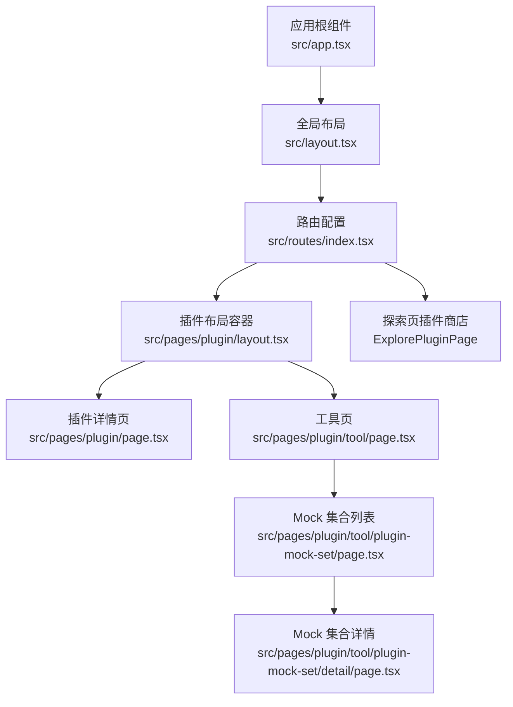
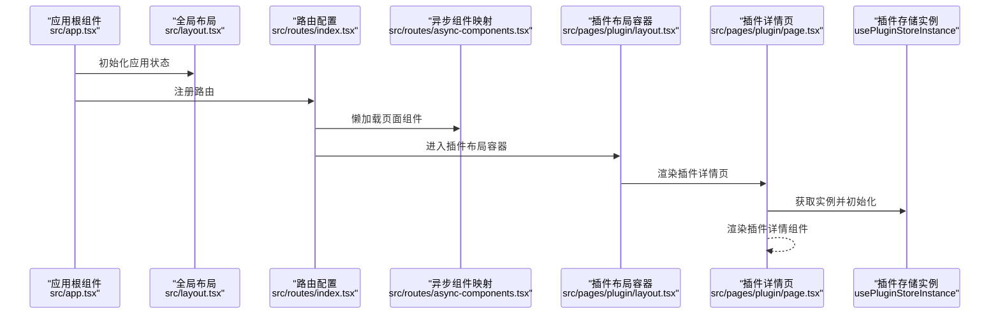
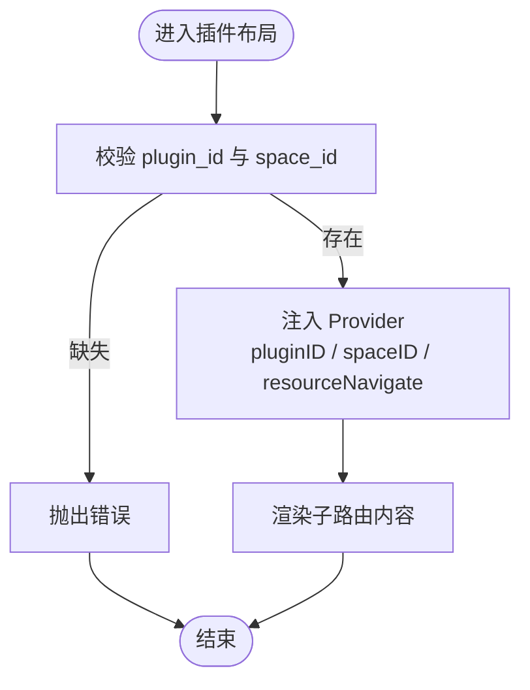
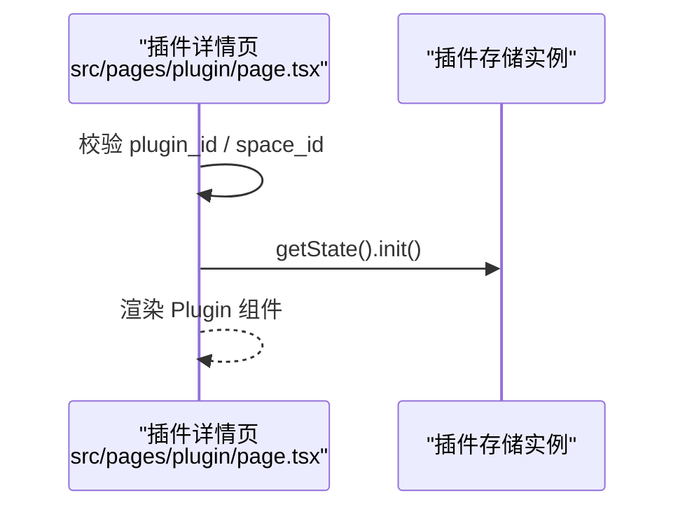
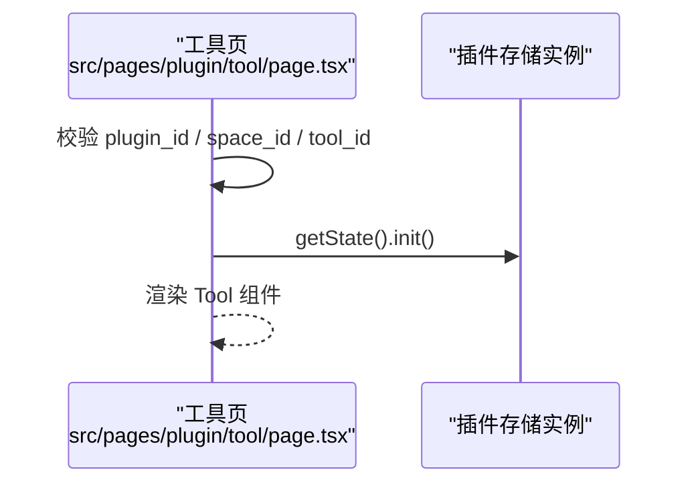
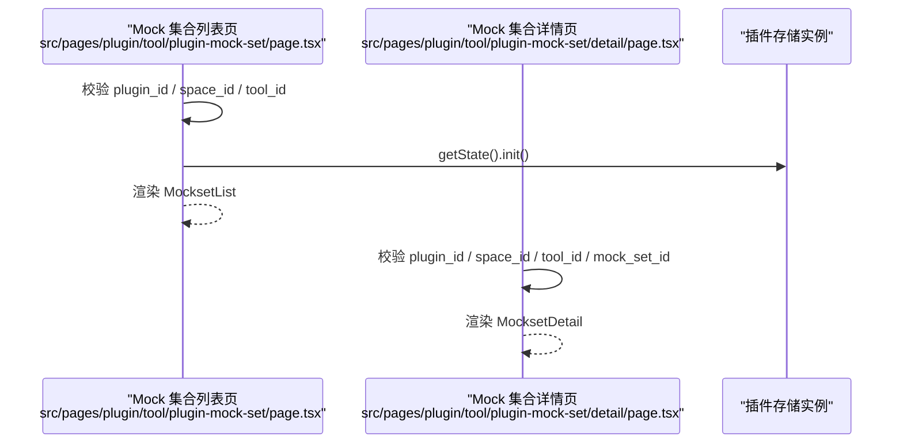
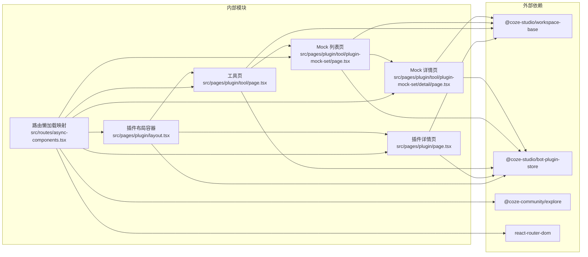

# 插件生态系统

<cite>
**本文引用的文件**
- [src/pages/plugin/page.tsx](file://src/pages/plugin/page.tsx)
- [src/pages/plugin/layout.tsx](file://src/pages/plugin/layout.tsx)
- [src/pages/plugin/tool/page.tsx](file://src/pages/plugin/tool/page.tsx)
- [src/pages/plugin/tool/plugin-mock-set/page.tsx](file://src/pages/plugin/tool/plugin-mock-set/page.tsx)
- [src/pages/plugin/tool/plugin-mock-set/detail/page.tsx](file://src/pages/plugin/tool/plugin-mock-set/detail/page.tsx)
- [src/routes/index.tsx](file://src/routes/index.tsx)
- [src/routes/async-components.tsx](file://src/routes/async-components.tsx)
- [src/app.tsx](file://src/app.tsx)
- [src/layout.tsx](file://src/layout.tsx)
- [package.json](file://package.json)
</cite>

## 目录
1. [引言](#引言)
2. [项目结构](#项目结构)
3. [核心组件](#核心组件)
4. [架构总览](#架构总览)
5. [详细组件分析](#详细组件分析)
6. [依赖关系分析](#依赖关系分析)
7. [性能考虑](#性能考虑)
8. [故障排查指南](#故障排查指南)
9. [结论](#结论)
10. [附录：开发者指南与最佳实践](#附录开发者指南与最佳实践)

## 引言
本文件面向使用者与开发者，系统化阐述该前端应用中的“插件生态系统”能力，包括插件商店入口、插件浏览与详情、工具页布局与功能组织、Mock 集合列表与详情交互，以及面向插件开发者的结构与发布指引。文档以实际源码为依据，配合可视化图示帮助不同背景的读者快速上手。

## 项目结构
该前端应用采用 React + React Router 的单页应用（SPA）架构，插件相关页面通过路由懒加载方式按需加载。插件生态涉及以下关键路径：
- 插件资源页：/space/:space_id/plugin/:plugin_id
- 工具页：/space/:space_id/plugin/:plugin_id/tool/:tool_id
- Mock 集合列表：/space/:space_id/plugin/:plugin_id/tool/:tool_id/mock-set
- Mock 集合详情：/space/:space_id/plugin/:plugin_id/tool/:tool_id/mock-set/:mock_set_id
- 插件商店入口：/explore/plugin

图表来源
- [src/app.tsx:1-37](file://src/app.tsx#L1-L37)
- [src/layout.tsx:1-24](file://src/layout.tsx#L1-L24)
- [src/routes/index.tsx:1-298](file://src/routes/index.tsx#L1-L298)
- [src/pages/plugin/layout.tsx:1-41](file://src/pages/plugin/layout.tsx#L1-L41)
- [src/pages/plugin/page.tsx:1-36](file://src/pages/plugin/page.tsx#L1-L36)
- [src/pages/plugin/tool/page.tsx:1-35](file://src/pages/plugin/tool/page.tsx#L1-L35)
- [src/pages/plugin/tool/plugin-mock-set/page.tsx:1-37](file://src/pages/plugin/tool/plugin-mock-set/page.tsx#L1-L37)
- [src/pages/plugin/tool/plugin-mock-set/detail/page.tsx:1-39](file://src/pages/plugin/tool/plugin-mock-set/detail/page.tsx#L1-L39)

章节来源
- [src/routes/index.tsx:217-236](file://src/routes/index.tsx#L217-L236)
- [src/routes/index.tsx:262-294](file://src/routes/index.tsx#L262-L294)
- [src/routes/async-components.tsx:124-152](file://src/routes/async-components.tsx#L124-L152)

## 核心组件
- 应用根与路由
  - 应用根组件负责挂载 RouterProvider 并提供全局加载态兜底。
  - 全局布局负责初始化应用状态并渲染全局布局框架。
- 路由与异步组件
  - 路由集中定义了插件资源页、工具页、Mock 集合页及探索页（插件商店）等子路由。
  - 所有页面均通过 lazy 按需加载，降低首屏体积。
- 插件布局容器
  - 提供插件上下文（pluginID、spaceID），注入资源导航函数，承载插件详情与工具页。
- 插件详情页
  - 读取路由参数，初始化插件存储实例，渲染插件详情组件。
- 工具页
  - 读取路由参数，初始化插件存储实例，渲染工具组件。
- Mock 集合列表与详情
  - 列表页：渲染 Mock 集合列表，支持在空间上下文中进行筛选与跳转。
  - 详情页：渲染指定 Mock 集合的详情视图。

章节来源
- [src/app.tsx:24-36](file://src/app.tsx#L24-L36)
- [src/layout.tsx:19-23](file://src/layout.tsx#L19-L23)
- [src/routes/index.tsx:17-48](file://src/routes/index.tsx#L17-L48)
- [src/routes/async-components.tsx:124-152](file://src/routes/async-components.tsx#L124-L152)
- [src/pages/plugin/layout.tsx:22-37](file://src/pages/plugin/layout.tsx#L22-L37)
- [src/pages/plugin/page.tsx:23-32](file://src/pages/plugin/page.tsx#L23-L32)
- [src/pages/plugin/tool/page.tsx:22-31](file://src/pages/plugin/tool/page.tsx#L22-L31)
- [src/pages/plugin/tool/plugin-mock-set/page.tsx:22-33](file://src/pages/plugin/tool/plugin-mock-set/page.tsx#L22-L33)
- [src/pages/plugin/tool/plugin-mock-set/detail/page.tsx:21-35](file://src/pages/plugin/tool/plugin-mock-set/detail/page.tsx#L21-L35)

## 架构总览
下图展示了从应用启动到插件资源页渲染的关键调用链路，以及插件存储实例的初始化位置。

图表来源
- [src/app.tsx:24-36](file://src/app.tsx#L24-L36)
- [src/layout.tsx:19-23](file://src/layout.tsx#L19-L23)
- [src/routes/index.tsx:17-48](file://src/routes/index.tsx#L17-L48)
- [src/routes/async-components.tsx:124-152](file://src/routes/async-components.tsx#L124-L152)
- [src/pages/plugin/layout.tsx:22-37](file://src/pages/plugin/layout.tsx#L22-L37)
- [src/pages/plugin/page.tsx:23-32](file://src/pages/plugin/page.tsx#L23-L32)

## 详细组件分析

### 插件布局容器（Provider）
- 职责
  - 通过 Provider 注入插件 ID、空间 ID 与资源导航函数，使子组件可感知当前插件上下文。
  - 在进入插件资源页时，确保导航基址基于当前空间 ID 动态计算。
- 关键点
  - 参数校验：若缺少 plugin_id 或 space_id，直接抛出错误，避免后续渲染异常。
  - 导航适配：resourceNavigate 基于 navBase 生成，保证资源跳转与当前空间绑定。

图表来源
- [src/pages/plugin/layout.tsx:22-37](file://src/pages/plugin/layout.tsx#L22-L37)

章节来源
- [src/pages/plugin/layout.tsx:22-37](file://src/pages/plugin/layout.tsx#L22-L37)

### 插件详情页
- 职责
  - 读取路由参数（plugin_id、space_id），初始化插件存储实例，渲染插件详情组件。
- 关键点
  - 参数校验：缺失任一参数即抛错。
  - 存储初始化：在组件挂载后调用插件存储实例的 init 方法，确保数据可用。

图表来源
- [src/pages/plugin/page.tsx:23-32](file://src/pages/plugin/page.tsx#L23-L32)

章节来源
- [src/pages/plugin/page.tsx:23-32](file://src/pages/plugin/page.tsx#L23-L32)

### 工具页
- 职责
  - 读取路由参数（plugin_id、space_id、tool_id），初始化插件存储实例，渲染工具组件。
- 关键点
  - 参数校验：缺失任一参数即抛错。
  - 存储初始化：同上，在组件挂载后调用 init。

图表来源
- [src/pages/plugin/tool/page.tsx:22-31](file://src/pages/plugin/tool/page.tsx#L22-L31)

章节来源
- [src/pages/plugin/tool/page.tsx:22-31](file://src/pages/plugin/tool/page.tsx#L22-L31)

### Mock 集合列表与详情
- Mock 集合列表
  - 负责渲染指定插件与工具下的 Mock 集合列表，支持在空间上下文中进行筛选与跳转。
- Mock 集合详情
  - 负责渲染指定 Mock 集合的详情视图，参数包含 plugin_id、space_id、tool_id、mock_set_id。

图表来源
- [src/pages/plugin/tool/plugin-mock-set/page.tsx:22-33](file://src/pages/plugin/tool/plugin-mock-set/page.tsx#L22-L33)
- [src/pages/plugin/tool/plugin-mock-set/detail/page.tsx:21-35](file://src/pages/plugin/tool/plugin-mock-set/detail/page.tsx#L21-L35)

章节来源
- [src/pages/plugin/tool/plugin-mock-set/page.tsx:22-33](file://src/pages/plugin/tool/plugin-mock-set/page.tsx#L22-L33)
- [src/pages/plugin/tool/plugin-mock-set/detail/page.tsx:21-35](file://src/pages/plugin/tool/plugin-mock-set/detail/page.tsx#L21-L35)

### 插件商店（探索页）
- 路由入口
  - /explore/plugin 对应 ExplorePluginPage，作为插件商店的入口页面。
- 页面职责
  - 展示插件商店内容，支持分类、搜索与跳转至插件详情或工具页。

章节来源
- [src/routes/index.tsx:262-294](file://src/routes/index.tsx#L262-L294)
- [src/routes/async-components.tsx:147-152](file://src/routes/async-components.tsx#L147-L152)

## 依赖关系分析
- 外部依赖
  - @coze-studio/workspace-base：提供 Plugin、Tool、MocksetList、MocksetDetail 等组件。
  - @coze-studio/bot-plugin-store：提供插件存储实例 usePluginStoreInstance 及 Provider。
  - @coze-community/explore：提供 ExplorePluginPage、ExploreTemplatePage、ExploreSubMenu 等。
  - react-router-dom：负责路由与导航。
- 内部依赖
  - 路由懒加载将页面组件与布局解耦，提升首屏性能。
  - 插件布局容器统一注入上下文，减少各页面重复逻辑。

图表来源
- [package.json:19-51](file://package.json#L19-L51)
- [src/routes/async-components.tsx:124-152](file://src/routes/async-components.tsx#L124-L152)
- [src/pages/plugin/layout.tsx:19-20](file://src/pages/plugin/layout.tsx#L19-L20)
- [src/pages/plugin/page.tsx:20-21](file://src/pages/plugin/page.tsx#L20-L21)
- [src/pages/plugin/tool/page.tsx:20-21](file://src/pages/plugin/tool/page.tsx#L20-L21)
- [src/pages/plugin/tool/plugin-mock-set/page.tsx:20-21](file://src/pages/plugin/tool/plugin-mock-set/page.tsx#L20-L21)
- [src/pages/plugin/tool/plugin-mock-set/detail/page.tsx:19](file://src/pages/plugin/tool/plugin-mock-set/detail/page.tsx#L19)

章节来源
- [package.json:19-51](file://package.json#L19-L51)
- [src/routes/async-components.tsx:124-152](file://src/routes/async-components.tsx#L124-L152)

## 性能考虑
- 路由懒加载
  - 通过 lazy 按需加载页面组件，显著降低首屏 JavaScript 体积，提升初始渲染速度。
- Provider 上下文注入
  - 将插件存储实例注入到布局层，避免在多处重复初始化，减少重复渲染与副作用。
- 加载兜底
  - 应用根组件提供全局加载态兜底，改善用户等待体验。

章节来源
- [src/app.tsx:24-36](file://src/app.tsx#L24-L36)
- [src/routes/async-components.tsx:124-152](file://src/routes/async-components.tsx#L124-L152)
- [src/pages/plugin/layout.tsx:29-36](file://src/pages/plugin/layout.tsx#L29-L36)

## 故障排查指南
- 参数缺失导致渲染异常
  - 现象：进入插件资源页时报错，提示需要 plugin_id 与 space_id。
  - 排查：确认路由是否正确传入 plugin_id、space_id；检查父级路由是否正确嵌套。
- 插件存储未初始化
  - 现象：插件详情或工具页空白或报错。
  - 排查：确认页面在挂载后调用了插件存储实例的 init；检查 Provider 是否正确包裹。
- 导航异常
  - 现象：点击资源链接后跳转到错误路径。
  - 排查：确认 resourceNavigate 的 navBase 基于当前 space_id 计算；检查路由层级是否正确。

章节来源
- [src/pages/plugin/layout.tsx:23-28](file://src/pages/plugin/layout.tsx#L23-L28)
- [src/pages/plugin/page.tsx:24-28](file://src/pages/plugin/page.tsx#L24-L28)
- [src/pages/plugin/tool/page.tsx:23-27](file://src/pages/plugin/tool/page.tsx#L23-L27)
- [src/pages/plugin/tool/plugin-mock-set/page.tsx:23-27](file://src/pages/plugin/tool/plugin-mock-set/page.tsx#L23-L27)
- [src/pages/plugin/tool/plugin-mock-set/detail/page.tsx:22-26](file://src/pages/plugin/tool/plugin-mock-set/detail/page.tsx#L22-L26)

## 结论
该插件生态系统以清晰的路由分层与懒加载策略构建，结合统一的插件上下文 Provider，实现了从插件商店到插件详情、工具页与 Mock 集合的完整闭环。通过参数校验与存储初始化机制，保障了页面稳定性与可维护性。对于使用者而言，可直接通过 /explore/plugin 进入插件商店，再进入具体插件与工具；对于开发者而言，可基于现有 Provider 与组件体系扩展新的插件能力。

## 附录：开发者指南与最佳实践

### 使用者操作指南（插件商店）
- 浏览与搜索
  - 通过 /explore/plugin 进入插件商店，使用内置搜索与分类功能查找目标插件。
- 安装与管理
  - 在插件详情页完成安装与启用；在空间内对插件进行管理与配置。
- 工具页与 Mock 集成
  - 在插件工具页中查看与编辑 Mock 数据集合，便于联调与测试。

章节来源
- [src/routes/index.tsx:262-294](file://src/routes/index.tsx#L262-L294)

### 开发者指南（插件结构与集成）
- 路由与页面
  - 插件详情页与工具页分别对应 /space/:space_id/plugin/:plugin_id 与 /space/:space_id/plugin/:plugin_id/tool/:tool_id。
  - Mock 集合列表与详情分别对应 /space/:space_id/plugin/:plugin_id/tool/:tool_id/mock-set 与 /space/:space_id/plugin/:plugin_id/tool/:tool_id/mock-set/:mock_set_id。
- 上下文与存储
  - 在插件布局容器中注入 pluginID、spaceID 与 resourceNavigate；在页面中调用插件存储实例的 init 完成初始化。
- 组件复用
  - 使用 @coze-studio/workspace-base 中的 Plugin、Tool、MocksetList、MocksetDetail 组件，保持一致的交互与样式风格。

章节来源
- [src/routes/index.tsx:217-236](file://src/routes/index.tsx#L217-L236)
- [src/pages/plugin/layout.tsx:29-36](file://src/pages/plugin/layout.tsx#L29-L36)
- [src/pages/plugin/page.tsx:29-31](file://src/pages/plugin/page.tsx#L29-L31)
- [src/pages/plugin/tool/page.tsx:28-30](file://src/pages/plugin/tool/page.tsx#L28-L30)
- [src/pages/plugin/tool/plugin-mock-set/page.tsx:28-30](file://src/pages/plugin/tool/plugin-mock-set/page.tsx#L28-L30)
- [src/pages/plugin/tool/plugin-mock-set/detail/page.tsx:28-35](file://src/pages/plugin/tool/plugin-mock-set/detail/page.tsx#L28-L35)

### 发布流程（概要）
- 构建与打包
  - 使用 Rsbuild 进行构建，脚本已在 package.json 中配置。
- 本地验证
  - 在本地运行开发服务器，验证插件商店、插件详情、工具页与 Mock 集合的交互。
- 部署
  - 将构建产物部署至生产环境，确保路由与静态资源路径正确。

章节来源
- [package.json:11-18](file://package.json#L11-L18)

### 商业价值与技术架构要点
- 商业价值
  - 通过插件商店聚合第三方能力，提升平台生态活跃度与用户粘性。
  - 工具页与 Mock 集成降低联调成本，加速产品迭代。
- 技术架构
  - 路由分层清晰、组件按需加载、上下文统一注入，具备良好的扩展性与可维护性。