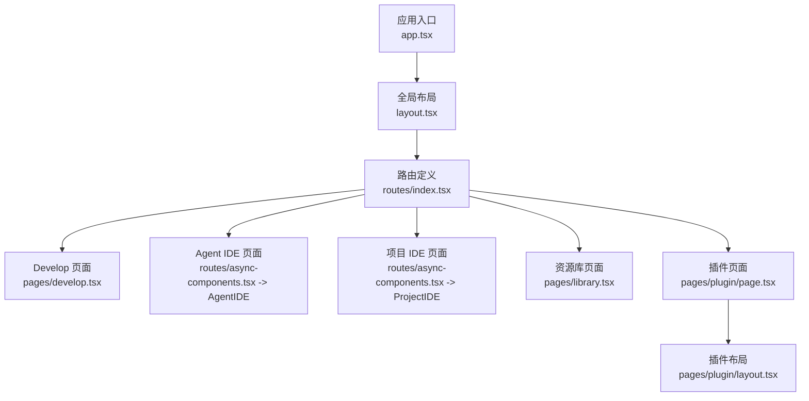
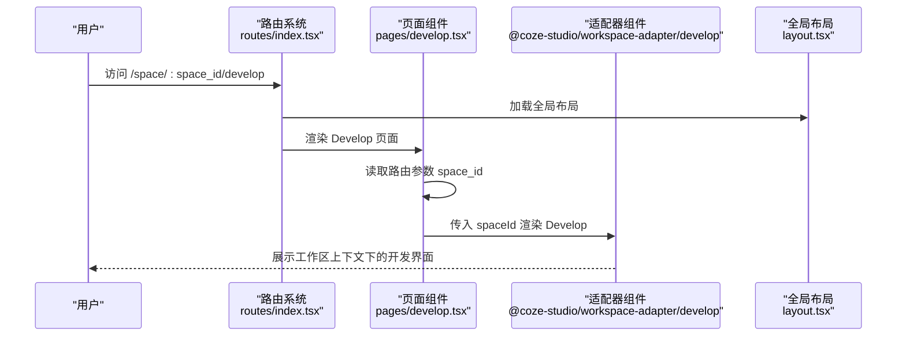
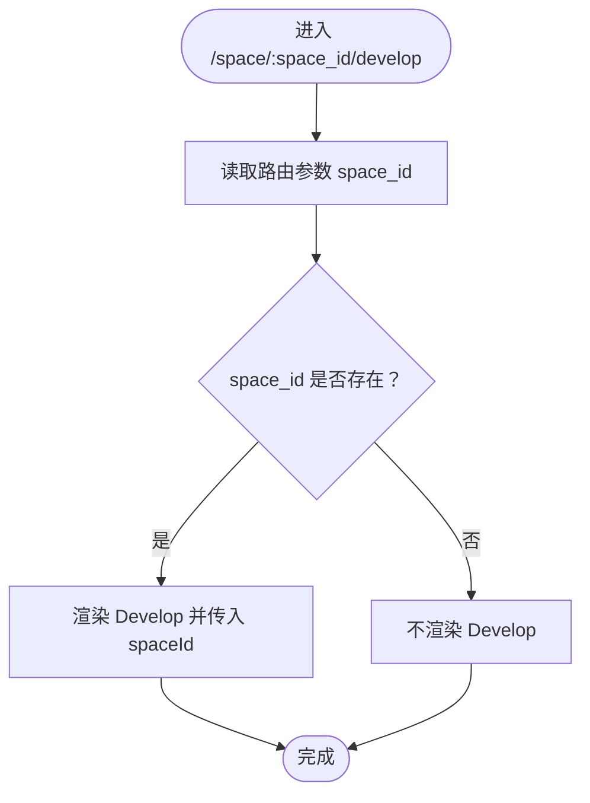
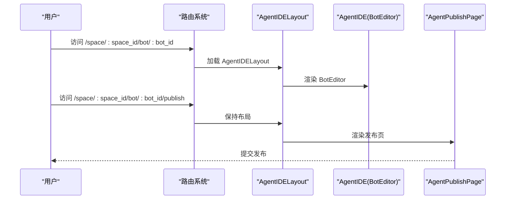
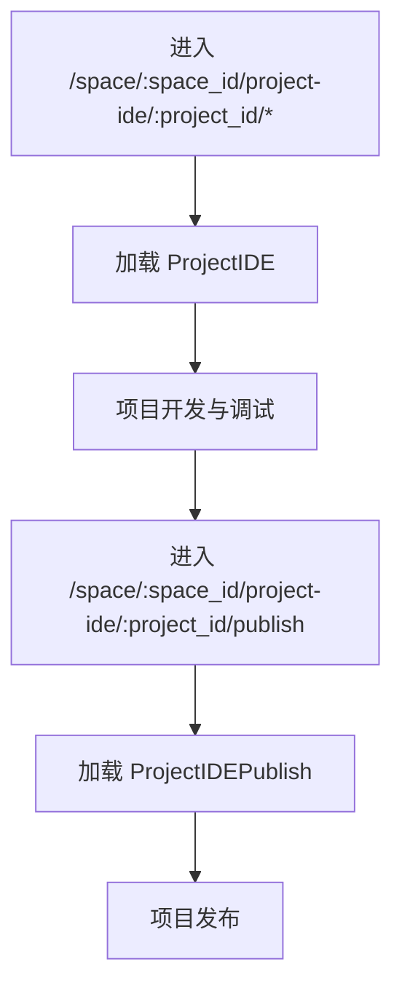
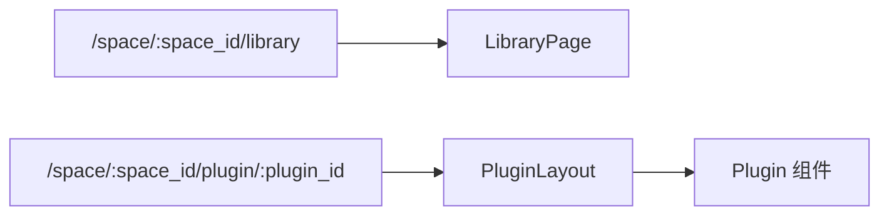
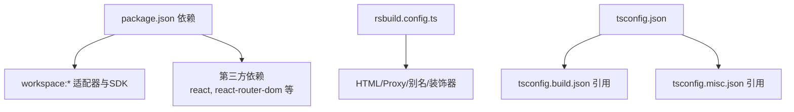

# 智能体开发工具

<cite>
**本文引用的文件**
- [develop.tsx](file://src/pages/develop.tsx)
- [index.tsx](file://src/routes/index.tsx)
- [async-components.tsx](file://src/routes/async-components.tsx)
- [layout.tsx](file://src/layout.tsx)
- [app.tsx](file://src/app.tsx)
- [rsbuild.config.ts](file://rsbuild.config.ts)
- [package.json](file://package.json)
- [tsconfig.json](file://tsconfig.json)
- [tsconfig.build.json](file://tsconfig.build.json)
- [README.md](file://README.md)
- [library.tsx](file://src/pages/library.tsx)
- [plugin/layout.tsx](file://src/pages/plugin/layout.tsx)
- [plugin/page.tsx](file://src/pages/plugin/page.tsx)
</cite>

## 目录
1. [简介](#简介)
2. [项目结构](#项目结构)
3. [核心组件](#核心组件)
4. [架构总览](#架构总览)
5. [详细组件分析](#详细组件分析)
6. [依赖分析](#依赖分析)
7. [性能考虑](#性能考虑)
8. [故障排查指南](#故障排查指南)
9. [结论](#结论)
10. [附录](#附录)

## 简介
本文件面向智能体开发工具（Agent IDE）的前端应用，系统性阐述其功能与架构，重点覆盖以下方面：
- 项目开发、代码编辑、调试与发布管理的端到端流程
- Develop 组件通过 space_id 获取工作区上下文的实现机制
- 智能体开发全生命周期：从项目创建到最终发布的各环节
- 开发环境配置、项目结构说明与常见问题的解决方案
- 基于仓库实际代码的可视化架构图与流程图，帮助非技术读者快速上手

## 项目结构
该前端应用采用 React + Rsbuild 构建，路由基于 React Router v6 的嵌套路由设计，页面按功能域拆分为多个模块页，如 Develop、Agent IDE、Project IDE、资源库、插件等。核心入口在应用层与路由层，页面层负责具体业务页面的加载与参数传递。

图表来源
- [app.tsx:1-37](file://src/app.tsx#L1-L37)
- [layout.tsx:1-24](file://src/layout.tsx#L1-L24)
- [index.tsx:1-298](file://src/routes/index.tsx#L1-L298)
- [async-components.tsx:1-153](file://src/routes/async-components.tsx#L1-L153)
- [develop.tsx:1-27](file://src/pages/develop.tsx#L1-L27)
- [library.tsx:1-27](file://src/pages/library.tsx#L1-L27)
- [plugin/layout.tsx:1-41](file://src/pages/plugin/layout.tsx#L1-L41)
- [plugin/page.tsx:1-36](file://src/pages/plugin/page.tsx#L1-L36)

章节来源
- [app.tsx:1-37](file://src/app.tsx#L1-L37)
- [layout.tsx:1-24](file://src/layout.tsx#L1-L24)
- [index.tsx:1-298](file://src/routes/index.tsx#L1-L298)
- [README.md:1-7](file://README.md#L1-L7)

## 核心组件
- 应用壳与全局布局：应用壳负责路由与骨架加载，全局布局负责空间级上下文初始化与侧边栏等基础容器。
- 路由系统：集中定义所有页面路径、权限与菜单项，支持嵌套路由与动态懒加载。
- 页面层：
  - Develop 页面：接收 space_id 并注入到工作区适配器的 Develop 组件中，作为工作区上下文入口。
  - Agent IDE 页面：通过适配器加载 BotEditor，支持智能体编辑、调试与发布。
  - Project IDE 页面：面向项目级开发与发布。
  - 资源库与插件：提供资源库浏览与插件生态接入能力。

章节来源
- [app.tsx:1-37](file://src/app.tsx#L1-L37)
- [layout.tsx:1-24](file://src/layout.tsx#L1-L24)
- [index.tsx:1-298](file://src/routes/index.tsx#L1-L298)
- [develop.tsx:1-27](file://src/pages/develop.tsx#L1-L27)
- [async-components.tsx:1-153](file://src/routes/async-components.tsx#L1-L153)

## 架构总览
下图展示了从浏览器访问到页面渲染的关键链路，以及页面与适配器之间的关系。

图表来源
- [index.tsx:98-125](file://src/routes/index.tsx#L98-L125)
- [develop.tsx:17-24](file://src/pages/develop.tsx#L17-L24)
- [layout.tsx:19-23](file://src/layout.tsx#L19-L23)

章节来源
- [index.tsx:98-125](file://src/routes/index.tsx#L98-L125)
- [develop.tsx:17-24](file://src/pages/develop.tsx#L17-L24)
- [layout.tsx:19-23](file://src/layout.tsx#L19-L23)

## 详细组件分析

### Develop 组件与工作区上下文
- 参数解析：Develop 页面通过路由参数解析 space_id。
- 上下文注入：将 space_id 作为 props 传给 @coze-studio/workspace-adapter/develop 中的 Develop 组件，用于建立工作区上下文。
- 渲染条件：当 space_id 存在时才渲染 Develop，否则不显示内容。

图表来源
- [develop.tsx:21-24](file://src/pages/develop.tsx#L21-L24)

章节来源
- [develop.tsx:17-24](file://src/pages/develop.tsx#L17-L24)
- [index.tsx:118-125](file://src/routes/index.tsx#L118-L125)

### Agent IDE 生命周期与发布管理
- 编辑阶段：通过 /space/:space_id/bot/:bot_id 进入 Agent IDE，加载 BotEditor 适配器组件，支持智能体编辑与调试。
- 发布阶段：在 /space/:space_id/bot/:bot_id/publish 页面，加载 AgentPublishPage，完成智能体的发布配置与提交。

图表来源
- [index.tsx:127-157](file://src/routes/index.tsx#L127-L157)
- [async-components.tsx:56-73](file://src/routes/async-components.tsx#L56-L73)

章节来源
- [index.tsx:127-157](file://src/routes/index.tsx#L127-L157)
- [async-components.tsx:56-73](file://src/routes/async-components.tsx#L56-L73)

### 项目 IDE 与发布
- 项目 IDE：通过 /space/:space_id/project-ide/:project_id/* 进入项目级开发界面，支持项目内多页面开发。
- 项目发布：通过 /space/:space_id/project-ide/:project_id/publish 进入项目发布页。

图表来源
- [index.tsx:159-173](file://src/routes/index.tsx#L159-L173)
- [async-components.tsx:75-87](file://src/routes/async-components.tsx#L75-L87)

章节来源
- [index.tsx:159-173](file://src/routes/index.tsx#L159-L173)
- [async-components.tsx:75-87](file://src/routes/async-components.tsx#L75-L87)

### 资源库与插件生态
- 资源库：通过 /space/:space_id/library 进入资源库页面，使用 LibraryPage 组件展示资源库内容。
- 插件生态：通过 /space/:space_id/plugin/:plugin_id 进入插件页面，插件布局负责插件资源导航与状态初始化。

图表来源
- [library.tsx:17-24](file://src/pages/library.tsx#L17-L24)
- [plugin/layout.tsx:22-38](file://src/pages/plugin/layout.tsx#L22-L38)
- [plugin/page.tsx:23-33](file://src/pages/plugin/page.tsx#L23-L33)

章节来源
- [library.tsx:17-24](file://src/pages/library.tsx#L17-L24)
- [plugin/layout.tsx:22-38](file://src/pages/plugin/layout.tsx#L22-L38)
- [plugin/page.tsx:23-33](file://src/pages/plugin/page.tsx#L23-L33)

## 依赖分析
- 应用依赖：通过 package.json 可见，项目大量依赖 @coze-* 与 @coze-studio-* 命名空间下的适配器与 SDK，形成以“适配器 + 基础设施”为核心的分层架构。
- 构建与运行：Rsbuild 配置提供代理、HTML 元信息、PostCSS、别名与装饰器支持；tsconfig 引用 tsconfig.build.json 与 tsconfig.misc.json，确保多包工程的类型检查与构建一致性。

图表来源
- [package.json:19-51](file://package.json#L19-L51)
- [rsbuild.config.ts:26-136](file://rsbuild.config.ts#L26-L136)
- [tsconfig.json:7-14](file://tsconfig.json#L7-L14)
- [tsconfig.build.json:47-96](file://tsconfig.build.json#L47-L96)

章节来源
- [package.json:19-51](file://package.json#L19-L51)
- [rsbuild.config.ts:26-136](file://rsbuild.config.ts#L26-L136)
- [tsconfig.json:7-14](file://tsconfig.json#L7-L14)
- [tsconfig.build.json:47-96](file://tsconfig.build.json#L47-L96)

## 性能考虑
- 代码分割与懒加载：路由层统一使用 React.lazy 动态导入页面组件，减少首屏体积。
- 分包策略：Rsbuild 的 chunkSplit 策略按大小拆分，避免单块过大影响加载性能。
- 构建优化：启用装饰器支持、别名解析与 watchOptions 配置，提升开发体验与编译效率。
- 外部依赖：对部分包含较新语法的依赖进行显式 include，确保打包兼容性。

章节来源
- [async-components.tsx:17-153](file://src/routes/async-components.tsx#L17-L153)
- [rsbuild.config.ts:126-132](file://rsbuild.config.ts#L126-L132)
- [rsbuild.config.ts:55-89](file://rsbuild.config.ts#L55-L89)
- [rsbuild.config.ts:107-112](file://rsbuild.config.ts#L107-L112)

## 故障排查指南
- 页面无内容或空白
  - 确认当前路由是否包含 space_id，Develop 仅在 space_id 存在时渲染。
  - 参考路径：[develop.tsx:21-24](file://src/pages/develop.tsx#L21-L24)
- 插件页面报错缺少参数
  - 插件页面需要同时具备 plugin_id 与 space_id，若缺失会抛出错误提示。
  - 参考路径：[plugin/page.tsx:26-28](file://src/pages/plugin/page.tsx#L26-L28)
- 插件布局导航异常
  - 插件布局通过 resourceNavigate 将导航基址绑定到 /space/:space_id，确保跳转正确。
  - 参考路径：[plugin/layout.tsx:22-38](file://src/pages/plugin/layout.tsx#L22-L38)
- 开发代理与接口不通
  - Rsbuild 配置了 /api 与 /v1 的代理目标，请确认代理地址与后端服务一致。
  - 参考路径：[rsbuild.config.ts:25-43](file://rsbuild.config.ts#L25-L43)
- 类型检查或构建失败
  - 确认 tsconfig.json 正确引用 tsconfig.build.json 与 tsconfig.misc.json。
  - 参考路径：[tsconfig.json:7-14](file://tsconfig.json#L7-L14)

章节来源
- [develop.tsx:21-24](file://src/pages/develop.tsx#L21-L24)
- [plugin/page.tsx:26-28](file://src/pages/plugin/page.tsx#L26-L28)
- [plugin/layout.tsx:22-38](file://src/pages/plugin/layout.tsx#L22-L38)
- [rsbuild.config.ts:25-43](file://rsbuild.config.ts#L25-L43)
- [tsconfig.json:7-14](file://tsconfig.json#L7-L14)

## 结论
本项目通过清晰的路由分层与适配器模式，将“工作区上下文”贯穿至 Develop、Agent IDE、Project IDE、资源库与插件等页面，形成从开发到发布的完整闭环。Develop 组件通过 space_id 将工作区上下文注入到适配器中，保证页面在正确的空间环境中运行。结合懒加载、分包策略与构建配置，项目在可维护性与性能之间取得平衡。

## 附录

### 开发环境配置与启动
- 使用 Rsbuild 启动开发服务器与构建产物，脚本定义于 package.json。
- Rsbuild 提供 HTML 标题、favicon、PostCSS 与代理配置，满足本地联调需求。
- 参考路径：
  - [package.json:11-17](file://package.json#L11-L17)
  - [rsbuild.config.ts:44-49](file://rsbuild.config.ts#L44-L49)
  - [rsbuild.config.ts:29-42](file://rsbuild.config.ts#L29-L42)

章节来源
- [package.json:11-17](file://package.json#L11-L17)
- [rsbuild.config.ts:44-49](file://rsbuild.config.ts#L44-L49)
- [rsbuild.config.ts:29-42](file://rsbuild.config.ts#L29-L42)

### 项目结构速览
- pages：页面层，按功能划分，如 develop、library、plugin 等。
- routes：路由与异步组件定义，集中管理页面加载与菜单。
- app.tsx 与 layout.tsx：应用壳与全局布局，负责路由与基础容器。
- rsbuild.config.ts：构建与开发服务器配置。
- package.json：依赖与脚本。
- tsconfig.*：类型检查与多包工程配置。

章节来源
- [README.md:1-7](file://README.md#L1-L7)
- [app.tsx:1-37](file://src/app.tsx#L1-L37)
- [layout.tsx:1-24](file://src/layout.tsx#L1-24)
- [index.tsx:1-298](file://src/routes/index.tsx#L1-L298)
- [develop.tsx:1-27](file://src/pages/develop.tsx#L1-L27)
- [rsbuild.config.ts:1-136](file://rsbuild.config.ts#L1-L136)
- [package.json:1-84](file://package.json#L1-L84)
- [tsconfig.json:1-16](file://tsconfig.json#L1-L16)