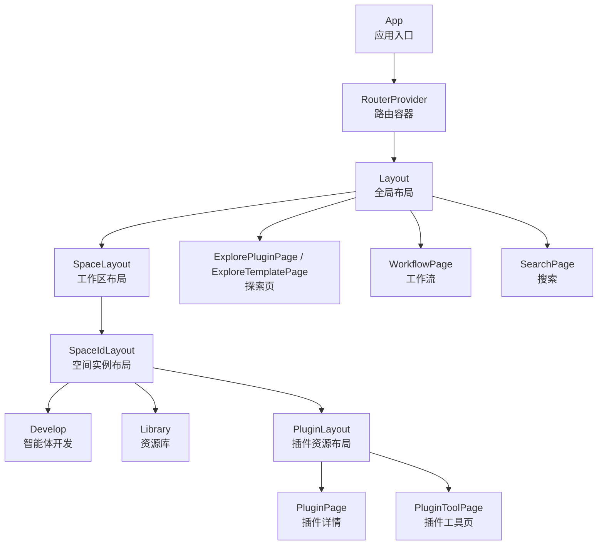
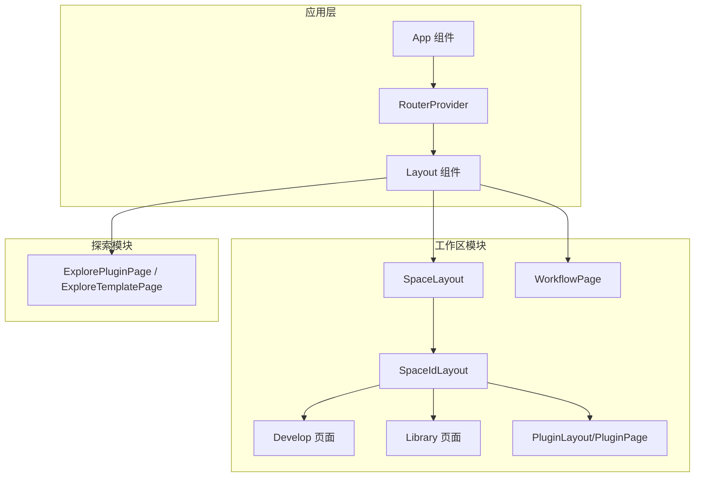
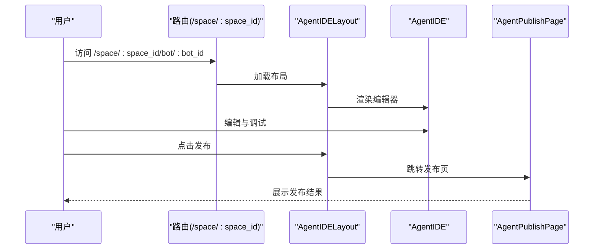
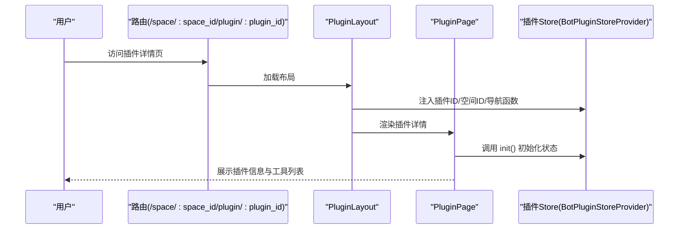
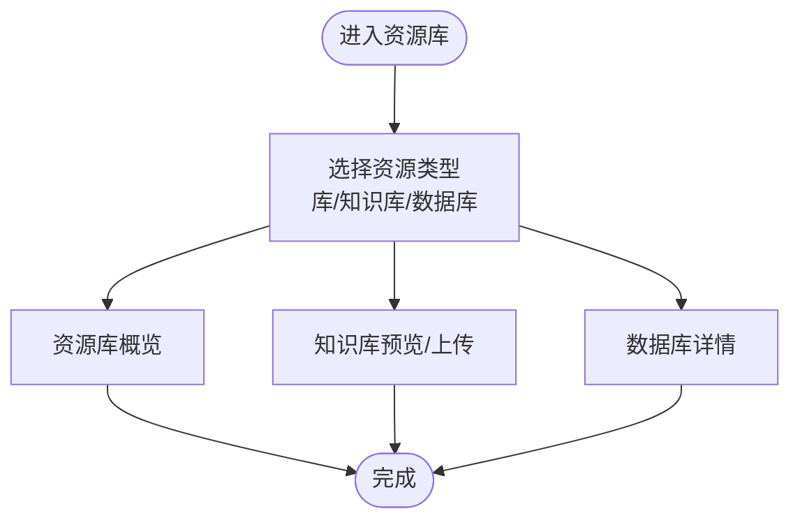
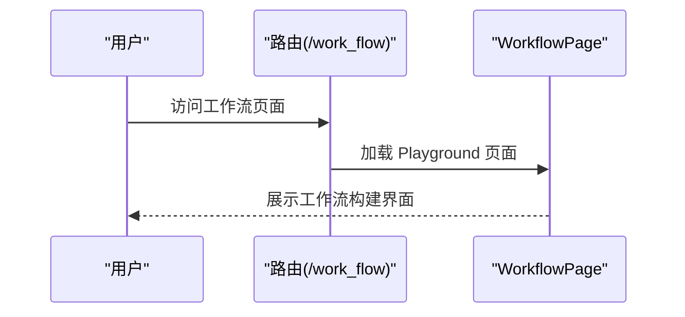
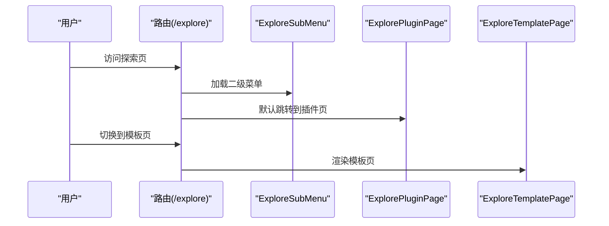

# 核心功能特性

<cite>
**本文引用的文件**
- [src/app.tsx](file://src/app.tsx)
- [src/layout.tsx](file://src/layout.tsx)
- [src/routes/index.tsx](file://src/routes/index.tsx)
- [src/routes/async-components.tsx](file://src/routes/async-components.tsx)
- [src/pages/develop.tsx](file://src/pages/develop.tsx)
- [src/pages/library.tsx](file://src/pages/library.tsx)
- [src/pages/plugin/layout.tsx](file://src/pages/plugin/layout.tsx)
- [src/pages/plugin/page.tsx](file://src/pages/plugin/page.tsx)
- [src/pages/plugin/tool/page.tsx](file://src/pages/plugin/tool/page.tsx)
- [src/pages/explore.tsx](file://src/pages/explore.tsx)
- [package.json](file://package.json)
- [README.md](file://README.md)
</cite>

## 目录
1. [简介](#简介)
2. [项目结构](#项目结构)
3. [核心组件](#核心组件)
4. [架构总览](#架构总览)
5. [详细组件分析](#详细组件分析)
6. [依赖分析](#依赖分析)
7. [性能考虑](#性能考虑)
8. [故障排查指南](#故障排查指南)
9. [结论](#结论)
10. [附录](#附录)

## 简介
本文件面向使用者与开发者，系统性阐述 Coze Studio 前端应用的核心功能特性与架构组织，重点覆盖以下能力域：
- 智能体开发工具：基于 Agent IDE 的可视化编辑与发布流程
- 插件生态系统：插件与工具的资源化管理与运行时状态管理
- 资源库管理：空间内资源库与知识库/数据库资源的统一入口
- 工作流构建：通过工作流 Playground 构建与调试流程
- 探索功能：插件与模板的发现、浏览与检索体验

同时，文档解释各模块间的协作关系与数据流转，给出可操作的使用案例与最佳实践，并对关键技术点进行设计层面的解读，帮助非技术用户快速理解平台价值，也为开发者提供足够的实现细节。

## 项目结构
前端应用采用 React + React Router v6 的单页应用架构，通过动态懒加载（React.lazy）拆分路由组件，结合全局布局与侧边菜单，形成“工作区 + 子模块”的导航体系。核心页面与路由分布如下：
- 应用入口与全局布局：App 组件包裹 RouterProvider，Layout 组件负责全局容器与初始化
- 工作区路由：以 /space 开头，承载智能体开发、资源库、知识库/数据库、插件资源等子模块
- 探索路由：以 /explore 开头，提供插件与模板的浏览与检索
- 工作流路由：以 /work_flow 开头，接入工作流 Playground
- 其他：登录页、搜索页、重定向页等

图表来源
- [src/app.tsx:24-36](file://src/app.tsx#L24-L36)
- [src/layout.tsx:19-23](file://src/layout.tsx#L19-L23)
- [src/routes/index.tsx:100-239](file://src/routes/index.tsx#L100-L239)
- [src/routes/async-components.tsx:37-48](file://src/routes/async-components.tsx#L37-L48)

章节来源
- [src/app.tsx:17-36](file://src/app.tsx#L17-L36)
- [src/layout.tsx:17-23](file://src/layout.tsx#L17-L23)
- [src/routes/index.tsx:17-298](file://src/routes/index.tsx#L17-L298)
- [src/routes/async-components.tsx:17-153](file://src/routes/async-components.tsx#L17-L153)

## 核心组件
- 应用入口与加载骨架
  - App 使用 Suspense 提供全局加载骨架，RouterProvider 注入路由配置
  - 适合在页面切换或懒加载组件时提供一致的用户体验
- 全局布局与初始化
  - Layout 调用 useAppInit 完成应用初始化，再渲染 GlobalLayout
  - 为后续模块（如工作区、探索、工作流）提供统一容器
- 路由与子模块
  - 路由集中定义于 index.tsx，按需懒加载 async-components.tsx 中的组件
  - 工作区子模块通过 SpaceSubModuleEnum 与 BaseEnum 进行菜单标识与权限控制
- 页面级适配器
  - 各页面通过 @coze-studio/* 或 @coze-* 适配器挂载具体业务组件（如 Develop、Library、AgentIDE 等）

章节来源
- [src/app.tsx:17-36](file://src/app.tsx#L17-L36)
- [src/layout.tsx:17-23](file://src/layout.tsx#L17-L23)
- [src/routes/index.tsx:17-298](file://src/routes/index.tsx#L17-L298)
- [src/routes/async-components.tsx:17-153](file://src/routes/async-components.tsx#L17-L153)

## 架构总览
下图展示了从应用入口到各功能模块的数据与控制流：App -> Router -> Layout -> 工作区/探索/工作流 -> 具体页面组件；页面组件通过适配器与外部包交互，实现智能体编辑、插件管理、资源库与工作流构建等能力。

图表来源
- [src/app.tsx:24-36](file://src/app.tsx#L24-L36)
- [src/layout.tsx:19-23](file://src/layout.tsx#L19-L23)
- [src/routes/index.tsx:100-239](file://src/routes/index.tsx#L100-L239)
- [src/routes/async-components.tsx:50-152](file://src/routes/async-components.tsx#L50-L152)

## 详细组件分析

### 智能体开发工具
- 功能定位
  - 提供智能体（Agent）的可视化编辑、调试与发布流程
  - 支持 bot_id 参数驱动的编辑器实例化与发布页跳转
- 关键实现
  - 路由层：/space/:space_id/bot/:bot_id -> AgentIDELayout -> AgentIDE
  - 发布页：/space/:space_id/bot/:bot_id/publish -> AgentPublishPage
  - 适配器：AgentIDE 与 AgentPublishPage 由 @coze-agent-ide 生态提供
- 使用场景
  - 快速搭建对话型智能体
  - 在线调试与灰度发布
  - 多空间隔离下的智能体版本管理
- 数据流转
  - 用户在空间中选择 bot，路由携带 bot_id 进入编辑器
  - 编辑完成后进入发布页，完成发布配置与上线

图表来源
- [src/routes/index.tsx:128-157](file://src/routes/index.tsx#L128-L157)
- [src/routes/async-components.tsx:56-73](file://src/routes/async-components.tsx#L56-L73)

章节来源
- [src/routes/index.tsx:128-157](file://src/routes/index.tsx#L128-L157)
- [src/routes/async-components.tsx:56-73](file://src/routes/async-components.tsx#L56-L73)

### 插件生态系统
- 功能定位
  - 插件与工具的资源化管理，支持插件详情页与工具页
  - 通过插件 Store 提供运行时状态初始化与上下文注入
- 关键实现
  - 路由层：/space/:space_id/plugin/:plugin_id -> PluginLayout -> PluginPage
  - 工具页：/space/:space_id/plugin/:plugin_id/tool/:tool_id -> PluginToolPage
  - Provider：BotPluginStoreProvider 注入插件 ID、空间 ID 与资源导航函数
  - 初始化：页面组件在首次渲染时调用插件 Store 的 init 方法
- 使用场景
  - 在特定空间内查看/编辑插件
  - 管理插件下的多个工具与其 mock 集合
  - 通过资源导航在插件与工具间快速跳转
- 数据流转
  - 路由参数解析后，Provider 将插件与空间上下文注入页面
  - 页面组件初始化 Store，随后渲染插件或工具视图

图表来源
- [src/pages/plugin/layout.tsx:22-37](file://src/pages/plugin/layout.tsx#L22-L37)
- [src/pages/plugin/page.tsx:23-32](file://src/pages/plugin/page.tsx#L23-L32)
- [src/routes/index.tsx:217-236](file://src/routes/index.tsx#L217-L236)

章节来源
- [src/pages/plugin/layout.tsx:17-41](file://src/pages/plugin/layout.tsx#L17-L41)
- [src/pages/plugin/page.tsx:17-36](file://src/pages/plugin/page.tsx#L17-L36)
- [src/pages/plugin/tool/page.tsx:17-35](file://src/pages/plugin/tool/page.tsx#L17-L35)
- [src/routes/index.tsx:217-236](file://src/routes/index.tsx#L217-L236)

### 资源库管理
- 功能定位
  - 空间内的资源库统一入口，支持资源分类与检索
  - 与知识库/数据库资源联动，提供预览与上传能力
- 关键实现
  - 路由层：/space/:space_id/library -> Library 页面
  - 知识库：/space/:space_id/knowledge/:dataset_id 与 /space/:space_id/knowledge/:dataset_id/upload
  - 数据库：/space/:space_id/database/:table_id
  - 适配器：LibraryPage 与知识库/数据库相关页面由 @coze-studio/workspace-base 提供
- 使用场景
  - 在空间内集中管理各类资源
  - 对知识库进行预览与批量上传
  - 查看数据库表结构与数据详情
- 数据流转
  - 路由携带 space_id 与资源标识，页面组件根据标识请求对应资源数据并渲染

图表来源
- [src/pages/library.tsx:17-26](file://src/pages/library.tsx#L17-L26)
- [src/routes/index.tsx:175-215](file://src/routes/index.tsx#L175-L215)
- [src/routes/async-components.tsx:53-108](file://src/routes/async-components.tsx#L53-L108)

章节来源
- [src/pages/library.tsx:17-26](file://src/pages/library.tsx#L17-L26)
- [src/routes/index.tsx:175-215](file://src/routes/index.tsx#L175-L215)
- [src/routes/async-components.tsx:53-108](file://src/routes/async-components.tsx#L53-L108)

### 工作流构建
- 功能定位
  - 提供工作流的可视化构建与调试环境
  - 通过工作流 Playground 适配器集成
- 关键实现
  - 路由层：/work_flow -> WorkflowPage
  - 适配器：@coze-workflow/playground-adapter 提供工作流页面
- 使用场景
  - 设计复杂业务流程
  - 在线调试节点与连接关系
  - 导出与复用工作流模板
- 数据流转
  - 用户访问工作流路由后，加载 Playground 页面，进入构建与调试流程

图表来源
- [src/routes/index.tsx:242-250](file://src/routes/index.tsx#L242-L250)
- [src/routes/async-components.tsx:110-115](file://src/routes/async-components.tsx#L110-L115)

章节来源
- [src/routes/index.tsx:242-250](file://src/routes/index.tsx#L242-L250)
- [src/routes/async-components.tsx:110-115](file://src/routes/async-components.tsx#L110-L115)

### 探索功能
- 功能定位
  - 插件与模板的发现与浏览，支持二级菜单与类型筛选
- 关键实现
  - 路由层：/explore -> ExplorePluginPage / ExploreTemplatePage
  - 子菜单：ExploreSubMenu 由 @coze-community/explore 提供
  - 默认跳转：/explore -> /explore/plugin
- 使用场景
  - 浏览社区插件与模板
  - 按类型筛选插件或模板
  - 通过搜索页进行关键词检索
- 数据流转
  - 路由加载子菜单与目标页面，页面根据 type 参数渲染对应内容

图表来源
- [src/pages/explore.tsx:37-66](file://src/pages/explore.tsx#L37-L66)
- [src/routes/index.tsx:262-294](file://src/routes/index.tsx#L262-L294)
- [src/routes/async-components.tsx:133-152](file://src/routes/async-components.tsx#L133-L152)

章节来源
- [src/pages/explore.tsx:17-66](file://src/pages/explore.tsx#L17-L66)
- [src/routes/index.tsx:262-294](file://src/routes/index.tsx#L262-L294)
- [src/routes/async-components.tsx:133-152](file://src/routes/async-components.tsx#L133-L152)

## 依赖分析
- 组件耦合与职责
  - App/Router/Layout：负责应用生命周期与全局容器
  - 路由与异步组件：通过懒加载降低首屏体积，提升加载性能
  - 页面组件：仅承担参数解析与适配器挂载，不直接处理复杂业务逻辑
- 外部依赖与集成点
  - @coze-studio/*、@coze-foundation/*、@coze-agent-ide/*、@coze-workflow/* 等生态包提供具体功能页面与适配器
  - @coze-community/explore 提供探索页与搜索页
- 潜在循环依赖
  - 路由与页面组件通过懒加载解耦，避免直接相互引用
- 接口契约
  - 页面组件通过路由参数(space_id、bot_id、plugin_id、tool_id 等)与外部系统交互
  - 插件生态通过 Store Provider 注入上下文，保证页面与 Store 的一致性

图表来源
- [src/app.tsx:24-36](file://src/app.tsx#L24-L36)
- [src/layout.tsx:19-23](file://src/layout.tsx#L19-L23)
- [src/routes/index.tsx:24-48](file://src/routes/index.tsx#L24-L48)
- [package.json:19-51](file://package.json#L19-L51)

章节来源
- [package.json:19-51](file://package.json#L19-L51)
- [src/routes/index.tsx:24-48](file://src/routes/index.tsx#L24-L48)

## 性能考虑
- 懒加载策略
  - 所有页面与布局均通过 React.lazy 按需加载，减少初始包体与首屏时间
- 路由级懒加载
  - 异步组件集中定义于 async-components.tsx，路由层统一调度
- 加载骨架
  - App 使用 Suspense 提供统一加载骨架，改善感知性能
- 最佳实践
  - 合理拆分子模块，避免单页组件过大
  - 对高频切换页面启用缓存策略（如 Keep-Alive），降低重复渲染成本

## 故障排查指南
- 页面空白或白屏
  - 检查路由参数是否完整（如 space_id、bot_id、plugin_id、tool_id）
  - 确认 App 的 Suspense 是否正确包裹 RouterProvider
- 插件页面报错“缺少插件ID或空间ID”
  - 确保路由参数齐全，且 PluginLayout/PluginPage 正确解析参数
  - 检查插件 Store 初始化是否执行（页面组件应在首次渲染时调用 init）
- 插件工具页无法加载
  - 确认 tool_id 参数存在
  - 检查插件 Store 的初始化与工具渲染逻辑
- 探索页菜单不显示
  - 确认 ExploreSubMenu 与 ExplorePluginPage/ExploreTemplatePage 的懒加载是否成功
- 工作流页面无法打开
  - 检查工作流适配器是否正确引入与注册

章节来源
- [src/app.tsx:24-36](file://src/app.tsx#L24-L36)
- [src/pages/plugin/layout.tsx:22-37](file://src/pages/plugin/layout.tsx#L22-L37)
- [src/pages/plugin/page.tsx:23-32](file://src/pages/plugin/page.tsx#L23-L32)
- [src/pages/plugin/tool/page.tsx:22-31](file://src/pages/plugin/tool/page.tsx#L22-L31)
- [src/pages/explore.tsx:37-66](file://src/pages/explore.tsx#L37-L66)
- [src/routes/index.tsx:242-250](file://src/routes/index.tsx#L242-L250)

## 结论
Coze Studio 前端通过清晰的路由分层与适配器模式，将智能体开发、插件生态、资源库、工作流与探索功能有机整合。页面组件仅承担参数解析与适配器挂载，业务逻辑下沉至生态包与 Store，实现了高内聚、低耦合的架构设计。配合懒加载与加载骨架，兼顾了性能与用户体验。对于使用者，平台提供了从“发现”到“开发”再到“发布的闭环路径；对于开发者，平台提供了稳定的扩展点与清晰的协作边界。

## 附录
- 快速开始
  - 访问 /space/:space_id 进入工作区，选择相应子模块（develop/library/plugin/workflow/explore）
  - 在探索页发现插件与模板，或在工作流页构建流程
- 技术要点
  - 路由参数驱动页面行为，Store 上下文贯穿插件生态
  - 懒加载与全局骨架提升首屏体验
- 参考
  - 项目模板与基础能力说明见 README

章节来源
- [README.md:1-7](file://README.md#L1-L7)