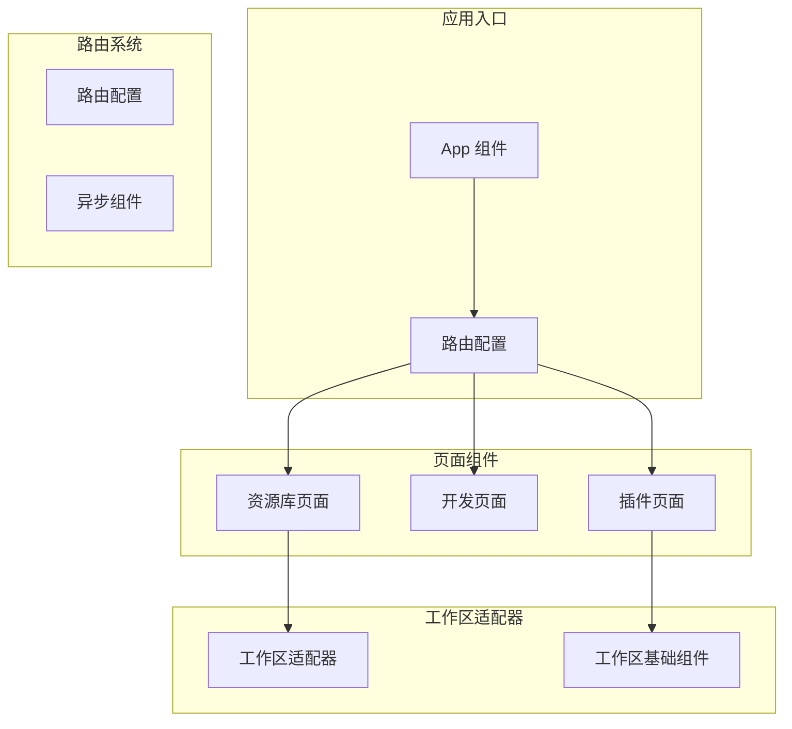
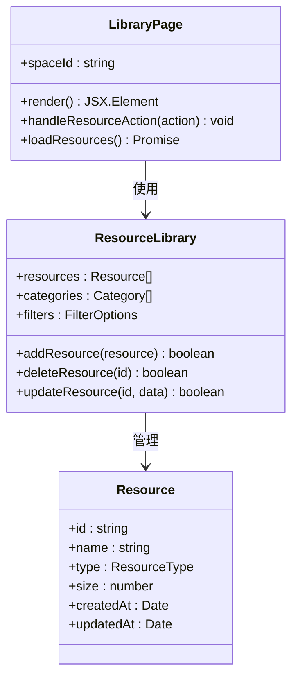
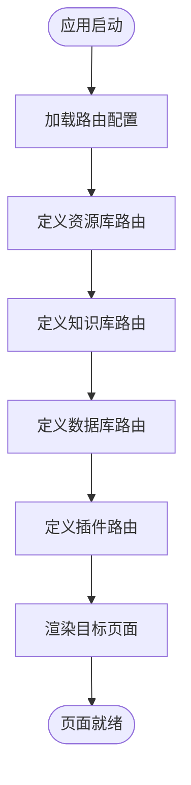
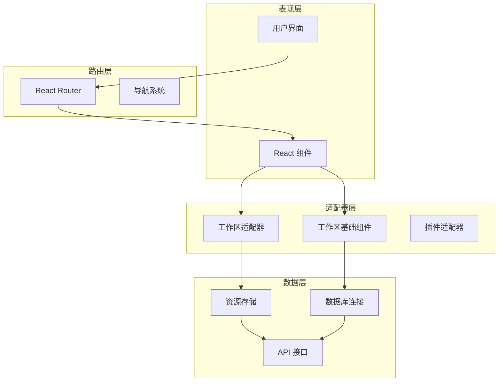
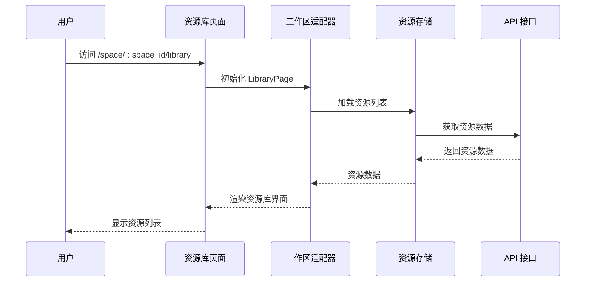
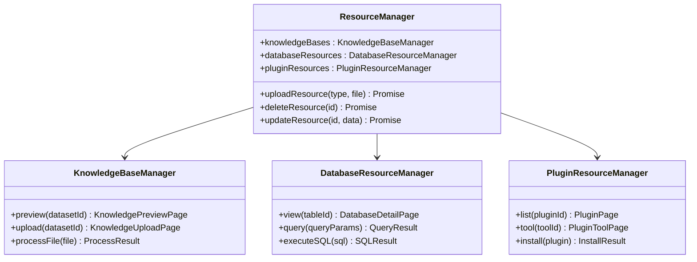
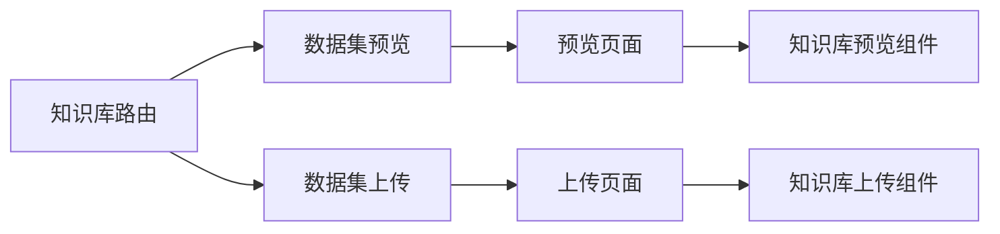
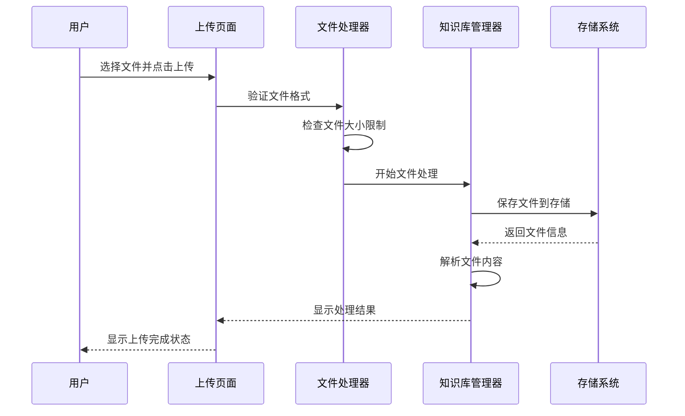
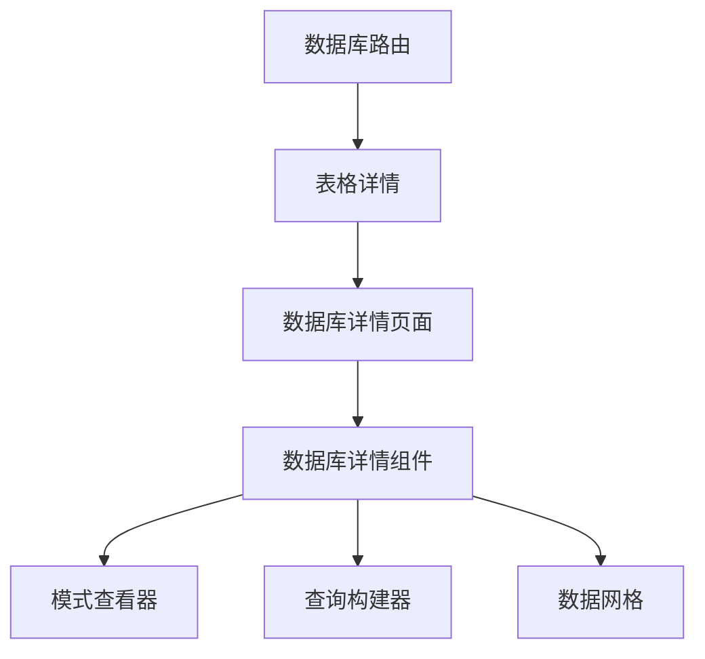
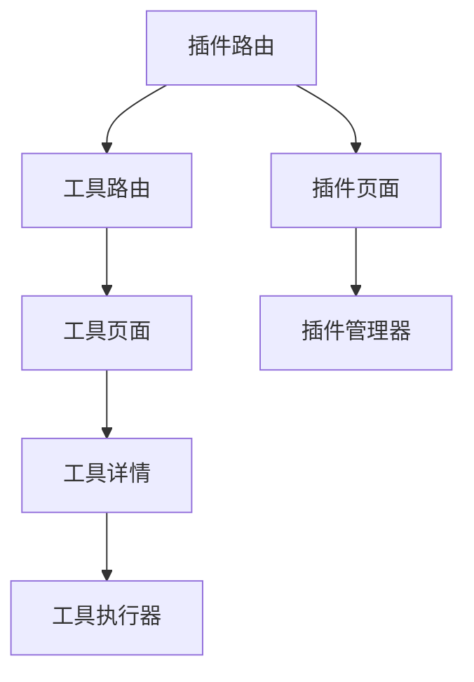

# 资源库管理系统

<cite>
**本文档引用的文件**
- [src/pages/library.tsx](file://src/pages/library.tsx)
- [src/routes/index.tsx](file://src/routes/index.tsx)
- [src/routes/async-components.tsx](file://src/routes/async-components.tsx)
- [src/app.tsx](file://src/app.tsx)
- [package.json](file://package.json)
- [README.md](file://README.md)
- [src/pages/plugin/page.tsx](file://src/pages/plugin/page.tsx)
- [src/pages/plugin/layout.tsx](file://src/pages/plugin/layout.tsx)
</cite>

## 目录
1. [简介](#简介)
2. [项目结构](#项目结构)
3. [核心组件](#核心组件)
4. [架构概览](#架构概览)
5. [详细组件分析](#详细组件分析)
6. [依赖分析](#依赖分析)
7. [性能考虑](#性能考虑)
8. [故障排除指南](#故障排除指南)
9. [结论](#结论)
10. [附录](#附录)

## 简介

资源库管理系统是 Coze Studio 前端应用的重要组成部分，负责管理各种类型的资源，包括知识库资源、数据库资源和插件资源。该系统提供了统一的资源管理界面，支持资源的预览、上传、管理和组织功能。

本系统基于现代化的前端技术栈构建，采用模块化设计，通过路由系统实现资源库的多级导航和页面切换。系统集成了多个工作区适配器，为不同类型的资源提供专门的管理界面。

## 项目结构

前端应用采用清晰的目录结构，主要包含以下关键部分：



**图表来源**
- [src/app.tsx:24-36](file://src/app.tsx#L24-L36)
- [src/routes/index.tsx:50-298](file://src/routes/index.tsx#L50-L298)

**章节来源**
- [src/app.tsx:1-37](file://src/app.tsx#L1-L37)
- [src/routes/index.tsx:1-298](file://src/routes/index.tsx#L1-L298)

## 核心组件

### 资源库页面组件

资源库页面是系统的核心入口，负责展示和管理所有类型的资源。该组件通过工作区适配器提供的 `LibraryPage` 实现资源库功能。



**图表来源**
- [src/pages/library.tsx:19-24](file://src/pages/library.tsx#L19-L24)

### 路由系统架构

系统采用 React Router v6 的现代路由系统，支持嵌套路由和动态参数传递。



**图表来源**
- [src/routes/index.tsx:175-236](file://src/routes/index.tsx#L175-L236)

**章节来源**
- [src/pages/library.tsx:1-27](file://src/pages/library.tsx#L1-L27)
- [src/routes/index.tsx:175-236](file://src/routes/index.tsx#L175-L236)

## 架构概览

资源库管理系统采用分层架构设计，通过适配器模式实现功能模块的解耦。



**图表来源**
- [src/app.tsx:22-33](file://src/app.tsx#L22-L33)
- [package.json:41-43](file://package.json#L41-L43)

## 详细组件分析

### 资源库页面实现

资源库页面通过工作区适配器实现，支持多种资源类型的统一管理。

#### 页面组件结构



**图表来源**
- [src/pages/library.tsx:21-24](file://src/pages/library.tsx#L21-L24)
- [src/routes/async-components.tsx:53-54](file://src/routes/async-components.tsx#L53-L54)

#### 资源类型管理

系统支持多种资源类型的管理，每种类型都有专门的处理逻辑：



**图表来源**
- [src/routes/index.tsx:184-215](file://src/routes/index.tsx#L184-L215)

**章节来源**
- [src/pages/library.tsx:17-24](file://src/pages/library.tsx#L17-L24)
- [src/routes/index.tsx:184-215](file://src/routes/index.tsx#L184-L215)

### 知识库资源管理

知识库资源管理是系统的重要功能模块，支持知识的预览和上传操作。

#### 知识库路由配置



**图表来源**
- [src/routes/index.tsx:184-200](file://src/routes/index.tsx#L184-L200)
- [src/routes/async-components.tsx:89-101](file://src/routes/async-components.tsx#L89-L101)

#### 知识库上传流程



**图表来源**
- [src/routes/async-components.tsx:96-101](file://src/routes/async-components.tsx#L96-L101)

**章节来源**
- [src/routes/index.tsx:184-200](file://src/routes/index.tsx#L184-L200)
- [src/routes/async-components.tsx:89-101](file://src/routes/async-components.tsx#L89-L101)

### 数据库资源管理

数据库资源管理提供对数据库表的详细查看和管理功能。

#### 数据库路由结构



**图表来源**
- [src/routes/index.tsx:202-215](file://src/routes/index.tsx#L202-L215)
- [src/routes/async-components.tsx:103-108](file://src/routes/async-components.tsx#L103-L108)

**章节来源**
- [src/routes/index.tsx:202-215](file://src/routes/index.tsx#L202-L215)
- [src/routes/async-components.tsx:103-108](file://src/routes/async-components.tsx#L103-L108)

### 插件资源管理

插件资源管理支持插件的安装、配置和工具管理。

#### 插件路由体系



**图表来源**
- [src/routes/index.tsx:217-236](file://src/routes/index.tsx#L217-L236)
- [src/pages/plugin/layout.tsx:22-37](file://src/pages/plugin/layout.tsx#L22-L37)

**章节来源**
- [src/routes/index.tsx:217-236](file://src/routes/index.tsx#L217-L236)
- [src/pages/plugin/layout.tsx:1-41](file://src/pages/plugin/layout.tsx#L1-L41)

## 依赖分析

系统采用模块化的依赖管理策略，通过工作区适配器实现功能的解耦。

```mermaid
graph TB
subgraph "核心依赖"
React[React 18.2.0]
Router[React Router 6.11.1]
Design[Coze Design]
end
subgraph "工作区适配器"
WorkspaceAdapter[@coze-studio/workspace-adapter]
WorkspaceBase[@coze-studio/workspace-base]
end
subgraph "功能模块"
AgentIDE[@coze-agent-ide]
ProjectIDE[@coze-project-ide]
Workflow[@coze-workflow]
end
subgraph "基础设施"
Foundation[@coze-foundation]
Arch[@coze-arch]
Community[@coze-community]
end
React --> Router
Router --> Design
WorkspaceAdapter --> WorkspaceBase
AgentIDE --> ProjectIDE
Workflow --> Community
Foundation --> Arch
```

**图表来源**
- [package.json:19-50](file://package.json#L19-L50)

**章节来源**
- [package.json:19-50](file://package.json#L19-L50)

## 性能考虑

系统在设计时充分考虑了性能优化，采用了多种策略来提升用户体验：

### 懒加载机制
- 所有页面组件都采用懒加载方式，减少初始包体积
- 异步组件按需加载，提升首屏加载速度

### 缓存策略
- 资源数据采用缓存机制，避免重复请求
- 图片和静态资源使用浏览器缓存

### 优化建议
- 对于大量资源的场景，建议实现虚拟滚动
- 考虑实现增量加载，提升大数据集的浏览体验
- 优化图片压缩和格式选择

## 故障排除指南

### 常见问题及解决方案

#### 资源库页面无法加载
1. 检查网络连接是否正常
2. 确认用户具有访问权限
3. 查看浏览器控制台是否有错误信息

#### 资源上传失败
1. 检查文件格式是否受支持
2. 确认文件大小是否超过限制
3. 验证存储空间是否充足

#### 路由跳转异常
1. 检查路由配置是否正确
2. 确认参数传递是否完整
3. 查看控制台是否有路由错误

**章节来源**
- [src/pages/library.tsx:21-24](file://src/pages/library.tsx#L21-L24)
- [src/pages/plugin/page.tsx:23-33](file://src/pages/plugin/page.tsx#L23-L33)

## 结论

资源库管理系统通过模块化的设计和适配器模式，成功实现了多种资源类型的统一管理。系统具有良好的扩展性和维护性，能够满足不同场景下的资源管理需求。

系统的架构设计充分体现了现代前端开发的最佳实践，包括组件化、模块化和响应式设计。通过合理的技术选型和性能优化策略，为用户提供了流畅的资源管理体验。

## 附录

### 快速开始指南

1. 访问资源库页面：`/space/:space_id/library`
2. 选择要管理的资源类型
3. 使用相应的操作按钮进行资源管理
4. 通过搜索和过滤功能快速定位资源

### 支持的资源类型

- 知识库资源：支持文档、PDF、文本等文件的上传和管理
- 数据库资源：支持表格查看、数据查询和管理
- 插件资源：支持插件安装、配置和工具使用

### 最佳实践

1. **资源分类**：建立清晰的资源分类体系
2. **命名规范**：遵循统一的资源命名约定
3. **版本管理**：对重要资源实施版本控制
4. **权限控制**：合理设置资源访问权限
5. **定期清理**：定期清理不再使用的资源