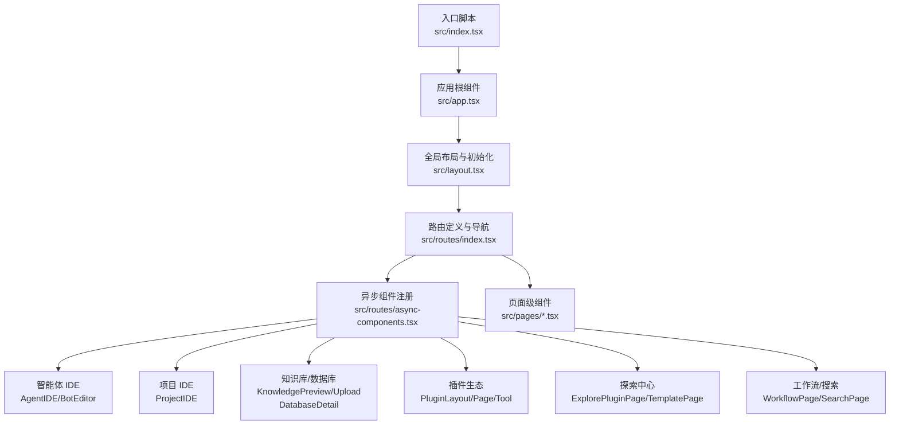
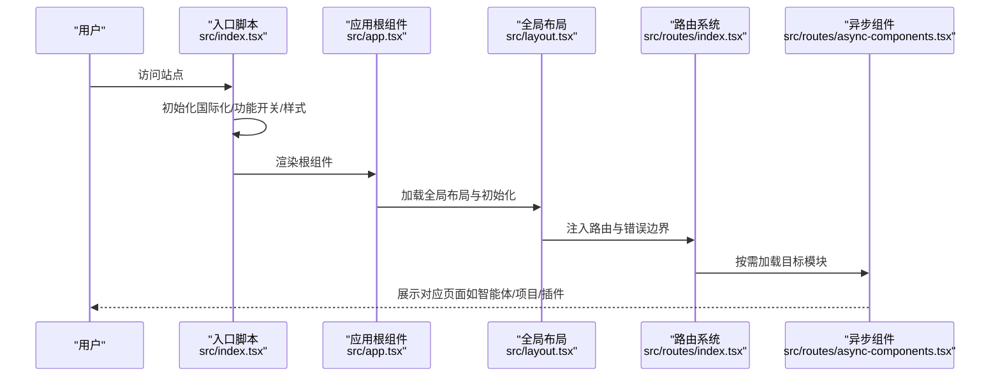
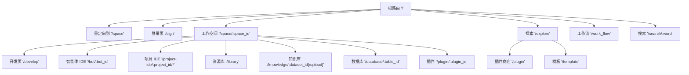
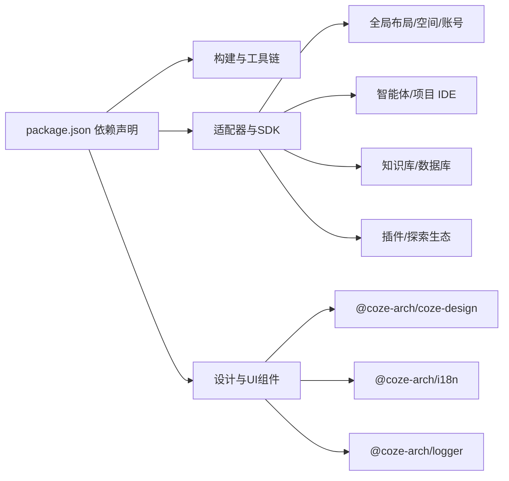

# 项目介绍

<cite>
**本文引用的文件**
- [README.md](file://README.md)
- [package.json](file://package.json)
- [src/index.tsx](file://src/index.tsx)
- [src/app.tsx](file://src/app.tsx)
- [src/layout.tsx](file://src/layout.tsx)
- [src/routes/index.tsx](file://src/routes/index.tsx)
- [src/routes/async-components.tsx](file://src/routes/async-components.tsx)
- [src/pages/develop.tsx](file://src/pages/develop.tsx)
- [src/pages/library.tsx](file://src/pages/library.tsx)
- [src/pages/explore.tsx](file://src/pages/explore.tsx)
- [src/pages/docs.tsx](file://src/pages/docs.tsx)
- [src/pages/plugin/layout.tsx](file://src/pages/plugin/layout.tsx)
- [src/pages/plugin/page.tsx](file://src/pages/plugin/page.tsx)
- [src/pages/plugin/tool/page.tsx](file://src/pages/plugin/tool/page.tsx)
</cite>

## 目录
1. [引言](#引言)
2. [项目结构](#项目结构)
3. [核心组件](#核心组件)
4. [架构总览](#架构总览)
5. [详细组件分析](#详细组件分析)
6. [依赖分析](#依赖分析)
7. [性能考虑](#性能考虑)
8. [故障排查指南](#故障排查指南)
9. [结论](#结论)
10. [附录](#附录)

## 引言
Coze Studio 是一个面向智能体（Agent）与工作空间的可视化开发与协作平台。其核心使命是降低智能体从设计到上线的门槛，帮助开发者、AI 工程师与企业团队高效构建、调试、发布与管理智能体应用。平台通过模块化能力与统一的前端框架，提供从智能体编辑器、项目 IDE、知识库、插件生态到工作空间资源库的一体化体验，使复杂 AI 应用的开发流程更清晰、可复用、可扩展。

在当前 AI 应用开发生态中，Coze Studio 的独特定位在于：以“工作空间”为中心的多模块协同（智能体、项目、插件、知识库、数据库），结合动态路由与按需加载的前端架构，既保证了开发效率，也兼顾了运行时的性能与可维护性。

## 项目结构
前端采用 Rsbuild 构建工具，基于 React 18 与 React Router v6，配合 TailwindCSS、Less 模块化样式与 Vitest 测试框架。项目通过工作区依赖组织多个子包，形成可复用的组件与适配层，覆盖登录认证、全局布局、空间与菜单、智能体 IDE、项目 IDE、知识库、插件商店、工作流与搜索等模块。

图表来源
- [src/index.tsx:1-55](file://src/index.tsx#L1-L55)
- [src/app.tsx:1-37](file://src/app.tsx#L1-L37)
- [src/layout.tsx:1-24](file://src/layout.tsx#L1-L24)
- [src/routes/index.tsx:1-298](file://src/routes/index.tsx#L1-L298)
- [src/routes/async-components.tsx:1-153](file://src/routes/async-components.tsx#L1-L153)

章节来源
- [README.md:1-7](file://README.md#L1-L7)
- [package.json:1-84](file://package.json#L1-L84)
- [src/index.tsx:1-55](file://src/index.tsx#L1-L55)
- [src/app.tsx:1-37](file://src/app.tsx#L1-L37)
- [src/layout.tsx:1-24](file://src/layout.tsx#L1-L24)
- [src/routes/index.tsx:1-298](file://src/routes/index.tsx#L1-L298)
- [src/routes/async-components.tsx:1-153](file://src/routes/async-components.tsx#L1-L153)

## 核心组件
- 入口与初始化
  - 初始化国际化、功能开关与 Markdown 样式注入，随后渲染应用根组件。
- 应用根组件
  - 使用 Suspense 提供加载占位，RouterProvider 管理全站路由。
- 全局布局
  - 调用全局初始化钩子与通用布局容器，承载侧边菜单与主内容区域。
- 路由系统
  - 定义文档、登录、工作空间（space）、探索（explore）、工作流、搜索等多层级路由；支持权限控制与侧边菜单联动。
- 页面与模块
  - 智能体 IDE、项目 IDE、资源库、知识库、数据库、插件与工具页、探索插件与模板等，均通过异步组件按需加载。

章节来源
- [src/index.tsx:1-55](file://src/index.tsx#L1-L55)
- [src/app.tsx:1-37](file://src/app.tsx#L1-L37)
- [src/layout.tsx:1-24](file://src/layout.tsx#L1-L24)
- [src/routes/index.tsx:1-298](file://src/routes/index.tsx#L1-L298)
- [src/routes/async-components.tsx:1-153](file://src/routes/async-components.tsx#L1-L153)

## 架构总览
Coze Studio 前端采用“入口初始化 → 全局布局 → 动态路由 → 异步组件”的分层架构。路由层负责权限与菜单联动，页面层通过工作区上下文与适配器实现具体功能，异步组件与工作区依赖共同支撑模块化扩展。

图表来源
- [src/index.tsx:1-55](file://src/index.tsx#L1-L55)
- [src/app.tsx:1-37](file://src/app.tsx#L1-L37)
- [src/layout.tsx:1-24](file://src/layout.tsx#L1-L24)
- [src/routes/index.tsx:1-298](file://src/routes/index.tsx#L1-L298)
- [src/routes/async-components.tsx:1-153](file://src/routes/async-components.tsx#L1-L153)

## 详细组件分析

### 路由与导航体系
- 主要路径
  - 文档与重定向：/open/docs、/docs、/information/auth/success
  - 登录页：/sign
  - 工作空间：/space/:space_id 下的 develop、bot/:bot_id、project-ide、library、knowledge、database、plugin/:plugin_id
  - 探索中心：/explore 下的 plugin、template
  - 其他：/work_flow、/search/:word
- 权限与菜单
  - 多数路由要求鉴权；空间模块与探索模块分别绑定侧边菜单与二级菜单。
- 子模块键值
  - 空间子模块枚举用于区分“开发”“资源库”等子模块，保障菜单高亮与面包屑一致性。

图表来源
- [src/routes/index.tsx:78-294](file://src/routes/index.tsx#L78-L294)

章节来源
- [src/routes/index.tsx:1-298](file://src/routes/index.tsx#L1-L298)

### 页面与模块职责
- 智能体 IDE
  - 通过智能体 IDE 适配器提供可视化编辑与发布流程，支持移动端提示与编辑器初始化控制。
- 项目 IDE
  - 面向项目级开发与发布的统一界面，提供项目内多页面与发布流程。
- 资源库
  - 在指定工作区内展示与管理公共资源。
- 知识库与数据库
  - 提供知识库预览与上传、数据库详情查看等能力。
- 插件生态
  - 插件与工具页通过插件存储实例初始化，支持插件资源导航与工具调用。
- 探索中心
  - 提供插件与模板的浏览与检索能力，支持二级菜单与类型筛选。

章节来源
- [src/routes/async-components.tsx:50-153](file://src/routes/async-components.tsx#L50-L153)
- [src/pages/develop.tsx:1-27](file://src/pages/develop.tsx#L1-L27)
- [src/pages/library.tsx:1-27](file://src/pages/library.tsx#L1-L27)
- [src/pages/plugin/layout.tsx:1-41](file://src/pages/plugin/layout.tsx#L1-L41)
- [src/pages/plugin/page.tsx:1-36](file://src/pages/plugin/page.tsx#L1-L36)
- [src/pages/plugin/tool/page.tsx:1-35](file://src/pages/plugin/tool/page.tsx#L1-L35)
- [src/pages/explore.tsx:1-67](file://src/pages/explore.tsx#L1-L67)

### 初始化与国际化
- 初始化流程
  - 拉取功能开关、初始化国际化实例、动态引入 Markdown 样式，随后挂载根组件。
- 国际化策略
  - 根据本地存储或环境变量选择语言，确保多地区用户的可用性。

章节来源
- [src/index.tsx:26-43](file://src/index.tsx#L26-L43)

### 文档与外部跳转
- 文档路由
  - 将旧版文档路径重定向至官方站点，保障用户访问连续性。

章节来源
- [src/pages/docs.tsx:1-27](file://src/pages/docs.tsx#L1-L27)

## 依赖分析
- 构建与工具
  - Rsbuild、TailwindCSS、Less、Vitest、TypeScript 等，提供现代化开发与测试能力。
- 业务与适配层
  - 账号与空间适配器、全局上下文、设计体系、日志与 Web 上下文、工作区与 IDE 适配器、插件与探索生态等，构成平台能力底座。
- 关键依赖关系
  - 应用入口依赖全局布局与路由；路由层依赖异步组件与页面；页面层依赖工作区与适配器；插件生态依赖插件存储实例。

图表来源
- [package.json:19-51](file://package.json#L19-L51)

章节来源
- [package.json:1-84](file://package.json#L1-L84)

## 性能考虑
- 按需加载与懒加载
  - 所有页面与模块通过异步组件按需加载，减少首屏体积与初次渲染压力。
- 路由级错误边界
  - 统一的错误处理与回退元素，提升异常场景下的用户体验。
- 国际化与样式初始化
  - 在入口阶段完成国际化与样式注入，避免重复请求与闪烁。
- 移动端提示
  - 部分模块在移动端显示提示，优化跨设备体验。

章节来源
- [src/routes/index.tsx:80-81](file://src/routes/index.tsx#L80-L81)
- [src/app.tsx:24-35](file://src/app.tsx#L24-L35)
- [src/index.tsx:33-43](file://src/index.tsx#L33-L43)

## 故障排查指南
- 根元素缺失
  - 若未找到挂载节点，应用会抛出错误；请检查 HTML 结构与入口挂载点。
- 插件/工具渲染参数缺失
  - 插件与工具页需要完整的工作区与插件标识；若缺少参数将触发错误提示，请确认路由参数与工作区上下文。
- 文档重定向
  - 文档路由会跳转至官方站点；若无法访问，请检查网络或域名解析。

章节来源
- [src/index.tsx:45-48](file://src/index.tsx#L45-L48)
- [src/pages/plugin/page.tsx:23-33](file://src/pages/plugin/page.tsx#L23-L33)
- [src/pages/plugin/tool/page.tsx:20-32](file://src/pages/plugin/tool/page.tsx#L20-L32)
- [src/pages/docs.tsx:19-24](file://src/pages/docs.tsx#L19-L24)

## 结论
Coze Studio 以“工作空间”为核心，围绕智能体与项目开发，提供从可视化编辑、资源管理到插件生态与探索中心的完整闭环。通过模块化依赖与动态路由架构，平台在保证开发效率的同时，兼顾了可维护性与可扩展性。对于开发者、AI 工程师与企业团队而言，它是一个能够显著降低智能体应用开发门槛、提升协作效率与交付质量的基础设施平台。

## 附录
- 主要目标用户
  - 开发者：使用智能体 IDE 与项目 IDE 快速构建与迭代智能体。
  - AI 工程师：借助知识库、数据库与工作流进行数据与逻辑编排。
  - 企业团队：通过工作空间与资源库实现资产沉淀与团队协作。
- 典型使用场景
  - 快速原型：在探索中心浏览插件与模板，快速搭建基础智能体。
  - 迭代开发：在智能体 IDE 中进行可视化编辑与调试，一键发布。
  - 资产沉淀：在资源库与知识库中归档与共享模型、数据与工具。
  - 生态集成：通过插件与工具扩展平台能力，接入第三方服务。