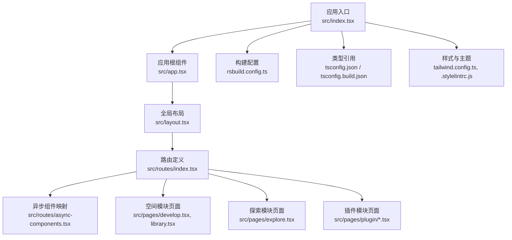
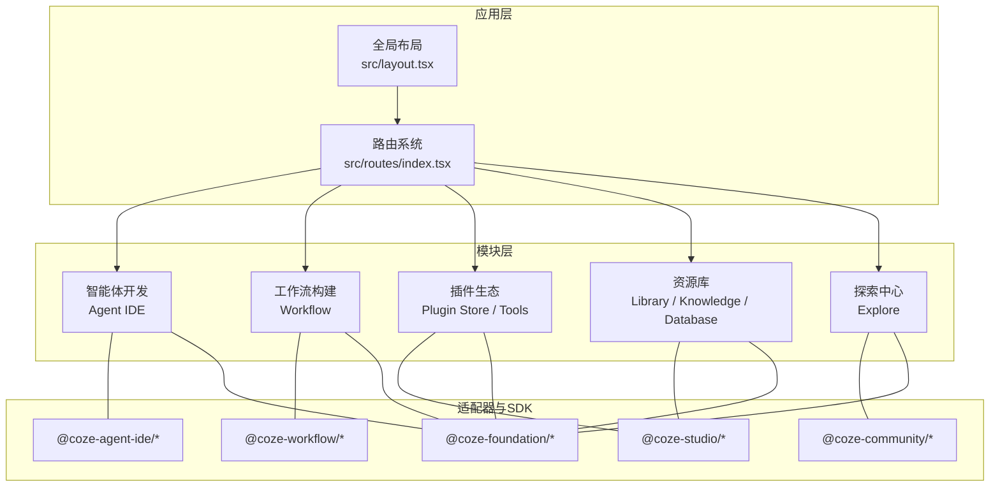
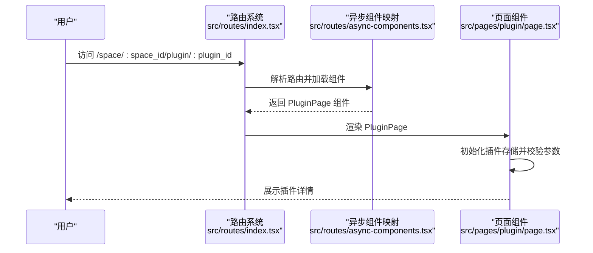
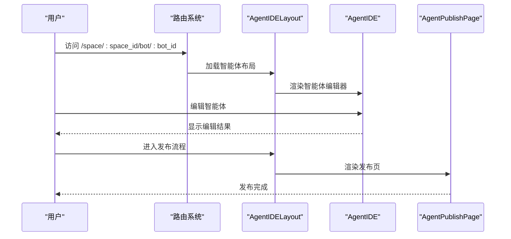
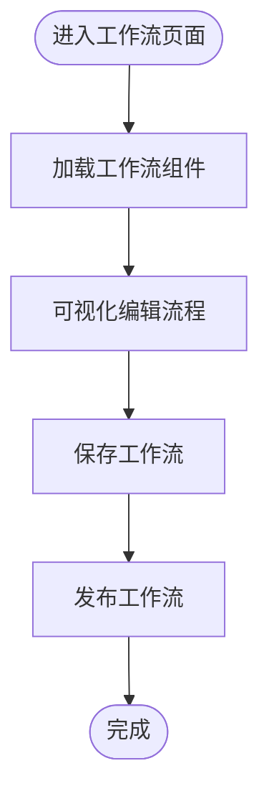
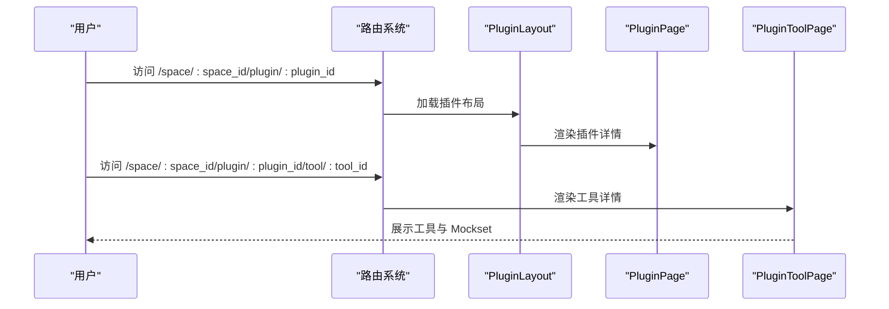
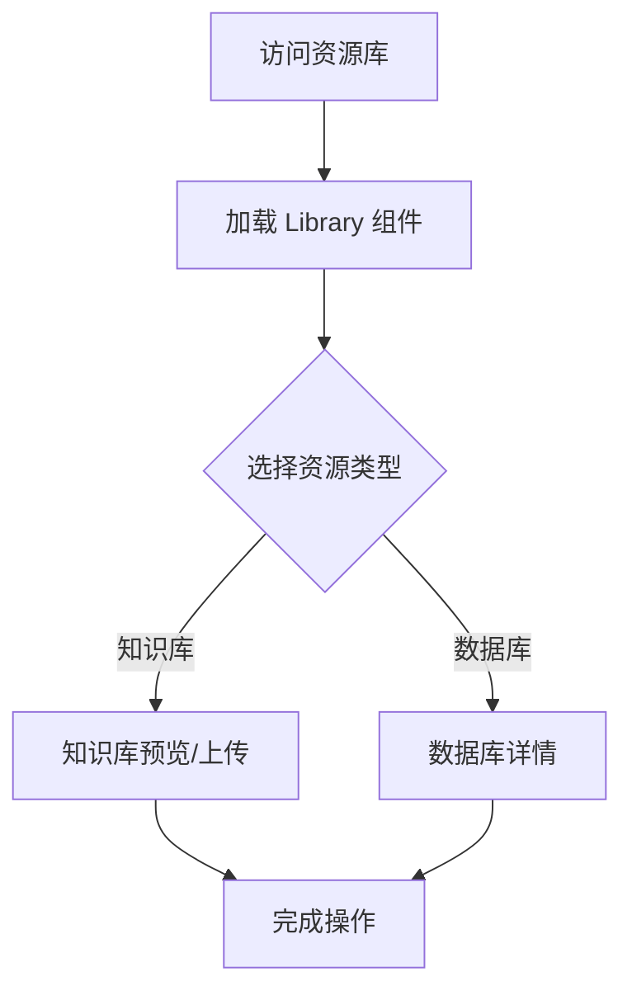
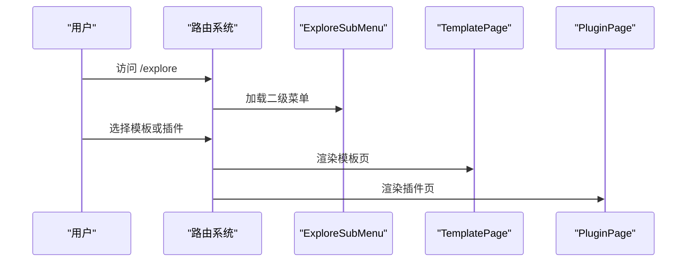
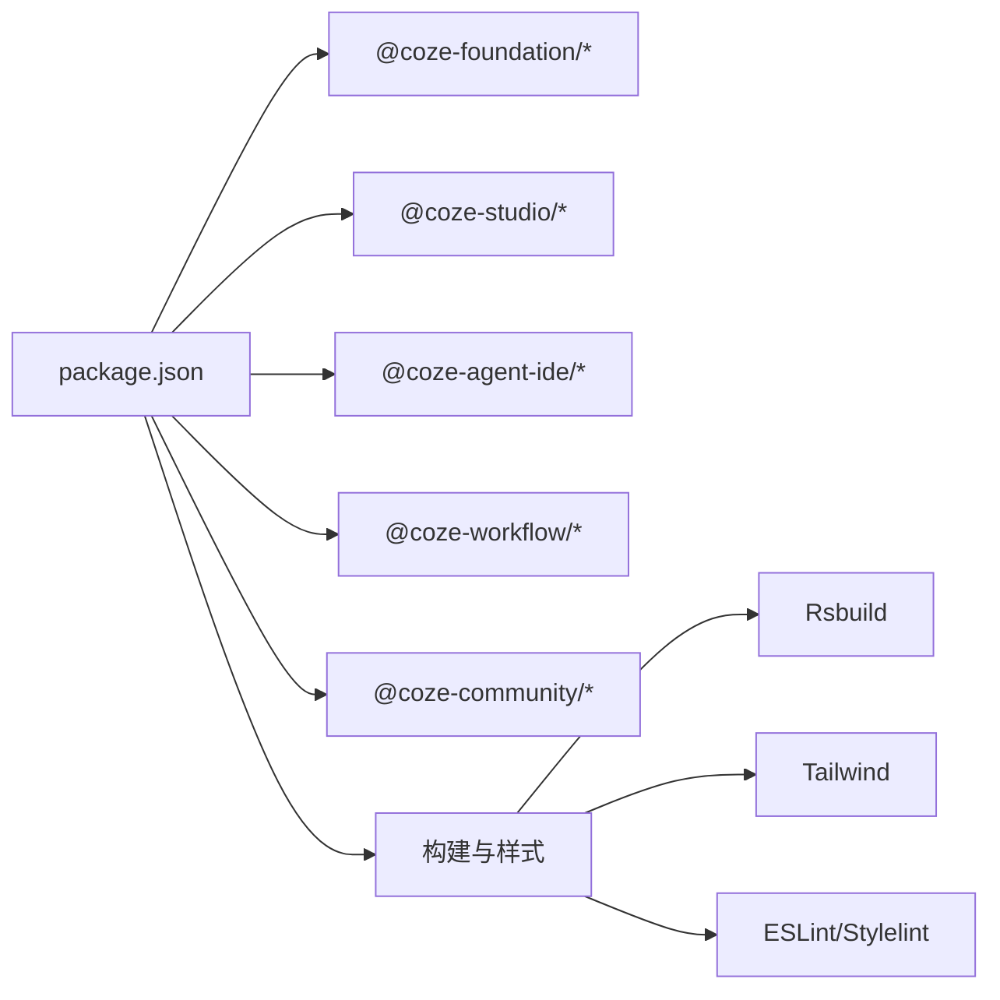

# 项目概述

<cite>
**本文档引用的文件**
- [README.md](file://README.md)
- [package.json](file://package.json)
- [tsconfig.json](file://tsconfig.json)
- [tsconfig.build.json](file://tsconfig.build.json)
- [rsbuild.config.ts](file://rsbuild.config.ts)
- [tailwind.config.ts](file://tailwind.config.ts)
- [.stylelintrc.js](file://.stylelintrc.js)
- [src/index.tsx](file://src/index.tsx)
- [src/app.tsx](file://src/app.tsx)
- [src/layout.tsx](file://src/layout.tsx)
- [src/routes/index.tsx](file://src/routes/index.tsx)
- [src/routes/async-components.tsx](file://src/routes/async-components.tsx)
- [src/pages/develop.tsx](file://src/pages/develop.tsx)
- [src/pages/library.tsx](file://src/pages/library.tsx)
- [src/pages/explore.tsx](file://src/pages/explore.tsx)
- [src/pages/plugin/page.tsx](file://src/pages/plugin/page.tsx)
- [src/pages/plugin/tool/page.tsx](file://src/pages/plugin/tool/page.tsx)
- [src/pages/plugin/tool/plugin-mock-set/page.tsx](file://src/pages/plugin/tool/plugin-mock-set/page.tsx)
</cite>

## 目录
1. [引言](#引言)
2. [项目结构](#项目结构)
3. [核心组件](#核心组件)
4. [架构总览](#架构总览)
5. [详细组件分析](#详细组件分析)
6. [依赖分析](#依赖分析)
7. [性能考虑](#性能考虑)
8. [故障排除指南](#故障排除指南)
9. [结论](#结论)
10. [附录](#附录)

## 引言
Coze Studio 是一个面向智能体开发与工作流构建的前端平台，旨在降低 AI 应用开发门槛，帮助开发者以可视化与模块化的方式快速搭建智能体、管理资源、探索插件生态，并通过工作流引擎实现复杂业务流程编排。平台采用现代化前端技术栈与模块化架构，结合统一的全局布局与多子系统适配器，形成“空间”驱动的工作区与“探索”生态两大核心能力域。

平台定位：
- 面向开发者与企业团队，提供从智能体设计到发布、从资源管理到插件扩展的一站式开发体验。
- 通过可插拔的适配器与工作区组件，支持多场景、多形态的智能体与项目开发。
- 在 AI 应用开发领域强调“低代码可视化 + 可扩展插件生态 + 工作流编排”的综合能力。

## 项目结构
本项目为一个基于 Rsbuild 的 React 单页应用，采用分层与模块化的组织方式：
- 根级配置：Rsbuild 构建配置、TypeScript 引用配置、Tailwind 主题与样式规范、ESLint 规则等。
- 源码入口：应用初始化、路由定义、全局布局与页面组件。
- 页面与路由：围绕“空间”、“探索”、“工作流”、“插件”等模块划分的页面与子路由。
- 依赖与适配器：大量 workspace、agent-ide、workflow、community 等适配器与 SDK，支撑平台能力扩展。

图表来源
- [src/index.tsx:1-55](file://src/index.tsx#L1-L55)
- [src/app.tsx:1-37](file://src/app.tsx#L1-L37)
- [src/layout.tsx:1-24](file://src/layout.tsx#L1-L24)
- [src/routes/index.tsx:1-298](file://src/routes/index.tsx#L1-L298)
- [src/routes/async-components.tsx:1-153](file://src/routes/async-components.tsx#L1-L153)
- [rsbuild.config.ts:68-135](file://rsbuild.config.ts#L68-L135)
- [tsconfig.json:1-16](file://tsconfig.json#L1-L16)
- [tsconfig.build.json:92-133](file://tsconfig.build.json#L92-L133)
- [tailwind.config.ts:25-54](file://tailwind.config.ts#L25-L54)
- [.stylelintrc.js:1-5](file://.stylelintrc.js#L1-L5)

章节来源
- [README.md:1-7](file://README.md#L1-L7)
- [package.json:1-84](file://package.json#L1-L84)
- [tsconfig.json:1-16](file://tsconfig.json#L1-L16)
- [tsconfig.build.json:92-133](file://tsconfig.build.json#L92-L133)
- [rsbuild.config.ts:68-135](file://rsbuild.config.ts#L68-L135)
- [tailwind.config.ts:25-54](file://tailwind.config.ts#L25-L54)
- [.stylelintrc.js:1-5](file://.stylelintrc.js#L1-L5)

## 核心组件
- 应用入口与初始化
  - 初始化国际化、功能开关、Markdown 样式动态加载，挂载根组件。
  - 关键路径：[src/index.tsx:33-55](file://src/index.tsx#L33-L55)
- 应用根组件
  - 提供全局加载兜底与路由容器，承载页面切换与错误边界。
  - 关键路径：[src/app.tsx:24-36](file://src/app.tsx#L24-L36)
- 全局布局
  - 使用全局适配器初始化应用状态并渲染统一布局。
  - 关键路径：[src/layout.tsx:19-23](file://src/layout.tsx#L19-L23)
- 路由系统
  - 定义主路由与嵌套路由，包含登录、空间、探索、工作流、搜索、插件等模块。
  - 关键路径：[src/routes/index.tsx:50-298](file://src/routes/index.tsx#L50-L298)
- 异步组件映射
  - 将页面组件懒加载并映射到路由，提升首屏性能。
  - 关键路径：[src/routes/async-components.tsx:17-153](file://src/routes/async-components.tsx#L17-L153)

章节来源
- [src/index.tsx:1-55](file://src/index.tsx#L1-L55)
- [src/app.tsx:1-37](file://src/app.tsx#L1-L37)
- [src/layout.tsx:1-24](file://src/layout.tsx#L1-L24)
- [src/routes/index.tsx:1-298](file://src/routes/index.tsx#L1-L298)
- [src/routes/async-components.tsx:1-153](file://src/routes/async-components.tsx#L1-L153)

## 架构总览
平台采用“入口 -> 布局 -> 路由 -> 模块页面”的分层架构，配合统一的适配器与工作区组件，形成可扩展的能力体系。核心模块包括：
- 智能体开发（Agent IDE）：提供智能体编辑、发布与版本管理。
- 工作流构建（Workflow）：提供可视化工作流页面与编排能力。
- 插件生态（Plugin Store / Plugin Tools）：提供插件商店、插件详情与工具页面。
- 资源库（Workspace Library / Knowledge / Database）：提供资源检索、知识库与数据库资源管理。
- 探索中心（Explore）：提供模板与插件的浏览与搜索能力。

图表来源
- [src/layout.tsx:19-23](file://src/layout.tsx#L19-L23)
- [src/routes/index.tsx:50-298](file://src/routes/index.tsx#L50-L298)
- [src/routes/async-components.tsx:17-153](file://src/routes/async-components.tsx#L17-L153)
- [package.json:19-50](file://package.json#L19-L50)

## 详细组件分析

### 路由与页面组件
- 主路由与嵌套路由
  - 登录页、空间导航、智能体 IDE、项目 IDE、资源库、知识库、数据库、工作流、搜索、探索等模块均通过路由集中管理。
  - 关键路径：[src/routes/index.tsx:78-298](file://src/routes/index.tsx#L78-L298)
- 异步组件懒加载
  - 使用 React.lazy 与路由 loader 组合，按需加载页面组件，优化首屏性能。
  - 关键路径：[src/routes/async-components.tsx:17-153](file://src/routes/async-components.tsx#L17-L153)
- 页面组件示例
  - 开发页：绑定空间 ID，调用工作区适配器进行开发。
    - 关键路径：[src/pages/develop.tsx:19-24](file://src/pages/develop.tsx#L19-L24)
  - 资源库页：绑定空间 ID，调用工作区适配器进行资源管理。
    - 关键路径：[src/pages/library.tsx:19-24](file://src/pages/library.tsx#L19-L24)
  - 探索页：二级菜单与模板/插件页面懒加载。
    - 关键路径：[src/pages/explore.tsx:22-66](file://src/pages/explore.tsx#L22-L66)
  - 插件页：初始化插件存储，渲染插件详情。
    - 关键路径：[src/pages/plugin/page.tsx:23-33](file://src/pages/plugin/page.tsx#L23-L33)
  - 插件工具页：渲染具体工具并初始化插件存储。
    - 关键路径：[src/pages/plugin/tool/page.tsx:22-32](file://src/pages/plugin/tool/page.tsx#L22-L32)
  - 插件 Mockset 列表页：渲染工具 Mockset 列表。
    - 关键路径：[src/pages/plugin/tool/plugin-mock-set/page.tsx:22-34](file://src/pages/plugin/tool/plugin-mock-set/page.tsx#L22-L34)

图表来源
- [src/routes/index.tsx:218-236](file://src/routes/index.tsx#L218-L236)
- [src/routes/async-components.tsx:124-131](file://src/routes/async-components.tsx#L124-L131)
- [src/pages/plugin/page.tsx:23-33](file://src/pages/plugin/page.tsx#L23-L33)

章节来源
- [src/routes/index.tsx:1-298](file://src/routes/index.tsx#L1-L298)
- [src/routes/async-components.tsx:1-153](file://src/routes/async-components.tsx#L1-L153)
- [src/pages/develop.tsx:1-27](file://src/pages/develop.tsx#L1-L27)
- [src/pages/library.tsx:1-27](file://src/pages/library.tsx#L1-L27)
- [src/pages/explore.tsx:1-67](file://src/pages/explore.tsx#L1-L67)
- [src/pages/plugin/page.tsx:1-36](file://src/pages/plugin/page.tsx#L1-L36)
- [src/pages/plugin/tool/page.tsx:1-34](file://src/pages/plugin/tool/page.tsx#L1-L34)
- [src/pages/plugin/tool/plugin-mock-set/page.tsx:1-36](file://src/pages/plugin/tool/plugin-mock-set/page.tsx#L1-L36)

### 智能体开发（Agent IDE）
- 功能定位：提供智能体编辑、发布与版本管理的完整工作流。
- 页面构成：IDE 布局、编辑器、发布页等。
- 关键路径：
  - 路由与组件映射：[src/routes/index.tsx:127-157](file://src/routes/index.tsx#L127-L157)，[src/routes/async-components.tsx:56-73](file://src/routes/async-components.tsx#L56-L73)
  - 页面组件：[src/app.tsx:24-36](file://src/app.tsx#L24-L36)

图表来源
- [src/routes/index.tsx:127-157](file://src/routes/index.tsx#L127-L157)
- [src/routes/async-components.tsx:56-73](file://src/routes/async-components.tsx#L56-L73)

章节来源
- [src/routes/index.tsx:127-157](file://src/routes/index.tsx#L127-L157)
- [src/routes/async-components.tsx:56-73](file://src/routes/async-components.tsx#L56-L73)
- [src/app.tsx:1-37](file://src/app.tsx#L1-L37)

### 工作流构建（Workflow）
- 功能定位：提供可视化工作流页面与编排能力。
- 页面构成：工作流页面。
- 关键路径：
  - 路由与组件映射：[src/routes/index.tsx:242-250](file://src/routes/index.tsx#L242-L250)，[src/routes/async-components.tsx:110-115](file://src/routes/async-components.tsx#L110-L115)

图表来源
- [src/routes/index.tsx:242-250](file://src/routes/index.tsx#L242-L250)
- [src/routes/async-components.tsx:110-115](file://src/routes/async-components.tsx#L110-L115)

章节来源
- [src/routes/index.tsx:242-250](file://src/routes/index.tsx#L242-L250)
- [src/routes/async-components.tsx:110-115](file://src/routes/async-components.tsx#L110-L115)

### 插件生态（Plugin Store / Tools）
- 功能定位：提供插件商店、插件详情与工具页面，支持 Mockset 管理。
- 页面构成：插件布局、插件详情、工具详情、Mockset 列表。
- 关键路径：
  - 路由与组件映射：[src/routes/index.tsx:217-236](file://src/routes/index.tsx#L217-L236)，[src/routes/async-components.tsx:124-131](file://src/routes/async-components.tsx#L124-L131)
  - 页面组件：[src/pages/plugin/page.tsx:23-33](file://src/pages/plugin/page.tsx#L23-L33)，[src/pages/plugin/tool/page.tsx:22-32](file://src/pages/plugin/tool/page.tsx#L22-L32)，[src/pages/plugin/tool/plugin-mock-set/page.tsx:22-34](file://src/pages/plugin/tool/plugin-mock-set/page.tsx#L22-L34)

图表来源
- [src/routes/index.tsx:217-236](file://src/routes/index.tsx#L217-L236)
- [src/routes/async-components.tsx:124-131](file://src/routes/async-components.tsx#L124-L131)
- [src/pages/plugin/page.tsx:23-33](file://src/pages/plugin/page.tsx#L23-L33)
- [src/pages/plugin/tool/page.tsx:22-32](file://src/pages/plugin/tool/page.tsx#L22-L32)
- [src/pages/plugin/tool/plugin-mock-set/page.tsx:22-34](file://src/pages/plugin/tool/plugin-mock-set/page.tsx#L22-L34)

章节来源
- [src/routes/index.tsx:217-236](file://src/routes/index.tsx#L217-L236)
- [src/routes/async-components.tsx:124-131](file://src/routes/async-components.tsx#L124-L131)
- [src/pages/plugin/page.tsx:1-36](file://src/pages/plugin/page.tsx#L1-L36)
- [src/pages/plugin/tool/page.tsx:1-34](file://src/pages/plugin/tool/page.tsx#L1-L34)
- [src/pages/plugin/tool/plugin-mock-set/page.tsx:1-36](file://src/pages/plugin/tool/plugin-mock-set/page.tsx#L1-L36)

### 资源库（Workspace Library / Knowledge / Database）
- 功能定位：提供资源检索、知识库与数据库资源管理。
- 页面构成：资源库、知识库预览/上传、数据库详情。
- 关键路径：
  - 路由与组件映射：[src/routes/index.tsx:175-215](file://src/routes/index.tsx#L175-L215)，[src/routes/async-components.tsx:54, 90-108](file://src/routes/async-components.tsx#L54, 90-L108)
  - 页面组件：[src/pages/library.tsx:19-24](file://src/pages/library.tsx#L19-L24)

图表来源
- [src/routes/index.tsx:175-215](file://src/routes/index.tsx#L175-L215)
- [src/routes/async-components.tsx:54, 90-108](file://src/routes/async-components.tsx#L54, 90-L108)
- [src/pages/library.tsx:19-24](file://src/pages/library.tsx#L19-L24)

章节来源
- [src/routes/index.tsx:175-215](file://src/routes/index.tsx#L175-L215)
- [src/routes/async-components.tsx:54, 90-108](file://src/routes/async-components.tsx#L54, 90-L108)
- [src/pages/library.tsx:1-27](file://src/pages/library.tsx#L1-L27)

### 探索中心（Explore）
- 功能定位：提供模板与插件的浏览与搜索能力。
- 页面构成：二级菜单、模板页、插件页、搜索页。
- 关键路径：
  - 路由与组件映射：[src/routes/index.tsx:262-294](file://src/routes/index.tsx#L262-L294)，[src/pages/explore.tsx:22-66](file://src/pages/explore.tsx#L22-L66)

图表来源
- [src/routes/index.tsx:262-294](file://src/routes/index.tsx#L262-L294)
- [src/pages/explore.tsx:22-66](file://src/pages/explore.tsx#L22-L66)

章节来源
- [src/routes/index.tsx:262-294](file://src/routes/index.tsx#L262-L294)
- [src/pages/explore.tsx:1-67](file://src/pages/explore.tsx#L1-L67)

## 依赖分析
- 依赖关系概览
  - 应用层依赖：React、React Router、Zustand、Coze 设计与基础 SDK。
  - 适配器与模块：Foundation、Studio、Agent-IDE、Workflow、Community 等工作区与生态相关包。
  - 构建与样式：Rsbuild、Tailwind、ESLint、Stylelint。
- 关键依赖路径：
  - 应用依赖：[package.json:19-50](file://package.json#L19-L50)
  - 类型引用：[tsconfig.json:7-14](file://tsconfig.json#L7-L14)，[tsconfig.build.json:92-133](file://tsconfig.build.json#L92-L133)
  - 构建配置：[rsbuild.config.ts:68-135](file://rsbuild.config.ts#L68-L135)
  - 样式配置：[tailwind.config.ts:25-54](file://tailwind.config.ts#L25-L54)，[.stylelintrc.js:1-5](file://.stylelintrc.js#L1-L5)

图表来源
- [package.json:19-50](file://package.json#L19-L50)
- [rsbuild.config.ts:68-135](file://rsbuild.config.ts#L68-L135)
- [tailwind.config.ts:25-54](file://tailwind.config.ts#L25-L54)
- [.stylelintrc.js:1-5](file://.stylelintrc.js#L1-L5)

章节来源
- [package.json:1-84](file://package.json#L1-L84)
- [tsconfig.json:1-16](file://tsconfig.json#L1-L16)
- [tsconfig.build.json:92-133](file://tsconfig.build.json#L92-L133)
- [rsbuild.config.ts:68-135](file://rsbuild.config.ts#L68-L135)
- [tailwind.config.ts:25-54](file://tailwind.config.ts#L25-L54)
- [.stylelintrc.js:1-5](file://.stylelintrc.js#L1-L5)

## 性能考虑
- 代码分割与懒加载
  - 通过路由懒加载与异步组件映射，减少初始包体积，提升首屏加载速度。
  - 关键路径：[src/routes/async-components.tsx:17-153](file://src/routes/async-components.tsx#L17-L153)
- 构建优化
  - Rsbuild 分包策略按大小拆分，避免单 Chunk 过大；别名与装饰器配置提升打包兼容性。
  - 关键路径：[rsbuild.config.ts:126-133](file://rsbuild.config.ts#L126-L133)，[rsbuild.config.ts:113-125](file://rsbuild.config.ts#L113-L125)
- 样式与主题
  - Tailwind 内容扫描与安全列表配置，避免无用样式被移除，保证主题一致性。
  - 关键路径：[tailwind.config.ts:25-54](file://tailwind.config.ts#L25-L54)

## 故障排除指南
- 根元素缺失
  - 现象：应用启动时报错提示未找到根元素。
  - 处理：确认 HTML 中存在 id 为 root 的容器节点。
  - 关键路径：[src/index.tsx:45-48](file://src/index.tsx#L45-L48)
- 插件渲染参数缺失
  - 现象：插件详情或工具页面抛出缺少插件/空间 ID 的错误。
  - 处理：检查路由参数是否正确传入，确保 space_id 与 plugin_id 存在。
  - 关键路径：[src/pages/plugin/page.tsx:26-28](file://src/pages/plugin/page.tsx#L26-L28)，[src/pages/plugin/tool/page.tsx:25-27](file://src/pages/plugin/tool/page.tsx#L25-L27)
- 国际化语言设置
  - 现象：界面语言不符合预期。
  - 处理：检查本地存储中的语言键值，或根据环境变量切换默认语言。
  - 关键路径：[src/index.tsx:37-41](file://src/index.tsx#L37-L41)

章节来源
- [src/index.tsx:45-48](file://src/index.tsx#L45-L48)
- [src/pages/plugin/page.tsx:25-28](file://src/pages/plugin/page.tsx#L25-L28)
- [src/pages/plugin/tool/page.tsx:25-27](file://src/pages/plugin/tool/page.tsx#L25-L27)
- [src/index.tsx:37-41](file://src/index.tsx#L37-L41)

## 结论
Coze Studio 通过清晰的模块化架构与丰富的适配器生态，为智能体开发与工作流构建提供了高扩展性的前端平台。其以“空间”为中心的工作区与“探索”生态相结合，既满足了开发者对可视化与低代码的需求，也为插件与资源管理提供了标准化接口。未来可在以下方面持续演进：
- 丰富工作流编排能力与可视化交互体验。
- 扩展插件生态与模板市场，完善开发者工具链。
- 持续优化构建与运行时性能，提升大规模项目开发效率。

## 附录
- 快速开始
  - 开发：执行开发服务器命令，进入平台进行功能调试。
  - 构建：执行构建命令生成生产包。
  - 测试：执行单元测试与覆盖率统计。
  - 关键路径：[package.json:11-17](file://package.json#L11-L17)

章节来源
- [package.json:11-17](file://package.json#L11-L17)